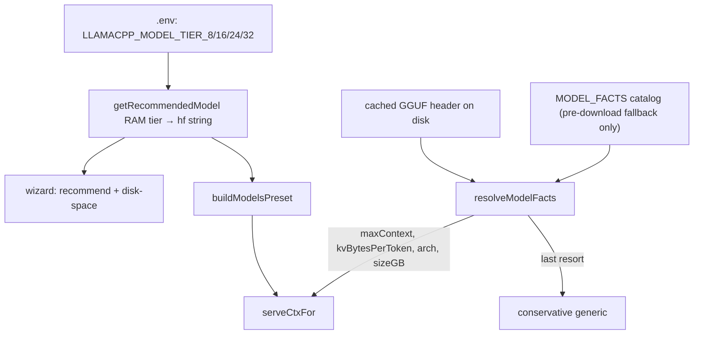

# Plan: Configurable RAM-tier recommended models (+ GGUF-derived sizing)

## Objective
Let the product shipper preset the 4 RAM-tier default models via `.env` (no source
edit), and size *any* model from its own GGUF so an arbitrary pick can't OOM the GPU
(the Ornith 76800-token/Metal-OOM class of bug).

## Why now
`getRecommendedModel()` (`lib/providers/index.js:44`) hardcodes both the RAM
thresholds and the model keys. `serveCtxFor()` (`lib/helpers/startLlamaCpp.js:62`)
sizes context from the hardcoded `MODEL_FACTS` table, so a model not in the table
falls back to a guess. The GGUF-reader that would fix sizing —
`estimateKvBytesPerToken()` (`lib/providers/index.js:85`) — **already exists but is
never called** (dead code). This plan wires it up and makes the tiers config-driven.

## Diagram

## Scope split
- **Part A (the ask):** 4 `.env`-configurable tier models. Small, self-contained.
- **Part B (the real fix):** GGUF-derived facts so arbitrary tier models size safely.
  Required for Part A to be safe with non-catalog models. Can ship right after A.

## Steps

### Part A — configurable tiers
1. **Add 4 config keys** to the `lib/config.js` registry (No-Touch Zone → run
   `npm run gen:env` + `npm run gen:env:check` after):
   - `LLAMACPP_MODEL_TIER_8`  — RAM ≤ 8 GB
   - `LLAMACPP_MODEL_TIER_16` — 8 < RAM ≤ 16 GB
   - `LLAMACPP_MODEL_TIER_24` — 16 < RAM ≤ 24 GB
   - `LLAMACPP_MODEL_TIER_32` — RAM > 24 GB (covers ≤32 and above; the top tier)

   Each = an hf `repo[:quant]` string. Defaults = the **curated tier picks decided
   2026-07-11** (research + verified GGUF sizes: `trash/model-tiers-research.md`).
   Note: this deliberately *changes* the recommendations vs today's
   `getRecommendedModel()` ladder (gemma4:12b → MoE picks on 24/32 GB tiers).
   Section `llamacpp`, `show: "commented"`.

   | Key | Default | Q4 size |
   |-----|---------|---------|
   | `LLAMACPP_MODEL_TIER_8`  | `unsloth/gemma-4-E4B-it-qat-GGUF:Q4_K_XL` | 3.9 GiB |
   | `LLAMACPP_MODEL_TIER_16` | `unsloth/Qwen3.5-9B-GGUF:Q4_K_M` | 5.3 GiB |
   | `LLAMACPP_MODEL_TIER_24` | `unsloth/gemma-4-26B-A4B-it-GGUF:UD-Q4_K_XL` | 15.8 GiB |
   | `LLAMACPP_MODEL_TIER_32` | `unsloth/Qwen3.6-35B-A3B-MTP-GGUF:UD-Q4_K_XL` | 21.3 GiB |

   *Works when:* `.env.example` shows the 4 keys with these defaults; `gen:env:check` passes.

2. **Rewrite `getRecommendedModel()`** (`lib/providers/index.js:44`) to read the tier
   env var for the detected RAM and **return the hf string directly** (not a
   MODEL_FACTS key). Keep the perf-profile nuance (`fast-low-vram`/`quality`) as an
   optional override layer, or fold profiles into the same tier lookup — decide during
   impl; simplest is: tier → hf, profiles tweak only ctx sizing, not model choice.
   *Works when:* setting `LLAMACPP_MODEL_TIER_16=some/other-GGUF:Q4_K_M` makes a 12 GB
   machine boot with that model; unset → same model as today.

3. **Fix callers that assume a MODEL_FACTS key.** `getRecommendedModel` used to return
   a key; callers do `MODEL_FACTS[key].hf` (`startLlamaCpp.js:90`, `specs.js:24`,
   `defaultMainModelHf` `startLlamaCpp.js:81`). After step 2 it returns an hf string —
   update those to use it directly / via `resolveModelFacts` (Part B).
   *Works when:* `npm run test:providers` + startLlamaCpp tests green.

### Part B — GGUF-derived sizing
4. **GGUF header parser** — new `lib/helpers/gguf.js`: read the metadata KV block from
   the start of a `.gguf` file (no tensor/weight load — it's the file header, KBs).
   Extract `general.architecture`, `<arch>.block_count`,
   `<arch>.attention.head_count[_kv]`, `<arch>.embedding_length`,
   `<arch>.attention.key_length/value_length`, `<arch>.context_length`,
   `<arch>.expert_count`. Resolve the cached path via the HF hub layout
   (`resolveModelCacheDir()` + `models--org--repo/snapshots/*/…gguf`).
   Consider the `@huggingface/gguf` npm reader instead of hand-rolling.
   *Works when:* parsing the cached Ornith GGUF yields kvBytesPerToken ≈ 5.2e5,
   context_length, and arch — matching the hand-added MODEL_FACTS values.

5. **`resolveModelFacts(hfOrPath, env)`** in `lib/providers/index.js`: (a) if the GGUF
   is cached on disk → derive facts via step 4 + `estimateKvBytesPerToken()` + file
   size for `sizeGB`; (b) else fall back to the `MODEL_FACTS` catalog
   (`factsForHf`); (c) else the conservative generic. Cache the parse by path.
   *Works when:* a model absent from MODEL_FACTS but present in cache sizes from its
   real facts, not the generic.

6. **Rewire `serveCtxFor()`** (`startLlamaCpp.js:62`) to call `resolveModelFacts`
   instead of `factsForHf(...) ?? GENERIC_MODEL_FACTS`.
   *Works when:* Ornith (with its MODEL_FACTS entry removed) still sizes to ~25600 on
   32 GB purely from the GGUF; no OOM.

7. **Shrink `MODEL_FACTS`** to the recommender catalog: keep entries only for the
   curated tier defaults (needed pre-download, when no GGUF exists yet). Remove the
   hand-added Ornith band-aid once step 6 covers it. Keep `sizeGB` for the wizard's
   pre-download disk-space check.
   The new tier defaults need **new catalog entries** (measure kvBytesPerToken from
   the GGUF header once downloaded, per step 4): `gemma4:e4b-qat` (the qat variant —
   current entry points at ggml-org non-QAT), `gemma4:26b-a4b` (moe, activeParams 4),
   `qwen3.6:35b-a3b-mtp` (moe, activeParams 3). `qwen3.5:9b` already exists.
   *Works when:* MODEL_FACTS = 4 tier defaults + VLM (+ transitional extras if any);
   all tests green.

## Risks
- **Pre-download sizing gap** — the wizard recommends a tier model *before* it's
  downloaded, so no GGUF to read yet. Mitigation: catalog keeps `sizeGB`/`maxContext`
  for the curated defaults; a user-set tier model that isn't curated shows an estimate
  and gets exact facts after first download. Document this.
- **getRecommendedModel return-type change** (key → hf string) has caller blast radius
  (step 3). Mitigation: grep every `getRecommendedModel(` and `MODEL_FACTS[` before
  changing; the coverage map in the tests file lists them.
- **GGUF parser fragility** across architectures / missing fields. Mitigation:
  `estimateKvBytesPerToken` already returns null on missing fields → fall through to
  catalog/generic. Never throw; always degrade.
- **Metadata key names vary by arch** (gemma4.*, qwen3vl.*). Mitigation: namespace by
  the file's own `general.architecture`, as `estimateKvBytesPerToken` already does.

## Doc updates (confirm before writing)
- `.env.example` — regenerated by `gen:env` (the 4 tier keys)
- `README.md` — document the 4 tier env vars for product shippers
- `CHANGELOG.md` — Added (configurable tiers) + Fixed (GGUF-derived sizing, no OOM)
- `id/reference/architecture.md` — note facts now derive from the GGUF, catalog is
  pre-download fallback only
- Companion tests: `trash/plans/configurable-model-tiers-tests.md`
