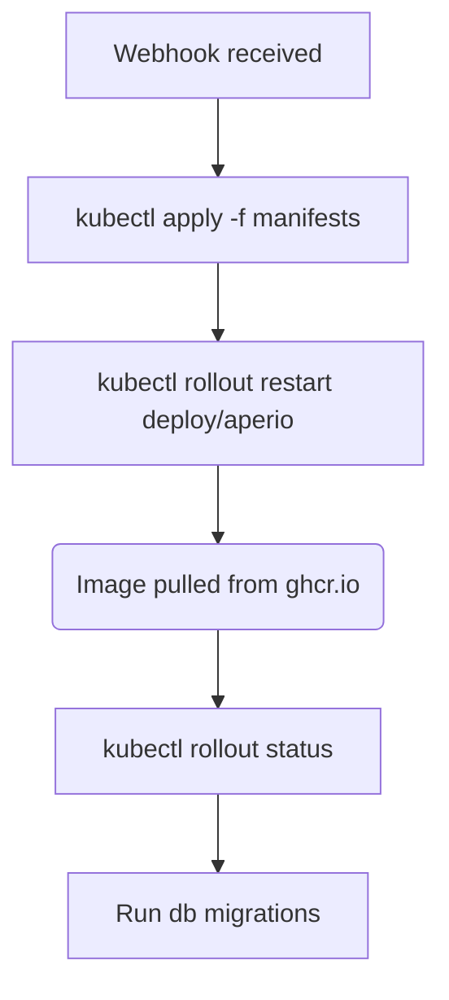

# Aperio on k3s (Raspberry Pi 5) — Deployment Guide

> Deploy Aperio to your local k3s cluster running on a Raspberry Pi 5.
> Part of the [k3s-pi5](https://github.com/BaiGanio/aperio) infrastructure.

---

## Table of Contents

1. [Architecture](#1-architecture)
2. [Prerequisites](#2-prerequisites)
3. [Manifests Overview](#3-manifests-overview)
4. [Initial Deploy on the Pi](#4-initial-deploy-on-the-pi)
5. [Connect via Ingress](#5-connect-via-ingress)
6. [CI/CD — Automatic Deploy from GitHub](#6-cicd---automatic-deploy-from-github)
   - [Pi-side: Webhook Setup](#61-pi-side-webhook-setup)
   - [GitHub-side: Workflow Secrets](#62-github-side-workflow-secrets)
   - [GitHub-side: The Workflow](#63-github-side-the-workflow)
7. [Manual Deploy (no webhook)](#7-manual-deploy-no-webhook)
8. [Troubleshooting](#8-troubleshooting)

---

## 1. Architecture

```
┌────────────────────────────────────────────────────────────┐
│  Raspberry Pi 5 (ARM64, 8 GB)                              │
│  ┌──────────────────────────────────────────────────────┐  │
│  │  k3s (lightweight Kubernetes)                        │  │
│  │                                                      │  │
│  │  ┌──────────────┐ ┌──────────────┐                  │  │
│  │  │  postgres    │ │   aperio     │                  │  │
│  │  │  StatefulSet │ │  Deployment  │                  │  │
│  │  │  :5432┬┘     │ │  :31337      │                  │  │
│  │  │  svc:8008    │ │  svc:31337   │                  │  │
│  │  │    pgvector  │ │  Node.js    │                  │  │
│  │  └──────┬───────┘ └──────┬──────┘                  │  │
│  │         │  aperio DB     │                          │  │
│  │         └────────────────┘                          │  │
│  │                                                      │  │
│  │  ┌────────────────────────────────────────────┐      │  │
│  │  │  Traefik Ingress (built into k3s)          │      │  │
│  │  │  aperio.local → aperio:31337                │      │  │
│  │  └────────────────────────────────────────────┘      │  │
│  │                                                      │  │
│  │  ┌────────────────────────────────────────────┐      │  │
│  │  │  Webhook Receiver (port 9001)              │      │  │
│  │  │  GitHub → POST → aperio-watch-deploy.sh   │      │  │
│  │  │  → pull ghcr.io image → rollout → migrate   │      │  │
│  │  └────────────────────────────────────────────┘      │  │
│  └──────────────────────────────────────────────────────┘  │
└────────────────────────────────────────────────────────────┘
```

### Port mapping for PostgreSQL

The Aperio Postgres uses **port 8008** on the Kubernetes Service level to avoid
collisions with any other Postgres in the cluster (e.g. the bgapi Postgres on
port 5432).

```
Postgres container:       5432  (internal)
Kubernetes Service:       8008  (in-cluster DNS)
NodePort (external):     30808  (host → cluster)
```

The Aperio app connects to `postgres.aperio.svc.cluster.local:8008`.

---

## 2. Prerequisites

- Raspberry Pi 5 with **64-bit OS** (Raspberry Pi OS Lite or Ubuntu Server)
- **k3s** installed and running
- `kubectl` configured to reach the cluster
- **Docker** installed on the Pi (for building images)
- `node` and `npm` on the Pi (for dependency install before Docker build)
- Access to [BaiGanio/aperio](https://github.com/BaiGanio/aperio) on GitHub

---

## 3. Manifests Overview

All Kubernetes manifests live in `aperio-k3s/` on the Pi (or in this repo
under `k8s/`). Copy them to the Pi before deploying.

| File | What it creates | Port |
|------|----------------|------|
| `namespace.yaml` | `aperio` namespace | — |
| `secrets.yaml` | Postgres password | — |
| `configmap.yaml` | First-boot defaults (AI provider, embeddings) — overridable via Web UI | — |
| `postgres.yaml` | **StatefulSet** (pgvector/pg16, 5Gi PVC) + **headless Service** | container: 5432, svc: **8008** |
| `postgres-nodeport.yaml` | **NodePort** (optional, for external DB access) | host: **30808** → svc: **8008** |
| `aperio.yaml` | **Deployment** (1 replica, 1Gi mem) + **ClusterIP Service** + PVC | container: **31337**, svc: **31337** |
| `ingress.yaml` | **Traefik IngressRoute** (k3s-native) | host: **80** → svc: **31337** |
| `deploy.sh` | Applies everything in order + waits for readiness | — |

### CI/CD files

| File | What it does |
|------|-------------|
| `.github/workflows/cd.k3s-deploy.yml` | GitHub Actions — on push to `main`, notifies Pi via webhook |
| `aperio-webhook.conf` | Webhook receiver config (HMAC-signed) |
| `aperio-webhook.service` | systemd service for the webhook (port **9001**) |
| `aperio-watch-deploy.sh` | Build + deploy script (git pull → docker build → k3s import → rollout) |

---

## 4. Initial Deploy on the Pi

### 4.1 Copy manifests to the Pi

```bash
# On your Mac:
scp -r k8s/* pi@<pi-ip>:/home/pi/aperio-k3s/
```

### 4.2 Set the Postgres password

```bash
# On your Mac (or any machine):
echo -n "YourStrongPassword" | base64
# → e.g. WW91clN0cm9uZ1Bhc3N3b3Jk
```

Edit `secrets.yaml` on the Pi and replace `YXBlcmlvX3NlY3JldA==` with your
real base64-encoded password. Set any API keys you'll need (Anthropic, etc.).

### 4.3 Deploy

The image is built automatically by GitHub CI when you push to `main` — no
local Docker build on the Pi. k3s pulls `ghcr.io/baiganio/aperio:latest`
directly.

```bash
# On the Pi:
cd /home/pi/aperio-k3s
chmod +x deploy.sh
./deploy.sh
```

### 4.4 Run database migrations

```bash
kubectl -n aperio exec deploy/aperio -- node db/migrate.js
```

### 4.5 Verify

```bash
kubectl -n aperio get pods,svc,ingressroute
```

Expected output:

```
NAME                           READY   STATUS    RESTARTS   AGE
pod/aperio-xxxxxxxxx-yyyyy     1/1     Running   0          1m
pod/postgres-0                 1/1     Running   0          2m

NAME                         TYPE        CLUSTER-IP     EXTERNAL-IP   PORT(S)    AGE
service/aperio               ClusterIP   10.43.x.x      <none>        31337/TCP   1m
service/postgres             ClusterIP   None           <none>        8008/TCP   2m

NAME                                        AGE
ingressroute.traefik.io/aperio              1m
```

---

## 5. Connect via Ingress

### 5.1 Add DNS

On your laptop, add to `/etc/hosts`:

```
<raspberry-pi-ip>  aperio.local
```

### 5.2 Open in browser

[http://aperio.local](http://aperio.local) → Aperio's first-run setup wizard.

### 5.3 Port-forward (if no ingress DNS yet)

```bash
kubectl -n aperio port-forward svc/aperio 31337:31337
```

Open [http://localhost:31337](http://localhost:31337).

---

## 6. CI/CD — Automatic Deploy from GitHub

The pipeline works in two halves:

1. **GitHub**: on push to `main`, a workflow sends an HMAC-signed POST to your Pi.
2. **Pi**: the `webhook` receiver validates the signature and runs the deploy script.

### 6.1 Pi-side: Webhook Setup

These steps mirror the existing `bgapi` webhook setup.

#### a) Install the `webhook` binary

```bash
sudo apt install -y webhook
```

#### b) Copy the webhook config

```bash
sudo mkdir -p /etc/webhook.d
sudo cp /home/pi/aperio-k3s/aperio-webhook.conf /etc/webhook.d/aperio.conf
```

#### c) Set a real HMAC secret

Edit `/etc/webhook.d/aperio.conf` and replace `CHANGE-ME-long-random-secret`
with a real random string:

```bash
# Generate one:
openssl rand -hex 32
# Copy the output and paste it into the "secret" field in aperio-webhook.conf
```

Save the same value — you'll need it for the GitHub secret in step 6.2.

#### d) Install and start the webhook service

```bash
sudo cp /home/pi/aperio-k3s/aperio-webhook.service /etc/systemd/system/
sudo systemctl daemon-reload
sudo systemctl enable --now aperio-webhook
sudo journalctl -u aperio-webhook -f   # watch logs
```

#### e) Verify the webhook is running

```bash
curl -s http://localhost:9001 | head -5
# → {"status":"ok"} or similar
```

#### f) Make the webhook reachable (choose one)

The GitHub runner must be able to POST to the Pi. Options:

**Option 1 — Cloudflare Tunnel** (if you already have access for bgapi):
Add another ingress to your tunnel config pointing at `localhost:9001`.

**Option 2 — Tailscale Funnel**:
```bash
sudo tailscale funnel 9001
```

**Option 3 — Local LAN only** (simplest for testing):
Use a GitHub self-hosted runner on the Pi itself — then the webhook is
reachable at `http://localhost:9001`.

### 6.2 GitHub-side: Workflow Secrets

In your GitHub repo → **Settings → Secrets and variables → Actions**, add:

| Secret name | Value |
|------------|-------|
| `APERIO_PI_WEBHOOK_URL` | `http://<pi-ip-or-hostname>:9001` or your tunnel URL |
| `APERIO_PI_WEBHOOK_SECRET` | The same HMAC secret from `aperio-webhook.conf` |

### 6.3 GitHub-side: The Workflow

### 6.4 Configuration Flow — ConfigMap + Web UI

Aperio's config comes from two places:

| Layer | What | Overrides |
|-------|------|-----------|
| **ConfigMap** (`configmap.yaml`) | First-boot defaults: AI provider, Ollama URL, embeddings | Nothing initially |
| **Web UI** (Settings panel) | Saved to database: provider, API keys, model, etc. | **Wins** — persists across restarts |

On first deploy, the ConfigMap sets `AI_PROVIDER=ollama` and
`EMBEDDING_PROVIDER=transformers` as starting defaults. Once you open
`http://aperio.local` → **Settings**, change the provider to Anthropic (or
DeepSeek, Gemini) and save your API key — that value is stored in the
database and wins on every subsequent pod start.

**To switch providers:**
1. Open Web UI → Settings
2. Change AI Provider / Embedding Provider
3. Save — no YAML edits, no pod restart needed

The Deployment's `APERIO_CONFIG_PRECEDENCE=db` ensures DB-saved settings
always beat ConfigMap/env defaults.

The workflow `.github/workflows/cd.k3s-deploy.yml` was already added to the
aperio repo. It triggers on:

- **Push to `main`** — automatically
- **Manual dispatch** — from the Actions tab in GitHub UI

What it does:

1. Checks out the pushed commit
2. Sets up QEMU + Docker Buildx for ARM64 cross-compilation
3. Logs in to ghcr.io and builds + pushes the image for `linux/arm64`
4. Sends an HMAC-signed POST to the Pi webhook URL
5. The Pi validates the signature and runs `aperio-watch-deploy.sh`

#### The deploy script on the Pi (`aperio-watch-deploy.sh`)



The image is built in GitHub CI (QEMU cross-compile for ARM64), pushed to
`ghcr.io/baiganio/aperio:latest`, then pulled by k3s when the Deployment
restarts. No local Docker build or image import needed on the Pi.

---

## 7. Manual Deploy (no webhook)

If you don't want to set up the webhook, use `deploy.sh` directly:

```bash
# On the Pi:
cd /home/pi/aperio-k3s
./deploy.sh
```

Or for a quick image rebuild and restart:

```bash
# Trigger a rebuild via GitHub — or force a fresh pull:
kubectl -n aperio rollout restart deploy/aperio
kubectl -n aperio rollout status deploy/aperio --timeout=180s
kubectl -n aperio exec deploy/aperio -- node db/migrate.js
```

---

## 8. Troubleshooting

### Pod stuck in `ImagePullBackOff` or `ErrImagePull`

The image is pulled from `ghcr.io/baiganio/aperio:latest` with
`imagePullPolicy: Always`. If the pull fails:

```bash
kubectl -n aperio describe pod -l app=aperio | grep "Failed to pull image"
kubectl -n aperio logs -l app=aperio --tail=20
```

Common causes:
- **ghcr.io rate limit** — wait a few minutes and restart
- **Network** — verify the Pi can reach `ghcr.io`: `curl -s https://ghcr.io | head`
- **Private repo** — if the aperio repo is private, add `imagePullSecrets` to
  the Deployment referencing a GitHub PAT with `read:packages` scope

### Postgres won't start

Check the logs:

```bash
kubectl -n aperio logs postgres-0
```

Common issues:
- PersistentVolumeClaim stuck — check `kubectl get pvc -n aperio`
- Password mismatch — `secrets.yaml` value doesn't match what's expected

### Aperio can't connect to Postgres

```bash
kubectl -n aperio logs deploy/aperio
```

Check the `DATABASE_URL` env var:

```bash
kubectl -n aperio exec deploy/aperio -- env | grep DATABASE_URL
```

Expected: `postgresql://aperio:<password>@postgres.aperio.svc.cluster.local:8008/aperio`

### Webhook not firing

On the Pi:

```bash
sudo journalctl -u aperio-webhook -f
# Trigger a test:
curl -X POST http://localhost:9001 \
  -H "Content-Type: application/json" \
  -H "X-Hub-Signature-256: sha256=$(echo -n '{"test":true}' | openssl sha256 -hmac 'your-secret' | awk '{print $2}')" \
  -d '{"test":true}'
```

On GitHub, check the Actions run logs for the HTTP response code.

### Port already in use on the Pi

If port 9001 is already taken, change to 9002 (or any free port):

```bash
# Edit the service file
sudo sed -i 's/-port 9001/-port 9002/' /etc/systemd/system/aperio-webhook.service
# Update the webhook config to match
sudo sed -i 's/localhost:9001/localhost:9002/' /etc/webhook.d/aperio.conf
# Restart
sudo systemctl daemon-reload && sudo systemctl restart aperio-webhook
```

Also update `APERIO_PI_WEBHOOK_URL` in GitHub secrets to match.

### NodePort not accessible

If you need external DB access via `30808`:

```bash
kubectl -n aperio apply -f /home/pi/aperio-k3s/postgres-nodeport.yaml
```

Check the node's firewall — port 30808 must be open.

---

## File Inventory

### In `aperio/.github/workflows/` (stays in the aperio repo)

- `cd.k3s-deploy.yml` — GitHub Actions workflow

### In `k3s-pi5/aperio-k3s/` or `aperio/k8s/` (move to the Pi)

```
aperio-k3s/
├── namespace.yaml                # aperio namespace
├── secrets.yaml                  # Postgres password
├── configmap.yaml                # First-boot defaults (AI, embeddings)
├── postgres.yaml                 # StatefulSet + headless svc (8008)
├── postgres-nodeport.yaml        # NodePort (30808 → 8008)
├── aperio.yaml                   # Deployment + ClusterIP (31337)
├── ingress.yaml                  # Traefik IngressRoute
├── deploy.sh                     # Initial deploy script
├── aperio-webhook.conf           # Webhook receiver config
├── aperio-webhook.service        # systemd unit for webhook
├── aperio-watch-deploy.sh        # CI/CD deploy script
└── k3s-instructions.md           # This file
```
