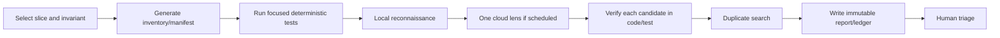

# Aperio Continuous Audit — Developer Playbook

_Companion to `aperio-continuous-audit.md` and
`aperio-continuous-audit-tests.md` · Updated 2026-07-20_

## 1. Purpose

This is the practical guide for implementing and running the continuous audit. The main
plan explains **what** the program must accomplish; the companion test file defines **how
we prove it**; this playbook explains **what to do in each working session**.

Use these files in this order:

1. `aperio-continuous-audit-progress.md` — learn the current run state and next action.
2. `aperio-continuous-audit.md` — understand components, invariants, waves, and exit gates.
3. `aperio-continuous-audit-tests.md` — read the verification criteria before implementation.
4. This file — execute the current phase and prepare the right prompts/evidence.

The audit and remediation are separate activities. Audit sessions may add audit scripts,
fixtures, contract tests, manifests, ledgers, and reports. They do not change Aperio's
production behavior. A confirmed product defect becomes a separate implementation task.

## 2. Mental Model of Aperio

Aperio is not one linear application. It has several entry parents that converge on shared
children:

| Parent | Direct children | Shared children reached later | Main audit slices |
|---|---|---|---|
| Production entrypoint | `server.js` → `lib/server.js`, `bootstrap.js` | config, auth/net guards, routes, WebSocket, shutdown | A01–A04 |
| Browser UI | `public/` → REST and WebSocket | agent, settings, sessions, tools, artifacts | A03, A04, A22 |
| Terminal client | `lib/terminal.js`, `lib/terminal/` | WebSocket/session protocol, agent/provider behavior | A04, A06, A22 |
| Internal foreground agent | `lib/agent/index.js` and lifecycle modules | context, providers, tools, permissions, privacy | A05–A11, A17–A19 |
| Standalone MCP | `mcp/index.js` → `mcp/tools/*` | DB, embeddings, paths, network/external services | A12–A16 |
| Background control plane | scheduler, roundtable, job specs, workers | agent, budgets, interrupts, persistence | A17–A20 |
| Persistence parent | `db/index.js` → SQLite/Postgres adapters | migrations, encryption, memory/wiki, indexes | A13, A14, A20, A21 |
| Delivery parent | setup, installers, Docker/VMs, CI, locales | every documented user path | A22 |

Three rules prevent confusion:

1. **Directory ownership is not runtime ownership.** `mcp/tools/files.js` lives under MCP,
   but the internal agent can reach it too.
2. **A shared child must be audited through every caller.** Correct path validation is not
   enough if one caller bypasses it or supplies a broader policy.
3. **Component slices test internals; journeys test connections.** Do not treat completion
   of A02–A22 as proof that browser, terminal, MCP, and background lifecycles compose safely.

Refer to the two architecture diagrams in the main plan whenever a session loses its place.

## 3. Where Audit Work Should Live

Use this initial layout unless implementation reveals a concrete reason to change it:

```text
scripts/audit/
  inventory.js              deterministic repository inventory
  schema.js                 run/finding validation and transitions
  manifest.js               evidence packet builder and hashing
  contracts/
    database.js             first A14 contract gate

tests/audit/
  inventory.test.js
  schema.test.js
  manifest.test.js
  database-contract.test.js
  fixtures/                 disposable synthetic repository structures

trash/plans/aperio-continuous-audit/runs/
  run-001/
    baseline.json
    progress snapshot or links
    A14/
      manifest.json
      contract-result.json
      report.md
      ledger.json
```

Keep machine-readable facts in JSON and human reasoning in Markdown. Generated records must
carry a schema version. Run records are immutable after closeout; corrections append a new
record or explicit amendment rather than silently rewriting history.

Do not store audit records in `var/`: it is private runtime state, may contain sensitive
conversation data, and is separate from audit planning artifacts.

`trash/` is gitignored in this repository. The layout above supports continuing Run 1 across
local workspace sessions, but it will not travel with a normal clone or appear in a commit.
Before Run 1 needs durable/shared history, ask the developer whether validated run records
should move to a tracked location such as `id/audit/runs/` or to an external artifact store.
Do not force-add `trash/` or write tracked audit documentation without that approval.

## 4. Phase 0 — Bootstrap the Audit Harness

This is the first implementation phase. It is deliberately one vertical A14 pilot rather
than a broad set of unrelated scanners.

### 4.1 Session opening

Read-only checks:

```bash
git status --short
git branch --show-current
git rev-parse HEAD
node --version
npm --version
```

Then read the T1, T2.4, T3, T4.4, and T5.1 cases. Do not start the application or MCP server.

### 4.2 Write T1 tests first

Prepare a disposable fixture repository containing:

- Tracked source and test files.
- One provider fixture.
- Paired migration directories.
- A file with spaces in its name.
- Ignored/runtime/generated files that must not affect normalized output.

Tests must prove:

- Two unchanged runs are byte-identical after excluding the explicit observation timestamp.
- Enumeration order cannot change output.
- Tracked modification, deletion, and untracked file are all reported.
- The audit does not stage, restore, delete, or rewrite user files.
- Counts change when fixture files change; no count comes from prose constants.

Only then implement `scripts/audit/inventory.js`. Give it a root argument so tests never
need to mutate the real worktree.

### 4.3 Implement the minimal T3 schema

Start with two record types:

- **Run:** schema version, run/slice ID, revision, branch, dirty state, timestamp, scope,
  commands, files read, model/usage, results, uncertainty, elapsed time.
- **Finding:** ID, revision, status, severity, confidence, affected locations, invariant,
  expected/actual, evidence, reproduction, impact, mitigation, regression-test location.

Prove that missing revision, evidence, invariant, or reproduction is rejected. Implement
the finding-state transitions from the main plan and preserve transition history.

Do not invent monetary cost for local or subscription models. Record `unknown` when the
actual billed price cannot be established.

### 4.4 Build the A14 evidence packet

The first packet should consider at least:

- `db/index.js`
- `db/sqlite.js`
- `db/postgres.js`
- `db/migrate.js`
- `db/migrate-sqlite.js`
- `db/migrations/`
- `db/migrations-sqlite/`
- `db/tables.js`
- `db/types.js`
- `db/encrypt.js`
- Focused DB/migration/encryption tests.
- Relevant DB and encryption config keys.

For every included path, record the reason and content hash. For every discovered coupled
path that is excluded, record the path and reason. Record an aggregate manifest hash and
estimated model-input tokens. Refuse model invocation when the ceiling is exceeded; never
silently truncate a function or omit the test list.

### 4.5 Implement the A14 contract gate

The deterministic gate should answer questions before an LLM is involved:

- Which public store operations exist in SQLite and Postgres?
- Are required operations present in both?
- Do return shapes and transaction contracts have behavioral tests?
- Which migration intents exist in each backend?
- Are unmatched migrations reviewed backend-specific exceptions?
- Are encryption/decryption and fallback paths represented in focused tests?

Filename equality is a signal, not proof of semantic parity. Do not require identical SQL.

### 4.6 Prove red, then green

Against fixtures only:

1. Remove one required adapter operation and observe a named invariant failure.
2. Add an unmatched migration without an exception and observe failure.
3. Restore the operation/migration and observe both checks pass.
4. Remove a required finding field and observe schema rejection.
5. Change an A14 packet file and observe the aggregate hash change.

Record the exact commands and exit codes. A gate that has only ever been green is not yet a
trusted audit gate.

### 4.7 Bootstrap exit checklist

- [ ] T1 inventory tests pass.
- [ ] Minimal T3 schema and transition tests pass.
- [ ] T4.4 A14 manifest tests pass.
- [ ] T2.4 A14 contract fixture tests pass.
- [ ] T5.1 red/green evidence is recorded.
- [ ] Same revision reproduces the same normalized baseline and A14 manifest hash.
- [ ] First A14 ledger/report validates, even if it reports no product finding.
- [ ] No server/MCP process or repository runtime state was created.
- [ ] Progress diagram and A14 row point to evidence before status changes.

## 5. Phase 1 — Expand Deterministic Contracts

After the pilot, extend the harness one contract at a time:

| Order | Contract | Primary question | Relevant tests/slices |
|---:|---|---|---|
| 1 | Configuration | Do registry, resolver, generated env/docs, DB overlay, UI, and secret masking agree? | T2.5 / A02 |
| 2 | HTTP mutations | Is every state mutation classified by auth, origin, rate, and confirmation policy? | T2.2 / A03 |
| 3 | WebSocket messages | Is every message type classified and paired with session/permission policy? | T2.2 / A04 |
| 4 | Path/file capability | Do all file and shell entry paths reach the same canonical policy? | T5 + focused path tests / A15 |
| 5 | Privacy egress | Does every cloud send boundary apply the expected local/private/secret policy? | T7.3 / A09 |
| 6 | Providers | Do all six adapters implement semantic turn/tool/abort/usage/error behavior? | T2.1 / A06 |
| 7 | MCP context/tools | Are registrations complete and every required `ctx` field supplied? | T2.3 / A11–A12 |
| 8 | Locales/delivery | Do canonical keys and shipped paths remain synchronized? | T2.5 / A22 |

For every new contract:

1. Add or extend its disposable fixture.
2. Write the failing sensitivity test.
3. Implement the scanner/gate.
4. Restore the fixture and confirm green.
5. Add dependency rules that select affected slices when the manifest changes.

Do not refactor production registries merely to make scanning easier during this phase.
Record implicit/dynamic contracts as manual-review requirements until a separate refactor is
approved.

## 6. Phase 2 — Run Component Slices

### 6.1 Per-slice loop

Run every A01–A22 slice through this sequence:



Before model review, the packet must already state:

- Revision and dirty paths.
- Primary invariant and one lens.
- Included files with line-numbered excerpts or content hashes.
- Coupled exclusions and why they were excluded.
- Existing focused tests and their results.
- Known exceptions and previously tracked findings.
- Token estimate under the cap.

### 6.2 What to look for by slice

| Slice | Look for | Typical negative case |
|---:|---|---|
| A01 | partial boot cleanup, signal races, owned resources, truthful terminal state | failure halfway through bootstrap or shutdown called twice |
| A02 | config precedence, registry drift, secret masking, bootstrap-only variables | DB overlay and env disagree; secret returned by settings API |
| A03 | route reachability, mutation policy, auth/origin/rate parity | new POST route mounted before guard or missing classification |
| A04 | per-connection state, message ordering, reconnect/resume, cross-session isolation | disconnect during mutation; stale confirmation used in another session |
| A05 | shared mutable state, lifecycle transitions, replayability, middleware order | two agents share session state or trace reports false success |
| A06 | tool/message schema, abort, usage, retries, images, provider switching | structured tool history becomes invalid after provider switch |
| A07 | authority order, token trimming, paired tool messages, provenance | trim drops system authority or one half of a tool pair |
| A08 | ownership, addressing, retention, offload/retrieval, deletion | artifact survives owner deletion or becomes visible to another session |
| A09 | final provider boundary, local-only data, secret derivatives, log redaction | local transcript is destructively redacted or secret crosses cloud boundary |
| A10 | deterministic matching, force/reload, prompt bounds, authority injection | untrusted skill content becomes system authority without provenance |
| A11 | profile selection, schema validation, hooks, result bounds, confirmation | tool omitted from profile but still executable by name |
| A12 | standalone/internal parity, context completeness, transport error behavior | MCP tool reads absent `ctx` field or logs into JSON-RPC stdout |
| A13 | ranking quality, queue consistency, mutation/index ordering, privacy | deleted memory remains recallable or queue loses an update |
| A14 | backend behavior, transactions, migration intent, encryption recovery | same method name returns incompatible shape across backends |
| A15 | canonicalization, symlinks, non-existent tails, read/write separation, shell | allowed parent plus symlink escapes policy |
| A16 | SSRF, DNS rebinding, credential scope, query bounds, egress logging | redirected request reaches forbidden/private destination |
| A17 | one-shot cancellation propagation, timeouts, cleanup, terminal state | WebSocket closes but provider/tool continues mutating state |
| A18 | permission snapshot, least privilege, execution-time enforcement | selection hides tool but direct execution bypasses permission |
| A19 | one accounting source, nested limits, exhausted state | retry/roundtable path bypasses turn or cost limit |
| A20 | isolation, idempotency, persistence, resume, pruning | restart duplicates a partially committed job action |
| A21 | parser limits, watcher lifecycle, backend parity, deletion/reindex | crafted document consumes unbounded resources or stale index survives delete |
| A22 | shipped setup/UI/installer parity, i18n, CSP, CI/release metadata | UI claims feature ready before backend/bootstrap state is ready |

### 6.3 Candidate verification

For each candidate, ask in this order:

1. What exact invariant is allegedly violated?
2. Where is the current file/line evidence?
3. What caller and lifecycle can reach it?
4. What expected behavior is distinguishable from actual behavior?
5. Can a focused static trace or safe test reproduce it?
6. Does another guard, caller, or transaction contradict the claim?
7. Does an existing issue or ledger entry already track it?
8. Which variants matter: SQLite/Postgres, local/cloud, browser/MCP, foreground/background?
9. Where would the red regression test live?

Two models agreeing is not reproduction. If the evidence fails, mark the candidate Rejected
and preserve the reason so later sessions do not pay to rediscover it.

## 7. Phase 3 — Cross-Domain Journeys

Begin journeys only after their principal component slices have usable reports. For every
hop, record:

- Input/output shape and owner.
- Trust or authority transition.
- Timeout and cancellation behavior.
- Persistence and rollback behavior.
- Correlation/logging behavior without exposing secrets.
- At least one negative or injected-failure case.

Do not stop a journey at a directory boundary. For example, browser chat is not complete at
the WebSocket handler; follow it through the agent, provider/tool, persistence, emitted UI
event, and disconnect/recovery behavior.

Update the boundary matrix as evidence is produced. A blank cell is unfinished work, not an
implicit “not applicable.” Use `impossible: <reason + reviewer>` only after review.

## 8. Phase 4 — Triage, Remediation Handoff, and Closeout

After each wave, every confirmed finding gets exactly one outcome:

- Duplicate.
- Rejected after verification.
- Accepted risk with owner/review date.
- Documentation-only.
- Separate implementation plan.
- Issue filed through the appropriate public/private path.

For security-sensitive findings, decide disclosure before creating or updating a public
issue. Never paste exploit-ready details, secrets, private runtime data, or unredacted logs
into prompts, reports, commits, or GitHub.

Before remediation begins, the handoff must name the regression-test file and the assertion
that is expected to fail. Read the companion test specification first, demonstrate red,
then implement until green. Production fixes do not belong inside an audit-only diff.

Closeout reconciles source records rather than manually estimating totals. It must include
deferred scope, environmental failures, unknown costs, blind spots, and evidence-backed Run
2 changes.

## 9. Reusable Quick Prompts

Replace every bracketed field. Attach only the bounded packet; never the whole repository.

### 9.1 Local reconnaissance

```text
You are reconnoitering Aperio audit slice [Axx: name] at revision [SHA].
Primary invariant: [one invariant].

Use only the attached evidence manifest and excerpts. Map the callers, callees,
state owners, trust transitions, and focused tests. List suspicious seams as
Candidate statements, each with current file/line evidence and a proposed safe
reproduction. Also list clean invariants and coupled areas excluded from this packet.

Do not claim a defect, propose broad refactors, or infer behavior not supported by
the packet. If evidence is missing, name exactly what must be inspected next.
Maximum output: [2000] tokens.
```

### 9.2 Primary audit with one lens

```text
Audit Aperio slice [Axx] at [SHA] using only the [security engineer / code reviewer /
software architect / product thinker / socratic questioner] lens.

Invariant: [invariant].
Known callers/variants: [list].
Focused tests already run: [commands + outcomes].
Reviewed exceptions: [list or none].

For each candidate provide: title, affected file/line, violated invariant,
expected vs actual behavior, reachable lifecycle, impact, confidence, and a focused
reproduction/test design. Try to contradict each candidate using guards or tests in
the packet. Separate findings from residual uncertainty. No evidence means no finding.
```

### 9.3 Verify one candidate

```text
Attempt to falsify candidate [ID/title] against revision [SHA].

Claim: [precise claim].
Evidence: [files/lines].
Expected/actual: [behavior].
Relevant variants: [list].

Trace the reachable call path, identify any guard/transaction/test that contradicts
the claim, and propose the smallest safe reproduction. Return one disposition:
Confirmed, Rejected, NeedsEvidence, or DuplicateCandidate. A second model's opinion
is not evidence.
```

### 9.4 Precision adjudication

```text
Adjudicate disputed/high-impact finding [ID] only. Do not review the whole slice.

Invariant: [invariant].
Candidate evidence: [bounded excerpts and failing test/static trace].
Contradicting evidence: [bounded excerpts].
Security/lifecycle variants: [list].

Decide whether the evidence supports Confirmed, Rejected, or NeedsEvidence. Explain
the controlling code path and remaining uncertainty. Do not increase severity merely
because the scenario is security-related.
```

### 9.5 Packet completeness check

```text
Review this [Axx] evidence manifest, not the source code. Does it include the owners,
direct callers/callees, companion tests, config, public contract, and recent relevant
changes required to evaluate [invariant]? Name missing coupled paths and unnecessary
content. Do not audit behavior yet.
```

### 9.6 Clean-result report

```text
Write a bounded no-confirmed-findings report for [Axx] at [SHA]. Record the exact
invariants checked, commands and test outcomes, rejected candidates with reasons,
unreviewed edges, variants not exercised, and rerun triggers. Do not say “no risk” or
generalize beyond the packet.
```

### 9.7 Wave triage

```text
Triage only the attached confirmed findings from Wave [N]. For each, choose exactly
one outcome: Duplicate, AcceptedRisk, DocumentationOnly, Planned, or IssueFiled.
Check that evidence, severity/confidence separation, owner, regression-test location,
and disclosure classification are present. Return incomplete records to verification;
do not silently repair them with assumptions.
```

### 9.8 Session handoff

```text
Prepare the audit handoff for [slice/phase]. State revision and dirty state, completed
criteria with evidence paths, exact commands/results, current candidates and status,
rejected claims worth remembering, residual uncertainty, token/cost usage, and the next
single action. Do not mark progress complete without linked evidence.
```

## 10. Session Checklist

### Before work

- [ ] Read the progress file and confirm the next node.
- [ ] Record `git status`, branch, and full SHA.
- [ ] Read the relevant companion tests before implementation/audit.
- [ ] Identify whether any scoped file is a Fragile / No-Touch Zone.
- [ ] Confirm the task is audit-only or separately approved remediation.
- [ ] Select one slice, one invariant, and one primary lens.
- [ ] Check existing reports/issues before spending model tokens.

### During work

- [ ] Prefer static reading and focused tests; do not casually start servers.
- [ ] Keep real `var/` data out of evidence and prompts.
- [ ] Use disposable fixtures for mutation sensitivity.
- [ ] Record commands, exit codes, environment failures, elapsed time, and token usage.
- [ ] Separate candidates, confirmed findings, clean invariants, and unknowns.
- [ ] Stop after two unsupported candidate cycles.
- [ ] Do not remediate production behavior inside the audit session.

### Before handoff

- [ ] Validate the JSON records against the current schema.
- [ ] Confirm paths/lines still point to the recorded revision.
- [ ] Reconcile the progress row, live diagram, report, and ledger.
- [ ] Mark `working-tree-sensitive` if the relevant packet changed during the session.
- [ ] Name the next single action and its acceptance criterion.
- [ ] For repository changes, provide a ready-to-use commit message; do not commit unless asked.

## 11. Focused Command Guidance

Prefer narrowly scoped commands while the audit harness is being built:

```bash
NODE_ENV=test node --test tests/audit/inventory.test.js
NODE_ENV=test node --test tests/audit/schema.test.js
NODE_ENV=test node --test tests/audit/manifest.test.js
NODE_ENV=test node --test tests/audit/database-contract.test.js
NODE_ENV=test node --test 'tests/audit/*.test.js'
```

Later, run the affected product tests named by the slice. The full `npm test` suite is a
final regression gate, not the first diagnostic step. If a focused test needs a listener,
use its existing fixture harness and classify sandbox `EPERM` separately from product
failure.

Never use the live repository as the deliberately broken fixture. Never invoke
`node server.js`, `npm start`, or standalone `npm run mcp` during audit-only diagnosis.

## 12. Standard Slice Report Skeleton

```markdown
# [Axx] [Domain] — Audit Report

## Run identity
- Revision / branch / dirty state:
- Date / elapsed time:
- Auditor / model / lens:
- Token and actual-cost record:

## Scope and invariant
- Primary invariant:
- Manifest hash:
- Included evidence:
- Coupled exclusions:

## Verification performed
- Commands and outcomes:
- Variants exercised:
- Environment limitations:

## Confirmed findings
- Finding IDs or “None confirmed.”

## Rejected candidates
- Claim, contradictory evidence, disposition.

## Clean invariants
- Exact checked invariant plus evidence.

## Residual uncertainty
- Unreviewed edge, risk, owner, and rerun trigger.

## Next action
- One action with acceptance criterion.
```

This skeleton is intentionally honest about clean results and unknowns. A report is useful
when it prevents the next session from rereading the same code without learning anything,
even when it confirms no defect.
