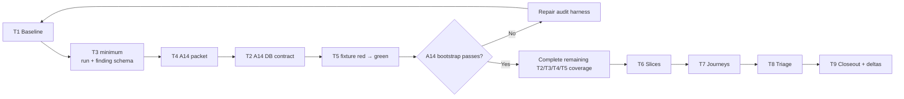

# Aperio Continuous Component Audit — Verification Plan

_Companion to `aperio-continuous-audit.md` · Date: 2026-07-12_

These are tests of the audit system, not claims that the production code is defective.
Verify-first means each new drift gate must demonstrate that it detects a deliberately
mutated fixture or known baseline mismatch before it is trusted.

Implementation begins with the A14 vertical bootstrap described in the main plan. The
logical T1–T9 grouping remains useful for coverage, but it is not a requirement to finish
all of T2 before exercising T3/T4/T5. First prove one complete evidence path, then broaden it.

## 1. Coverage Map

| Plan step | Test group | Coverage |
|---|---|---|
| Bootstrap milestone — A14 vertical pilot | T1.1, T3.1, T4.4, T2.4, T5.1 | One reproducible inventory → validated record → hashed packet → sensitive contract gate → red/green proof |
| Step 1 — baseline | T1 | Reproducibility, dirty-tree handling, normalized inventory |
| Step 2 — contracts | T2 | Provider, route, WS, MCP, DB, migration, config, locale drift |
| Step 3 — ledger/schema | T3 | Required evidence, status transitions, usage accounting |
| Step 4 — evidence packets | T4 | Scope completeness, token cap, manifest hashes |
| Step 5 — red baseline | T5 | Failure classification and red-first proof |
| Step 6 — audit waves | T6 | Slice completeness, lens isolation, exit gate, duplicate detection |
| Step 7 — journeys | T7 | Boundary and lifecycle coverage |
| Step 8 — triage | T8 | One outcome per finding, security disclosure, regression ownership |
| Step 9 — closeout/deltas | T9 | Cost totals, trigger routing, selective reruns |

## 2. Test Cases

### T1 — Baseline inventory

#### T1.1 Repeated inventory is stable

- **Input/setup:** clean temporary copy or fixed commit; run the inventory twice with no
  filesystem changes.
- **Expected behavior:** normalized inventories are byte-identical except an explicitly
  excluded timestamp field.
- **Assertions:** same SHA, provider list, route list, tool list, migration names, config
  keys, source/test counts, and locale count.
- **Edge cases:** filesystem enumeration order differs; `.DS_Store`, runtime `var/`, and
  generated coverage files appear between runs and do not affect the result.

#### T1.2 Dirty state is preserved and visible

- **Input/setup:** one tracked modification, one untracked file, and one deletion in a
  disposable fixture/copy.
- **Expected behavior:** inventory reports all three without modifying, staging, or deleting
  them; affected slices are marked `working-tree-sensitive`.
- **Assertions:** `git status --short` is identical before and after; no audit command writes
  outside the audit output directory.
- **Edge cases:** filename contains spaces; file belongs to multiple slices.

#### T1.3 Counts are generated, not copied from prose

- **Input/setup:** add a fixture source/test/provider file in a disposable tree.
- **Expected behavior:** the corresponding generated counts/lists change on the next run.
- **Assertions:** prose constants are not used as the source of truth.

### T2 — Contract and drift gates

#### T2.1 Provider matrix detects a missing adapter branch

- **Input/setup:** fixture registry lists six providers while the dispatch fixture handles five.
- **Expected behavior:** gate fails and names the provider missing from dispatch.
- **Assertions:** it checks registry, resolver, dispatch, config option, usage/abort/redaction
  capabilities, and provider-specific tests—not file count alone.
- **Edge cases:** provider intentionally delegates to another adapter; reviewed exception passes.

#### T2.2 HTTP/WS mutation inventory detects an unclassified operation

- **Input/setup:** add a fixture state-changing route and a new WebSocket message case without
  policy metadata.
- **Expected behavior:** gate fails with both operation names.
- **Assertions:** read-only operations are not falsely flagged; dynamic/computed message names
  are reported as “manual classification required.”

#### T2.3 MCP ctx and tool registry stay coherent

- **Input/setup:** fixture tool reads a ctx field not supplied by `createContext`; fixture
  registry omits a tool module.
- **Expected behavior:** gate identifies the missing field and unregistered module.
- **Assertions:** optional ctx reads can be declared; internal and standalone tool names are
  compared.

#### T2.4 DB adapter and migration parity reports semantic exceptions

- **Input/setup:** adapter fixture lacks one required method; migrations contain one unmatched
  filename and one explicitly allowlisted backend-only migration.
- **Expected behavior:** missing method and unreviewed migration fail; reviewed exception passes.
- **Assertions:** parity is based on declared operations/intent, not identical SQL text.
- **Edge cases:** transaction semantics and return shapes differ despite matching method names;
  these require behavioral contract tests.

#### T2.5 Config and locale drift gates retain current guarantees

- **Input/setup:** unregistered env read, config registry change without generated env update,
  UI translation reference absent from canonical locale.
- **Expected behavior:** all three fail with actionable locations.
- **Assertions:** existing `npm run gen:env:check` and `npm run i18n:check` remain part of the
  gate instead of being reimplemented inconsistently.

### T3 — Ledger and finding schema

#### T3.1 Incomplete finding is rejected

- **Input/setup:** candidate lacks reproduction, revision, violated invariant, or file/line evidence.
- **Expected behavior:** schema validation fails and lists every missing field.
- **Assertions:** severity cannot substitute for confidence or evidence.

#### T3.2 Finding transitions are controlled

- **Input/setup:** exercise Candidate → Confirmed → Planned → Fixed and invalid transitions
  such as Rejected → Fixed.
- **Expected behavior:** valid transitions pass; invalid transition fails with reason.
- **Assertions:** reopening a fixed finding preserves its history.

#### T3.3 Usage accounting reconciles

- **Input/setup:** records with input, cached input, reasoning, output tokens, unit prices, and
  one subscription/local invocation.
- **Expected behavior:** API costs sum correctly; local/subscription entries are labeled rather
  than assigned fabricated per-token prices.
- **Assertions:** estimated and actual costs are separate; unknown price produces `unknown`, not zero.

### T4 — Evidence packets

#### T4.1 Manifest explains inclusions and coupled exclusions

- **Input/setup:** build A06 provider packet.
- **Expected behavior:** manifest includes resolver, registry, all provider loops, provider
  contract tests, and agent dispatch; coupled context/tool files are included or listed as
  deliberate exclusions.
- **Assertions:** every included file has a reason and content hash.

#### T4.2 Packet respects token ceiling

- **Input/setup:** construct an oversized slice.
- **Expected behavior:** builder refuses model invocation and proposes deterministic sub-slices.
- **Assertions:** estimated input ≤30K before call; truncation never silently cuts the middle of
  a function or drops the companion test list.

#### T4.3 Manifest hash drives delta selection

- **Input/setup:** change an unrelated locale file, then a provider contract file.
- **Expected behavior:** unrelated change does not invalidate A06; provider change does.
- **Assertions:** dependency rules schedule A06 plus declared downstream slices A07/A09.

#### T4.4 A14 is a complete reference packet

- **Input/setup:** build A14 against a fixed revision and a disposable backend fixture.
- **Expected behavior:** manifest includes the store factory, both adapters, migration runners,
  both migration directories, tables/types/encryption modules, focused tests, and relevant
  config; coupled but excluded files are named with reasons.
- **Assertions:** every included path has a content hash and inclusion reason; the aggregate
  manifest hash is stable; the packet records revision and dirty-state sensitivity; token
  estimate is below the invocation ceiling.
- **Edge cases:** backend-only migration has a reviewed intent exception; identical filenames
  contain semantically different operations; an untracked migration marks A14 sensitive.

### T5 — Red-first baseline

#### T5.1 New drift gate proves sensitivity

- **Input/setup:** mutate a disposable fixture to violate its contract.
- **Expected behavior:** gate fails before any remediation and passes after the fixture is restored.
- **Assertions:** failure names the invariant and changed element.

#### T5.2 Failure taxonomy is enforced

- **Input/setup:** one assertion failure, one listener `EPERM`, one timeout that passes on retry,
  and one stale expected count.
- **Expected behavior:** classified respectively as product, environment, flaky, and stale test.
- **Assertions:** none is silently ignored; environment/flaky is not reported as product defect.

#### T5.3 Audit obeys no-server diagnostic rule

- **Input/setup:** inspect command log for an audit-only run.
- **Expected behavior:** no `node server.js`, `npm start`, or standalone `npm run mcp` invocation.
- **Assertions:** fixture-server test commands are allowed and recorded.

### T6 — Slice execution

#### T6.1 All slices meet the exit gate

- **Input/setup:** completed A01–A22 run set or documented deferrals.
- **Expected behavior:** every completed report contains revision, scope, lens, manifest, commands,
  token usage, candidates/outcomes, clean invariants, and residual uncertainty.
- **Assertions:** deferred slice has reason, owner, and trigger/date; it is not counted complete.

#### T6.2 Unsupported candidates cannot escalate

- **Input/setup:** model produces plausible claim without line evidence or reproducible trace.
- **Expected behavior:** claim remains Candidate or becomes Rejected; it cannot become Confirmed.
- **Assertions:** a second model agreeing is not accepted as independent evidence.

#### T6.3 Lens and escalation budget are enforced

- **Input/setup:** routine slice requests two cloud lenses or a frontier model without an
  adjudication reason.
- **Expected behavior:** budget guard rejects or requires recorded human override.
- **Assertions:** at most one primary lens; precision model use includes finding IDs and reason.

#### T6.4 Duplicate search works

- **Input/setup:** candidate matches an open GitHub issue or ledger finding by invariant and path.
- **Expected behavior:** it links as Duplicate instead of creating a second independent record.
- **Edge cases:** same symptom but different root cause remains a distinct linked finding.

### T7 — Cross-domain journeys

#### T7.1 Journey coverage is complete

- **Input/setup:** twelve journey reports from plan Step 7 plus the mandatory boundary matrix.
- **Expected behavior:** each report names every hop, input/output contract, trust transition,
  owner, timeout/cancellation behavior, persistence, logging, and negative test.
- **Assertions:** no journey ends at a directory boundary; provider and backend variants are explicit;
  every boundary-matrix cell links to evidence or gives a reviewed impossibility rationale.

#### T7.2 Failure propagation is observable

- **Input/setup:** for each journey, inject or simulate failure at one boundary using existing mocks.
- **Expected behavior:** error reaches the correct user/caller, partial state is rolled back or
  marked recoverable, and logs contain correlation without secrets.
- **Assertions:** no hanging promise, orphaned tool pair, or ambiguous success event.

#### T7.3 Privacy journey blocks forbidden egress

- **Input/setup:** derived cloud-bound message contains a representative API token, self-memory,
  attachment metadata, and structured tool result.
- **Expected behavior:** allowed conversation content remains; secrets/private-local content is
  redacted or excluded at the final provider boundary.
- **Assertions:** persistent local transcript is not destructively redacted.

### T8 — Triage

#### T8.1 Every confirmed finding has one outcome

- **Input/setup:** wave ledger with confirmed findings.
- **Expected behavior:** each has exactly one of Duplicate, AcceptedRisk, DocumentationOnly,
  Planned, or IssueFiled, with owner and date.
- **Assertions:** no orphaned Confirmed entry after wave closeout.

#### T8.2 Security disclosure gate

- **Input/setup:** confirmed high-severity exploitable finding.
- **Expected behavior:** public issue export is blocked until disclosure classification is recorded.
- **Assertions:** sanitized public summary cannot contain reproduction secrets or exploit payloads.

#### T8.3 Code finding owns a red regression test

- **Input/setup:** finding outcome Planned/IssueFiled for a behavior fix.
- **Expected behavior:** it names a concrete test file and failing assertion design.
- **Assertions:** documentation-only and accepted-risk findings explain why no code regression test applies.

### T9 — Closeout and delta audits

#### T9.1 Closeout reconciles facts and cost

- **Input/setup:** all slice ledgers.
- **Expected behavior:** severity/status totals, token totals, actual API costs, deferred slices,
  and test classifications equal the sum of source records.
- **Assertions:** cached tokens are not double-counted; unknown/subscription/local costs are labeled.

#### T9.2 Change triggers select minimum safe slices

- **Input/setup:** simulate changes to (a) provider adapter, (b) migration, (c) parser dependency,
  (d) locale-only copy, (e) MCP ctx.
- **Expected behavior:** routes respectively to A06/A07/A09/A11; A14; A21/A15; A22; A11/A12 plus
  declared consumers.
- **Assertions:** full audit is not selected unless a global contract/threat-model trigger changes.

#### T9.3 Stale baseline is visible

- **Input/setup:** run closeout against a commit different from the slice baseline.
- **Expected behavior:** report is stamped stale and lists changed packet manifests.
- **Assertions:** stale report cannot claim current full coverage.

#### T9.4 Run retrospective changes Run 2 deliberately

- **Input/setup:** completed Run 1 progress file with actual findings, false positives, token
  usage, deferrals, newly discovered scope, and packet performance.
- **Expected behavior:** every proposed Run 2 change cites Run 1 evidence, expected benefit,
  owner, and measurable completion criterion.
- **Assertions:** prior run data remains immutable; unchanged slices are sampled rather than
  assumed safe forever; newly discovered boundary/component scope is routed into a slice or
  journey before Run 2 begins.

## 3. Execution Order

The A14 path is an implementation pilot, not permission to report a database defect before
evidence exists. After the pilot, contract groups can run independently. Slice audits within
a wave can be researched independently, but aggregation/ledger mutation is single-writer.

## 4. Required Setup

- Node/npm versions supported by the repository.
- Read access to the Git history and GitHub issue list for duplicate search.
- Existing native test dependencies installed.
- A disposable fixture/copy for mutation-sensitivity tests; never mutate the user's active
  working tree to prove a gate.
- Provider usage metadata enabled for any paid audit call.
- No production server or standalone MCP process started for audit diagnosis.
- If later runtime/manual checks are approved, use isolated temp DB/session paths and record
  them separately from this read-only audit phase.

## 5. Completion Criteria

The bootstrap milestone is complete when the A14 packet and contract are reproducible, a
disposable mutation proves the gate turns red, restoration turns it green, and the ledger
accepts the complete run record while rejecting an incomplete finding.

The full audit framework is complete when T1–T9 pass, all 22 slices and twelve journeys are
complete or explicitly deferred, the boundary matrix has no unexplained cells, all confirmed
findings are triaged, actual token/cost totals are published, the Run 1 retrospective is
complete, and a simulated change selects the correct delta audit without rereading the entire
repository.
