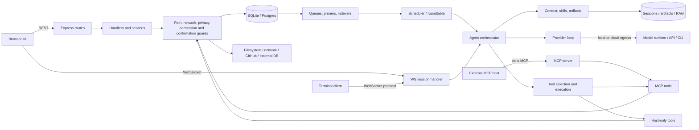
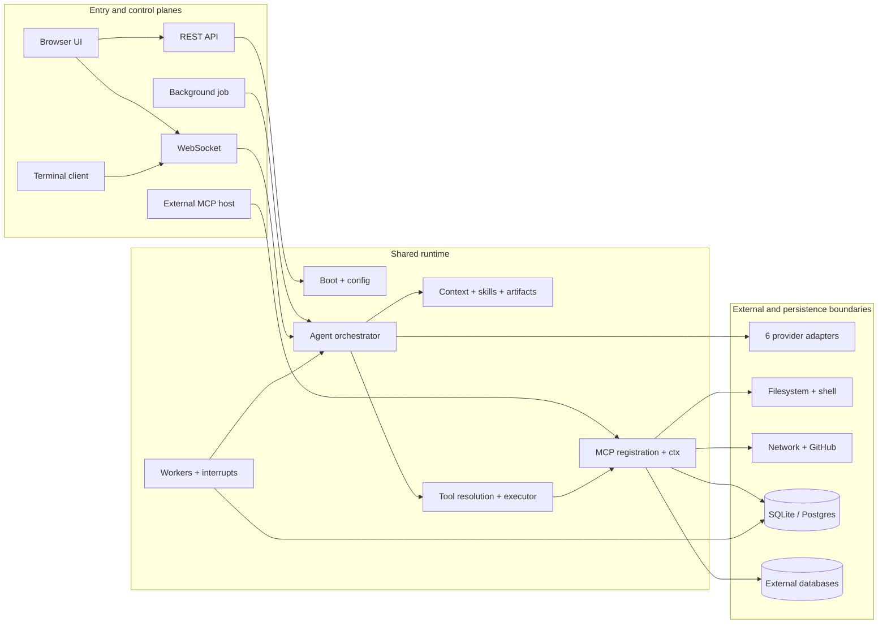
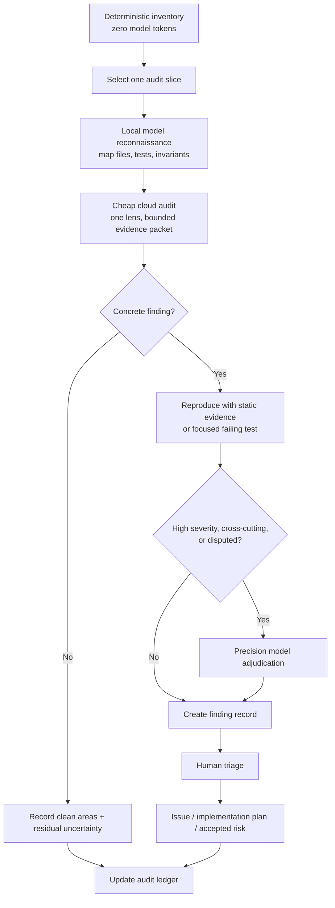
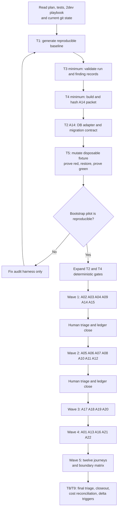
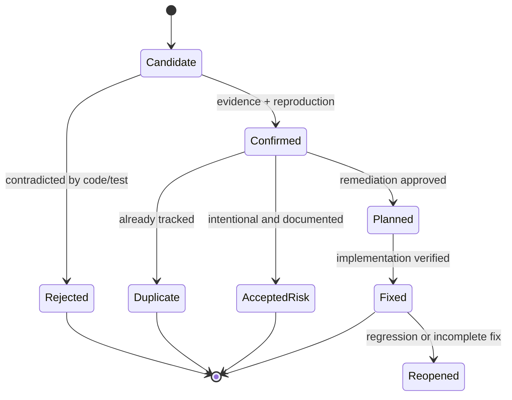
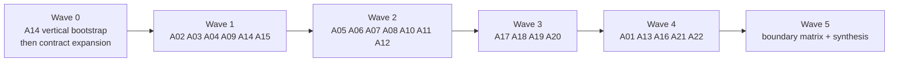

# Aperio Continuous Component Audit Plan

_Date: 2026-07-12 · Source direction: GitHub issue #205 · Planning basis: current working tree at `7c5fcf0`_
_Companion tests: `trash/plans/aperio-continuous-audit/aperio-continuous-audit-tests.md`_
_Developer playbook: `trash/plans/aperio-continuous-audit/2dev.md`_

## 1. Objective

Turn issue #205's component catalog into a repeatable, evidence-first audit program that finds real defects and architectural drift without paying frontier-model prices to repeatedly reread the whole repository.

## 2. Audit Findings That Shape This Plan

Issue #205 is a good orientation document, but it is not yet an executable audit plan.
The current repository survey found the following constraints:

| Observation | Current evidence | Consequence for this plan |
|---|---|---|
| The repository is larger than the issue's implied map | 217 source JavaScript files across `lib`, `mcp`, `db`, and `public/scripts`; 152 test files; roughly 3,495 `test()`/`describe()` declarations | Audit slices must be bounded and resumable; a single-session audit will lose precision and burn context |
| Provider coverage has drifted | Six provider loops exist: Anthropic, llama.cpp, DeepSeek, Gemini, Claude Code, and Codex | Codex needs its own audit entry; shared provider contracts need a separate cross-provider pass |
| The request path is broader than `server.js -> handler -> agent` | REST, WebSocket, terminal, internal agent, standalone MCP, background jobs, and provider SDK/CLI delegation are distinct entry paths | Audit by trust boundary and lifecycle as well as by directory |
| New context infrastructure is absent from #205 | `artifactStore`, `artifactRetrieval`, `ragStore`, `toolResultOffload`, model-context middleware, lifecycle trace | Add a dedicated context/artifact lifecycle domain |
| New security/orchestration infrastructure is absent | `lib/privacy/`, `lib/security/`, interrupts, agent permissions, job specs, roundtable budgets | Add agent-control-plane and privacy-egress domains |
| Migration counts are asymmetric | 9 Postgres migrations and 10 SQLite migrations in the current tree | Schema parity is a first-wave audit, not a generic checklist item |
| The existing audit material is valuable but can stale | `id/audit/protocol.md` still cites a 1,570-test baseline while the present suite is materially larger | Every audit run records commit SHA, counts, commands, and date; no timeless claims |
| The working tree is dirty in skills/UI files | Existing user changes touch skill matching, WebSocket handling, chat UI, and tests | Audit work remains read-only; findings against modified files are marked `working-tree-sensitive` and not auto-fixed |

This plan deliberately separates **inventory**, **finding**, **verification**, and
**remediation**. An audit session does not edit production code. A confirmed finding
becomes a narrowly scoped implementation plan or issue only after evidence review.

### Start-state recheck

The planning observations above are historical evidence, not the Run 1 baseline. A
read-only recheck on 2026-07-20 found commit `ad1d6ce365e0` on `master`, a clean worktree,
240 JavaScript files across `lib`, `mcp`, `db`, and `public/scripts`, 199 `*.test.js`
files, and nine migrations in each backend. In particular, the migration asymmetry that
helped motivate A14 is no longer present. This is useful evidence that the audit must
generate its baseline rather than copy counts or suspected defects from this plan.

Run 1 starts only after T1 generates the authoritative baseline. Do not keep hand-editing
the numbers in this section to make them look current.

## 3. Architecture and Audit Flow

### 3.1 Aperio component hierarchy — who owns what

This is the stable orientation map. Arrows mean **owns/composes**, not necessarily a
direct JavaScript import. A component may have more than one runtime caller; those shared
dependencies are shown separately in the request-path diagram below.

```mermaid
flowchart TD
    APERIO[Aperio]

    APERIO --> ENTRY[Entrypoints and clients]
    APERIO --> RUNTIME[Application runtime]
    APERIO --> SHARED[Shared capability layer]
    APERIO --> DATA[Persistence and indexes]
    APERIO --> DELIVERY[UI, setup, and delivery]

    ENTRY --> WEBENTRY[server.js<br/>production entrypoint]
    ENTRY --> BOOTSTRAP[bootstrap.js<br/>first-run setup]
    ENTRY --> TERMINAL[lib/terminal.js<br/>terminal client]
    ENTRY --> MCPENTRY[mcp/index.js<br/>standalone MCP host boundary]
    ENTRY --> JOBENTRY[workers/scheduler<br/>background entry]

    RUNTIME --> SERVER[lib/server.js<br/>composition root]
    SERVER --> HTTP[lib/routes/*<br/>REST and policy]
    SERVER --> WS[emitters/handlers/wsHandler.js<br/>WebSocket sessions]
    SERVER --> LIFECYCLE[boot, shutdown, auth,<br/>rate, TLS, net guard]
    WS --> AGENT[lib/agent/*<br/>orchestrator and lifecycle]
    JOBENTRY --> AGENT
    AGENT --> PROVIDERS[agent/providers/*<br/>six provider loops]
    AGENT --> CONTEXT[lib/context/*<br/>prompt, trim, artifacts, RAG]
    AGENT --> DISCOVERY[profiles, skills, schemas,<br/>hooks and workflow detection]

    SHARED --> MCPTOOLS[mcp/tools/*<br/>canonical tool registrations]
    SHARED --> HOSTTOOLS[agent/host-tools + lib/tools<br/>web-process tools]
    SHARED --> SECURITY[lib/security/*<br/>permissions and interrupts]
    SHARED --> PRIVACY[lib/privacy + redaction<br/>egress controls]
    SHARED --> PATHS[lib/routes/paths.js<br/>read/write path policy]
    SHARED --> NETWORK[web, GitHub, external DB<br/>network boundaries]
    AGENT --> MCPTOOLS
    AGENT --> HOSTTOOLS
    MCPENTRY --> MCPTOOLS
    MCPTOOLS --> PATHS
    HOSTTOOLS --> PATHS
    AGENT --> SECURITY
    AGENT --> PRIVACY

    DATA --> STORE[db/index.js<br/>store factory]
    STORE --> SQLITE[db/sqlite.js + migrations-sqlite]
    STORE --> POSTGRES[db/postgres.js + migrations]
    DATA --> MEMORY[memories, self-memory, wiki]
    DATA --> GRAPH[codegraph, docgraph, datasets]
    DATA --> RUNTIMEFILES[var/<br/>sessions, logs, artifacts, agent jobs]
    MCPTOOLS --> STORE
    HTTP --> STORE
    AGENT --> STORE
    CONTEXT --> RUNTIMEFILES

    DELIVERY --> BROWSER[public/<br/>browser application]
    DELIVERY --> SETUP[setup UI + configuration]
    DELIVERY --> PACKAGING[docker, VMs, installers, CI]
    BROWSER --> HTTP
    BROWSER --> WS
```

### 3.2 Runtime paths — who calls what

The same child can serve multiple parents. These paths are the reason the audit includes
both component slices and cross-domain journeys.

### 3.3 Audit program

### 3.4 Step-by-step execution map

This is the stable procedure. Live status belongs in
`aperio-continuous-audit-progress.md`; later sessions update that file, not this diagram.

### Finding lifecycle

## 4. Model Recommendation and Token Economics

### Recommended routing

Do not give the entire repository to one frontier model. Use a three-tier funnel:

| Stage | Recommended model | Use | Token cap per slice | Why |
|---|---|---|---:|---|
| Inventory and evidence collection | Shell scripts, `rg`, existing tests; no LLM | File maps, counts, import edges, config/migration parity, test ownership | 0 | Deterministic work should not consume inference tokens |
| Reconnaissance | Local llama.cpp coding model, preferably the strongest model that sustains acceptable speed on the host | Summarize a bounded file packet, enumerate invariants and suspicious seams | 18K input / 2K output | Zero API cost; mistakes are filtered by the evidence gate |
| Primary audit | `deepseek-chat` (or the currently available non-reasoning DeepSeek coding model) | One domain + one audit lens; produce evidence-backed candidates | 30K input / 4K output | Best cost/quality point for broad code review; avoid paying reasoning-token premiums for routine slices |
| Adjudication only | Current Codex precision model or a top-tier coding/reasoning model | Security-high findings, provider-contract disputes, race conditions, final cross-domain synthesis | 12K input / 3K output | Expensive reasoning is reserved for the small fraction of evidence that warrants it |

The repository's `CLAUDE.md` local-first rule is correct, but a local model should not
be the sole judge for security-critical findings. It is the scout; tests and focused
cross-review are the judge.

### Budget envelope

Use **22 audit slices** (listed below) with this default allowance:

- Deterministic inventory: **0 model tokens**.
- Local reconnaissance: at most **440K tokens total** (22 × 20K), **$0 API cost**.
- Primary DeepSeek review: at most **748K tokens total** (22 × 34K).
- Precision adjudication: budget only **5 slices**, at most **75K tokens total**.
- Never run Roundtable across all slices. It roughly duplicates prompt and output
  consumption and should be used only for the adjudication subset.

At the official `deepseek-chat` rates checked on 2026-07-12 ($0.27/M cache-miss
input, $0.07/M cache-hit input, $1.10/M output), one 30K-input/4K-output primary
slice costs approximately **$0.0125** on a cache miss; all 22 are approximately
**$0.28** before retries. Pricing source:
https://api-docs.deepseek.com/quick_start/pricing-details-usd

Those figures are a planning baseline, not a promise: model aliases, cache hit rate,
and prices change. Record actual provider usage returned by each call. If the requested
DeepSeek V4 model is not on the official price sheet, do not invent a V4 cost—use the
published alias/rate actually billed.

### Token controls that are mandatory

1. Build a compact **evidence packet** per slice: relevant source files, companion tests,
   public contract/docs, recent commits touching the slice, and dependency edges. Never
   attach the full repo.
2. Cap each packet at 30K input tokens. Split the slice if it exceeds the cap.
3. Pass file excerpts with line numbers, not duplicated prose summaries plus full files.
4. Give the model the general protocol plus exactly **one primary lens**. A second lens is
   a separate pass only when risk justifies it.
5. Cache stable material: threat model, conventions, finding schema, and architecture
   summary. Do not regenerate them in every prompt.
6. Stop a slice after two unsupported candidate cycles. Record uncertainty instead of
   buying more speculative reasoning.
7. A finding without a file/line reference, violated invariant, and reproduction path is
   discarded before cross-review.
8. Store per-run input, cached-input, reasoning, and output token counts in the audit
   ledger. Optimize the next wave using actual data rather than estimates.

## 5. Audit Domains and Ownership Map

Each row is an independently executable slice. The “first lens” selects the existing
role prompt in `id/audit/`; it does not imply that other concerns are ignored.

| Slice | Domain | Primary scope | First lens | Principal invariant |
|---:|---|---|---|---|
| A01 | Bootstrap and shutdown | `bootstrap.js`, `server.js`, crash/shutdown helpers | code reviewer | Every partial start has an observable recovery path; shutdown releases all owned resources |
| A02 | Configuration and secrets | config registry/resolver/sync, env loading, settings API | security engineer | One registered definition per setting; precedence and secret masking agree across CLI, DB, and UI |
| A03 | HTTP trust boundary | route mounting, auth, net guard, rate limits, TLS | security engineer | Every reachable state mutation has the intended host/origin/auth/rate controls |
| A04 | WebSocket and session lifecycle | `wsHandler`, emitters, session crypto/storage | security engineer | Per-connection state cannot leak or mutate another session; messages are ordered and bounded |
| A05 | Agent factory and lifecycle | agent bundle/index/spec/middleware/lifecycle trace | software architect | Session-scoped state is not shared accidentally; lifecycle transitions are explicit and replayable |
| A06 | Provider contract matrix | all six provider loops + provider resolution/schema | software architect | Same semantic turn, tools, abort, usage, redaction, and error contract across providers |
| A07 | Context assembly and trimming | `lib/context/trim.js`, prompt assembly, model-context middleware, language and skills injection | code reviewer | Context limits preserve system authority, tool-pair validity, ordering, provenance, and recoverability |
| A08 | Artifact lifecycle and retrieval | `artifactStore`, `artifactRetrieval`, `ragStore`, `toolResultOffload`, attachment bridges | software architect | Offloaded content remains addressable, scoped, bounded, attributable, and deleted with its owner |
| A09 | Privacy classification and egress | `lib/privacy/*`, secret redaction, self-memory walls, egress log, every provider send boundary | security engineer | Nothing marked local/private/secret crosses a cloud or logging boundary; derived redaction never corrupts local truth |
| A10 | Skills and prompt injection | skill loader/matcher, built-in and overlay skills, persona files | socratic questioner | Deterministic match/force/reload behavior; bounded prompt cost; untrusted content cannot silently become authority |
| A11 | Tool discovery and execution | profiles, hooks, executor, schema checks, activity | code reviewer | Only intended tools are exposed; arguments/results are validated, bounded, and correctly paired |
| A12 | MCP standalone boundary | `mcp/index.js`, all registrations, shared ctx | software architect | Internal and external callers receive equivalent contracts and guardrails; ctx shape is complete |
| A13 | Memory, wiki, and embeddings | handlers/tools, seeds, queues, ranking | product thinker | Recall quality and privacy are measurable; indexes remain consistent after every mutation |
| A14 | Database parity and encryption | factory, adapters, migrations, tables, crypto | code reviewer | SQLite/Postgres semantics and migrations remain equivalent; failures are transactional and recoverable |
| A15 | Filesystem, shell, and generated artifacts | paths, files, shell, output validation | security engineer | Canonical paths and symlinks cannot escape policy; execution cannot exceed declared capability |
| A16 | Network, GitHub, external DB egress | web/github/database tools, SSRF guard, DB secrets | security engineer | Destinations, credentials, queries, and egress are authorized, bounded, and auditable |
| A17 | Interrupt and cancellation semantics | interrupt service/routes, abort controllers, provider cancellation, WebSocket disconnect, tool/process timeout | code reviewer | Cancellation reaches every active layer once, releases resources, and records a truthful terminal state |
| A18 | Permission and capability enforcement | agent permissions, job specs, tool safety middleware, confirmations, local/cloud capability gates | security engineer | Authority is explicit, least-privilege, immutable during an action, and enforced at execution—not only selection/UI |
| A19 | Budgets, quotas, and runaway prevention | roundtable budget, agent turn/tool limits, context thresholds, rate limits, scheduler and provider usage | software architect | Every recursive/long-running loop has a measurable limit, one accounting source, and a safe exhausted state |
| A20 | Background agents and recovery | scheduler, roundtable, run/job persistence, pruners, restart/resume | software architect | Jobs are isolated, idempotent, budgeted, interruptible, and safely resumed after partial failure |
| A21 | Codegraph/docgraph ingestion | parsers, watchers, backends, queues | security engineer | Untrusted documents cannot escape resource limits; backend results and lifecycle agree |
| A22 | Web UI, setup, i18n, packaging and delivery | `public/`, installers, containers, workflows, release metadata | product thinker | Shipped paths match documented behavior and enforce the same workflow, security, config, and observability contracts |

### Wave order

Wave 1 goes first because config, trust boundaries, storage parity, and filesystem
policy constrain nearly every later conclusion. Within a wave, slices are independent,
but only one agent edits the shared ledger at a time.

### Bootstrap milestone — first implementation increment

Do not implement every deterministic contract and then attempt the first real slice. Start
with one thin vertical path through the audit system:

1. Implement T1 and generate a normalized baseline.
2. Implement only the T3 fields and transitions needed to record one run and one finding.
3. Implement T4 for A14, including inclusion reasons, content hashes, coupled exclusions,
   and the token estimate.
4. Implement the A14 portion of T2: store adapter operations and migration intent/parity.
5. Use a disposable fixture to make that gate fail, restore the fixture, and make it pass.
6. Write the first A14 run record, including a clean result if no defect is found.

This ordering intentionally crosses T1/T3/T4/T2/T5 before broadening any one test group.
It proves that inventory, evidence, contracts, red-first sensitivity, and recording work
together. A14 is the pilot because its backend contract is bounded and the old migration
asymmetry has already disappeared, preventing the harness from assuming its conclusion.

**Bootstrap works when:** another developer can check out the same revision, reproduce the
A14 packet and contract result, observe the fixture mutation fail for the named invariant,
and validate the resulting ledger record without starting Aperio.

## 6. Steps

Every step is covered by the companion test file.

The numbered steps are requirement groups, not a mandate to implement each whole group
before touching the next. The bootstrap milestone deliberately interleaves the minimum
useful parts of Steps 1–5, then returns to complete each group.

### Step 1 — Freeze the audit baseline

- Record date, branch, commit SHA, dirty paths (without altering them), Node/npm versions,
  source/test counts, migration names, provider names, route modules, MCP tool names, locale
  count, and relevant config keys.
- Generate the inventory using a checked-in/readable script or documented shell commands;
  do not ask an LLM to count files.
- Mark modified files as `working-tree-sensitive` in affected slices.
- **Works when:** a second developer can reproduce the inventory from the same commit and
  receive the same normalized output.
- **Tests:** T1.

### Step 2 — Define machine-readable contracts and drift gates

- Implement these incrementally. Start with the A14 database/migration contract used by the
  bootstrap milestone; expand to the other matrices only after that vertical path passes.
- Create audit-only inventories for provider capabilities, route protection, WebSocket
  message types, MCP ctx fields/tools, DB adapter methods, migration pairs, config keys,
  and UI locale keys.
- Prefer tests against exported registries. Where code has only implicit switch statements,
  use a static scanner first; do not refactor production code during the audit.
- Treat current asymmetries as questions, not automatic bugs (for example, SQLite migration
  `009_vec_cleanup.sql` may intentionally lack a Postgres equivalent).
- **Works when:** every implicit cross-module contract has either a passing drift test or a
  documented, reviewed exception.
- **Tests:** T2.

### Step 3 — Create the audit ledger and finding schema

- For the bootstrap milestone, implement the smallest complete run/finding schema needed by
  A14 before attempting the full contract catalog. Generalize from a validated record, not
  from hypothetical fields.
- Store one immutable run record per slice with: baseline SHA, lens, scope, files read,
  commands/tests run, model and provider, input/cache/reasoning/output tokens, candidates,
  confirmed findings, rejected candidates, residual uncertainty, and elapsed time.
- Finding fields: stable ID, title, severity, confidence, affected paths/lines, violated
  invariant, reproduction, expected vs actual, impact, evidence, suggested mitigation,
  regression-test location, duplicate search, and status.
- Severity is based on impact; confidence is separate. A high-impact/low-confidence candidate
  is not reported as a confirmed high-severity bug.
- **Works when:** schema validation rejects a finding without evidence, reproduction, or
  affected revision.
- **Tests:** T3.

### Step 4 — Build minimal evidence packets

- Build A14 first. Its manifest is the reference implementation for the remaining packet
  builders; do not create 22 hand-maintained file lists before validating hash and exclusion
  behavior.
- For each A01–A22 slice, derive the import/call neighbors, companion tests, config keys,
  routes/messages/tools, docs, and last relevant commits.
- Exclude fixtures, generated files, translations, and lockfile content unless the slice
  explicitly concerns them.
- Hash packet manifests so a later rerun can tell whether its evidence changed.
- Enforce the 30K input-token ceiling before model invocation; split oversized packets by
  lifecycle or trust boundary.
- **Works when:** every included file has a stated reason and every excluded but coupled file
  is visible in the manifest.
- **Tests:** T4.

### Step 5 — Run a red-first baseline

- Run existing focused tests and deterministic contract gates before model review.
- Confirm every newly proposed regression test actually fails against the audited behavior
  before any future remediation begins.
- Do not start `server.js` or standalone MCP merely to diagnose; use existing fixture servers
  and test harnesses. Manual runtime verification belongs to an approved implementation
  phase under the co-pilot contract.
- Classify failures as product failure, environment failure, flaky/timeout, or stale test.
- **Works when:** every baseline failure is reproducible and classified; no failure is hidden
  by a broad “tests failed” statement.
- **Tests:** T5.

### Step 6 — Execute Waves 1–5

- Run one slice at a time through deterministic inventory, local reconnaissance, cheap cloud
  audit, evidence verification, and optional precision adjudication.
- Use the general protocol plus one lens. Cross-lens review occurs only for confirmed
  cross-cutting or high-severity candidates.
- Search open issues and the ledger before creating a new finding.
- Record clean invariants and unreviewed edges; “no findings” never means “no risk.”
- **Works when:** all 22 slice reports satisfy the exit gate and token ledger, or explicitly
  state why a slice was deferred.
- **Tests:** T6.

### Step 7 — Audit cross-domain journeys

Component review alone misses boundary failures. Trace these end-to-end journeys:

1. Fresh Lite install → bootstrap → SQLite → local model → first memory recall.
2. Browser chat → WebSocket → agent → tool → confirmation → UI result.
3. External MCP host → ctx → memory/files tool → database/path guard.
4. Provider switch mid-session, including structured tool history, images, usage, and abort.
5. Cloud egress of a conversation containing secrets, self-memory, attachments, and tool results.
6. Background job → permissions/budget → interrupt → persisted run → restart/resume.
7. Document/code indexing → parser → embedding queue → backend → retrieval → deletion/reindex.
8. Non-loopback deployment → TLS/auth/origin/rate-limit → WebSocket and REST parity.
9. Browser disconnect/reconnect during provider streaming and during a mutating tool call.
10. External MCP host and browser session acting concurrently on the same memory, path policy,
    artifact, or database record.
11. Tool result too large for context → offload → artifact retrieval → provider switch → session
    resume → retention cleanup.
12. Permission or model change while a background job is queued, running, interrupted, and resumed.

- Complete the boundary matrix below in addition to the narrative journeys. Every populated
  cell must point to a journey/test or state a reviewed reason why the combination is impossible.
- **Works when:** every hop names its contract, owner, failure behavior, and observability;
  relevant negative cases are exercised; the boundary matrix has no unexplained cells.
- **Tests:** T7.

### Mandatory boundary matrix

| Caller / lifecycle | Agent/context | MCP/tools | Provider/cloud | DB/artifacts | Background/interrupt |
|---|---|---|---|---|---|
| Browser REST | config/session mutation; stale UI state | REST-to-tool parity where applicable | model selection and secret handling | CRUD consistency and auth | job CRUD, interrupt authorization, status freshness |
| Browser WebSocket | turn ordering, reconnect, per-session context | tool events, confirmation tokens, result pairing | stream/abort/usage/provider switch | session persistence, artifact references | foreground-to-job handoff and cancellation |
| Terminal client | protocol parity and session identity | tool visibility/result rendering | provider switch and stream errors | session/artifact parity with browser | interrupt and resume parity |
| External MCP host | no implicit browser/session assumptions | ctx completeness, confirmations, error contract | local/cloud privacy policy if provider-backed | concurrent writes, path and DB isolation | long calls, timeout, client disconnect |
| Internal foreground agent | prompt/skill/memory authority | selection → safety → execution | redaction, capability, usage, retry | offload/retrieval and transactions | interruption and resource cleanup |
| Scheduled/background agent | fresh vs captured context/provider | permission snapshot and noninteractive confirmation | budget, retry, provider availability | run persistence and idempotency | queue → run → interrupt → restart/resume |
| Shutdown/restart/recovery | session and cached-context invalidation | in-flight tool disposition | abort and remote stream closure | flush/rollback/retention | job terminal state and safe rescheduling |

The matrix is intentionally redundant with component slices: that redundancy is how the
audit catches a correct component connected incorrectly to another correct component.

### Step 8 — Triage findings into action

- Hold a human triage after each wave. Outcomes: duplicate, rejected, accepted risk,
  documentation-only, implementation plan, or immediate issue.
- Critical/high security findings receive a private disclosure path when publication would
  expose users. Do not put exploit-ready details into a public issue by default.
- Bundle fixes by invariant and blast radius, not by whichever audit session found them.
- Each accepted code finding must name its red regression test before implementation.
- **Works when:** every confirmed finding has one owner/outcome and no candidate silently
  becomes a public claim.
- **Tests:** T8.

### Step 9 — Publish the audit closeout and schedule deltas

- Publish counts by severity/status, invariant coverage, deferred risks, flaky/environmental
  failures, actual token/cost totals, and next-review triggers.
- Rerun cheap deterministic gates on every PR. Rerun only affected audit slices when their
  packet hash changes. Run a full wave quarterly or before a major release/security posture
  change.
- Triggers include: provider added/removed, ctx shape change, config key change, new route or
  WebSocket mutation, migration addition, new parser, auth/trust-model change, or new MCP tool.
- Complete the run progress and retrospective document; proposed Run 2 changes require
  evidence from Run 1, an expected benefit, an owner, and an acceptance criterion.
- **Works when:** a changed provider file schedules A06/A07/A09/A11 automatically rather than
  requiring a full-repository review.
- **Tests:** T9.

## 7. Finding Exit Gate

A candidate is **confirmed** only when all applicable boxes are checked:

- [ ] Exact commit/working-tree state recorded.
- [ ] File and line references point to current code.
- [ ] Violated invariant is explicit.
- [ ] Expected and actual behavior are distinguishable.
- [ ] Static trace, focused test, or safe reproduction supports the claim.
- [ ] Existing tests and issues were searched.
- [ ] Severity and confidence were assigned independently.
- [ ] SQLite/Postgres, local/cloud, browser/MCP, or other relevant variants were considered.
- [ ] Proposed mitigation does not widen scope beyond the finding.
- [ ] A regression-test location is named.
- [ ] Token usage and model are recorded.

## 8. Risks and Mitigations

| Risk | Mitigation |
|---|---|
| The audit plan becomes another stale map | Generated inventory, commit-stamped reports, packet hashes, and change-triggered slice reruns |
| LLM reports plausible but false bugs | Evidence gate, red-first test, line references, confidence field, and precision adjudication only after reproduction |
| Token cost grows through repeated whole-repo context | 30K packet ceiling, one lens per pass, stable prompt caching, deterministic discovery, no default Roundtable |
| Cheap/local model misses a serious security flaw | Security slices use a cloud primary pass; high-impact candidates escalate even when confidence is low |
| Frontier model is used for mechanical work | Explicit routing table and ledger alerts when a precision model is invoked outside adjudication |
| Current dirty files invalidate conclusions | Baseline records the diff; affected findings are `working-tree-sensitive` and verified against an agreed revision before publication |
| Broad full-suite failures mask the useful signal | Focused tests first; failures classified by product/environment/flaky/stale; full suite is a final regression gate |
| Audit agents accidentally change code | Read-only audit rule; remediation is a separate approved task/plan |
| Parallel agents overwrite a shared report | Immutable per-slice reports and a single-writer aggregation step |
| Public issue discloses an exploitable vulnerability | Security triage chooses private disclosure before public issue creation |
| Directory-based slices miss boundary bugs | Mandatory end-to-end journey audits in Step 7 |
| Test count is mistaken for coverage quality | Contract/invariant map and negative tests; raw count is only baseline metadata |

## 9. Deliverables

The implementation of this plan should produce:

1. A reproducible baseline inventory.
2. Contract/drift checks for the implicit high-risk matrices.
3. A versioned audit ledger and validated finding schema.
4. Twenty-two bounded slice manifests and reports.
5. Twelve end-to-end journey reports and a fully dispositioned boundary matrix.
6. A triaged finding register with regression-test locations.
7. A closeout containing actual token and cost accounting.
8. Change triggers that select delta audits instead of repeatedly auditing everything.
9. A completed run progress/retrospective document derived from
   `aperio-continuous-audit-progress.md`, preserved as the baseline for Run 2.
10. A stable parent/child component map and runtime-boundary map maintained in this plan.
11. A session-ready developer playbook (`2dev.md`) with prompts, checks, and handoff rules.

## 10. Documentation Updates

Ask for approval before writing these, per `CLAUDE.md`:

- `id/audit/protocol.md` — replace the static test-count snapshot with the repeatable baseline,
  finding schema, and slice workflow.
- `id/reference/architecture.md` — add context/artifact, Codex, privacy/security, and interrupt
  paths found missing from the current overview.
- `id/reference/testing.md` — document audit contract gates and classification of environment
  failures.
- `SECURITY.md` — only if confirmed findings change the threat model or supported deployment
  posture.
- `CONTRIBUTING.md` — add the developer workflow for selecting and reporting an audit slice.
- `CHANGELOG.md` — add the audit framework when its scripts/schema land; individual behavior
  fixes get their own entries.
- GitHub issue #205 — link this plan or replace its drifting counts with generated references;
  preserve it as the human-friendly index rather than duplicating detailed findings there.

No documentation or issue updates are part of this planning task itself.
