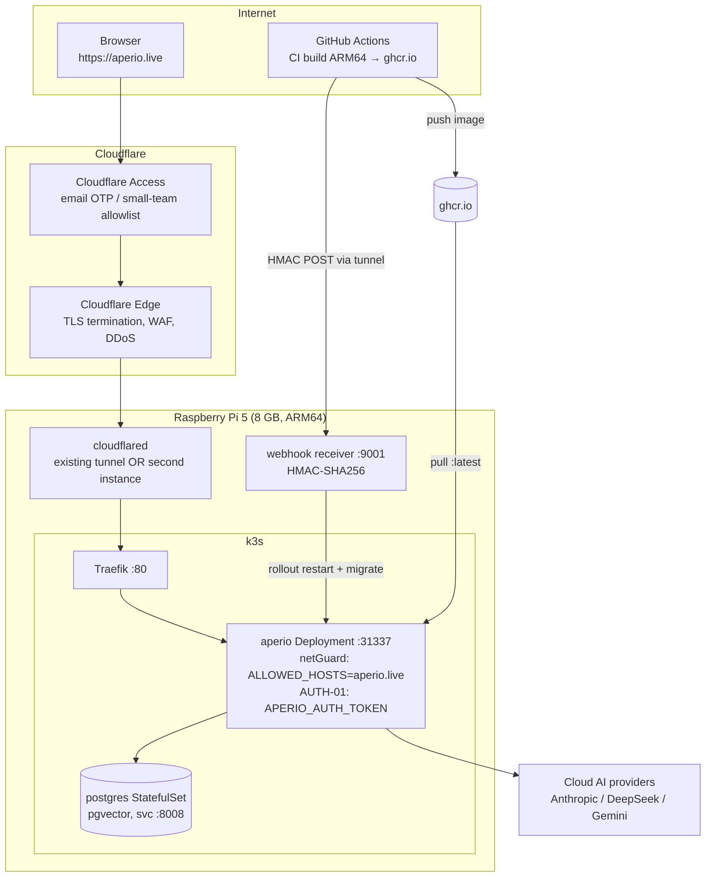

# Aperio public at aperio.live — k3s / Pi 5 / Cloudflare Tunnel

> Companion tests: [`aperio-live-public-deploy-tests.md`](aperio-live-public-deploy-tests.md)
> Supersedes issues #19, #51 (auth research preserved), #49 (DB research preserved; #208 stays open).

## 1. Objective

Serve the full Aperio app publicly at **https://aperio.live** from the existing k3s
cluster on the Raspberry Pi 5, hardened for the open internet (Cloudflare Access +
`APERIO_AUTH_TOKEN` now, Keycloak-ready later), configured for **cloud AI providers**
(the Pi's 8 GB runs only the app + Postgres) — and restructure the `k8s/` docs around
the one real deploy flow (GitHub CI builds → webhook → Pi pulls).

**Key architectural insight** (this is why #19 closes): hosting the *whole app* at
aperio.live is **same-origin**. The browser loads UI and opens the WebSocket against
the same host. The entire Mixed-Content / Private-Network-Access / netGuard-relaxation
problem that #19's two audits analyze does not exist on this path. What survives from
#19 is its security research (REBIND-01, `APERIO_PAIRED_ORIGIN`, PNA) — preserved in
the closed issue's comments and pointed to from the new EPIC — for the future
Aperio-lite split-UI scenario, which is explicitly out of scope here.

## 2. Diagram

Request path: browser → Cloudflare edge (TLS ends here) → tunnel (encrypted) →
cloudflared on the Pi → Traefik `web` entrypoint (plain HTTP, host-local) →
`aperio` Service :31337. WebSocket upgrades ride the same path (Cloudflare
proxies WS natively).

## 3. Model recommendation

- **Recommended:** current Claude Code session (Anthropic) for the repo-side work
  (manifests, workflow, docs rewrite) — precision-critical config where a wrong
  Host rule or env var silently 403s everything. Pi-side steps are human-driven
  shell (per the Co-pilot Contract, no processes run from here).
- **Estimated tokens:** ~60k in / ~15k out (docs rewrite dominates). ≈ $1–2 at
  current Anthropic pricing.
- **Rationale:** small code volume, high blast radius (`netGuard`, ingress, CD
  workflow) — not a job for a 7B local model; no heavy reasoning that would
  justify DeepSeek round-trips.

## 4. Steps

Ordered; each has an acceptance criterion and a test-group reference
(→ `aperio-live-public-deploy-tests.md`).

### WS0 — Issue housekeeping (done as part of planning)
1. Create the new EPIC issue collecting the undone-and-worthwhile items from
   #19/#51/#49; close those three with pointer comments; #54 already closed;
   #208 stays open (hosted-Postgres guide is a separate deliverable).
   *Works when:* EPIC exists, three issues closed, each with a comment linking
   the EPIC. → **T0**

### WS1 — Tunnel routing to aperio.live (decision gate)
2. **Determine the account layout:** in the Cloudflare dashboard, check whether
   the aperio.live zone lives in the same account as the existing tunnel's
   domain (`cloudflared tunnel list` under each account).
   *Works when:* answered; one of the two paths below is selected.
3. **Path A — same account, reuse the tunnel (preferred):**
   - Add an ingress rule *above* the existing wildcard in the tunnel's
     `config.yml`: `hostname: aperio.live → service: http://localhost:80`
     (Traefik). Optionally `www.aperio.live` too.
   - Route DNS: `cloudflared tunnel route dns <tunnel> aperio.live` (creates the
     CNAME to `<tunnel-id>.cfargotunnel.com` in the aperio.live zone).
   - `sudo systemctl restart cloudflared`.
   *Works when:* `curl -sI https://aperio.live` returns a Cloudflare-served
   response reaching Traefik (any HTTP status from Traefik, not 1033/530 tunnel
   errors). → **T1**
4. **Path B — different account (or isolation wanted): second tunnel.**
   - `cloudflared login` against the aperio.live account → new cert.
   - `cloudflared tunnel create aperio` → credentials JSON.
   - Config at `/etc/cloudflared-aperio/config.yml` (ingress: aperio.live →
     `http://localhost:80`, catch-all 404), dedicated systemd unit
     `cloudflared-aperio.service` (template on the existing unit; different
     config path; both instances coexist — they make *outbound* connections,
     no port conflicts).
   - `cloudflared tunnel route dns aperio aperio.live`.
   *Works when:* same criterion as step 3; both cloudflared services active. → **T1**

### WS2 — k3s + app config for the public hostname
5. **Ingress:** extend `k8s/ingress.yaml` route to
   ``match: Host(`aperio.local`) || Host(`aperio.live`)``.
   *Works when:* `curl -H "Host: aperio.live" http://<pi-ip>` reaches the app
   (from LAN) and `aperio.local` still works. → **T2**
6. **netGuard:** add `APERIO_ALLOWED_HOSTS=aperio.live` to the Deployment env
   in `k8s/aperio.yaml`. Without this every request with `Host: aperio.live`
   is `403 host_not_allowed` — this is the single most likely silent failure.
   *Works when:* request via aperio.live returns the app, and a bogus Host
   (e.g. `Host: evil.example`) still 403s. → **T2**
7. **Auth token:** add `aperio-auth-token` to `k8s/secrets.yaml` (base64,
   generated with `openssl rand -hex 32`) and inject as `APERIO_AUTH_TOKEN`
   env in the Deployment. Rotate the Postgres placeholder password at the
   same time (the placeholder base64 is in the public repo).
   *Works when:* `/api/*` without the token → 401/403; with token → 200; WS
   connect carries the token (AUTH-01 query param). → **T3**
8. **Cloud-provider profile:** ConfigMap first-boot defaults set a cloud
   provider (e.g. `AI_PROVIDER=anthropic`), embeddings decision recorded
   (local `transformers` works on ARM64 but is slow on Pi — start there, move
   to `voyage` if latency hurts). llama.cpp stays disabled.
   *Works when:* pod memory stays within the 512Mi request / 1Gi limit during
   a chat round-trip. → **T5**

### WS3 — Public-exposure hardening
9. **Cloudflare Access:** create an Access application for `aperio.live`
   (email-OTP allowlist; free tier covers a small team). Note for the EPIC:
   a 15–20-person team can run on Access alone; the dev deployment layers
   `APERIO_AUTH_TOKEN` on top; Keycloak (#51 research) arrives later as the
   real IdP — Access can federate to it, or it can replace this layer via
   Traefik forward-auth. Keep auth **at the edge/ingress layer**, not baked
   into the app, so the Keycloak swap is config, not code.
   *Works when:* unauthenticated browser → Cloudflare login page; allowlisted
   email gets through; non-allowlisted is refused. → **T4**
10. **Webhook exposure:** the receiver hostname (e.g.
    `aperio-webhook.<domain>`) stays HMAC-guarded; it must NOT sit behind the
    interactive Access policy (GitHub's runner can't do OTP). Either exclude
    it from Access or use an Access *service token* (workflow sends
    `CF-Access-Client-Id/Secret` headers). HMAC remains the primary gate.
    *Works when:* a signed POST from the workflow reaches the receiver; an
    unsigned POST is rejected. → **T6**
11. **Proxy-correctness audit:** verify rate limiting and any IP-based logic
    see the real client IP behind Cloudflare + Traefik (Express `trust proxy`,
    `CF-Connecting-IP`). Verify WS long-idle behavior through Cloudflare
    (~100 s idle timeout — confirm Aperio's ping/keepalive covers it; if not,
    add a WS ping interval < 60 s).
    *Works when:* rate limiter keys on distinct client IPs, not the tunnel's;
    an idle chat tab stays connected > 5 min. → **T5**
12. **Container posture check (no change expected, verify):** shell tool off,
    `APERIO_ALLOWED_PATHS_TO_READ=/app`, `_WRITE=/app/var`, non-root image,
    resource limits enforced.
    *Works when:* checklist in T4 passes against the live pod env. → **T4**

### WS4 — k8s/ docs split
13. Replace `k8s/k3s-instructions.md` with:
    - **`k8s/README.md`** — lean (~1 page): the real flow only. Manifest table,
      initial deploy, the CI→webhook→pull loop, aperio.live routing, security
      env vars, troubleshooting quick-refs. No Docker-on-Pi, no node/npm-on-Pi
      prerequisites, no `main`-branch references (workflow triggers on
      `master`), no "git pull → docker build → k3s import" description.
    - **`k8s/ALTERNATIVES.md`** — everything optional: Tailscale Funnel,
      self-hosted runner, manual deploy without webhook, heredoc-style
      walkthrough for a fresh Pi, NodePort DB access, second-tunnel setup
      (the path B not chosen), Pages/PWA split-UI pointer to #19's archive.
    *Works when:* both files exist, `k3s-instructions.md` deleted, no stale
    claims (grep gate in tests), links from README → ALTERNATIVES resolve. → **T7**

### WS5 — Close the CD loop end-to-end
14. Uncomment the "Notify Pi" step in `.github/workflows/cd.k3s-deploy.yml`;
    set `APERIO_PI_WEBHOOK_URL` (tunnel hostname) + `APERIO_PI_WEBHOOK_SECRET`
    GitHub secrets.
    *Works when:* an empty-commit push to master → Actions green → webhook 200
    → new pod rolled out → migrations logged → app live at aperio.live. → **T6**

### WS6 — Documentation sync (ask-first, per CLAUDE.md)
15. After implementation, propose updates: `CHANGELOG.md` (Unreleased),
    `README.md` (if k8s deploy is referenced), `id/reference/architecture.md`
    (deployment section), `SECURITY.md` (public-exposure posture). **Confirm
    with the user before writing each.**
    *Works when:* user has approved/declined each file explicitly. → **T7**

## 5. Risks

| Risk | Mitigation |
|------|------------|
| netGuard 403s everything at aperio.live (`host_not_allowed`) | Step 6 is mandatory before DNS cutover; T2 tests both allowed and bogus Host headers |
| Cloudflare account mismatch discovered late | Decision gate (step 2) is first; both paths fully specified |
| WS drops through Cloudflare (~100 s idle timeout) | Step 11 verifies keepalive; add ping < 60 s if missing |
| Placeholder Postgres password / secrets in public repo | Step 7 rotates both secrets before exposure; secrets.yaml keeps only placeholders + regeneration instructions |
| Webhook endpoint publicly reachable | HMAC-SHA256 required; optional Access service token; receiver runs one fixed script, no payload-derived commands |
| Pi memory contention (bgapi + SQL Edge 2 GB + aperio stack) | Existing budget ≈ 2.8 GB worst case for aperio side; T5 watches pod memory during chat; k8s limits enforce ceilings |
| `imagePullPolicy: Always` + `:latest` → unpinned deploys | Accepted for now; noted in EPIC as future improvement (webhook payload carries SHA → `kubectl set image`) |
| Cloud API keys resident on a public-facing box | Keys live in DB settings on the PVC; Access + token gate the UI; future Keycloak / DB-encryption for Postgres noted in EPIC |
| Aperio is single-user; a "team" behind Access shares one brain | Explicitly documented in EPIC — multi-tenancy is #49/#51 territory, not this EPIC |

## 6. Doc updates (see Documentation Sync — ask first)

| File | Why |
|------|-----|
| `k8s/README.md` (new) + `k8s/ALTERNATIVES.md` (new) | The split itself (WS4) |
| `k8s/k3s-instructions.md` (delete) | Superseded by the split |
| `CHANGELOG.md` | Feature: public deployment support (ingress hosts, ALLOWED_HOSTS docs, workflow webhook step) |
| `SECURITY.md` | Public-exposure posture: Access + token layering, netGuard role |
| `id/reference/architecture.md` | Deployment topology addition |
| `README.md` | Only if it references the k8s guide by filename |
