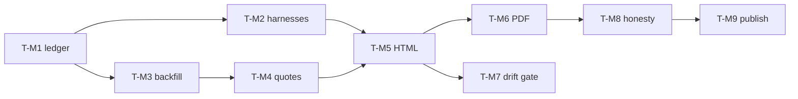

# Document Intelligence Capability Manual — Verification Plan

Companion to [`docint-capability-manual.md`](./docint-capability-manual.md).

The artifact this plan produces is a public claim about our own software. The tests
therefore have two jobs: prove the pipeline works, and prove the pipeline **cannot
publish a number nobody measured**. Every group below that carries the second job is
marked ⚑.

---

## 1. Coverage map

| Plan step | Test group | Coverage |
|---|---|---|
| 1 — ledger schema + appender | T-M1 ⚑ | Record validation, rejection paths, fixture-corpus guard, append atomicity |
| 2 — harness wiring | T-M2 ⚑ | One record per run per harness, including timeout/abort/error paths |
| 3 — historical backfill | T-M3 ⚑ | Provenance marking, evidence references, absent-vs-zero discipline |
| 4 — curated quotes | T-M4 ⚑ | Quote↔run linkage, dangling-reference failure, no generated prose |
| 5 — HTML generator | T-M5 | Determinism, self-containment, ledger-traceability of every rendered figure |
| 6 — PDF render | T-M6 | Extractable text, expected figures present, pagination integrity |
| 7 — drift gate + scripts | T-M7 | Regeneration check red/green, CI wiring |
| 8 — content/honesty pass | T-M8 ⚑ | Review checklist; contradiction sweep against transcripts |
| 9 — publish | T-M9 | Link integrity, both themes, release asset equality |

No plan step is uncovered. T-M5/T-M6/T-M7/T-M9 are mechanical; the ⚑ groups are where a
dishonest artifact would have to sneak through, and they are deliberately the strictest.

---

## 2. Test cases

### T-M1 — Ledger schema and appender ⚑

**Setup:** `benchmarks/docint/ledger.mjs`; a scratch ledger path (never the tracked file);
a valid record fixture; the household-gen spec hash available.

| Case | Input | Expected |
|---|---|---|
| T-M1.1 valid round-trip | Complete record | Appended as exactly one line; re-read parses deep-equal to input |
| T-M1.2 missing required field | Record without `model` | Rejected; error names `model`; **file unchanged** |
| T-M1.3 family label rejected | `model: "gemma"` / `"GPT-5"` | Rejected — the project requires exact model ids, and a manual that says "Gemma" is unfalsifiable |
| T-M1.4 fixture guard | `corpus: "/Users/…/my-bills"` | Rejected; file unchanged; error explains the guard |
| T-M1.5 fixture guard, stale hash | `household-gen@<wrong-hash>` | Rejected — a record from a mutated corpus is not comparable to the others |
| T-M1.6 backfill requires evidence | `source: "backfilled"`, no `evidenceRef` | Rejected |
| T-M1.7 unknown fields | Extra key | Rejected, not silently dropped — an unread field is a number that never reaches the reader |
| T-M1.8 concurrent append | Two appends racing | Both lines intact and parseable; no interleaved/truncated line |
| T-M1.9 no prose leaks | Record carrying a `answer`/`text`/`prose` key | Rejected by schema |

**Edge cases:** empty ledger file; ledger with a trailing newline and without; a record
whose `checks` object is empty (a grader that produced nothing must not look like a pass).

### T-M2 — Harness wiring ⚑

**Setup:** each of the four harnesses, run against the fixture corpus with a stubbed
provider so no live model time is spent; scratch ledger path via env override.

| Case | Input | Expected |
|---|---|---|
| T-M2.1 clean pass | Stubbed passing run | Exactly one record; `status: "pass"`; `checks` matches the grader's own object |
| T-M2.2 clean fail | Stubbed failing run | One record; `status: "fail"`; `failures` verbatim from the grader |
| T-M2.3 per-turn timeout | Stub that never completes a turn | One record; `status: "error"`; partial `perTurnWallMs` retained |
| T-M2.4 abort mid-run | SIGINT during a turn | One record written from `finally`; teardown still clean; no orphan process |
| T-M2.5 non-fixture corpus | Harness pointed elsewhere | Results printed to stdout; **zero** ledger lines |
| T-M2.6 no double-append | One run | Exactly one line — not one per turn, not one per phase |
| T-M2.7 llama.cpp fields | Stubbed local run reporting timings | `cacheN`, `contextServed`, `contextUsable` populated; absent for cloud providers rather than zeroed |

**Edge cases:** harness crashing before the first turn (record with `status: "error"` and
no turn data); ledger path unwritable (harness reports it and still exits cleanly rather
than losing the run silently).

### T-M3 — Historical backfill ⚑

**Setup:** the four evidence sources named in plan step 3; the backfilled ledger.

| Case | Assertion |
|---|---|
| T-M3.1 | Every backfilled record has `source: "backfilled"` and an `evidenceRef` that resolves to an existing file |
| T-M3.2 | No backfilled record has a `checks` object unless the evidence file actually lists per-check results — a summarized "PASS" becomes `status` only |
| T-M3.3 | Unmeasured fields are **absent**; a scan for `0`/`null` in `wallMs`, `tokens`, `cacheN` across backfilled records returns nothing |
| T-M3.4 | Both T-R5 Gemma 4 E4B passes (2026-08-01, 2026-08-02) are present and distinct |
| T-M3.5 | The T-G2.3 gemma4 run appears as `fail` — the corrected verdict, never the original false pass |
| T-M3.6 | The DeepSeek `deepseek-v4-flash` provenance pass is recorded as a cloud run and is not attributed to a local model |
| T-M3.7 | Manual spot-check: a reviewer picks 5 records at random and traces each to its source sentence |

**Edge case:** a run described in two files with different numbers → the discrepancy is
resolved and noted, not averaged, and not silently resolved in favor of the better number.

### T-M4 — Curated quotes ⚑

| Case | Input | Expected |
|---|---|---|
| T-M4.1 | Quote referencing an existing `runId` | Renders, attributed to that run's model and date |
| T-M4.2 | Quote referencing an unknown `runId` | Generator **fails**; no partial output written |
| T-M4.3 | Ledger record deleted after a quote was written | Generator fails on the now-dangling reference |
| T-M4.4 | The two carrying quotes present | Empty-query recital and the `893.24` blend both render in the failures section |
| T-M4.5 | Quote text vs source | Each quote matches its original transcript excerpt; ellipsis allowed, paraphrase not |

### T-M5 — HTML generator

| Case | Assertion |
|---|---|
| T-M5.1 determinism | Two runs on one ledger produce byte-identical HTML (timestamps come from data, not `Date.now()`) |
| T-M5.2 self-contained | No `http(s)://` asset reference; fonts, styles, images inline |
| T-M5.3 traceability | Every numeric figure in the rendered tables maps to a ledger field — asserted by generating from a synthetic ledger of known sentinel values and finding exactly those values |
| T-M5.4 empty ledger | Renders an honest "no runs recorded" document rather than an empty table implying zero results |
| T-M5.5 both themes | Light and dark render with adequate contrast; no color-only encoding of pass/fail |
| T-M5.6 provenance column | Backfilled rows visually distinguishable from harness-written rows |
| T-M5.7 charts | The two charts read correctly at print size and in grayscale |

### T-M6 — PDF render

**Setup:** Playwright chromium; `pdfjs-dist` (already a dependency) for extraction.

| Case | Assertion |
|---|---|
| T-M6.1 | PDF is produced, non-zero length, opens without error |
| T-M6.2 | Extracted text contains the June gate figures — `696.84`, `260.50`, `215.60`, `140.75`, `50.00`, `29.99` — and `196.40` **separately**, never a blended `893.24` outside the quoted-failure context |
| T-M6.3 | Extracted text contains each recorded model's exact id |
| T-M6.4 | Footer carries page numbers and the commit SHA on every page |
| T-M6.5 | No table row or chart is split across a page break |
| T-M6.6 | Page count within a sane band (a 200-page manual means the generator looped) |

**Edge case:** a ledger large enough to paginate the results table across pages — headers
repeat, and no run appears twice or disappears.

### T-M7 — Drift gate and scripts

| Case | Assertion |
|---|---|
| T-M7.1 | `manual:docint:check` passes immediately after `manual:docint` |
| T-M7.2 | Hand-editing the committed HTML makes `--check` fail with a useful diff |
| T-M7.3 | Appending a ledger record makes `--check` fail until regenerated |
| T-M7.4 | CI installs chromium only, not all browsers |
| T-M7.5 | A PDF-render failure fails its own job without blocking the HTML drift gate |

### T-M8 — Content and honesty pass ⚑

A review checklist, run against the rendered PDF before publication:

1. No gate is reported as passed where a transcript in the epic contradicts it.
2. No cloud-provider result is presented, by placement or wording, as a local-model result.
3. Every model named uses its exact id.
4. Failures are shown at the same visual weight as passes — not in smaller type, not in an
   appendix, not behind a euphemism.
5. The hardware section names the machine measured and does not generalize from it.
6. The "choosing a model" section reaches whatever conclusion the evidence supports,
   including "not on this hardware yet" — and is not softened if that is the answer.
7. Every claim in the prose is traceable to a ledger record or is explicitly framed as
   design intent rather than measurement.
8. A reader who has never seen this repository can tell what was tested and how to redo it.
9. Developer approves the rendered PDF.

### T-M9 — Publish

| Case | Assertion |
|---|---|
| T-M9.1 | The `docs/` link resolves to the generated PDF, not a stale copy |
| T-M9.2 | The HTML page renders on aperio.live in both themes, no console errors |
| T-M9.3 | The release asset is byte-identical to the committed artifact |
| T-M9.4 | The manual's own "reproduce it yourself" commands run as written from a clean checkout |

---

## 3. Execution order

T-M1 gates everything. T-M2 and T-M3 are independent of each other. T-M8 is the only group
a human must run, and it is the last gate before publication — nothing ships on mechanical
green alone.

---

## 4. Required setup

- Household-gen fixture corpus and its spec hash (`tests/fixtures/household-gen/`).
- Stub provider for T-M2 so harness wiring is testable without live model time.
- Playwright chromium: `npx playwright install chromium`.
- `pdfjs-dist` for PDF text extraction — already a project dependency.
- A scratch ledger path honored via env override, so no test ever appends to the tracked
  ledger.
- The four evidence sources for T-M3, unmodified.

---

## 5. Verification-first note

Before implementation, T-M1.4 (fixture guard) and T-M4.2 (dangling quote) must be
demonstrated **red** — a run against a non-fixture corpus writing a ledger line, and a
generator happily rendering a quote with no run behind it. These are the two failure modes
that would put an unverifiable claim in a published document; if their tests cannot be made
to fail first, the tests are not testing anything.
