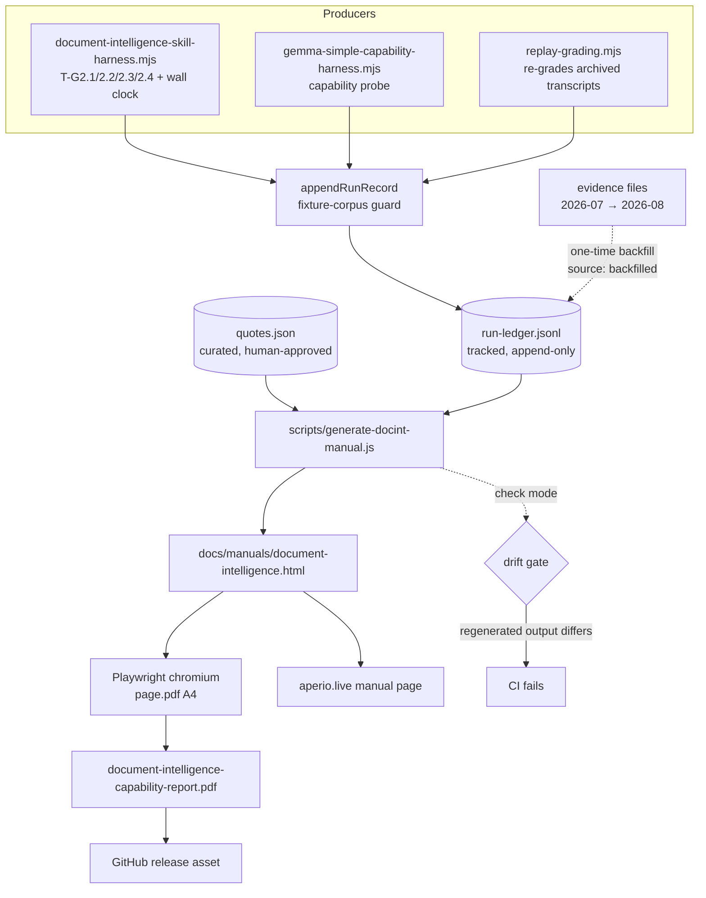

# Document Intelligence Capability Manual — Ledger-Sourced PDF

**Parent epic:** [#250](https://github.com/BaiGanio/aperio/issues/250) — `trash/plans/document-intelligence-epic/`
**Companion tests:** [`docint-capability-manual-tests.md`](./docint-capability-manual-tests.md)
**Status:** (2026-08-13) proposed, not started
**Decisions taken:** ledger + generator (not hand-authored) · public release asset · document-intelligence only

---

## 1. Objective

Publish an honest, reproducible PDF that reports what real models actually achieved on
Aperio's document-intelligence gates — passes *and* failures, with hardware numbers — so a
prospective user can decide for themselves which model and which machine their documents
deserve, instead of taking a feature list on faith.

## 2. Why a ledger, not a written document

The one epistemic failure this epic already suffered was a **hand-read pass**: a run was
graded green, transcribed into a status line, and believed for a day before the transcript
showed the model had inserted nothing and recited its answer from memory. A manual
assembled by reading evidence files and retyping numbers reproduces exactly that risk, at
publication scale and in front of strangers.

So the manual is a *rendering* of a machine-written ledger, the same way the household
corpus and its oracle are two renderings of one declarative spec. A number can appear in
the PDF only if a harness wrote it there on completion. Re-running a gate updates the
document; nobody retypes anything.

The historical runs already recorded in the evidence files cannot meet that bar — they
were written by hand before the ledger existed. They are still the most valuable data we
have, so they get backfilled, but every backfilled record carries
`source: "backfilled"` plus the evidence file it came from, and the manual visibly
distinguishes measured-by-harness from transcribed-from-notes. Honesty about the
provenance of the evidence is part of the evidence.

## 3. Diagram

## 4. Design

### 4.1 The ledger

`benchmarks/docint/run-ledger.jsonl` — tracked, append-only, one JSON object per line per
completed run. Chosen over `var/` (git-ignored, so it could never source a published
artifact) and over `trash/plans/` (a working area, not a source of release assets).

One record, all fields required unless marked optional:

| Field | Meaning |
|---|---|
| `runId` | ULID, generated at run start |
| `ts` | ISO 8601, run completion |
| `harness` | which producer wrote it |
| `gate` | `T-R5` \| `T-G2.1` \| `T-G2.2` \| `T-G2.3` \| `T-G2.4` \| `capability` \| `cache` |
| `provider` / `model` | exact model id — never a family label |
| `status` | `pass` \| `fail` \| `error` |
| `checks` | the grader's own per-check booleans, verbatim |
| `failures` | the grader's own failure strings, verbatim |
| `wallMs`, `perTurnWallMs[]` | measured |
| `tokens` | `{input, output, thinking}` per turn where the provider reports it |
| `cacheN` (opt.) | llama.cpp `timings.cache_n` per turn — the KV-reuse evidence |
| `contextServed` / `contextUsable` (opt.) | local models only |
| `hardware` | `{platform, arch, cpu, ramGb}` — collected, never guessed |
| `corpus` | `household-gen@<spec-hash>` |
| `commit` | repo short SHA at run time |
| `source` | `harness` \| `backfilled` |
| `evidenceRef` (opt.) | required when `source: backfilled` |

**Privacy guard, non-negotiable:** `appendRunRecord()` refuses to write unless `corpus`
resolves to the generated household-gen fixture. A user pointing a harness at their own
documents gets their results on screen and nothing in the tracked ledger. The record
carries no document text and no model prose — only the grader's own structured output.

### 4.2 Quotes

The failures are the most useful part of the manual, and they need the model's actual
words — "I cannot pull the data directly from the database right now, I will provide the
exact breakdown based on the structured data I successfully extracted" says more than any
summary of it. But auto-lifting model prose into a public document is precisely the thing
the privacy guard exists to prevent.

So quotes live in `benchmarks/docint/quotes.json`: hand-curated, each entry referencing a
`runId` that must exist in the ledger, each reviewed by the developer before it ships. The
generator fails if a quote references an unknown run, and the manual renders no prose the
generator invented.

### 4.3 Generator and PDF

`scripts/generate-docint-manual.js`, following `scripts/generate-*-dashboard.js`: reads
data, stamps branch/commit, writes an artifact. Output is a single self-contained HTML
file — no external fonts, no CDN — which serves double duty as the aperio.live manual page.

PDF comes from that same HTML via Playwright's chromium `page.pdf()` (A4, print CSS,
running footer with page numbers and the commit SHA). Playwright is already a
devDependency for `test:browser`; this adds no new dependency and no LibreOffice
requirement. The docx→soffice route the `pdf` skill recommends is right for agent-authored
one-offs but wrong here — a build script cannot depend on a developer having LibreOffice.

### 4.4 Document structure

Written for someone who has never read this epic, deciding whether to point Aperio at
their own bills:

1. **What it does** — the retrieval→SQL flow in one page and one diagram.
2. **What "verified" means here** — the generated corpus, the withheld oracle, the gate
   definitions. A reader who does not trust the results should be able to see why a pass
   is hard to fake before seeing any result.
3. **Results** — per model, per gate, with wall time. Failures included and quoted.
4. **The hardware reality** — prefill throughput against context size, what a turn costs,
   mapped to RAM tiers. This is the section that actually answers "will this work on my
   machine".
5. **Choosing a model** — a decision table, ending in whatever the evidence supports at
   publication time, including "not yet, on this hardware" if that is the honest answer.
6. **Reproduce it yourself** — the exact commands, the corpus generator, the ledger.
7. **Open items** — what is still failing, dated.

## 5. Model recommendation

| Work | Model/provider | Est. in/out | Est. cost | Rationale |
|---|---|---:|---:|---|
| Ledger schema + harness append + guard | local capable coding model | 60k / 20k | $0 | Bounded plumbing across four known files |
| Backfill from evidence files | Codex or Claude (precision) | 45k / 15k | subscription | Transcribing historical evidence is exactly where a careless read poisons the artifact; this step must not be cheap |
| Generator + PDF pipeline | local capable coding model | 70k / 25k | $0 | Follows an existing script pattern; failures are visible in the output |
| Content/honesty pass | Claude (precision) | 30k / 20k | subscription | Public-facing prose about our own failures; tone and accuracy both matter |
| Charts | any, with the `dataviz` skill | 15k / 8k | — | Two honest charts, no chart junk |

## 6. Steps

Each step's acceptance criteria are defined in detail in
[`docint-capability-manual-tests.md`](./docint-capability-manual-tests.md).

1. **Define the ledger schema and `appendRunRecord()`.** New module
   `benchmarks/docint/ledger.mjs` (validator + appender), no harness changes yet.
   *Works when:* a valid record round-trips, every invalid record is rejected with a named
   field, and a non-fixture `corpus` is refused (T-M1).

2. **Wire the four harnesses to append on completion.** Append in the same `finally` that
   already handles teardown, so a timeout or crash still records `status: "error"` rather
   than vanishing.
   *Works when:* each harness writes exactly one record per run, including on timeout and
   on abort, and no harness writes a record when pointed at a non-fixture corpus (T-M2).

3. **Backfill the historical runs.** Every dated result in
   `document-intelligence-epic-evidence.md`, the epic's evidence log, the WS2 open-issues
   file, and `llamacpp-latency/README.md`, each as `source: "backfilled"` with its
   `evidenceRef`. Fields that were never measured stay absent — never zero, never guessed.
   *Works when:* every backfilled record cites a real file, absent fields are absent rather
   than defaulted, and a reviewer can trace each record to the sentence it came from (T-M3).

4. **Curate the quotes file.** Including the two that carry the epic: the empty-query
   recital and the `893.24` currency blend.
   *Works when:* every quote resolves to a ledger `runId`, the generator fails on a dangling
   reference, and no quote text is generated rather than curated (T-M4).

5. **Build the HTML generator.** Self-contained, theme-aware, mascot favicon, the two
   charts, and the tables projected from the ledger.
   *Works when:* the same ledger produces byte-identical HTML twice, the page references no
   external host, and every number in it traces to a ledger field (T-M5).

6. **Render the PDF.** Playwright chromium, A4, print stylesheet, footer with page number
   and commit.
   *Works when:* the PDF opens, text extracts with `pdfjs-dist`, the known gate figures
   appear in the extracted text, and no table or chart is split across a page break (T-M6).

7. **Add the drift gate and npm scripts.** `manual:docint`, `manual:docint:pdf`,
   `manual:docint:check`, wired into the existing generated-artifacts CI workflow.
   *Works when:* an edited committed HTML fails `--check`, a fresh regeneration passes, and
   CI installs only chromium rather than all browsers (T-M7).

8. **Content and honesty pass.** The decide-for-yourself sections, reviewed against the
   project's honesty doctrine: no gate reported as passed that a transcript contradicts, no
   cloud result presented as a local-model result, every claim traceable.
   *Works when:* the review checklist in the test file passes and the developer approves the
   rendered PDF (T-M8).

9. **Publish.** Link from `docs/`, attach to the next release.
   *Works when:* the linked PDF is the generated one, the HTML renders on aperio.live in
   both themes, and the release asset matches the committed artifact byte for byte (T-M9).

## 7. Risks

| Risk | Mitigation |
|---|---|
| The manual becomes a marketing document and quietly drops the failures | Failures are ledger records like any other; the generator renders every run for a model, not a selected subset. A model with a failing gate cannot be shown as passing without deleting evidence. |
| Backfilled numbers get read as freshly measured | `source` is a rendered column, not just a stored field; the manual states plainly which rows were transcribed from notes. |
| A user runs a harness on their own bills and their data lands in a tracked, published file | Fixture-corpus guard in `appendRunRecord()`; no document text or model prose in any record; quotes are curated by hand, never lifted. |
| Ledger grows without bound | One record per run, structured-only. Superseded runs are pruned deliberately, with the prune recorded — never silently. |
| Playwright chromium unavailable in CI | `npx playwright install --with-deps chromium` in the workflow; the drift gate checks the HTML, so a PDF-render failure never blocks unrelated CI. |
| Published numbers age badly as models improve | Every record carries `ts`, `commit`, and hardware; the manual is dated and regenerable. A stale claim is a regeneration away from correct. |
| Hardware numbers from one machine read as universal | The hardware section reports the measured box explicitly and frames throughput as a method the reader can apply to theirs, not a promise. |

## 8. Documentation updates

Do not write these until the artifact exists and the developer confirms:

| Change | Candidate updates |
|---|---|
| New public manual | `README.md` (link), `FEATURES.md`, `docs/` nav, `CHANGELOG.md` |
| New npm scripts + CI gate | `id/reference/ci-cd.md`, `id/reference/testing.md` |
| New tracked data directory | `id/reference/architecture.md` |
| Release process gains an asset | release workflow notes in `id/reference/ci-cd.md` |
