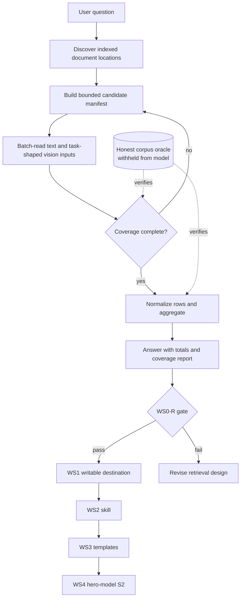

# Document Intelligence — Retrieval First

**Issue:** [#250](https://github.com/BaiGanio/aperio/issues/250)  
**Companion tests:** [`document-intelligence-epic-tests.md`](./document-intelligence-epic-tests.md)  
**Status:** (2026-08-02) **WS3 (persistent extraction templates) CLOSED, dual-backend-proven** — migrations, handlers, full 8-tool MCP surface, and a full end-to-end run against the real household-gen corpus all green on SQLite, after 5 review rounds closed 7 findings (dedup never wired in, keyword substring false positives, frozen confidence, unverified log-record trust, propose-token confirmation bypass, tools unreachable from the web agent, database not loaded alongside extraction intent). The Postgres gap flagged the same day is now closed: a real, isolated scratch Postgres reproduced all of T-G3.1/T-G4/T-G5/T-G5.2 with zero code changes needed. Detail: `document-intelligence-ws3-templates.md`. T-R5 re-confirmed PASSED on Gemma 4 E4B (second consecutive clean local-hero-model pass), WS0-R/WS1 stable on the local hero model. WS2 has a DeepSeek cloud provenance run: T-G2.3 passed, but T-G2.4 failed because EUR travel was saved and reported under spending categories. The Gemma hero-model gate has now been run twice (2026-08-02, same day, later session) after fixing 3 grading-harness false-pass bugs (`document-intelligence-ws2-tg23-open-issues.md`) — the fixed grader correctly reports `fail` both times, but the real blocker discovered is **latency, not a SKILL.md gap**: local multi-turn tool-using turns take 350-600+ seconds each because the per-turn tool-schema set changes turn-to-turn, defeating llama-server's own prompt/KV-cache reuse. Investigation + remediation plan written for a future session: `trash/plans/document-intelligence-epic/llamacpp-latency/`. WS2's T-G2.3/T-G2.4 stay open on Gemma pending that plan. Prior: (2026-08-01) Deterministic fact pipeline and period-aware retrieval landed (`2eb0e2b`); unit gate green (June + all nine periods reconcile); first T-R5 local-model pass on Gemma 4 E4B; WS1 (writable destination) implemented and tested same day — self-provisioning `extraction` connection behind the existing `db_execute` confirm boundary; T-G1.1–T-G1.4 all green (18 new tests, full suites 2404/2402 clean). Earlier: WS0-R implemented through retrieval/vision seams; first live T-R5 pass on deepseek-v4-pro (2026-07-26); local-model arithmetic failures recorded in the evidence log until the deterministic pipeline removed them.
**Reset:** 2026-07-23

This is the canonical plan. It replaces the original field-extraction spike, the
2026-07-11 issue-body plan, and the former standalone progress tracker.

---

## 1. Objective

Make a small local model reliably discover, read, account for, and aggregate a user's
documents before adding persistent extraction templates—so recall is woven into the work
instead of simulated by copying a visible answer key.

## 2. Current truth

The 2026-07-20 honest-corpus run established the red baseline:

| Prompt | Result | Meaning |
|---|---|---|
| P1 — bare utilities question | stopped at `recall`; never opened a document | routing failure |
| P2 — explicit folder/monthly total | read one irrelevant PDF; 265.60 vs 696.84 BGN | corpus-assembly failure |
| P3 — maximum tool steering | timed out at 600 s after serial reads; attempted the read-only `aperio` DB | convergence + destination failure |

The corpus itself is ready:

- the bank statement is partial and contains no category-total footer;
- the unrelated tax notices no longer leak S2/S3 answers;
- 10 ledger rows, category totals, and the statement reconciliation all equal
  **696.84 BGN**;
- Internet **29.99** remains a deliberate discovery trap;
- Gemma 4 E4B can read the electricity scan through its native vision path;
- task-shaped scan extraction remains unreliable and belongs in WS0-R.

**Stage verdict:** research has isolated the failure, but no document-intelligence
product code exists. Do not start the writable destination, skill, migrations, handlers,
MCP extraction tools, pages, or demo until WS0-R passes.

The old probe named `scratchpad/s2-probe.mjs` and `probe-results/s2-probe.json`, but those
artifacts are no longer present. WS0-R begins by recreating a maintainable harness and
preserving privacy-safe evidence.

Each harness run initializes a fresh ignored artifact before the first model call. It
immediately records all full prompts and an `expected` object containing the target
category/grand totals and retrieval-tool requirement used by the gate. As turns finish,
it refreshes the same file with wall time, tool sequence, status, and raw model answers;
the per-prompt acceptance timeout is 300 seconds.
`trash/plans/document-intelligence-epic/document-intelligence-run-answers.json`.
The file is replaced rather than appended across runs (the harness refreshes that one
fresh run file as prompts complete so partial results survive a timeout). It is the
working record for adjusting the next run's prompts and retrieval checks; it must not
be treated as an oracle or committed as a source of household truth.

## 3. Diagram

## 4. Scope and decisions

### In scope

1. A deterministic, bounded retrieval path for an unknown number of indexed folders.
2. Coverage accounting: candidates found, documents read, skipped documents, and reasons.
3. A stable task-shaped path for text, PDF, and native-vision documents.
4. A writable extraction destination after retrieval passes.
5. The orchestration skill, persistent templates, and S2 on the local hero model.

### Locked decisions

- No folder name or table name is derived from a fixture path.
- `doc_repos` or an equivalent inventory operation discovers locations at runtime.
- The model never receives `ground-truth.json`.
- Aggregate by currency; do not invent exchange rates.
- The built-in `aperio` connection remains read-only.
- Template fields remain source strings; numeric normalization happens in JS on write.
- Results are shown before insert; automatic insert is per-template opt-in.
- Template learning requires user confirmation.
- Capability-gate removal is unrelated and out of scope. The isolated evaluation harness
  may configure the current model allowlist without changing product doctrine.
- S1, S3, public pages, multi-model scorecards, real-bill drills, and demo v4 remain
  follow-ups gated on S2 passing.

### Deferred decision — resolved 2026-08-01

WS0-R passed; the writable destination is the **preferred** option: Aperio
provisions a clearly named user extraction database (`extraction`, a reserved
`db_execute` connection name) on first confirmed write, behind the existing
`db_execute` confirmation boundary. Tested from a clean profile; the built-in
`aperio` connection's read-only guarantee is unaffected. Details and test
evidence in `document-intelligence-epic-evidence.md` (WS1 section).

Original deferred-decision text

After WS0-R passes, choose the writable destination:

- preferred: Aperio provisions a clearly named user extraction database on first use,
  behind the existing confirmation boundary;
- fallback: guide the user through creating a writable SQLite connection in Settings.

The choice must be tested from a clean profile and must not weaken the read-only
guarantee of the built-in database.

## 5. Model recommendation

| Work | Model/provider | Est. input/output | Est. cost | Rationale |
|---|---|---:|---:|---|
| WS0-R code audit and design | current Codex session | 35k / 12k | subscription | Requires careful cross-module tracing and a narrow design |
| WS0-R implementation | local capable coding model, precision review by Codex | 80k / 25k | $0 local | Most edits should be bounded retrieval/test plumbing |
| Gate runs | `unsloth/gemma-4-E2B-it-qat-GGUF:Q4_K_XL` | n/a | $0 | This is the small-local-model product claim |
| Fragile-zone review, if needed | Codex | 20k / 8k | subscription | Context/tool routing changes affect every provider |

## 6. Steps

Each step references its detailed test group in
[`document-intelligence-epic-tests.md`](./document-intelligence-epic-tests.md).

### WS0-R — Retrieval redesign → T-R0 through T-R5

1. **Recreate the isolated red harness and evidence record.** Start from a clean snapshot,
   scratch DB, non-default ports, a copied corpus, and a withheld oracle. Capture prompts,
   wall time, tool sequence, documents touched, final output, and teardown result.
   *Works when:* P1/P2/P3 reproduce a retrieval or convergence failure without leaving a
   process or repo artifact, and a privacy-safe summary is stored beside this plan
   (T-R0).

2. **Trace the retrieval pipeline before choosing a fix.** Read the intent classifier,
   tool-profile filtering, `doc_repos`, `doc_search`, file-reading path, tool-result
   limits, and llama.cpp loop. Record the smallest responsible seam and reject designs
   that hardcode the household fixture or preload the entire corpus unbounded.
   *Works when:* the decision record explains the observed failure at each stage and
   selects one bounded design with explicit limits and cancellation behavior (T-R1).

3. **Build a candidate-manifest operation.** It must discover all indexed locations,
   filter by the user's question/month where possible, deduplicate twins, and return a
   bounded manifest before content reads begin. Extend an existing tool when that keeps
   the API coherent; add a new tool only if the current contracts cannot express it.
   *Works when:* one, multiple, empty, and oversized indexed-folder cases return a
   deterministic manifest without assuming the first folder (T-R2).

4. **Add bounded batch retrieval with coverage accounting.** Read candidate text/PDFs in
   bounded batches, pass images through the native-vision path, enforce time/size limits,
   and propagate abort/disconnect. Return found/read/skipped counts and per-file status.
   *Works when:* the honest corpus completes without a serial one-file-per-turn loop,
   a 30-document fixture degrades predictably, and no listeners/processes survive
   cancellation (T-R3).

5. **Stabilize task-shaped vision extraction.** Prevent the model from emitting a
   redundant or malformed `preprocess_image` call when the image is already inline.
   Preserve the generic image-description behavior.
   *Works when:* the electricity scan returns provider, date, total, and currency on the
   hero model, and existing image-provider tests remain green (T-R4).

6. **Pass the retrieval gate.** Run P1, P2, and P3 on the honest corpus. P1 must discover
   relevant indexed documents without a supplied path; P2/P3 must converge within the
   agreed budget and report coverage.
   *Works when:* Utilities is 260.50 BGN; full S2 is 696.84 BGN including Internet 29.99;
   no category is silently omitted; no oracle is visible; teardown is clean (T-R5).

### WS1 — Writable destination → T-G1 — **done 2026-08-01**

7. **Implement the selected writable-destination flow.** Preserve the read-only built-in
   connection and the existing confirmation boundary.
   *Works when:* a clean profile can create, append, and query an extraction table without
   hand-editing config or deriving schema names from paths (T-G1.1–G1.2). ✅

8. **Normalize amounts on write and group by currency.**
   *Works when:* BGN and DE-formatted EUR values become numeric database values, SQL sums
   each currency correctly, and no blended/converted total is produced (T-G1.3–G1.4). ✅

### WS2 — Orchestration skill → T-G2

9. **Create `skills/document-intelligence/SKILL.md`.** Teach discovery, manifest-first
   retrieval, bounded reads, coverage reporting, confirmed writes, and SQL aggregation.
   *Works when:* the bare P1 phrasing loads the skill and completes the verified flow
   without folder hardcoding or mental arithmetic (T-G2.1–G2.4).

10. **Autotune the skill.**
    *Works when:* trigger holdout meets or exceeds the prior baseline without stealing
    unrelated prompts (T-G2.5).

### WS3 — Persistent templates → T-G3 through T-G5

Detailed sub-plan: [`document-intelligence-ws3-templates.md`](./document-intelligence-ws3-templates.md)
(companion tests: [`document-intelligence-ws3-templates-tests.md`](./document-intelligence-ws3-templates-tests.md)).

11. **Add mirrored migrations** for global `extraction_templates` and `extraction_log`.
    Ask before touching both migration directories.
    *Works when:* fresh SQLite and Postgres migrations apply in lockstep and rerun safely
    (T-G3).

12. **Add extraction handlers** for template CRUD, matching, regex-first extraction,
    LLM fallback, confidence, hashing, and confirmed cold-start learning.
    *Works when:* handler tests cover success, rejection, fallback, deduplication, and
    lower-confidence near matches (T-G4).

13. **Register the extraction MCP surface without changing `ctx`.**
    Ask before touching `mcp/index.js`.
    *Works when:* schemas validate, the context field set is unchanged, memory tests pass,
    and Excel/database outputs round-trip against the oracle (T-G5).

### WS4 — Hero-model proof → T-G6

14. **Run S2 end to end on Gemma 4 E4B.** Produce a table and a standalone HTML pie-chart
    preview; obtain approval before any visual integration.
    *Works when:* totals match the oracle to the cent, coverage is explicit, SQL performed
    the arithmetic, and the preview renders (T-G6.1–G6.2).

15. **Run the multilingual/currency pass.**
    *Works when:* BG/EN/DE/FR rows share the selected schema, totals remain separated by
    currency, and scan/text twins agree or visibly report low confidence (T-G6.3–G6.4).

## 7. Risks

| Risk | Mitigation |
|---|---|
| Retrieval “fix” merely adds more prompt steering | T-R2/T-R3 require deterministic manifests, limits, and coverage contracts |
| Whole-corpus preload creates token or privacy growth | bounded manifests/batches; explicit byte/document limits; oracle withheld |
| Batch work survives cancellation | abort propagation and lifecycle assertions in T-R3 |
| One-file categories make leak sweeps ambiguous | detect aggregate labels/structures, not the mere presence of legitimate source amounts |
| Native vision works for description but not extraction | separate task-shaped T-R4 regression |
| Writable destination weakens internal DB safety | built-in `aperio` remains read-only; clean-profile and confirmation tests |
| Migration or MCP context drift | mirrored schema test; byte-equivalent `ctx` field-set test |
| Local-model result is correct by luck | per-file coverage and SQL provenance are acceptance criteria |

## 8. Documentation updates

Do not write these until implementation changes behavior and the developer confirms:

| Change | Candidate updates |
|---|---|
| Retrieval/tool contract | `id/reference/mcp-tools.md`, `id/reference/architecture.md`, `CHANGELOG.md` |
| New extraction feature | `FEATURES.md`, `CHANGELOG.md` |
| New skill | `id/reference/skills.md`, `CHANGELOG.md` |
| Writable destination/config | `README.md`, generated config reference if applicable, `CHANGELOG.md` |

## 9. Evidence log

| Date | Gate | Result |
|---|---|---|
| 2026-07-20 | corpus honesty | pass; statement/tax leaks removed and oracle reconciled |
| 2026-07-20 | native generic vision | pass; date and 142.50 BGN read from electricity scan |
| 2026-07-20 | honest-corpus retrieval | fail; P2 incomplete, P3 timed out → `impossible` |
| 2026-07-23 | plan reset | stale spike/tracker/demo material consolidated; WS0-R is next |
| 2026-07-23 | WS0-R T-R0–T-R4 | red harness reproduced; bounded manifest/batch, coverage, cancellation, routing, and task-shaped native-vision unit/integration contracts pass |
| 2026-07-23 | WS0-R T-R5 | fail; isolated Gemma E4B run completed P1 in ~122s, then P2 timed out at 180s; P3 was not started; stop before WS1 |
| 2026-07-23 | WS0-R T-R5 rerun | fail; isolated Gemma E2B Q4_K_XL completed P1/P2/P3 in ~89/~201/~111s, but all exact-total gates failed; oracle/corpus fences and teardown passed; stop before WS1 |
| 2026-07-24 | root-cause diagnosis | the wrong-total pattern (heating 47.12 vs 64.80, water 12.90 vs 38.20) traced to `extract-facts.js`'s `AMOUNT_LABELS` being English-only — every BG/DE/FR document's structured `amounts[]` evidence came back `label: null`, forcing the model to guess from raw text. Fixed: BG/DE/FR label patterns evidenced against the real fixture files + a language-agnostic `likely_total` fallback for unmodeled languages; 15/15 unit tests; verified against every real fixture file (all 5 BG utility bills now extract the exact ground-truth total). Full-locale (28+) coverage is a separate, larger decision — filed as #312 with a 4-option plan, not implemented here. |
| 2026-07-24 | WS0-R T-R5 rerun (post-#312, prompts also tightened: use-final-total + no-conversion-needed guidance) | **P1 PASSES** — Utilities 260.50 BGN exact, first clean pass. P2 fails: Utilities now exact (260.50, was the demonstrated bug), Groceries/Transport exact, but Fuel = 240.00 vs 215.60 (double-counted the bank-statement/receipt overlap, missed the second fuel receipt) and Internet = 0.00 (payment-form-completed-2.txt never discovered — genuinely has no adjacent currency marker even with correct labels, so this is retrieval/coverage, not extraction). Grand total 691.25 vs 696.84. P3 errored on a raw `SocketError`/`UND_ERR_SOCKET` against the local llama-server child process ~90s in — infra flake, not a model or gate failure, needs a clean retry before it counts as pass or fail. New gaps filed as #313 with a plan (fuel dedup → likely belongs in WS1's SQL-side dedup per the epic's own "SQL does the math" principle, not a prompt patch; internet discovery → doc_manifest/doc_search ranking or split-field amount linking). Stop before WS1 stands — T-R5 not yet green. |
| 2026-07-24 | WS0-R T-R5.2 first bare attempt ("What's my total spending this month, broken down by category?") | Failed at the routing step, before any retrieval: the model called `recall` (memory), got "no memories", and answered that it had no access to personal financial data — `doc_manifest`/`doc_batch` were never offered as tools. Root cause: `isDocumentAggregationIntent()`'s money regex matched `spend`/`spent` but not the gerund `spending`, so this realistic phrasing never satisfied the money+aggregate+personal test that gates the auto doc_manifest→doc_batch preflight shortcut. Fixed in `lib/agent/tool-profiles.js` (`spend(?:ing\|s)?`); regression test added to `tests/unit/agent/tool-profiles.test.js`; full suite green except one pre-existing, unrelated flaky e2e timing test (`T45` turn-interruption race). |
| 2026-07-24 | WS0-R T-R5.2 rerun (post-fix) | Retrieval engaged correctly (`doc_manifest`→`doc_batch`, 16/20 candidates forwarded, all genuinely relevant docs ranked inside the cap — only 2 tax notices and 2 of 3 trade-docs files were pushed out). **Fuel dedup: PASS** — 215.60 exact, bank-statement/gas-station-receipt overlap correctly resolved as one payment, second fuel receipt correctly added. **Travel exclusion: PASS** — hotel/train/airport receipts were in the forwarded batch (real ranked distractors) and never appeared in the answer. **Groceries: PASS** (140.75, correctly read off the bank-statement's own transaction table — no PNG/vision path needed; retracts an earlier offline-probe assumption that groceries were vision-only). **Internet: FAIL** — 29.99 never surfaced; confirms the open #313 gap (payment-form-completed-2.txt has no adjacent currency marker even with correct date/amount labels). **Utilities: FAIL** — reported 602.05, self-inconsistent with its own listed line items (142.50 + 38.20 = 180.70); heating-bill (64.80) was read but dropped from the category; waste fee (15.00) was split into its own category instead of folded into Utilities. **New finding**: an unrelated B2B trade document (`trade-docs/commercial-invoice.txt`, a steel/freight invoice, ~€1.27M) ranked inside the cap and was reported as a real spending category — a more severe false-positive than the travel-leak this tier was designed to catch, since it's not even household spending. No grand total was computed as a single figure; the model's own per-category arithmetic didn't reconcile, reinforcing WS1's "SQL does the math" decision. `AUTO_BATCH_CANDIDATE_CAP=16` had enough headroom for every real household document; the remaining gaps are extraction/judgment failures, not cap or cap-ranking failures. Stop before WS1 stands — T-R5.2 not yet green. |
| 2026-07-26 | ground-truth oracle + corpus rebuild | Acted on `ground-truth-review.md` (verdict: reject). Corpus grew 1 month → **9 consecutive periods** (2025-11 … 2026-07, 202 documents) and is now **generated** from one declarative spec under `tests/fixtures/household-gen/`, so documents and oracle are two renderings of one source and cannot drift — which structurally kills the stale-filename class of defect the review catalogued. Frozen slices (June 2026, three July bills, May payment form, templates) are never rewritten and **June's gate values are unchanged: 260.50 / 215.60 / 140.75 / 50.00 / 29.99, total 696.84 BGN**. Oracle rebuilt as `schema_version: 3`. Verification: 723/723 checks, 17/17 mutation tests. **T-R5 has not been re-run against a model.** |
| 2026-07-26 | WS0-R T-R5 (deepseek-v4-flash) | Harness runs P1 (full-month-total) against deepseek-v4-flash via the Aperio WebSocket. All 5 category totals exact, grand total 696.84 BGN correct, Internet discovered, no double-counting, full coverage. **Fails on `noExcludedLeak`**: EUR travel items (49.90 train, 18.50 airport) reported under spending categories. 16s wall time. + Fixed a pre-existing DeepSeek provider bug — `toOpenAIMessages()` now emits `reasoning_content: ""` on synthetic tool-call messages from auto-batch preflight, required by DeepSeek v4 API. |
| 2026-07-26 | WS0-R T-R5 (deepseek-v4-pro) | Same prompt against deepseek-v4-pro. **PASS** — all 10 gate checks green: 5 category totals exact, grand total 696.84 BGN, EUR travel correctly separated into its own table, no double-counting, full coverage, no oracle/path leak. First clean T-R5 pass. **Unblocks WS1.** |
| 2026-08-01 | T-R5 (Gemma 4 E4B, deterministic pipeline) | **PASS** — first T-R5 pass on the local hero model. All 10 gate checks green, all totals exact, EUR travel 196.40 separate, clean teardown. Details in `document-intelligence-epic-evidence.md`. |
| 2026-08-02 | T-R5 (Gemma 4 E4B, second confirmation) | **PASS** — re-run independently before starting WS2, all 10 gate checks green again, same exact totals (278.1s wall time). Confirms the 2026-08-01 pass was not a one-off. Details in `document-intelligence-epic-evidence.md`. |
| 2026-08-02 | WS2 T-G2.3/T-G2.4 (DeepSeek / `deepseek-v4-flash`, cloud) | **T-G2.3 PASS; T-G2.4 FAIL.** The isolated provenance harness completed: `db_execute` was proposed and approved, then a completed follow-up called `db_query` and narrated decimal totals from SQL. The full-month gate failed because EUR travel was inserted and reported as `Transport` (49.90 EUR) and `Dining` (18.50 EUR), an excluded-currency leak. This is cloud-provider evidence only; it does **not** pass or substitute for the Gemma hero-model gate. |
| 2026-08-02 | WS3 (persistent extraction templates) — SQLite implementation complete | **All three steps (T-G3 migrations, T-G4 handlers, T-G5 MCP surface + T-G5.2 full e2e) done and SQLite-verified.** `extraction_templates`/`extraction_log` migrated in lockstep; template CRUD, Unicode-aware whole-word keyword matching, regex-first + LLM-fallback field extraction with a rolling per-template confidence score, and confirmed cold-start learning (reusing `createInterruptService`, no new interrupt machinery) all built and tested. 8 MCP tools registered and — after a 5-round code review — wired into `TOOL_PROFILES.extraction` (loaded alongside `docgraph`/`database` on the same aggregation-intent signal) so the feature is actually reachable from the web agent, not just the MCP child. T-G5.2 ran the full chain against the real household-gen corpus (`2026/June/heating-bill-15-jun.txt`): match → propose → confirm → apply → `db_execute` write → `extraction_log_record` → `generate_xlsx`, every value matching the oracle's `2026-06-utilities-heating` entry exactly in both the DB and the workbook. Review rounds fixed, in order: (1) dedup never wired into the exposed flow at all; (2) `matchTemplates` admitted substring false positives ("gas" inside "Vegas"); (3) template confidence frozen at its create-time 0; (4) `extraction_log_record` trusted an unconfirmed/unrelated write unconditionally — now requires and server-verifies a `db_execute_token` down to the actual INSERT and its bound params; (5) the propose flow's token bypassed the agent's real self-confirmation guard (`lib/agent/tool-hooks.js`) via a toolName/public-name mismatch and a missing token-prefix case; (6) the tools were entirely unreachable from `planTurnTools()` (MCP registration ≠ agent-visible); (7) `database` wasn't loaded alongside `extraction` intent, so the documented persist/dedup follow-up had no `db_execute` to run. One claimed finding (a handler-argument-binding P1) was investigated and found NOT reproducible — verified against the real `@modelcontextprotocol/sdk` type signature and by calling the registered handler directly before concluding it was a false positive; the suggested cleanup was still applied. 5123/5123 across the full project test suite after every round. **Known gap: Postgres branches are written to the same contract throughout but never live-verified** (no local/CI Postgres available this session) — the one open item before this workstream can be called fully done, not just SQLite-done. Full detail: `document-intelligence-ws3-templates.md`. |
| 2026-08-02 | WS3 (persistent extraction templates) — Postgres verification closes the dual-backend gap | **T-G3.1/T-G4/T-G5/T-G5.2 all reproduced against a real, isolated scratch Postgres (`pgvector/pgvector:pg16`, disposable container, non-default port — the shared `docker/docker-compose.yml` volume turned out to predate this session and was left untouched) with zero code changes required.** 14 migrations apply cleanly and idempotently; all constraints (CHECK, FK ON DELETE SET NULL, UNIQUE→23505 mapping) verified equivalent to SQLite. Two new opt-in test files (`extractionHandlers.postgres.test.js`, 14 tests; `wsG5-2-e2e.postgres.test.js`, 10 tests against the real household-gen corpus), gated on `APERIO_E2E_POSTGRES_URL` per the existing `postgres-vec-meta.test.js`/contract-backends convention — all 24 passed first try. `tool-profile-coverage.test.js` reconfirmed green. Full suite: 5222/5222 clean on one run; two other runs each hit one unrelated, non-reproducing flake in the pre-existing `postgres-vec-meta.test.js` (#287 territory) under full-suite parallel load — investigated and attributed to local resource contention, not a WS3 regression, and left alone as out of this task's scope. WS3 is now closed on both backends. Full detail in the WS3 plan's own evidence log. |
| 2026-08-02 | WS2 T-G2.3 grading-harness false-pass fixed (same day, later session); gemma4's real blocker turns out to be latency, not SKILL.md | **3 grading-harness bugs fixed** in `document-intelligence-skill-harness.mjs`/`harness-gate.mjs`: `followUpCitesSql`/`followUpNarratesDecimalTotal` now require the follow-up turn's own `db_query` to have genuinely returned rows (not just an honest admission the query came back empty, narrated alongside a decimal-shaped figure from memory); `grandTotalCorrect` is now exclusive, failing on any total-cue line that blends currencies into one figure even alongside a separate, correct total line elsewhere in the same answer; `followUpSatisfied`'s escalation loop no longer stops early on that same false signal. 19/19 harness-gate tests green (2 new mutation cases added), full project suite 5124/5124 green. Re-running the fixed harness against gemma4 **twice** confirms `grading.status: "fail"` both times for accurate reasons — no more false pass — but also surfaces that gemma4's actual blocker is **latency**, not skill guidance: run 1's turn 1 hit the full 600s timeout emitting a malformed pseudo-tool-call (`<execute_tool_call>...</execute_tool_call>`) instead of a real one; run 2 made genuine `db_execute`/`CREATE TABLE`/INSERT calls but each turn took 350-410s (turn 3: 39,498 input tokens → ~140-165 tok/s implied prefill, matching an identical calculation against the earlier DeepSeek/gemma4 pass's 41,479-input-token/367s turn), then turn 4 (just a `SELECT`) also hit the full 600s timeout — ~29 minutes total, never reaching a real queried total. Root-caused, against the actual code (not just timing inference), to `lib/agent/index.js`'s per-turn `planTurnTools()` re-classifying a different tool-schema subset on every turn, which defeats llama-server's default prefix/KV-cache reuse for the entire growing conversation whenever the tool set changes — compounded by `doc_batch` re-reading an already-read 55.9 KB document mid-conversation with no session-level dedup. Not a SKILL.md wording gap: no prompt change fixes a structural cache invalidation. Investigation + remediation plan written for a future session: `trash/plans/document-intelligence-epic/llamacpp-latency/README.md` (companion tests in the same folder) — flagged as a cross-cutting issue affecting any local multi-turn tool-using flow, not just document-intelligence. Full detail: `document-intelligence-ws2-tg23-open-issues.md`. |
