# Document Intelligence — WS3: Persistent Extraction Templates

**Epic:** [`document-intelligence-epic.md`](./document-intelligence-epic.md) §WS3 (issue #250)
**Companion tests:** [`document-intelligence-ws3-templates-tests.md`](./document-intelligence-ws3-templates-tests.md)
**Status:** Steps 1–3 (T-G3 migrations, T-G4 handlers, T-G5 MCP surface, including T-G5.2's full
e2e round-trip) all done and SQLite-verified as of 2026-08-02 — **WS3 core implementation
complete**, Postgres side unverified (no local/CI Postgres this session, consistent gap across
all three steps). WS0-R/WS1 are green on the local hero model; WS2's skill passes
T-G2.1/2.2/2.4 live but T-G2.3 (SQL provenance) is a confirmed false pass on gemma4
([`document-intelligence-ws2-tg23-open-issues.md`](./document-intelligence-ws2-tg23-open-issues.md)).
That gap does not block WS3 — it's a follow-up prompt on top of the same skill — but WS3's
own gates must be graded the same way: read the transcript, not just the boolean.

---

## 1. Objective

Give the document-intelligence flow memory across sessions: the first bill of a new shape
teaches Aperio its fields (with the user's explicit confirmation), and every later document
of the same shape is recognized and extracted without the model reinventing a `CREATE TABLE`
and re-deriving field labels from scratch each time.

## 2. Scope and boundary

WS1 already gives the model an ad-hoc path — propose its own `CREATE TABLE`, normalize
amounts, write rows, all inside one session — and WS2's skill teaches that flow well enough
to pass T-G2.1/2.2/2.4. WS3 does not replace that path; a document that matches no learned
template still falls through to it. WS3 adds a **recognition and reuse layer** on top:

- a global, backend-mirrored record of document *shapes* (`extraction_templates`) — not
  extracted data itself, which continues to live in the user's own `extraction` connection
  from WS1;
- a global log of what's already been extracted (`extraction_log`), keyed by content hash,
  so re-reading the same source is flagged instead of silently duplicated;
- handlers for template CRUD, ranking a document against known templates, regex-first field
  extraction (reusing `lib/docgraph/extract-facts.js`'s labeled date/amount candidates —
  the same deterministic pipeline WS0-R's root-cause fix already hardened for BG/DE/FR) with
  an LLM fallback only when regex evidence is missing or ambiguous;
- new MCP tools exposing all of the above, registered without touching `createContext()`'s
  `ctx` shape (`mcp/index.js` is a Fragile Zone — ask before editing it, per AGENTS.md).

`extraction_templates`/`extraction_log` are **global** tables in Aperio's own store
(mirrored `db/migrations/` + `db/migrations-sqlite/`, like every other core table) — they
describe shapes and history, not the user's financial rows. The rows themselves still only
ever land in the WS1 `extraction` connection, through the same `db_execute` confirm gate.
Nothing in this plan weakens that boundary.

### Locked decisions (inherited from the epic, §4)

- Template fields remain source strings; numeric normalization happens in JS on write (WS1's
  `db_normalize_amount`, unchanged).
- Results are shown before insert; automatic insert is per-template opt-in, never silent.
- Template learning requires user confirmation — first document of a new shape proposes,
  never persists on its own.

## 3. Diagram

```mermaid
graph TD
    D[New document text + amounts/dates<br/>from doc_batch] --> M[extraction_match:<br/>rank against known templates]
    M -->|confident match| X[extraction_apply:<br/>regex-first field extraction]
    M -->|no match / low confidence| P[Propose new template<br/>from this document's fields]
    P -->|user confirms| T[(extraction_templates)]
    P -->|user rejects| N[Nothing persisted —<br/>fall back to WS1 ad-hoc flow]
    T --> M

    X -->|regex hit| R[High-confidence field]
    X -->|regex miss| L[LLM fallback for that field only]
    R --> H{Source hash already<br/>in extraction_log?}
    L --> H
    H -->|yes, same hash| SKIP[Flagged as already extracted —<br/>no duplicate rows]
    H -->|no| W[db_execute: write rows to<br/>the extraction connection]
    W --> LOG[(extraction_log:<br/>hash + verification state)]

    style T fill:#2d5,color:#000
    style LOG fill:#2d5,color:#000
```

## 4. Model recommendation

| Work | Model/provider | Est. input/output | Est. cost | Rationale |
|---|---|---:|---:|---|
| Migration design (T-G3) | current session (Sonnet 5) | 15k / 5k | subscription | Fragile-zone schema work needs careful column-parity review against `migration-lockstep.test.js`'s conventions |
| Handler implementation (T-G4) | local capable coding model, precision review by this session | 60k / 20k | $0 local + subscription review | Mostly CRUD/regex plumbing over an existing pattern (`selfWikiHandlers.js`, `databaseHandlers.js`); the confirm-flow reuse is the one part needing careful review |
| MCP surface (T-G5) | current session (Sonnet 5) | 20k / 8k | subscription | `mcp/index.js` is a Fragile Zone; tool schema + `ctx` byte-equality check should not be delegated |
| Gate runs | `unsloth/gemma-4-E4B-it-qat-GGUF:Q4_K_XL` (hero) + isolated harness | n/a | $0 | Matches every prior WS's gate-run model |

## 5. Steps

Each step references its test group in
[`document-intelligence-ws3-templates-tests.md`](./document-intelligence-ws3-templates-tests.md).
Do not start a step until the previous one is green — T-G4 depends on T-G3's tables
existing; T-G5 depends on T-G4's handlers.

### Step 1 — T-G3: mirrored migrations

Add `db/migrations/014_extraction_templates.sql` and
`db/migrations-sqlite/014_extraction_templates.sql` (next number after `013_vec_meta.sql`).
**Ask before touching either directory** — Fragile Zone.

Two tables:

**`extraction_templates`** — a learned document shape:
- `id` (serial / integer PK)
- `name` — user/model-facing slug, e.g. `bg_utility_bill` (`UNIQUE`)
- `match_keywords` — `JSON` array of strings used to rank a new document against this
  template (title/text keyword overlap — cheap, deterministic, no embedding call)
- `fields` — `JSON` array of `{name, amount_label, date_role, required}`; `amount_label`/
  `date_role` reference the same role vocabulary `extract-facts.js`'s `AMOUNT_LABELS`/
  `LABELS` already produce, so matching a field to evidence is a lookup, not new NLP
- `confidence` — `REAL`/`NUMERIC`, `0..1`, `CHECK` bounded (same convention as `010`'s
  `cg_edges.confidence_score`) — the template's own rolling extraction-success rate,
  distinct from a single extraction's confidence (T-G4)
- `created_at`, `updated_at`

**`extraction_log`** — one row per extracted source, for dedup/verification:
- `id`
- `source_hash` — `sha256` of the source text (same algorithm as `docgraph_documents.sha256`,
  §"Key tables" in AGENTS.md), `UNIQUE` — the dedup key
- `source_path` — nullable, best-effort provenance (a `docgraph`-indexed doc's relative
  path), never trusted as the dedup key itself
- `template_id` — nullable `REFERENCES extraction_templates(id) ON DELETE SET NULL` (a
  document extracted without a matching template still gets a log row)
- `extraction_connection` — which `db_execute` connection received the rows (defaults to
  `'extraction'`, but not hardcoded — WS1 never assumes the connection name is fixed either)
- `verification_state` — `TEXT CHECK (... IN ('unverified','verified','rejected'))`,
  default `'unverified'`
- `row_count`
- `extracted_at`

Both tables use the same type-family conventions `migration-lockstep.test.js` already
checks (`INTEGER`/`SERIAL`, `TEXT` timestamps on SQLite vs `TIMESTAMPTZ` on Postgres, `JSON`
columns gated by `CHECK (json_valid(...))` on SQLite / native `JSONB` on Postgres, matching
`008_agent_interrupts.sql`'s precedent). Add both filenames to
`tests/unit/db/migration-lockstep.test.js`'s explicit-existence checks and a column-parity
`describe` block for `014_extraction_templates`, following the `010_codegraph_intelligence`
block's shape — the lockstep test is a hard CI gate, not optional follow-up.

*Works when:* fresh SQLite and Postgres both apply `014_extraction_templates.sql` cleanly
via `npm run migrate` / `npm run migrate:sqlite`, a second run is a no-op (the existing
`schema_migrations` tracking table already gives this for free — no need for
migration-internal `IF NOT EXISTS`), and `migration-lockstep.test.js`'s new column-parity
block passes (T-G3.1).

### Step 2 — T-G4: extraction handlers

New `lib/handlers/extraction/` directory, following the per-backend-branch pattern
`lib/handlers/wiki/selfWikiHandlers.js` already establishes (`store.db` for SQLite,
`store.pool` for Postgres — no new sub-store class unless the file grows past the ~500-line
guidance in AGENTS.md, in which case split by responsibility: templates vs. log/dedup).

- **`templateHandlers.js`** — CRUD: create / get / update / list / delete.
  - Validation: `name` required + slug-shaped (mirror `selfWikiWriteHandler`'s
    `/^[a-z0-9][a-z0-9-]*$/` check), `fields` must be valid JSON matching the documented
    shape (each entry has `name`; at least one of `amount_label`/`date_role`), reject
    otherwise with a specific error — never silently coerce.
  - `created_at`/`updated_at` set by the handler (portable across backends), not by
    relying on backend-specific triggers.
- **`matchHandlers.js`** — rank all templates against a document's extracted keywords/text;
  return an ordered list with a match score, not just a top pick, so a near-miss is visible
  rather than silently forced.
- **`extractHandlers.js`** — given a document's text (already read via `doc_batch`) and a
  matched (or explicitly named) template:
  1. For each field, look up `extract-facts.js`'s labeled `amounts[]`/`dates[]` output by
     the field's `amount_label`/`date_role`. A real label match is high confidence; a
     `likely_total`/`unlabeled_date` fallback is lower confidence and must be flagged as
     such in the result, not silently treated as equal to a labeled hit.
  2. Only fields still missing after regex/label lookup fall back to an LLM call — one
     targeted prompt for the unresolved fields, not a full re-extraction of the document.
  3. Compute one extraction-level confidence score from the mix of label/fallback/LLM
     provenance per field.
  4. Hash the source text (`source_hash`) and check `extraction_log` before returning —
     an exact-hash match is reported as "already extracted" (with the prior log row) rather
     than silently re-run.
- **Confirmed cold-start learning** (T-G4.3) — reuses the *generic* `createInterruptService`
  from `lib/security/interruptService.js` (already backed by the `agent_interrupts` table
  from `008_agent_interrupts.sql` — no new interrupt-storage table needed) with a new
  `toolName` (e.g. `extraction_template_save`), mirroring `databaseInterruptService`'s
  propose/`commitAction`/`decideDatabaseInterrupt` shape in `databaseHandlers.js`:
  - First document of an unseen shape: `matchHandlers` returns no confident match →
    `extractHandlers` (or a dedicated `template_propose` tool, see Step 3) proposes a
    template — name, keywords, fields inferred from the document's own labeled evidence —
    and returns a pending confirmation, same "nothing persisted yet" contract as
    `db_execute`. Only a confirmed decision calls `templateHandlers.create`.
  - A rejected proposal persists nothing (no partial/draft template row).
  - Second document of the same shape: `matchHandlers` finds the now-persisted template
    with high confidence and auto-matches — no further confirmation needed to *match*
    (matching is read-only; writing extracted rows to the `extraction` connection still
    goes through WS1's own `db_execute` confirm, unchanged).
  - A near-match (ambiguous score) asks rather than silently picking the nearer template or
    silently proposing a duplicate one.
- **Extraction log round-trip** (T-G4.4) — `extractHandlers` writes/updates the
  `extraction_log` row only after the caller confirms the actual `db_execute` write
  succeeded (never optimistically, or a failed/declined write would still mark the source
  "extracted"). `verification_state` starts `'unverified'` and moves to `'verified'` once
  the caller confirms the written rows match what was reported (or `'rejected'` if the user
  declines the write) — this is the round-trip T-G4.4 checks, not a separate approval step.

*Works when:* handler tests cover CRUD success/validation-rejection, template
matching/ranking (including a near-match that doesn't force a pick), regex-hit vs.
regex-miss-then-LLM-fallback extraction, confidence scoring across that mix, the full
confirmed cold-start flow (first-document-proposes, second-document-auto-matches,
rejection-persists-nothing), and log round-trip/dedup including the "same filename, changed
content" edge case (T-G4.1–T-G4.4).

### Step 3 — T-G5: MCP surface

New `mcp/tools/extraction.js`, registered alongside the existing dynamic-import list in
`mcp/index.js` (~line 137–149) — **ask before editing `mcp/index.js` itself**; the tool file
is new and low-risk, but the registration line touches a Fragile Zone file.

Tools (names indicative, finalize during implementation against the CRUD/matching surface
Step 2 actually produces):

| Tool | Purpose | Confirm gate? |
|---|---|---|
| `extraction_template_list` | List known templates | no (read) |
| `extraction_template_get` | One template's fields/keywords | no (read) |
| `extraction_template_match` | Rank a document's text against known templates | no (read) |
| `extraction_template_propose` | Propose a new template from a document's evidence | **yes** — reuses `createInterruptService`, same propose-then-confirm contract as `db_execute` |
| `extraction_template_delete` | Remove a template | yes — destructive, same confirm boundary as any destructive tool (`getDestructiveTools()`, per the existing tool-repair doctrine) |
| `extraction_apply` | Regex-first + LLM-fallback field extraction against a matched template | no (read/compute only — the actual data write is still a separate WS1 `db_execute` call, unchanged) |
| `extraction_log_check` | Look up a source hash in `extraction_log` | no (read) |
| `extraction_log_record` | Record a source as extracted — added post-review (§8, 2026-08-02); not in the original table because nothing else in this plan called `recordExtraction`, so dedup silently never worked through the exposed flow. Requires `db_execute_token` (the same token that confirmed the real write), server-verified against `agent_interrupts`: `tool_name === "db_execute"`, `status === "executed"`, `connection === "extraction"` (round 2), AND (round 3, after a P1 finding that a confirmed CREATE TABLE or an unrelated INSERT could satisfy round 2's checks) the confirmed statement's `classify()` keyword is `INSERT` and `source_hash` appears literally among its bound `params` | no (bookkeeping only, but gated by server-verified evidence, not a two-phase interrupt of its own) |

Each tool's `zod` schema must validate cleanly (mirror `database.js`'s
`.passthrough()` + near-miss-key tolerance where a weaker model might guess a field name).
Bind handlers the same way `database.js`'s `createBoundHandlers(ctx)` does — `ctx.store` is
the only `ctx` field these tools need; nothing here requires a new `ctx` field.

*Works when:* every new tool's schema validates against representative inputs,
`createContext()`'s exported field set (`store`, `generateEmbedding`, `vectorEnabled`,
`embeddingQueue`, `providerIsLocal`) is byte-identical before and after this change
(diff `mcp/index.js` — it should have zero lines changed outside the one new import line),
existing memory/tool tests stay green, and an end-to-end run — sample bill → propose →
confirm template → `extraction_apply` → `db_execute` write — produces matching values in
**both** an Excel export (existing export path, unchanged) and the `extraction` connection
against the household-gen oracle, with the confirmation gate genuinely exercised (not
bypassed) at each step (T-G5.1–T-G5.2).

**Added post-review (§8, round 3, 2026-08-02) — not in the original text:** MCP registration
alone does not make a tool reachable from the in-app web agent. `lib/agent/tool-profiles.js`'s
`TOOL_PROFILES`/`classifyProfiles()` is a second, independent gate `planTurnTools()` reads
from; a tool absent there is dead through the primary product flow regardless of MCP
registration. `tests/integration/mcp/tool-profile-coverage.test.js` enforces this as a strict
bijection (registered ⇔ reachable) for every MCP tool in the repo, not just this workstream's
— run it, not just the extraction-specific suites, when adding any new tool.

## 6. Risks

| Risk | Mitigation |
|---|---|
| Migration column drift between Postgres/SQLite | `migration-lockstep.test.js` column-parity block is part of T-G3's own acceptance criterion, not a follow-up |
| Template matching becomes a second, undocumented aggregation path that bypasses `doc_batch`'s coverage accounting | `extraction_apply` only extracts fields from text `doc_batch` already read and reported coverage for — it never re-reads documents or discovers new candidates itself |
| Cold-start learning silently persists an unconfirmed template (repeating the T-G2.3 "narrated but not saved" failure class in reverse — saved without confirmation) | Reuses the exact `createInterruptService`/`agent_interrupts` machinery already proven in WS1's `db_execute` and the WS2 provenance harness — no new, unreviewed confirm mechanism |
| Regex-first extraction quietly regresses non-English documents the way pre-#312 `AMOUNT_LABELS` did | Extraction handlers call `extract-facts.js` as-is (already hardened for BG/DE/FR in #312) rather than re-implementing label matching; a template's `amount_label`/`date_role` values are validated against that module's known role vocabulary at template-create time, not free text |
| `mcp/index.js` edit breaks tool registration for every other tool | Change is additive (one new import line); `ctx` field-set equality is an explicit T-G5.1 assertion, and existing memory/tool test suites must stay green before this step is considered done |
| LLM fallback for missing fields becomes a full undisclosed re-extraction, defeating "regex-first" | Fallback prompt is scoped to only the fields regex/label lookup left unresolved, and the result records per-field provenance (label / fallback-label / llm) so a reviewer (or T-G4.2's tests) can see which path produced which value |

## 7. Documentation updates

Do not write these until implementation changes behavior and the developer confirms —
same rule as the epic doc (§8):

| Change | Candidate updates |
|---|---|
| New tables | `id/reference/architecture.md` ("Key tables" list already names `extraction_templates`/... once they exist) |
| New MCP tools | `id/reference/mcp-tools.md`, `CHANGELOG.md` |
| Template/learning behavior visible to the user | `FEATURES.md`, `CHANGELOG.md` |

## 8. Evidence log

Append entries here in the same format as the epic doc's §9 as each gate goes green; once
WS3 is fully done, fold a summary line back into the epic doc's own evidence log (as WS1/WS2
already do) rather than leaving two sources of truth.

| Date | Gate | Result |
|---|---|---|
| 2026-08-02 | T-G3.1 (mirrored migrations) | **PASS.** `014_extraction_templates.sql` added to both `db/migrations/` and `db/migrations-sqlite/` (extraction_templates + extraction_log). `migration-lockstep.test.js` extended with a filename-existence check and a full `014_extraction_templates parity` describe block (9 tests: table existence, column set, UNIQUE constraints, JSON columns, confidence bound+default, FK ON DELETE SET NULL, verification_state CHECK, extraction_connection default, index) — 32/32 lockstep tests green. Live-verified against a fresh isolated SQLite file (scratchpad, cleaned up after): all 14 migrations 001–014 apply cleanly via the real `runSqliteMigrations`/`sqlite-vec` path, a second run is a true no-op, `ON DELETE SET NULL` confirmed by deleting a referenced template, and all three CHECK constraints (bad JSON, out-of-range confidence, invalid verification_state) reject as expected. Postgres side not live-verified (no local/CI Postgres instance available this session) — reviewed manually against `010`/`008`'s established JSONB/CHECK/FK conventions instead. |
| 2026-08-02 | T-G4.1–T-G4.4 (extraction handlers) | **PASS, SQLite only.** `lib/handlers/extraction/{templateHandlers,matchHandlers,extractHandlers}.js` implement CRUD, keyword-overlap ranking, regex/label-first + injectable-LLM-fallback field extraction with per-field `provenance` (`label`/`fallback`/`llm`/`missing`) and a confidence score, confirmed cold-start learning (reuses `createInterruptService`/`agent_interrupts` with its own `extraction_template_save` toolName — no new storage), and the `extraction_log` dedup/verification round-trip. `AMOUNT_LABEL_ROLES`/`DATE_LABEL_ROLES` added as small additive exports to `extract-facts.js` (role names only, not the matching regexes) so a template's `amount_label`/`date_role` are validated against the real vocabulary at create time — 26/26 `extract-facts.test.js` tests still green, confirming no behavior change. 26/26 new tests green in `tests/integration/handlers/extraction/extractionHandlers.test.js` against a real in-memory SQLite store (not mocks), covering all four test groups including the digest-tamper rejection (T-G4.3 edge case) and the "same path, different hash" dedup edge case (T-G4.4). No regressions: `interruptService.test.js` (42), `database-confirm.test.js`, `agent-interrupts.test.js` contract tests, and the T-G3 lockstep suite all rerun green. Postgres-side handler branches (`store.pool`) written to the same contract but not live-tested (no local/CI Postgres this session, consistent with T-G3.1's gap). `match_keywords` for cold-start proposals are derived from the document's own text via a language-agnostic `\p{L}` significant-word heuristic, NOT from the (English) role vocabulary, so BG/DE/FR proposals stay usable — deliberate design choice, not in the original plan text; logged as tech debt (`id/reference/tech-debt.md` "Document Intelligence — cold-start template proposals") pending real-corpus evidence. |
| 2026-08-02 | T-G5.1 (MCP surface) | **PASS.** `mcp/tools/extraction.js` registers all 7 tools from the plan's table (`extraction_template_{list,get,match,propose,delete}`, `extraction_apply`, `extraction_log_check`). `extraction_template_propose` reuses `templateHandlers.proposeTemplate`/`decideTemplateProposal` with the same two-call (propose-then-confirmation_token) shape as `db_execute`; `extraction_template_delete` executes directly, gated only by `DESTRUCTIVE_TOOLS` (added there) — the lighter `forget`-style pattern, not a second two-phase interrupt, since deletion only removes a template definition, never extracted data. Wiring the propose/confirm flow into the existing generic confirm machinery required 4 small additive edits beyond the plan's original text (none Fragile Zones, so made directly): `DESTRUCTIVE_TOOLS` (+`extraction_template_delete`), `CONFIRMABLE_TOOLS` (+`extraction_template_save`), a new `extraction_template_save` dispatch branch in `lib/routes/api-interrupts.js`'s `decideAndMaybeExecute`, and a `tpl` token-prefix addition to the legacy WS confirm regex in `lib/emitters/handlers/ws/interrupts.js` — without these, a proposed template could never actually be confirmed through the UI. `mcp/index.js` registration (Fragile Zone) — asked first per AGENTS.md, developer approved, applied as exactly the 3 additive lines shown in the ask (destructure entry, import, register call); `git diff mcp/index.js` confirmed zero other lines touched. 26/26 new tests in `tests/integration/mcp/tools/extraction.test.js` (all 7 schemas validate representative input + reject structurally invalid input; full end-to-end chain: list→get(404)→match(none)→propose→confirm→re-propose-reports-matched→apply→log_check→delete→delete-again-404). Full `startServer()` boot suite (`tests/integration/mcp/index.test.js`, 13 tests) green with the new tool registered. 404/404 across the full touched-file regression sweep (extraction handlers, MCP extraction tools, MCP boot, WS interrupts, executor destructive-tools, api-database routes, interruptService, database-confirm, agent-interrupts contract, migration-lockstep, extract-facts, MCP files tools). |
| 2026-08-02 | T-G5.2 (full sample-bill e2e) | **PASS.** `tests/integration/handlers/extraction/wsG5-2-e2e.test.js` (10/10 green), run against the real household-gen corpus document `2026/June/heating-bill-15-jun.txt` (skips gracefully via the same `existsSync`-guard idiom as `tests/unit/docgraph/facts/june-gate.test.js` when the corpus isn't present on a machine). Full chain through the real MCP tool handlers (not the raw Step 2 functions): `extraction_template_match` (none) → `extraction_template_propose` (pending, nothing saved) → confirm (interrupt genuinely reaches `executed` status, checked directly against `agent_interrupts`, not just the tool's own report) → `extraction_apply` (all 6 evidenced fields — amount_due, invoice_date, due_date, service_period_start/end — resolve at `label` provenance, matching the oracle's `2026-06-utilities-heating` entry exactly: 64.80 BGN, 2026-06-15, 2026-06-30, 2026-05-01/31) → real `db_execute` CREATE TABLE + INSERT against the self-provisioned `extraction` SQLite connection (both propose and commit phases exercised and checked against `agent_interrupts` directly, not bypassed) → `db_query` confirms the written row matches the oracle to the exact value → `extraction_log` round-trip (recorded only after the confirmed write, unverified→verified) → `extraction_log_check` finds it → a second `extraction_apply` on the identical text is deduped, not silently re-run → `generate_xlsx` produces a workbook whose header row matches the field names and whose cell values agree with the DB row to the exact value. Edge case covered: a `payment_date` field added to the template with no evidence in this specific document resolves as `provenance: "missing", value: null` end-to-end — NULL in the DB, blank (not zero-filled) in the workbook, never fabricated. Isolated per AGENTS.md: real in-memory SQLite Aperio store + the self-provisioned `extraction` file (namespaced by a process-random identity, confirmed removed via `deleteExtractionFile` in an `after()` hook — verified no stray file at this run's timestamp survived) + the generated `.xlsx` deleted after reading. 414/414 across the complete touched-file regression sweep including this new test. **WS3 core implementation is now feature-complete on SQLite**; only the Postgres-side gap (T-G3.1/T-G4/T-G5.1 all share it — no local/CI Postgres available this session) remains before the epic doc's own evidence log gets a WS3 summary line. |
| 2026-08-02 | Code review — 3 findings fixed | **All 3 confirmed and fixed, re-verified against the oracle.** (1) **[P2] Dedup never actually worked through the exposed MCP flow** — `extraction_apply` only ever read `extraction_log`; nothing exposed called `recordExtraction`, so "already extracted" could never fire for a real agent using only the documented tools (the T-G5.2 e2e test had masked this by calling `extractHandlers.recordExtraction` directly instead of going through a tool). Fixed by adding `extraction_log_record` as an 8th MCP tool, documented on `extraction_apply`'s own description; T-G5.2 rewritten to call the tool instead of the internal function. (2) **[P2] Keyword matching admitted substring false positives** — `matchTemplates` used `lowerText.includes(keyword)`, so a "gas" keyword scored a hit inside "Vegas". Fixed with a Unicode-aware whole-word/phrase check (`(?<![\p{L}\p{N}])keyword(?![\p{L}\p{N}])`) — `\b` was rejected as the fix because it's ASCII-`\w`-based and silently no-ops on Cyrillic/other non-Latin scripts, which this project explicitly supports. New regression test proves "gas" no longer matches inside "Vegas" while still matching as its own word. (3) **[P2] Template confidence never updated after real use** — every template stayed frozen at its creation-time 0 regardless of extraction outcomes. Fixed with an exponential moving average (α=0.3) applied inside `extractFromTemplate` itself (not left for the MCP layer to remember to call separately, since — unlike log recording — nothing about updating this value needs to wait for an external write to be confirmed). 420/420 across the full regression sweep after all three fixes. |
| 2026-08-02 | Code review round 2 — 2 findings fixed (1 P1, 1 P2) | **Both confirmed and fixed.** (1) **[P1] `extraction_log_record` was unconditional — no server-verifiable evidence the write actually succeeded.** Round 1's fix exposed the tool but trusted whatever the caller claimed; an agent calling it before `db_execute` confirmation, after a decline, or after a failure would permanently (and silently) mark a document "already extracted" with no exposed way to undo it. Fixed by requiring a `db_execute_token` — the SAME `confirmation_token` used to confirm the real write — and having the handler look it up via `store.getAgentInterrupt()` server-side, verifying `tool_name === "db_execute"`, `status === "executed"`, and `canonical_arguments.connection === "extraction"` before ever calling `recordExtraction`. A model cannot fabricate this state; it can only be reached by going through the real propose→confirm→execute path. 5 new tests prove the check has teeth: rejects a missing token, a still-pending token, a token belonging to a different tool (`extraction_template_save`), and an executed token whose write was against a different connection (simulated via direct tamper of the stored interrupt, same technique as the T-G4.3 digest-tamper test) — only a genuine executed extraction-connection write is accepted. (2) **[P2] `extraction_apply` never delivered its documented LLM fallback** — always passed `llmFallback: undefined` to `extractFromTemplate`, so every unresolved field silently became "missing" instead of getting the one-targeted-prompt fallback the plan specifies. Fixed by wiring the shared `complete()` helper from `lib/helpers/completion.js` (same one `lib/workers/infer.js`'s background loop already uses — no re-implementing a second LLM-call path). Verified empirically that a genuine ESM named function export can't be mocked in place (`node:test`'s `mock.method` throws "Cannot redefine property"), so DI follows `infer.js`'s own established `deps.complete` pattern instead: `register(server, ctx, { completeFn })`, a tool-file-local optional 3rd argument that never touches `ctx`'s own shape (preserving the T-G5.1 byte-equality invariant). New test proves the fallback is genuinely invoked (not skipped) and returns `provenance: "llm"` for a field with no regex/label evidence, using a deterministic stub instead of a live model call. 427/427 across the full regression sweep after both fixes; `mcp/index.js`'s diff is still exactly the original 3 additive lines (git-diff-confirmed) — neither fix touched the Fragile Zone file. |
| 2026-08-02 | Code review round 3 — 3 findings fixed (2 P1, 1 P1) | **All 3 confirmed and fixed — this round found the feature was reachable nowhere in the actual product and its two confirm gates both had real holes.** (1) **[P1] Extraction tools were registered with the MCP child only — invisible to the web agent.** `planTurnTools()` builds a turn's callable tools from `TOOL_PROFILES` via `classifyProfiles()`, a completely separate mechanism from MCP registration; nothing named any `extraction_*` tool in any profile, so no document-intelligence turn could ever reach them regardless of the earlier rounds' fixes. Caught immediately once run: `tests/integration/mcp/tool-profile-coverage.test.js` (a pre-existing CI guard for exactly this bug class, written for the docgraph precedent — issue #125) was already failing and I simply hadn't run it. Fixed by adding a `TOOL_PROFILES.extraction` entry (all 8 tools) and a `hasExtractionIntent()` classifier — piggybacking on the same `isDocumentAggregationIntent` signal that already unlocks `docgraph` (WS3 is explicitly a layer on top of that workflow, not a separate one) plus explicit template/extraction language for requests with no aggregate phrasing. Coverage test now green; 4 new `classifyProfiles` tests confirm extraction loads alongside docgraph on an aggregation turn, loads on an explicit "learn a template" turn with no aggregate language, and does NOT load on a generic doc-search turn. (2) **[P1] `extraction_log_record`'s db_execute_token proved only that SOME write executed against the extraction connection — not that it was an INSERT, or that it wrote THIS document.** A confirmed `CREATE TABLE` token (or an INSERT for a completely different source) satisfied round 2's checks and could then falsely mark any arbitrary `source_hash` as extracted, permanently suppressing real extraction later. Fixed by requiring the confirmed statement's `classify()` keyword to be `INSERT` and requiring `source_hash` to appear literally among that INSERT's own bound `params` — the one thing every db_execute write already carries that doesn't depend on knowing the model's column names. `extraction_apply`'s description now explicitly instructs the model to include `sourceHash` as an INSERT column value. 3 new tests: a confirmed CREATE-TABLE-only token is rejected (the exact scenario the review described), a confirmed INSERT whose params don't contain the claimed hash is rejected, and a genuine matching INSERT is accepted. Notably, `wsG5-2-e2e.test.js`'s existing INSERT already happened to include `sourceHash` as its first param (it was modeling realistic model behavior even before this fix existed) — 0 changes needed there, real independent evidence the requirement is a natural one to ask of the model. (3) **[P1] The propose flow's `tpl_` token bypassed the agent's actual self-confirmation guard.** The REAL gate isn't `CONFIRMABLE_TOOLS`/`api-interrupts.js` (round 1's target) — it's `lib/agent/tool-hooks.js`'s `callToolHooked()`: when a tool result carries a `Token:` line AND the tool's PUBLIC name is in `CONFIRM_TOOLS`, the hook intercepts and REPLACES the result before the model ever sees it, substituting a "STOP — do NOT call again" message. Two independent breaks let the raw token through uncensored: the token-prefix regex didn't include `tpl`, and `CONFIRMABLE_TOOLS` held the interrupt's *internal* toolName (`extraction_template_save`) rather than the *public* MCP tool name the model actually calls (`extraction_template_propose`) — every other confirmable tool in the codebase uses the same string for both, so this split silently broke an implicit invariant the hook depends on. A model could see the real token and self-approve a template save with zero real user confirmation. Fixed by renaming the interrupt's toolName to match the public tool name everywhere (`templateHandlers.js`, `confirmableTools.js`, `api-interrupts.js`'s dispatch branch — `CONFIRM_TOOLS`/`CONFIRMABLE_TOOLS` are the same object per an existing test, so one rename covers both consumers), adding `tpl` to the hook's regex, and adding an `Action:` line to the propose response so the confirm card gets a real label instead of a generic fallback. New test reproduces the exact real response shape and asserts both that `action_confirm_pending` fires with the correct token/label AND — the actual safety property — that the raw token string never appears in what's returned to the model. 5121/5121 across the FULL project test suite (`npm test`) after all three fixes, run in full given the breadth of shared files touched (`tool-hooks.js`, `tool-profiles.js`, `confirmableTools.js`, `api-interrupts.js` are all load-bearing for every other confirmable tool, not just extraction's). `mcp/index.js` untouched again — still the same 3 lines. |
| 2026-08-02 | Code review round 4 — 1 finding claimed, verified NOT reproducible | **[P1 claimed] "Every registered extraction handler receives its tool arguments as the first MCP callback parameter, but the wrapper treats that parameter as ctx and forwards the second parameter to the bound handler — all argument-taking tools ignore text/IDs."** Investigated before touching anything, since it contradicted every one of the 90+ passing tests already calling these handlers with real arguments. Confirmed via three independent checks the claim does not hold: (1) traced `safeHandler`'s old `(ctx, args = {}) => fn(ctx, args)` against the actual `fn` closures from `createBoundHandlers` (each declares a single `(args)` parameter) — JS binds a function's declared parameters to the *positional* arguments passed to it regardless of a caller's own parameter names, so `fn`'s one parameter always received the wrapper's first argument, which is the real tool args; (2) checked `@modelcontextprotocol/sdk`'s actual `BaseToolCallback` type (`node_modules/@modelcontextprotocol/sdk/dist/esm/server/mcp.d.ts`): the real signature is `(args, extra)` — args genuinely is the first parameter in production, not just in the test harness; (3) called the real registered `extraction_template_match` handler directly, both with one argument and with a realistic two-argument `(args, extra)` MCP-style call — both correctly used `text` (a real match ran) and correctly produced the "text is required" error only when `text` was genuinely absent. This was a false positive. Applied the reviewer's suggested wrapper shape anyway (`(args) => fn(args)`) as a hygiene fix — the old code was confusing (a parameter named `ctx` that never held ctx) and relied on JS silently ignoring an extra positional argument, which would have become a real bug the moment any `fn` closure's arity changed. Added a permanent regression test calling a handler two-argument MCP-style to guard against that scenario for real. 246/246 across the extraction/MCP-tools regression sweep, zero behavior change as expected. |
| 2026-08-02 | Code review round 5 — 1 finding confirmed and fixed (P1) | **[P1] `database` wasn't loaded alongside `extraction` intent, so extraction's own documented follow-up (`db_execute` to persist, then `extraction_log_record` — which as of round 3 requires a genuine `db_execute_token`) was unreachable in the same turn.** `hasExtractionIntent()` (round 3) triggers on `isDocumentAggregationIntent` or explicit template/extraction language, neither of which mentions SQL/database/table — `database`'s own separate keyword regex never fired for either phrasing, so a turn could get `extraction_apply` but never `db_execute`. Confirmed by tracing both of round 3's own test phrasings ("how much did I spend on utilities...", "learn a template from this invoice...") through `classifyProfiles` — neither activated `database`. Fixed with one line: `active.add("database")` alongside `active.add("extraction")`, same call site. 2 new tests confirm `db_execute`/`db_query` load for both phrasings. 5123/5123 across the full project test suite (`npm test`) — 2 more than the prior round's count, exactly the 2 new tests added. `mcp/index.js` untouched — still the same 3 lines. |
