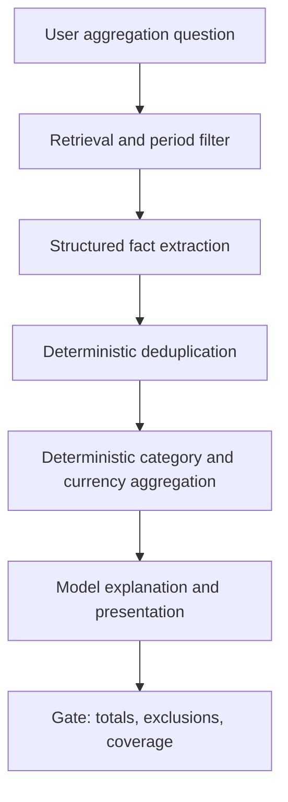

# Local model practical next step — deterministic document aggregation

## Fresh-session brief

Read this file before changing anything. Work only on this task and preserve
unrelated concurrent changes in the repository. Do not start a live server
unless the affected flow genuinely requires it; use an isolated scratch DB,
temporary workspace, and non-default ports when doing so.

## Objective

Make document-intelligence aggregation reliable for local models by moving
numeric extraction, deduplication, currency separation, and category totals out
of free-form model arithmetic, while separately repairing month-name date hints
so the real multi-period household corpus retrieves the correct documents.

## Evidence and diagnosis

The isolated T-R5 harness consistently indexed the corpus and delivered the
full 47.3 KB `doc_batch` to every local model. No valid run showed an Aperio
transport, indexing, corpus-fence, oracle-exposure, or teardown failure.

| Model | Result | Observed failure |
|---|---:|---|
| Gemma 4 E2B | 2/5 | Missing groceries; incorrect fuel/utilities; no total |
| Gemma 4 E4B | 3/5 | Fuel overcount; utilities arithmetic; incorrect total |
| Gemma 4 26B A4B | 4/5 | Fuel overcount; total 816.84 vs. 696.84 BGN |
| Ornith 1.0 9B | 2/5 | Used statement shortcut total 260.75 BGN |
| Gemma 4 12B | 0/5 | 600-second generation timeout |

The evidence therefore points primarily to a model-capacity/reasoning wall:
long-context synthesis, source reconciliation, arithmetic, deduplication, and
constraint-following. However, the live multi-month corpus has a separate
Aperio retrieval defect: `filenameDateHint()` does not recognize month names
such as `2026/June/...`, allowing unrelated months to compete in the candidate
cap. Fix both concerns, but do not conflate them.

## Target architecture



The model may identify facts, categories, dates, currencies, and ambiguity.
Application code must own arithmetic, duplicate reconciliation, currency
separation, excluded-document policy, and the final total.

## Implementation order

### 1. Repair period-aware retrieval

Inspect `lib/docgraph/retrieval.js`, especially `filenameDateHint()` and the
candidate ranking/filtering path. Add support for month names and day-month
abbreviations used by the household corpus, including paths such as:

```text
2026/June/electricity-bill-03-jun.txt
```

Acceptance: a synthetic multi-month candidate set ranks June 2026 documents
above unrelated months for a June query, and existing retrieval tests remain
green. Test path/date precedence, numeric months, month names, abbreviations,
missing dates, and non-date filenames.

### 2. Define a structured extracted-fact contract

Create or extend a bounded internal contract for facts emitted from document
chunks. Each fact should preserve at least:

- source document and location;
- event date and period;
- amount and currency;
- candidate category;
- payment/status metadata;
- duplicate/reconciliation key;
- confidence and unresolved ambiguity.

Do not expose the oracle or benchmark expected totals to the model. Keep the
contract bounded and abortable so large corpora cannot create an unbounded
fact array.

Acceptance: the June fixture can be represented without losing the Internet
payment, waste fee, two grocery receipts, fuel receipt/bank duplicate, travel
currency, or excluded trade documents.

### 3. Make aggregation deterministic

Implement pure application-side functions for:

- deduplicating the reconciled 120.00 BGN fuel receipt/statement pair;
- summing by category and currency;
- keeping EUR travel separate from the BGN household total;
- excluding trade documents and templates;
- reporting unresolved or conflicting facts instead of silently guessing.

Acceptance: the frozen June fixture deterministically produces Fuel 215.60,
Groceries 140.75, Internet 29.99, Transport 50.00, Utilities 260.50, and
BGN total 696.84, with 196.40 EUR travel reported separately.

### 4. Reduce the model to interpretation and presentation

Change the document-aggregation flow so the local model receives structured
facts and/or deterministic totals, then asks for presentation and concise
explanation. Explicitly prohibit using a bank-statement precomputed total as a
replacement for source aggregation, inventing FX rates, or merging currencies.

Acceptance: the T-R5 gate passes with a local model without relying on the
model to perform the final arithmetic. The answer still identifies sources,
keeps travel separate, and states uncertainty where facts conflict.

### 5. Verify in two corpora

Run unit/integration tests first. Then run the isolated T-R5 fixture. Finally,
exercise the real multi-period household corpus in a separate scratch runtime
to verify the month-name retrieval fix and compare its selected documents with
the isolated fixture.

Acceptance: tests are green; the isolated gate passes; the real-corpus trace
shows June-specific documents are not displaced by unrelated months; no runtime
process, DB, log, or scratch artifact remains.

## Risks and guardrails

- Extraction may miss facts: retain source locations and report incomplete
  coverage rather than fabricating totals.
- Duplicate rules may over-collapse distinct purchases: require date/amount/
  merchant evidence and test near-duplicate edge cases.
- Currency conversion may reappear in prose: enforce per-currency totals in the
  structured result and gate for invented FX rates.
- Retrieval changes affect all document questions: preserve existing ranking,
  deduplication, and path-safety tests; do not broaden filesystem access.
- Large corpora may create memory pressure: keep candidate, fact, and batch
  limits explicit and measure peak sizes during verification.

## Recommended execution model

Use a capable local coding model first for the implementation and tests. Use a
cloud reasoning model only for review if the local model cannot safely complete
the retrieval/aggregation refactor. Expected work is roughly 20–30k input
tokens and 5–10k output tokens; local execution cost is $0.

## Handoff result

Do not interpret the current local-model failures as proof that Aperio's
document bridge is broken. The bridge is reaching the evidence. The next
engineering boundary is deterministic fact handling and aggregation, with the
month-name retrieval defect fixed as an independent prerequisite for real-corpus
validation.
