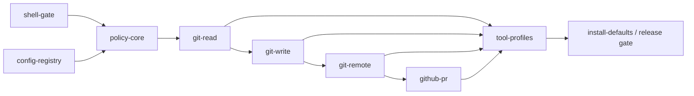

# Git co-pilot — companion test file

> Plan: [`git-copilot.md`](git-copilot.md)

## 1. Coverage map

| Plan step | Test group | Coverage |
|---|---|---|
| WS0 — close run_node_script/run_python_script bypass | Unit: shell-gate | Both tools refuse without `APERIO_ENABLE_SHELL`; doc-gen tools unaffected |
| WS1 — config keys | Unit: config-registry | Both keys generated, documented, CI-checked |
| WS2 — policy/runner core | Unit: policy-core | Repo resolution, write-path scoping, explicit staging, fixed constants, no CAS |
| WS3 — git-read tools | Integration: git-read | status/diff/log, structured output, no confirm, works outside allowlist |
| WS4 — git-write tools | Integration: git-write | stage/commit/branch, confirm chassis wiring (3 regex sites), stat-summary preview, TTL |
| WS5 — git-remote tools | Integration: git-remote | integrate refuse-on-conflict, sync fetch/push+force-with-lease, egress logging |
| WS6 — create_pull_request | Integration: github-pr | no auto-push, branch-exists precheck, egress logging |
| WS7 — capToolsForWindow atomic groups | Unit + regression: tool-profiles | atomic admission, loud refusal, run_shell git block, full existing suite still green |
| WS8 — defaults & release gate | Integration: install-defaults | fresh vs. upgrade fixtures, release-gate suite run |

## 2. Test cases

### Unit: shell-gate (WS0)

**Name:** `run_node_script refuses without APERIO_ENABLE_SHELL`
**Input/setup:** `APERIO_ENABLE_SHELL` unset; call `run_node_script` with a trivial valid script path.
**Expected behavior:** refusal returned before any file is read or executed.
**Assertions:** response matches the same refusal shape `run_shell` returns when disabled; no child process spawned (assert via spy on `child_process`).
**Edge cases:** `APERIO_ENABLE_SHELL=0` explicit vs. unset; same result both ways.

**Name:** `run_python_script refuses without APERIO_ENABLE_SHELL`
Same shape as above for the Python variant.

**Name:** `run_node_script executes normally with APERIO_ENABLE_SHELL=1`
**Assertions:** existing passing behavior (pre-fix) is unchanged when the flag is on.

**Name:** `generate_xlsx / generate_docx / read_docx do not depend on run_node_script`
**Input/setup:** static grep of the three handler files for `run_node_script`/`run_python_script` calls.
**Expected behavior:** zero matches.
**Assertions:** grep exit code / match count == 0. Run this as a real repo grep in CI, not a mocked assertion, since it's checking the current source, not a fixture.

### Unit: config-registry (WS1)

**Name:** `APERIO_ENABLE_GIT and APERIO_GIT_MODE are registered`
**Input/setup:** run `npm run gen:env`.
**Expected behavior:** `.env.example` and `docs/config-reference.md` contain both keys with descriptions.
**Assertions:** `npm run gen:env:check` exits 0 (no diff).
**Edge cases:** `APERIO_GIT_MODE` accepts only `confirm`/`autonomous` — invalid value falls back to `confirm` with a warning, does not crash boot.

### Unit: policy-core (WS2)

**Name:** `read-only Git call succeeds outside any allowed write path`
**Input/setup:** temp repo outside the DB `allowed-paths` list.
**Expected behavior:** `git_status` (or the WS2 internal helper it wraps) succeeds.
**Assertions:** returns structured status, no policy error.

**Name:** `mutating Git call is denied outside any allowed write path`
**Input/setup:** same temp repo, attempt a stage/commit-shaped internal call.
**Expected behavior:** denial with a message naming "not an allowed write path."
**Assertions:** no git process spawned for the mutation (spy on `execFile`).

**Name:** `explicit staging rejects missing/empty paths`
**Input/setup:** call the stage builder with `paths: []` and with `paths` omitted.
**Expected behavior:** schema validation error in both cases.
**Assertions:** error is a validation error, not a git invocation with `-A`/`.`.
**Edge cases:** `paths: ["."]` and `paths: ["-A"]` as literal path strings — must be treated as literal (likely nonexistent) pathspecs, never expanded to "everything."

**Name:** `plain --force is always rejected; force-with-lease with exact SHA is allowed`
**Input/setup:** two argv-builder calls, one requesting plain force, one requesting force-with-lease with an expected SHA.
**Expected behavior:** first rejected unconditionally; second builds valid argv only when the SHA matches current remote-tracking ref.
**Assertions:** rejection is not configurable — no env var flips it on (grep policy-core source for any conditional path to plain force).

**Name:** `filters and external transports are always blocked`
**Input/setup:** repo with `core.fsmonitor`/external diff configured; attempt to target an `ext::`/`file://` remote.
**Expected behavior:** both blocked unconditionally.
**Assertions:** no config key changes the outcome.

**Name:** `output is capped at the shared 48000-byte constant`
**Input/setup:** a diff/log call against a fixture producing >48000 bytes of output.
**Expected behavior:** output truncated to the same cap `run_shell` uses.
**Assertions:** byte length ≤ constant; constant is imported/shared, not redefined.

**Name:** `two concurrent mutating calls against the same repo serialize via Git's own lock`
**Input/setup:** fire two concurrent stage+commit calls against one temp repo.
**Expected behavior:** one succeeds; the other receives Git's native index-lock error surfaced up, not a custom Aperio queue error.
**Assertions:** no Aperio-side lock/queue file or table is created (this proves WS2.4's "no new machinery" holds).

### Integration: git-read (WS3)

**Name:** `git_status returns structured fields`
**Assertions:** response includes branch, HEAD, upstream, ahead/behind, staged, modified, untracked, conflicts — as fields, not embedded in prose text.

**Name:** `git_diff is bounded and includes file stats`
**Input/setup:** a fixture with a large diff.
**Assertions:** response includes per-file added/removed counts and a bounded patch body (respects WS2's output cap).

**Name:** `git_log returns bounded structured history`
**Assertions:** respects a `limit` parameter; entries are structured (sha, author, date, message), not raw `git log` text.

**Name:** `git-read tools never trigger the confirm flow`
**Assertions:** no `Token:` line, no `agent_interrupts` row created, for any git-read call.

### Integration: git-write (WS4)

**Name:** `git_stage / git_commit / git_branch are members of CONFIRMABLE_TOOLS`
**Assertions:** `lib/helpers/confirmableTools.js` exports include all three.

**Name:** `git_ token prefix is recognized at all three regex sites`
**Input/setup:** trigger a confirm-requiring call for each of the three tools.
**Assertions:** the emitted token matches the regex in `tool-hooks.js` (both sites) and `ws/interrupts.js`; a manual construction check confirms all three sites reference the same shared source, not three independent literals.

**Name:** `api-interrupts.js dispatches git tools correctly`
**Input/setup:** decide (approve) a pending git interrupt via the HTTP/WS decide path.
**Assertions:** the correct `executeTool`/`revalidate` pair runs; execution matches what was previewed (digest re-check).

**Name:** `confirm preview is a stat summary, never full diff text`
**Input/setup:** propose a commit touching 500 files.
**Expected behavior:** preview stays under the existing bounded-preview byte limit.
**Assertions:** preview contains file count + added/removed totals + message/branch, and does not contain literal diff hunk markers (`@@`).

**Name:** `TTL is the existing 2-minute default, unchanged`
**Assertions:** the git confirm token expires using the same `WRITE_TOKEN_TTL_MS` constant as file writes — no separate Git TTL constant introduced.

**Name:** `git_branch never force-deletes`
**Input/setup:** attempt to delete a branch with unmerged commits.
**Expected behavior:** refused (safe-delete semantics only).

**Name:** `git_commit has no amend parameter`
**Assertions:** schema for `git_commit` has no `amend` field (contract test on the tool's JSON schema).

### Integration: git-remote (WS5)

**Name:** `git_integrate refuses on conflict before touching the worktree`
**Input/setup:** two branches that would conflict on merge.
**Expected behavior:** refusal with conflict description; worktree unchanged (assert via clean `git status` after the call).
**Assertions:** no continue/skip/abort parameters exist on the schema.

**Name:** `git_integrate succeeds on a clean merge/rebase`
**Assertions:** goes through the WS4 confirm chassis before applying.

**Name:** `git_sync fetch requires no confirm; push requires confirm`
**Assertions:** fetch call has no `Token:`/interrupt; push call does.

**Name:** `git_sync push with force-with-lease requires an exact expected SHA`
**Input/setup:** stale expected SHA (remote moved since last fetch).
**Expected behavior:** rejected, no push attempted.

**Name:** `git_sync push logs egress`
**Assertions:** one `egress.log` line with `{ts, tool, host, sessionId}` shape, matching the existing `logEgress` output exactly (same fields, same file).

**Name:** `no compound pull, no raw refspecs`
**Assertions:** schema for `git_sync` has no `pull` action and no free-form refspec string parameter.

### Integration: github-pr (WS6)

**Name:** `create_pull_request refuses when the head branch isn't pushed`
**Input/setup:** local branch with commits, never pushed.
**Expected behavior:** refusal naming `git_sync`, **before** any confirm token is issued.
**Assertions:** no `agent_interrupts` row created for this attempt.

**Name:** `create_pull_request succeeds when the branch is pushed`
**Assertions:** goes through `proposeAction`/`commitAction`, same chassis as `create_github_issue`.

**Name:** `create_pull_request does not push`
**Assertions:** spy on the git-remote runner confirms no push invocation occurs as a side effect of PR creation.

**Name:** `create_pull_request logs egress`
**Assertions:** one `egress.log` line — this is the **first** logged GitHub write egress line in the suite (confirms #536's "establishing, not reusing" framing for writes).

### Unit + regression: tool-profiles (WS7)

**Name:** `git-read/git-write/git-remote groups are admitted atomically`
**Input/setup:** a served window sized to fit `git-read` fully but not `git-write` fully.
**Expected behavior:** `git-read` loads whole; `git-write` loads not at all (zero of its tools) — never a partial `git-write`.

**Name:** `smallest-needed-group-doesn't-fit refuses loudly`
**Input/setup:** a 4K-token served window, intent classified as needing `git-write`.
**Expected behavior:** zero git tools load; a visible message explains the window is too small for Git tools.
**Assertions:** message is surfaced to the model/user, not just a `logger.info` line (this is the #354 non-negotiable — silent truncation is a failing test, not an acceptable log line).

**Name:** `run_shell rejects any git invocation unconditionally`
**Input/setup:** `run_shell({program: "git", ...})` with `APERIO_ENABLE_SHELL=1`.
**Expected behavior:** refused regardless of shell being enabled.
**Assertions:** `GIT_READONLY` allowance no longer exists in `mcp/tools/shell/command.js` (source-level check, not just behavioral).

**Name:** `existing non-Git tool profiles are unaffected by the atomic-group change`
**Input/setup:** re-run the full pre-existing `tests/unit/agent/tool-profiles.test.js` suite unmodified except for additions.
**Expected behavior:** 100% of prior passing cases still pass.
**Assertions:** this is the regression gate for WS7.2's cross-cutting change — treat any prior-suite failure as a blocker, not a "known difference."

### Integration: install-defaults (WS8)

**Name:** `fresh install gets APERIO_ENABLE_SHELL=1, APERIO_GIT_MODE=confirm`
**Input/setup:** simulate a fresh-install fixture (no prior settings row).
**Assertions:** both defaults present as specified.

**Name:** `upgrade fixture keeps its existing settings untouched`
**Input/setup:** a settings fixture representing a pre-upgrade install with `APERIO_ENABLE_SHELL` explicitly `0` (or unset, simulating "never touched it").
**Expected behavior:** value after upgrade is unchanged — not silently flipped to the new fresh-install default.
**Assertions:** this is the corrected #352 answer — the test must fail if defaults leak into an existing install.

**Name:** `release gate: WS0 shipped + full suite green`
**Input/setup:** run `npm test` and `npm run test:harness` against the finished branch.
**Expected behavior:** both green, and a search for the WS0 gate (`APERIO_ENABLE_SHELL` check on `run_node_script`/`run_python_script`) confirms it's present.
**Assertions:** this is the actual release-readiness check referenced in the plan's §6 WS8.3 — run it as a real CI step, not asserted from memory.

## 3. Test execution order

1. **Unit: shell-gate** (WS0) — no dependencies, run first; blocks everything else per the plan's WS0 gate.
2. **Unit: config-registry** (WS1) — independent, can run in parallel with shell-gate.
3. **Unit: policy-core** (WS2) — depends on WS1 (needs `APERIO_ENABLE_GIT` to exist for the tools it underpins, though the policy functions themselves are also unit-testable standalone).
4. **Integration: git-read** (WS3) — depends on policy-core.
5. **Integration: git-write** (WS4) — depends on policy-core + git-read (shares fixtures).
6. **Integration: git-remote** (WS5) — depends on git-write (shares the confirm chassis wiring).
7. **Integration: github-pr** (WS6) — depends on git-remote (needs `git_sync` to exist for the "branch pushed" success case).
8. **Unit + regression: tool-profiles** (WS7) — depends on WS3–WS6 existing (needs real tool schemas to group), run its regression sub-case last within the group since it's the highest-blast-radius change.
9. **Integration: install-defaults** (WS8) — last; depends on everything above being mergeable, and is itself the release gate.

Within each group, individual test cases are independent and may run in any order
or in parallel.

## 4. Diagrams

## 5. Required setup

- A disposable temp Git repo (and a bare remote, also temp) created and destroyed
  per test run — never inside the Aperio repo tree, per `AGENTS.md`'s no-stray-state
  rule. Use a harness-managed scratch dir outside the project tree.
- A settings-fixture helper capable of producing both a "fresh install" and an
  "existing install with prior settings" DB state, for WS8.
- Spies/mocks for `child_process.execFile`/`spawn`, so policy-denial tests can
  assert *no process was spawned*, not just that a response looks like a denial.
- The existing `agent_interrupts` table/migration (008) — already present, no new
  migration needed; tests use it as-is.
- `egress.log` fixture isolation — point `logEgress` at a temp log path per test
  run so assertions don't collide with any log from a real session.
- Existing `tests/unit/agent/tool-profiles.test.js` and
  `tests/integration/agent.test.js` as the regression baseline for WS7 — run
  before WS7 changes to record a pass baseline, then again after.
