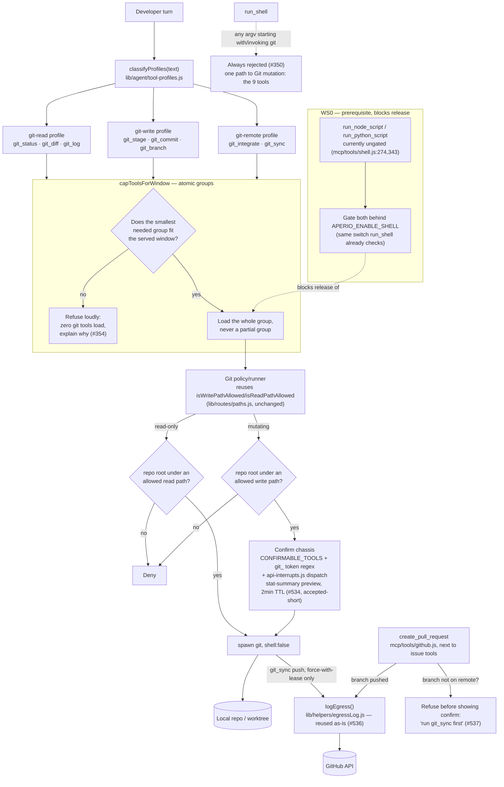

# Local-model Git co-pilot — executable rewrite of #343

> Companion tests: [`git-copilot-tests.md`](git-copilot-tests.md)
> Rewrites issue #343. Every decision below traces to a resolution comment on
> Wayfinder map #345 (tickets #346–354, #533–537, all closed). Citations are
> `#<ticket>` for the decision and `file:line` for the current code it touches
> (verified live against this branch, not the audit's pinned commit).

## 1. Objective

Give qualified local and cloud models a safe way to inspect, stage, commit, branch,
sync, and open pull requests on a Git repository — through nine structured MCP tools
with no free-form shell access to `git`, closing the `run_node_script` host-execution
bypass along the way, so that "the AI drives Git" stops being a shell-injection risk
and becomes an enumerable, confirmable, policy-gated tool surface.

## 2. Diagram

## 3. Model recommendation

- **Recommended:** Anthropic (Claude, current tier) for every workstream in this
  epic — precision-critical only per the `write-plan` model table. Reasoning:
  the entire deliverable is a security policy layer (argv construction, path-scope
  gating, confirm-token plumbing across three regex sites, taint plumbing) where a
  subtly wrong boundary is a silent privilege escalation, not a visible bug. This is
  exactly the "instruction-following is paramount" case the skill calls out.
- **Estimated tokens:** ~90–140k input / ~35–55k output across the full epic
  (9 workstreams, each touching 2–5 files plus their tests). Split across several
  sessions rather than one pass — WS0 alone is small and should ship/verify first.
- **Not a fit for local/cheap models:** the policy engine and confirm-token plumbing
  require holding cross-file invariants (three regex sites, `CONFIRMABLE_TOOLS`,
  `api-interrupts.js` dispatch) in mind at once — precisely the failure mode #346's
  audit found already half-missed in the existing file/GitHub confirm flows.

## 4. Scope changes from the original #343 draft

Read this before implementing — these are real narrowings the map decided, not
omissions in this rewrite:

- **Ten tools become nine.** #350's resolution names ten tools (carrying over
  #343's original list, including `git_worktree`), but #351 — decided after #350,
  specifically to settle v1 scope — defers worktrees to v2 as "mainly a
  parallel-agent-session need." This rewrite follows #351 as the later, more
  specific decision. **v1 ships nine tools; there is no `git_worktree` tool.**
  Flagging this explicitly since #350's own text still says "ten."
- **`git_commit` has no `amend` flag.** #351: amend is a history rewrite the AI
  doesn't need — it commits again instead.
- **`git_integrate` is refuse-on-conflict only.** No continue/skip/abort state
  machine in v1 (#351). If merge/rebase would conflict, the tool stops before
  starting and tells the human to resolve it in their own editor.
- **Branch protection (`main`/`master`) is dropped, not carried forward.**
  Original #343 hardcoded protecting `main`/`master` from direct commits/push and
  exposed `APERIO_GIT_PROTECTED_BRANCHES`. #535 caps new config keys at exactly
  two (`APERIO_ENABLE_GIT`, `APERIO_GIT_MODE`) and no ticket revisits branch
  protection. **v1 has no branch-protection mechanism** — a confirmed commit/push
  to `main` proceeds like any other branch, gated only by repo-scope + confirm.
  This is a real behavior gap versus the original draft; if the developer wants it
  back, that's a fresh ticket, not something to quietly reintroduce here.
- **Five more original config keys are gone, replaced by fixed policy constants**
  (not user-configurable in v1), per #535's two-key cap:
  - `APERIO_GIT_ALLOWED_REMOTE_HOSTS` → hardcoded: only `https`/`ssh` transports,
    never `file://` or `ext::`. No per-host allowlist.
  - `APERIO_GIT_ALLOW_HISTORY_REWRITE` → history rewrite is simply what
    `force-with-lease` does; #351 keeps it in v1 unconditionally (no toggle).
    Plain `--force` stays forbidden regardless of any setting (carried-over
    out-of-scope list, §7).
  - `APERIO_GIT_ALLOW_FILTERS` → filters/external diff/textconv are always
    blocked. Consistent with the carried-over ban on custom merge/diff drivers.
  - `APERIO_GIT_MAX_OUTPUT_BYTES` → reuse `run_shell`'s existing 48000-byte cap
    (`mcp/tools/shell.js:16-18`) as a fixed constant; no separate Git-specific cap.
  - `APERIO_CAPABLE_MODELS` as a Git gate → removed entirely (#349). Policy, not
    model identity, is the boundary.
- **`APERIO_SHELL_LOCAL` is untouched.** #353 explicitly does not add a new flag
  for the `run_node_script`/`run_python_script` fix — it reuses `APERIO_ENABLE_SHELL`
  alone.

## 5. Fragile Zone touch map

Per `AGENTS.md`. Every workstream below states which zones it touches and what
"verified" means for that touch — read this section before starting any workstream.

| Zone | Touched by | What changes | Required verification |
|---|---|---|---|
| `lib/config.js` | WS1 | Add exactly `APERIO_ENABLE_GIT`, `APERIO_GIT_MODE` — **pre-approved standing, per #535**, no re-ask needed | `npm run gen:env` + `npm run gen:env:check` |
| `db/migrations/` + `db/migrations-sqlite/` | none | No schema change — `agent_interrupts` (008) already covers arbitrary tool names; Git tools reuse it | n/a |
| `lib/context/` | none | Not touched — Git tools don't change system-prompt assembly | n/a |
| `lib/routes/paths.js` | none (consumed, not modified) | WS2 calls `isWritePathAllowed`/`isReadPathAllowed` exactly as they exist today (#348: "no new config key... reuses the existing allowed-write-paths mechanism") | n/a — but run path tests once as a smoke check that nothing elsewhere regressed them |
| `mcp/index.js` ctx | WS3–WS6 (tool registration only) | New tool files register through the existing `ctx.store` / `ctx.embeddingQueue`-style pattern; **no new `ctx` field is added**. If a workstream finds it needs one (e.g. a git-specific helper), stop and treat that as a Fragile Zone change requiring its own sign-off, not a silent addition | `npm run test:memory` + tool tests if any `ctx` field is touched |

## 6. Steps

### WS0 — Close the `run_node_script`/`run_python_script` bypass (blocking prerequisite)

Per #353: this is owned by this epic, not a separate issue shipped first. Nothing
in WS3–WS8 ships until this does.

1. Gate `run_node_script` and `run_python_script` behind the existing
   `SHELL_ENABLED = process.env.APERIO_ENABLE_SHELL === "1"` check
   (`mcp/tools/shell.js:76`) at their handler entry points
   (`mcp/tools/shell.js:274` and `:343` today — confirm exact lines at
   implementation time, they will have moved). No `process.env` stripping, no new
   flag — the same switch `run_shell` already enforces at `shell.js:515`.
   *Works when:* with `APERIO_ENABLE_SHELL` unset/`0`, both tools return the same
   class of refusal `run_shell` already returns, and do so on the very first line
   of the handler (no partial script write before the refusal).
2. Confirm the migration is safe: `generate_xlsx`, `generate_docx`, `read_docx` do
   not call `run_node_script` internally (already checked against
   `mcp/tools/files/generate.js` per #353) — re-run this check against current
   code before merging, since files move.
   *Works when:* grepping those three tool handlers for `run_node_script` /
   `run_python_script` returns nothing.
3. Add a CHANGELOG entry noting the behavior change: on upgrade, any custom
   one-off script a user relied on via `run_node_script`/`run_python_script` now
   requires `APERIO_ENABLE_SHELL=1` (previously ungated).
   *Works when:* entry exists under `## Unreleased`.

### WS1 — Config surface

1. Add `APERIO_ENABLE_GIT` (boolean, tier 1, matching the
   `APERIO_CODEGRAPH`/`APERIO_DOCGRAPH` pattern at `lib/config.js:334-336`) and
   `APERIO_GIT_MODE` (`confirm` | `autonomous`, default `confirm` per #352) to the
   config registry. Fragile Zone approval already granted, standing, per #535 —
   do not re-ask.
   *Works when:* `npm run gen:env` regenerates `.env.example` and
   `docs/config-reference.md` with both keys documented, and
   `npm run gen:env:check` passes in CI.

### WS2 — Git policy/runner core

1. Build the shared repo-resolution + argv-safe runner: resolve the real repo root
   (`git rev-parse --show-toplevel` via `execFile`, `shell: false`), classify each
   tool call as read-only (must pass `isReadPathAllowed`) or mutating (must pass
   `isWritePathAllowed`) on the resolved root — reuse `lib/routes/paths.js` exports
   unmodified, per #348.
   *Works when:* a read-only call (e.g. status) against a repo outside any allowed
   read path is denied with a clear "not an allowed read path" message; a mutating
   call against a repo outside any allowed write path is denied with a clear "not
   an allowed write path" message.
   **SUPERSEDED 2026-08-29** (security review): this originally read "read-only
   (allowed on any resolvable repo)" — reversed because a read-only call can still
   return full file contents (`git show HEAD:path`, `git log -p`), so it needs the
   same boundary as any other read tool. AGENTS.md: "no read-only tier" — one
   allowed-folders list covers read and write alike, no broader exception for git.
2. Enforce explicit staging: the stage tool accepts only an explicit `paths: []`
   array — no `.`/`-A`/empty-means-everything semantics anywhere in the git argv
   builder (#348, #533's "commits another session's work" guard).
   *Works when:* calling stage with an empty/missing `paths` argument is a schema
   validation error, not a fallback to "stage everything."
3. Implement the fixed (non-configurable) policy constants from §4: transport
   allowlist (`https`/`ssh` only), filters always blocked, plain `--force` always
   rejected (force-with-lease with an exact expected SHA is the only rewrite
   path), 48000-byte output cap reused from `mcp/tools/shell.js`.
   *Works when:* each constant has a unit test asserting the specific git
   invocation it blocks is blocked, and the one it allows is allowed.
4. No mutation queue, no HEAD/index/worktree digest compare-and-swap (#533) — do
   not build one. Git's own `.git/index.lock` plus explicit staging is the whole
   concurrency story for v1.
   *Works when:* two concurrent mutating calls against the same repo serialize
   through Git's own lock (one succeeds, the other gets Git's native lock error,
   not a custom Aperio error) — proven in the harness, not asserted in prose.

### WS3 — `git-read` tools (no confirm)

1. Implement `git_status`, `git_diff`, `git_log` per #343's original schemas
   (branch/HEAD/upstream/ahead-behind/staged/modified/untracked/conflicts for
   status; bounded working/staged/base patch + file stats for diff; bounded
   structured history for log). Read-only, no confirm flow — but per WS2.1's
   superseded decision (2026-08-29), still gated by `isReadPathAllowed`, not
   usable against an arbitrary resolvable repo.
   *Works when:* each tool returns structured JSON (not raw porcelain text) and
   works against a repo under an allowed read path; is denied against one outside it.

### WS4 — `git-write` tools (confirm required)

1. Implement `git_stage`, `git_commit`, `git_branch` (create/switch/safe-delete —
   never force-delete, per the carried-over out-of-scope list).
2. Wire each into the existing confirm chassis: add to `CONFIRMABLE_TOOLS`
   (`lib/helpers/confirmableTools.js:6-10`), add a `git_` prefix to the
   token-prefix regex in **all three** sites (`lib/agent/tool-hooks.js:485,586`,
   `lib/emitters/handlers/ws/interrupts.js:14`), add a dispatch case in
   `decideAndMaybeExecute` (`lib/routes/api-interrupts.js:57-64`), and write the
   Git-specific `revalidate`/`executeTool` pair.
   *Works when:* a single new shared constant or lookup table drives all three
   regex sites (grep for the literal string `git_` returns exactly the expected
   set of edit sites — no site missed).
3. Preview shape per #534: a stat-summary (file list + added/removed counts +
   commit message/branch name), never full diff text inline. TTL stays at the
   existing 2-minute default (`WRITE_TOKEN_TTL_MS`,
   `mcp/tools/files/interrupt.js:23`) — this is a **known, accepted-short**
   limitation per #534, not something to silently extend or silently leave
   undocumented.
   *Works when:* the confirm preview for a 500-file commit is still under a fixed
   byte bound (reuse whatever bound the existing file-write preview uses), and a
   code comment or doc note next to the TTL constant says why Git reuses it
   unchanged.

### WS5 — `git-remote` tools (confirm required)

1. Implement `git_integrate` (merge/rebase, refuse-on-conflict only — no
   continue/skip/abort) and `git_sync` (fetch; push including force-with-lease).
   No compound "pull," no raw refspecs.
   *Works when:* attempting a merge/rebase that would conflict returns a refusal
   with the conflict description and does not touch the worktree; a clean
   merge/rebase and a normal/force-with-lease push both go through the WS4 confirm
   chassis.
2. `git_sync` push calls `logEgress()` exactly as `mcp/tools/github.js` already
   does for issue writes (#536) — no new logging mechanism.
   *Works when:* a push produces one `egress.log` line with the existing shape
   (`{ts, tool, host, sessionId}`).

### WS6 — `create_pull_request`

1. Add to `mcp/tools/github.js`, next to `create_github_issue`/
   `update_github_issue` — grouped by what it talks to (GitHub's API, same token
   resolution, same `proposeAction`/`commitAction` chassis), per #537.
2. Does **not** push the branch. If the head branch isn't on the remote, refuse
   with a message pointing at `git_sync`, checked **before** showing a confirm
   button — same pattern already used for a missing GitHub token
   (`mcp/tools/github.js:371-372`).
   *Works when:* proposing a PR for an unpushed branch never reaches the confirm
   step; the refusal message names `git_sync` explicitly.
3. Reuse `logEgress()` for the PR-creation POST (#536 — GitHub write egress
   currently isn't logged at all anywhere in `github.js`; this establishes the
   first logged write, not a reuse of an existing logged write).
   *Works when:* creating a PR produces an `egress.log` line.

### WS7 — Tool-profile loading (`capToolsForWindow` atomic groups)

1. Split Git tools into three sub-profiles — `git-read`, `git-write`,
   `git-remote` — selected by intent the same way `file-generate`/`docgraph`
   already are (`lib/agent/tool-profiles.js`), rather than one 9-tool `git`
   profile.
2. Change `capToolsForWindow` so a profile group is admitted **whole or not at
   all** — replace the current break-on-first-miss behavior
   (`tool-profiles.js:125-134` today) with an atomic-group check. This changes
   behavior for every existing profile, not just Git — treat it as a
   cross-cutting change and re-run the full existing tool-profile test suite,
   not just new Git tests.
3. If the smallest needed group doesn't fit the served window, refuse loudly:
   zero Git tools load, and the model/user sees an explicit "context window too
   small for Git tools" message — never a silently truncated partial group
   (#354's non-negotiable).
   *Works when:* a synthetic 4K-window test case requesting `git-write` gets zero
   git tools and a visible refusal, not `git_stage` alone with `git_commit`
   silently missing.
4. Close `run_shell` to `git` entirely (#350): any argv whose first non-flag token
   is (or resolves to, including via `npm run`/`node -e` tricks already covered
   by WS0) `git` is refused, unconditionally, regardless of `APERIO_ENABLE_SHELL`.
   *Works when:* `run_shell({program: "git", args: ["status"]})` is refused even
   with shell fully enabled, and the existing `GIT_READONLY` allowance in
   `mcp/tools/shell/command.js:13` is deleted, not left dead.

### WS8 — Defaults & release gate

1. Fresh installs only: `APERIO_ENABLE_SHELL` defaults on. Existing installs keep
   whatever they already have on upgrade — untouched, not silently flipped
   (#352, confirmed final after an initial wrong answer was corrected).
2. `APERIO_GIT_MODE` defaults to `confirm` for every install type.
3. Release gate: ship only once WS0 is shipped **and** the full automated test
   suite (`npm test`, `npm run test:harness`) is green. No separate human
   security-review pass is a hard gate for v1 (#352) — though nothing stops one
   happening informally.
   *Works when:* a fresh-install fixture ends up with `APERIO_ENABLE_SHELL=1`,
   `APERIO_GIT_MODE=confirm`; an upgrade fixture with pre-existing settings ends
   up with those settings unchanged.

## 7. Out of scope (carried over verbatim — not reopened by this rewrite)

- `reset --hard`, `clean`, automatic stash, force branch/worktree deletion,
  arbitrary refspecs, interactive rebase editors, `rebase --exec`, hooks, custom
  merge/diff drivers, submodule execution, Git LFS filters by default, tags and
  releases, credential storage, automatic pull.
- Junior-developer coaching mode and the full `git-copilot` skill that would carry
  it (#347) — v1 is a developer co-pilot only.
- `git_worktree` and `git_commit --amend` (§4 above) — deferred to v2 with
  reasons, not deleted from the idea space.
- Branch protection for `main`/`master` (§4 above) — genuinely dropped versus the
  original draft, not merely deferred; would need a fresh ticket to reintroduce.
- Mutation queue / compare-and-swap for concurrent sessions (#533).
- A dedicated local-mutation audit log (#536) — Git's own history is the audit
  trail.

## 8. Risks

| Risk | Mitigation |
|---|---|
| WS7's atomic-group change to `capToolsForWindow` is cross-cutting — a bug regresses every existing tool profile, not just Git | Run the full existing `tests/unit/agent/tool-profiles.test.js` suite before and after; add atomic-group cases without deleting existing break-on-first-miss regression coverage until it's confirmed obsolete |
| WS4's three-site token-regex edit misses a site, silently breaking Git confirm | Drive all three sites from one shared source (constant array or generated regex) instead of three hand-edited literals; grep-verify `git_` appears at each site before merging |
| WS0 breaks a user's custom `run_node_script`-based skill script on upgrade if they never set `APERIO_ENABLE_SHELL` | Documented in the CHANGELOG entry (WS0.3); this is an accepted, flagged behavior change, not a silent regression |
| Branch protection is genuinely gone (§4) — a confirmed push to `main` proceeds | Confirm-required + stat-summary preview is the only guard in v1; call this out in release notes so it's a known posture, not a surprise |
| 2-minute confirm TTL (#534, unchanged) is too short to read a real diff before confirming a commit/push/PR | Already flagged as accepted-short by the map; do not silently extend it in this epic — if it becomes real friction, that's a separate ticket against `APERIO_INTERRUPT_TTL_MS` |
| TOCTOU between repo-root resolution and the actual `execFile` git call (same class the audit found in `paths.js`) | Resolve and validate the repo root fresh on every tool invocation (never cache across calls); accept as the same residual risk `paths.js` already carries, not unique to this epic |

## 9. Doc updates

- `CHANGELOG.md` — new Git co-pilot tools, `APERIO_ENABLE_SHELL` fresh-install
  default change, `run_node_script`/`run_python_script` gating change (WS0).
- `docs/config-reference.md` — regenerated by `npm run gen:env` (WS1), not hand-edited.
- `id/reference/mcp-tools.md` — add the nine new tools plus `create_pull_request`.
- `SECURITY.md` — new attack surface (git argv construction, remote push, PR
  creation) and the explicit branch-protection gap from §4.
- `FEATURES.md` / `README.md` — new Git co-pilot capability, developer-only v1
  posture (no coaching mode).
