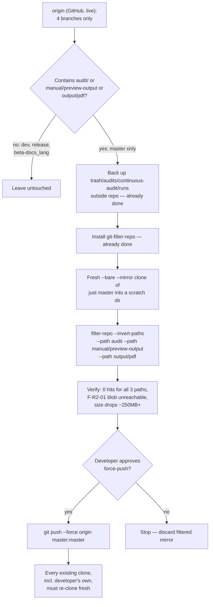

# Git history rewrite — issue #457 (map #455)

## Objective

Strip three exposed path histories (`manual/preview-output`, `output/pdf`, and the
pre-move `audit/` tree — the git-history name of what now lives, gitignored, at
`trash/audits/continuous-audit/runs`) out of `master`'s history on `origin`, using
`git filter-repo`, so new default clones of `aperio` stop shipping ~343 MB of stale
renders and a live secret-egress finding (F-R2-01) with exact file:line locations.

**Say this plainly up front: this does not erase the exposure.** `origin` has 4
forks and 242 clones in the last 14 days. Anyone who already cloned or forked keeps
the raw files forever — rewriting only stops *new* default clones from getting them.
If F-R2-01 names a real unpatched bug, the actual fix is patching that bug, not this
rewrite.

## What changed since ticket #457 was filed (read this before approving)

Two rounds of investigation, each correcting the previous assumption:

**Round 1** — the ticket assumed ~30 local branches. The actual local clone has 28
branches checked out plus 35 more `origin/*` remote-tracking refs (63 total),
mostly stale `dependabot/*`/`imgbot` branches. `trash/audits/continuous-audit/runs`
(path #3 in the ticket) turned out to never exist in git history at all — `trash/*`
is gitignored except `trash/plans/`, so when commit `d69489df` moved the old
`audit/` tree there, the destination was never committed. The real historical path
is `audit/` (149 blobs, ~343 MB, includes `audit/runs/run-002/findings.json` /
F-R2-01).

**Round 2 (the one that matters) — the local clone's remote-tracking refs are
stale.** `git branch -vv` / `git branch -r` report 63 `origin/*` branches because
this clone has never run `git fetch --prune`. Checked directly against GitHub —
`git ls-remote --heads origin` and `gh api repos/BaiGanio/aperio/branches
--paginate` both independently confirm:

**GitHub `origin` currently has exactly 4 branches: `beta-docs_lang`, `dev`,
`master`, `release`.** Everything else (all `feature/*`, `fix/*`, `chore/*`,
`test/*`, every `dependabot/*` branch, `imgbot`) was **already deleted from
GitHub** at some earlier point — this clone's local copies of those
remote-tracking refs are just leftover pointers, not live exposure.

Of the 4 real branches, path-by-path history check:

| Branch (live on GitHub) | `manual/preview-output` | `output/pdf` | `audit` |
|---|---|---|---|
| `master` | 2 hits | 2 hits | 7 hits |
| `dev` | 0 | 0 | 0 |
| `release` | 0 | 0 | 0 |
| `beta-docs_lang` | 0 | 0 | 0 |

**Only `master` needs the rewrite.** `dev`, `release`, and `beta-docs_lang` are
clean and need no action. There is nothing to delete from `origin` — the 19
`dependabot`/`imgbot` branches that Round 1 planned to delete already don't exist
there.

**Separate, lower-stakes finding, not required for this ticket:** roughly a dozen
branches exist **only on this machine** (never pushed, or pushed-then-deleted from
`origin`) that still carry `audit/`-history in their local git logs — e.g.
`feature/agent-rules-memory-discipline-285-ws3-signed-by-claude-opus-5`,
`fix/docint-cache-and-skill-stickiness-250-signed-by-claude-opus-5`, and others.
These are **not part of the public leak** (issue #457 is about `origin`
exposure) and are out of scope for this plan. Left as advisory: if any of them are
ever pushed to `origin` in the future, they'd reintroduce the same exposure — worth
a separate, low-urgency cleanup pass, not blocking this fix.

## Diagram



## Model recommendation

**Execute with Claude Sonnet 5 (this session), interactively, one destructive step
at a time.** Rationale unchanged from Round 1: this is a low-token, high-precision,
irreversible operation — a wrong path spec or an unreviewed force-push has no undo.
The narrowed scope (1 branch instead of 13) lowers total risk surface but not the
need for a human approval gate before the force-push. Estimated cost: negligible.

## Steps

### Step 1 — Back up the one target directory that still exists on disk ✅ DONE
`manual/preview-output` and `output/pdf` no longer exist anywhere on disk (already
deleted from the working tree by earlier commits `e6e49a6c`, `08cafe66`) — nothing
to back up for those two. `trash/audits/continuous-audit/runs` (444 KB, gitignored)
was copied to `~/backups/aperio-audit-runs-20260815-150024/runs` and verified
byte-identical with `diff -r`.

### Step 2 — Install `git-filter-repo` ✅ DONE
Installed via `brew install git-filter-repo` (v2.47.0). Verified with
`git filter-repo --version`.

### Step 3 — Build a scratch mirror containing only `master`
```
git clone --bare --mirror <origin-url> mirror.git
cd mirror.git
git for-each-ref --format='delete %(refname)' | grep -v 'refs/heads/master$' | git update-ref --stdin
git gc --prune=now
```
Scoped to one branch this time — no ref-pruning judgment calls needed since only
`master` carries the exposure. Do this in the session scratchpad, not inside the
real working repo.

**Acceptance criterion:** `git for-each-ref` in the mirror lists exactly
`refs/heads/master` (plus whatever tags point into its history — check with
`git tag --contains <master-root>` before deciding to keep or drop them; default
is keep).

### Step 4 — Run `filter-repo` with the correct path spec
```
git filter-repo --invert-paths \
  --path audit \
  --path manual/preview-output \
  --path output/pdf \
  --force
```
Path is `audit`, **not** `trash/audits/continuous-audit/runs` (see Round 1 finding
above — that path was never in git history).

**Acceptance criterion:** command exits 0 with a rewrite summary.

### Step 5 — Verify the strip actually worked, in the scratch mirror
```
git log --all --oneline -- audit manual/preview-output output/pdf   # must be empty
du -sh .   # should drop by roughly the ~343 MB estimate
```
Spot-check `audit/runs/run-002/findings.json` (F-R2-01) is unreachable after
`git reflog expire --expire=now --all && git gc --prune=now --aggressive`.

**Acceptance criterion:** both checks pass; size drop is in the expected range
(near-zero would mean the path spec missed the real history — this is exactly the
mistake Round 1's path #3 would have caused).

### Step 6 — Developer review of the filtered mirror before touching `origin`
Checkout the filtered mirror's `master` into an isolated scratch worktree, `npm
ci`, run the test suite, compare failure count against a pre-rewrite baseline run
on the current `master`. Per AGENTS.md's no-stray-state rule: isolated scratch dir,
cleaned up after.

**Acceptance criterion:** explicit developer go-ahead to force-push. **Do not
proceed past this point without it.**

### Step 7 — Force-push `master` to `origin`
```
git push --force origin master:master
```
Single branch — no batch `--all` push needed.

**Acceptance criterion:** `git ls-remote origin refs/heads/master` matches the
filtered mirror's local `master` hash.

### Step 8 — Re-clone every local working copy, including the developer's own
Old clones (including this working directory, and any other machine with a clone)
cannot `pull` — local history diverges from the rewritten remote. Move the current
directory aside (`mv aperio aperio.pre-rewrite-backup`, do **not** delete) and
`git clone` fresh from `origin`. The dozen local-only dirty branches (Round 2's
advisory finding) live only in the pre-rewrite backup unless the developer
explicitly wants them carried into the fresh clone — ask before copying them over,
since copying them back in reintroduces the same history locally (still not
exposed on `origin`, but worth a conscious choice, not a default).

**Acceptance criterion:** fresh clone's `master` boots, tests pass, `du -sh .git`
shows the reduced size.

### Step 9 — Housekeeping
Delete the A2D.md "Release / git hygiene" entry (this plan supersedes it). Run the
`sync-documentation` skill to check whether `SECURITY.md` / `CHANGELOG.md` need an
entry for the repo-size/history-rewrite change.

**Acceptance criterion:** A2D.md entry removed; sync-documentation's recommendation
followed or explicitly declined with reason.

## Risks

| Risk | Mitigation |
|---|---|
| Wrong path spec strips nothing (Round 1's path #3 mistake) | Step 5's verification re-runs the exact `git log -- <path>` queries used in investigation, plus a size-delta check, before force-push |
| `filter-repo` run on the wrong repo (working tree instead of scratch mirror) | Step 3 mandates a separate scratch clone; Step 4 never runs inside the real working repo |
| Force-push overwrites a commit someone else pushed to `master` in the meantime | Confirm no other session is active before Step 7; check `git ls-remote origin refs/heads/master` tip hash immediately before pushing |
| Developer's own working copy has uncommitted work at re-clone time | Step 8 moves the old directory aside instead of deleting it; `git status` checked first |
| Rewrite breaks something `master` depends on (CI config referencing `audit/`, etc.) | `package.json`'s `test:audit*` scripts and the 7 test files were already repointed off `audit/` in `d69489df`; Step 6 smoke-tests the filtered `master` before any push |
| Exposure is not actually closed by this rewrite (forks/clones already out) | Stated plainly in Objective; if F-R2-01 is a real unpatched bug, fix it independently of this rewrite |
| Local-only dirty branches get pushed to `origin` later without anyone remembering they carry the old exposure | Flagged as an advisory in Round 2 findings and again at Step 8 — not auto-fixed, deliberately left to a conscious developer decision |

## Doc updates

Run the `sync-documentation` skill after execution. Likely candidates:
`SECURITY.md` (repo-size/history-exposure posture — F-R2-01 disclosure note, and
the "rewrite doesn't erase existing forks/clones" caveat) and `CHANGELOG.md` under
`## Unreleased` (history rewrite is a repo-hygiene change worth noting for anyone
with an existing clone, since they must re-clone).
