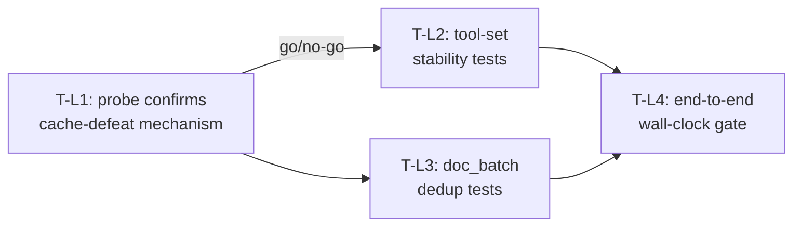

# Local Multi-Turn Tool-Call Latency — Test Plan

Companion to [`llamacpp-multiturn-latency.md`](./llamacpp-multiturn-latency.md). Read that
plan first — this file only defines verification criteria, not rationale.

## 1. Coverage map

| Plan step | Test group | Coverage |
|-----------|-----------|----------|
| Step 1 — confirm cache mechanism | T-L1: isolated slot-cache probe | Direct measurement of prefix-cache hit/miss under varied vs. stable `tools` |
| Step 2 — stabilize tool set | T-L2: `planTurnTools` snapshot + replayed probe | Tool-set stability across a scripted multi-turn transcript; measured prefill-time effect |
| Step 3 — dedup `doc_batch` reads | T-L3: repeat-read shrink + regression | Repeat-read size reduction; no regression to first-read or coverage accounting |
| Step 4 — end-to-end re-verification | T-L4: harness wall-clock gate | Full save-and-query flow completes within the agreed ceiling, twice |

## 2. Test cases

### T-L1.1 — Prefix-cache hit shrinks when `tools` changes turn-to-turn

**Input/setup:** Isolated llama-server instance (own port, own scratch runtime, offline,
same model as the epic's gate runs). A fixed 3-message conversation history (~2-3K tokens,
representative of a real early-conversation size).

Three requests against the same slot, in order:
1. Request A: history + `tools` = profile set X (e.g. `[memory, self, data]`).
2. Request B: history + one appended message + `tools` = profile set Y, a genuinely
   different set (e.g. `[memory, self, data, docgraph, extraction, database, file-edit]`).
3. Request C (control): history + one appended message + `tools` = profile set X again
   (unchanged from request A).

**Expected behavior:** llama-server's reported cached-prefix length (via `/slots` or
verbose log output) for request B is materially shorter than for request C, despite both
being "one turn further" than request A in an otherwise-equivalent way.

**Assertions:**
- Cached-prefix length (tokens) for B < cached-prefix length for C, by a wide margin
  (assert B's hit ratio against total prompt length is under, say, 20%, while C's is over
  80% — exact thresholds set once real numbers are seen; the point is the gap, not a
  specific number).
- Measured wall time for B's request is materially higher than C's, holding output-token
  count roughly equal (bound the model's output with a short deterministic prompt/`max_tokens`
  so the comparison isn't confounded by generation-length variance).

**Edge cases:**
- Repeat the same A/B/C sequence 2-3 times to rule out first-request-cold-cache noise.
- Also test a variant where request B's `tools` differs by only ONE entry (closer to the
  real `capToolsForProvider` budget-trimming case) — confirm even a small tools-array change
  still breaks the prefix match at the point the tools list is rendered, not just "wildly
  different" tool sets.

### T-L2.1 — `planTurnTools()` produces a stable tool set across a scripted transcript

**Input/setup:** A fixed, scripted multi-turn transcript matching the real
document-intelligence save-and-query flow shape: turn 0 (greeting/setup-shaped text), turn 1
(the aggregation+save request), turns 2-5 (follow-up prompts pushing the confirm/query
round-trip, mirroring the existing `document-intelligence-skill-harness.mjs` follow-up
prompts).

**Expected behavior:** After Step 2's stabilization logic, `planTurnTools()`'s returned tool
name set for turns 1-5 is identical (or a strict superset that never drops an
already-attached tool), where before the fix it demonstrably differed turn-to-turn (capture
the "before" snapshot from the unmodified code as a regression fixture).

**Assertions:**
- `[...turnCache.names].sort()` is deep-equal across turns 1-5 (or strictly superset-growing,
  never shrinking or swapping unrelated tools out).
- The "before" fixture (current behavior) fails this same assertion, proving the test has
  teeth (run it against the pre-fix code path first, per the plan's verify-first mandate).

**Edge cases:**
- A transcript where turn 3 pivots to a genuinely unrelated request (e.g. "actually, what's
  the weather" — a hypothetical tool-requiring topic switch) must still attach whatever new
  tool that turn needs; the fix must not cause a real tool-availability regression. Assert
  the newly-needed tool IS present on that turn even though the set didn't shrink.

### T-L2.2 — Stabilization measurably reduces prefill time on the replayed transcript

**Input/setup:** Re-run the T-L1 probe's methodology, but drive it with the T-L2.1
transcript's actual before/after `tools` arrays (pre-fix varying vs. post-fix stable).

**Expected behavior:** Cumulative prefill time across turns 1-5 is materially lower with the
post-fix stable tool set than with the pre-fix varying one, on the same hardware/model.

**Assertions:**
- Total measured wall time (or prefill-specific time, if directly obtainable from
  llama-server) for the 5-turn replay is lower post-fix by a clearly attributable margin
  (not noise-level) — report the actual before/after numbers in the plan's evidence log
  rather than asserting a specific percentage in code, since this is a benchmark, not a unit
  test.

**Edge cases:** none beyond T-L2.1's — this is a measurement pass over the same transcript,
not new transcript coverage.

### T-L3.1 — Repeat `doc_batch` read of an already-read document shrinks

**Input/setup:** A `doc_batch` call reading a known fixture document (fresh session, first
read). A second `doc_batch` call in the same session naming the same document (same
`sha256`).

**Expected behavior:** The second call's result for that document is a short pointer/marker,
not the full document text again.

**Assertions:**
- First read: `result.text` present, full length, `status: "read"`.
- Second read of the same `sha256`: result byte size is at least an order of magnitude
  smaller than the first read's, and clearly indicates "already read this session" (exact
  field/message TBD at implementation time — assert on whatever shape is chosen, not on
  today's placeholder wording).
- A document with a DIFFERENT `sha256` (content changed since the first read, or simply a
  different file) is read in full on every call — dedup never suppresses genuinely new
  content.

**Edge cases:**
- Two different documents that happen to share a `rel_path` across primary/secondary roots
  (the existing "duplicates" mechanism in `doc_manifest`) must not be confused with this
  session-level hash dedup — verify the two mechanisms don't interact incorrectly (a
  `doc_manifest`-level duplicate is a different document identity concept than "already
  read this session").
- A `doc_batch` call spanning a mixed batch (some documents already read, some new) returns
  full text for the new ones and the short pointer for the already-read ones in the same
  response — not all-or-nothing.

### T-L3.2 — No regression to existing `doc_batch`/coverage-accounting behavior

**Input/setup:** Existing `doc_batch` test suites (retrieval, coverage accounting, T-R3/T-R5
gates from the document-intelligence epic).

**Expected behavior:** All existing tests remain green; coverage accounting (found/read/
skipped counts) is unaffected by a document being served from the dedup shortcut instead of
a fresh read — a deduped document still counts as "read" for coverage purposes, since its
content was genuinely retrieved earlier in the session.

**Assertions:** full existing `lib/docgraph`/`doc_batch`-related test suites pass unmodified
in outcome (specific counts may need updating if the dedup shortcut changes a byte-count
assertion — update those, don't loosen them).

### T-L4.1 — Full save-and-query flow completes within the agreed wall-clock ceiling

**Input/setup:** `DOCINT_PHASE=provenance DOCINT_EVALUATION_PROVIDER=llamacpp
LLAMACPP_MODEL=unsloth/gemma-4-E4B-it-qat-GGUF:Q4_K_XL node
trash/plans/document-intelligence-epic/document-intelligence-skill-harness.mjs`, after
Steps 1-3 are implemented.

**Expected behavior:** The harness's grading (already fixed this session to no longer
false-pass) reports `status: "pass"`, and total wall time across all turns is under the
ceiling agreed in the plan (proposed: 10 minutes total, no single turn over 90 seconds —
confirm or revise this number using Step 1's real measurements before treating it as final).

**Assertions:**
- `grading.status === "pass"`.
- Sum of all `results[].wallMs` is under the agreed total ceiling.
- `Math.max(...results.map(r => r.wallMs))` is under the agreed per-turn ceiling.

**Edge cases:** a turn that legitimately needs more time (e.g. a large multi-row INSERT
confirm round-trip) should still fit under the per-turn ceiling if Steps 1-3 worked — if it
doesn't, that's a real finding, not a test to loosen.

### T-L4.2 — Second independent run confirms the first (not a one-off)

**Input/setup:** Immediately re-run T-L4.1's exact command a second time.

**Expected behavior:** Same pass/ceiling result, consistent with T-L4.1 — matching this
epic's own established "confirm, don't trust a single run" convention (see the epic's own
evidence log's repeated "second consecutive pass" entries).

**Assertions:** both runs pass; if they disagree, treat the FASTER one as noise and the
SLOWER one as the real signal, not the other way around — per this plan's own discovery
process, a single fast/lucky run does not prove the fix.

## 3. Test execution order

1. **T-L1** first, always — it is the go/no-go gate for the entire plan. Do not start Step 2
   or 3's implementation until T-L1.1 produces real, measured evidence for the mechanism.
2. **T-L2.1** (unit-testable, no live model needed) can run independent of T-L1's live probe,
   but T-L2.2 (the benchmark) depends on T-L1's probe methodology existing already.
3. **T-L3.1/T-L3.2** are independent of T-L1/T-L2 — they can be implemented and verified in
   parallel with Step 2's work.
4. **T-L4.1/T-L4.2** run last, only after Steps 2 and 3 are both implemented — it is the
   integrated, end-to-end confirmation that the individual fixes actually compose into a
   real user-facing improvement.

## 4. Diagram

## 5. Required setup

- Isolated llama-server instance for T-L1/T-L2.2: own scratch runtime dir, own non-default
  port, offline (preset model already cached), torn down after each probe run — same
  isolation convention as `document-intelligence-red-harness.mjs`/
  `document-intelligence-skill-harness.mjs`.
- Access to llama-server's `/slots` endpoint or verbose/`-lv` logging for cache-hit
  measurement (confirm which is available in the pinned llama.cpp build before writing T-L1;
  fall back to wall-clock-only measurement with a documented caveat if neither exposes a
  direct cache-hit metric).
- The household-gen corpus at `/Users/lk/Projects/household` (T-L4 only, same as the parent
  epic's existing requirement) — confirmed present as of 2026-08-02.
- `unsloth/gemma-4-E4B-it-qat-GGUF:Q4_K_XL` already cached locally (T-L1/T-L2.2/T-L4) — no
  network download should be required to run any test in this file.
