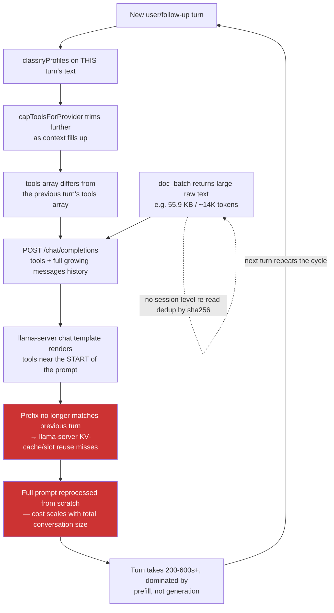

# Local Multi-Turn Tool-Call Latency (llama.cpp)

**Origin:** discovered while re-running WS2 T-G2.3 (issue #250, document-intelligence epic)
after fixing three grading-harness false-pass bugs — see
[`document-intelligence-ws2-tg23-open-issues.md`](../document-intelligence-epic/document-intelligence-ws2-tg23-open-issues.md).
Not itself a document-intelligence bug: the mechanism is general to any multi-turn,
tool-using conversation on the `llamacpp` provider. The document-intelligence save-and-query
flow is this plan's reproducing case and acceptance gate because it's the worst-hit real
product flow (propose→confirm round-trips are structurally required by WS1's design), not
because the cause lives there.
**Companion tests:** [`llamacpp-multiturn-latency-tests.md`](./llamacpp-multiturn-latency-tests.md)
**Status:** not started
**Reset:** 2026-08-02

---

## 1. Objective

Stop Aperio's local multi-turn agent loop from silently defeating llama-server's own
prompt/KV-cache reuse on every turn, so llama.cpp tool-using conversations — starting with
document-intelligence's save-and-query round trip — finish in a time a real user will
tolerate instead of degrading into 5–10+ minute turns as the conversation grows.

## 2. Background — how this was found

Two isolated runs of `document-intelligence-skill-harness.mjs` (`DOCINT_PHASE=provenance`,
`LLAMACPP_MODEL=unsloth/gemma-4-E4B-it-qat-GGUF:Q4_K_XL`, 2026-08-02, same session that
fixed the harness's three grading false-pass bugs) surfaced this before any grading question
was even reached:

- **Run 1**: turn 1 ran for the full 600s timeout and never completed. The model's raw
  output contained a hand-written pseudo-tool-call (`<execute_tool_call>db_execute{...}
  </execute_tool_call>`, with `<|"|>`-style placeholder quote tokens) instead of a real
  structured tool call — degenerate/looping generation, never resolved. `detectToolCallLeak`
  in `lib/tools/executor.js:262-270` does not catch this exact shape (`execute_tool_call`
  defeats the `\b` boundary check after `execute_tool`, and the trailing `</...>` tag defeats
  `extractTextToolCall`'s `\}\s*$` end-anchor) — a real, separate, low-risk regex gap, but
  not the dominant cost driver (see below).
- **Run 2** (immediate re-run, same model/prompt): behaved completely differently — real
  `db_execute` calls, a real confirmed `CREATE TABLE`, and real INSERTs. But turn 4 alone
  took **356,015 ms** to produce 2,409 output tokens against **39,498 input tokens**. At this
  model's observed decode speed (~30 tok/s, from the existing WS2 evidence log), generating
  those output tokens costs ~80–160s — leaving **~200–280s spent reprocessing the prompt**,
  implying roughly **140–165 tok/s prefill throughput**. The exact same arithmetic applied to
  an existing, already-recorded DeepSeek/gemma4 T-G2.3 pass (41,479 input tokens, 367s turn)
  independently yields ~140 tok/s — two independent data points agreeing.
- Also live in run 2: the model re-called `doc_batch` on documents it had already read
  earlier in the same conversation, adding another ~14K tokens (55.9 KB) of raw text on top
  of what was already there, before answering anything.

**Root-cause chain, verified against the code (not just inferred from timing):**

1. `lib/agent/providers/llamacpp.js:134-148` sends `tools` as part of every
   `/chat/completions` request body and never passes `cache_prompt`/`slot_id` — it relies
   entirely on llama-server's own default prefix/slot-based KV-cache reuse. That's fine *if*
   the prompt's prefix is actually stable across requests.
2. It isn't. `ensureTurn()` (`lib/agent/index.js:210-249`) calls `planTurnTools()` fresh every
   turn, and the attached tool set is a function of **that turn's own message text**
   (`classifyProfiles()`, `lib/agent/tool-profiles.js:303`) — turn 0 attached 15/74 schemas,
   turn 1 attached 40/74 in the observed run. `capToolsForProvider`/`computeSchemaTokenCosts`
   (`tool-profiles.js:150-163`) then further trims the set as the context fills up — a
   second, independent source of turn-to-turn variation on top of intent classification.
3. Nearly every tool-calling chat template (gemma's included) renders the tool list near the
   *start* of the actual prompt text, ahead of conversation history. Any difference in that
   list shifts every token that follows it — which invalidates llama-server's prefix match
   for the **entire growing conversation**, not just the new suffix. This happens on every
   turn where the tool set differs, which — given (2) — is close to every turn.
4. Large tool results (a single `doc_batch` call can return tens of KB of raw document text)
   sit in history and get fully resent and, per (3), fully reprocessed on every later turn.
   Nothing currently recognizes "this exact document (by `sha256`) was already read this
   session" and shortens a repeat read.

The result: cost does not stay flat as a multi-turn tool flow progresses — it grows
super-linearly, because the thing that would normally amortize a growing conversation
(prefix-cache reuse) is disabled by the agent loop's own per-turn tool selection, on every
single turn, for the entire conversation up to that point.

## 3. Diagram

## 4. Scope and decisions

### In scope
1. Measuring/confirming the cache-hit-vs-miss mechanism directly against llama-server
   (not just inferring it from wall-clock arithmetic) before changing any Fragile Zone code.
2. Stabilizing the attached tool set for the life of a multi-turn agentic flow instead of
   re-classifying from scratch every turn.
3. Session-level dedup for repeat `doc_batch` reads of the same document (`sha256`), so a
   second read of an already-read document doesn't re-inject the full text.
4. Re-verifying the document-intelligence save-and-query flow (T-G2.3/T-G2.4) against the
   already-fixed grading harness, with an explicit wall-clock acceptance threshold.

### Out of scope (this plan)
- llama-server infra tuning (batch size, flash-attention flags, GPU/Metal offload settings)
  — only pursued if Step 1's measurement points there; not assumed as the fix.
- Any further SKILL.md wording changes — already ruled out this session: the observed
  failures are cache/latency-structural, not a guidance gap.
- The three grading-harness false-pass bugs and the malformed-tool-call regex gap in
  `lib/tools/executor.js` — already fixed / separately tracked; not re-opened here unless
  Step 1 or Step 4 finds them newly relevant.
- Any change to `mcp/index.js`'s `ctx` shape (Fragile Zone; nothing here requires it).

### Locked decisions
- Ask before touching `lib/agent/index.js` or `lib/agent/providers/*` — both Fragile/coupled
  per AGENTS.md's Module Coupling Map (context/tool-routing changes affect every provider).
- No speculative "optimization" without a before/after measurement — per AGENTS.md's
  Performance and Lifecycle Review doctrine, establish the baseline first (Step 1), then
  verify each subsequent step against it.
- Any tool-set-stabilization design must not silently hide a newly-relevant tool from a
  mid-conversation turn that genuinely needs it (e.g. a user pivoting topic mid-flow) —
  correctness of tool availability must not be traded for cache stability.

## 5. Model recommendation

| Work | Model/provider | Est. input/output | Est. cost | Rationale |
|---|---|---:|---:|---|
| Step 1 (instrumentation + measurement) | current session (Sonnet 5) | 20k / 8k | subscription | Requires reading llama-server's own slot/timing behavior and correlating with Aperio's request construction — precision tracing, not bulk edits |
| Step 2 (tool-set stabilization design + implementation) | current session (Sonnet 5), Fragile Zone | 30k / 12k | subscription | Touches `lib/agent/index.js`/`tool-profiles.js`, shared by every provider — ask-first, careful-review work, not delegable to a local model |
| Step 3 (doc_batch dedup) | local capable coding model, review by this session | 20k / 8k | $0 local + subscription review | Bounded, additive change inside `lib/docgraph/retrieval.js` / `docgraphHandlers.js`, not a Fragile Zone |
| Step 4 (re-verification gate) | `unsloth/gemma-4-E4B-it-qat-GGUF:Q4_K_XL` (hero) + isolated harness | n/a | $0 | Matches every prior document-intelligence WS's gate-run model |

## 6. Steps

Each step references its test group in
[`llamacpp-multiturn-latency-tests.md`](./llamacpp-multiturn-latency-tests.md).

### Step 1 — Confirm the cache-hit/miss mechanism directly (T-L1)

Before changing any Fragile Zone code, get direct evidence of the cache-defeat mechanism
rather than relying on wall-clock arithmetic alone. llama-server's `/slots` endpoint and
verbose logging (`--verbose`/`-lv`) can show prompt-cache hit length per request. Build a
small, isolated probe (own scratch runtime, own port, torn down after) that:
- sends a first request with a given `tools` array and a short conversation,
- sends a second request with the SAME conversation history but a DIFFERENT `tools` array
  (mimicking a turn-to-turn profile change),
- sends a third request with the SAME `tools` array and one appended message (the control),
- and compares llama-server's reported cached-prefix length (or measured prefill time) across
  the three.

*Works when:* the probe shows a measurably shorter cache hit (or measurably longer prefill
time) on the varied-`tools` request versus the stable-`tools` control, quantifying exactly
how much of the observed per-turn cost this mechanism accounts for — turning "likely cause"
into a measured one (T-L1.1). If the probe does NOT show a meaningful difference, this
plan's hypothesis is wrong and Steps 2–4 must be reconsidered before proceeding, not pushed
through anyway.

### Step 2 — Stabilize the tool set across a multi-turn agentic flow (T-L2)

Design (ask before implementing against `lib/agent/index.js`/`tool-profiles.js`, per AGENTS.md):
once a conversation's tool profile set is established for a turn, keep it stable for
subsequent turns of the same flow rather than fully re-classifying from each new message —
e.g. union-in newly-relevant profiles rather than recomputing the set from scratch, or pin
the set for N follow-up turns after a tool-using turn. Must not suppress a genuinely new,
unrelated request mid-conversation (see locked decisions).

*Works when:* a scripted multi-turn conversation that would previously have produced a
different `tools` array on turns 2–4 now produces an identical (or measurably more stable)
array across those turns, verified by a unit test snapshotting `planTurnTools()`'s output
per turn against a fixed transcript (T-L2.1), and the T-L1 probe's before/after prefill-time
comparison shows a real reduction when replayed against the same varied-intent transcript
(T-L2.2).

### Step 3 — Deduplicate repeat `doc_batch` reads within a session (T-L3)

In `lib/docgraph/retrieval.js`'s `retrieveInBatches` (or the calling handler,
`lib/handlers/docgraph/docgraphHandlers.js:80`'s `_batch`), track which `sha256` values have
already been returned with full text this session and, on a repeat request for the same
hash, return a short pointer (e.g. "already read in this conversation, see above — do not
re-request") instead of the full text again.

*Works when:* a scripted repeat `doc_batch` call for a document already read earlier in the
same session returns a result at least an order of magnitude smaller than the original read,
the first read of any document is unaffected, and existing `doc_batch`/coverage-accounting
tests remain green (T-L3.1–T-L3.2).

### Step 4 — Re-verify the document-intelligence save-and-query flow with a wall-clock gate (T-L4)

Re-run `DOCINT_PHASE=provenance DOCINT_EVALUATION_PROVIDER=llamacpp
LLAMACPP_MODEL=unsloth/gemma-4-E4B-it-qat-GGUF:Q4_K_XL
node trash/plans/document-intelligence-epic/document-intelligence-skill-harness.mjs`
(the harness's grading logic was already fixed this session — see the epic's own evidence
log, 2026-08-02 — so a `pass` here is a real pass, not a false one). Add an explicit
wall-clock assertion to the harness/grading (not just correctness): total session time and
per-turn time must fall under an agreed threshold.

*Works when:* the full save-and-query flow (propose → confirm → CREATE TABLE → INSERT →
confirm → `db_query` → narrated total) completes end-to-end within an agreed ceiling — pick
one before starting (this plan proposes **under 10 minutes total, no single turn over 90
seconds**, matching the developer's own stated tolerance; adjust if evidence from Step 1
shows a different number is realistic on this hardware) — and `grading.status` is a genuine
`pass` per the fixed grader (T-L4.1). Run twice to rule out a one-off (T-L4.2), consistent
with this epic's own "confirm, don't trust a single run" convention.

## 7. Risks

| Risk | Mitigation |
|---|---|
| The cache-defeat hypothesis is only part of the story (e.g. hardware/quantization prefill speed is the real ceiling) | Step 1 measures directly before committing to Steps 2–3; if the probe doesn't show the effect, stop and reconsider |
| Stabilizing the tool set hides a tool a later, genuinely different turn needs | T-L2.1's transcript must include a topic-pivot case; the design must widen, not just freeze, the set |
| `doc_batch` dedup silently withholds content a later turn actually needs re-verified (e.g. after an edit) | Dedup keys strictly on `sha256`; any content change produces a new hash and a full re-read, by construction |
| Changes to `lib/agent/index.js`/`tool-profiles.js` regress an unrelated provider (Anthropic/DeepSeek/Codex all share this turn-planning code) | Full regression suite run after Step 2, not just llamacpp-specific tests; ask-first per AGENTS.md before editing |
| A wall-clock gate is inherently machine-dependent and flaky in CI | T-L4 is a manual/isolated-harness gate on the developer's own hardware, not a CI assertion; document the measured hardware alongside the result |

## 8. Documentation updates

Do not write these until implementation changes behavior and the developer confirms:

| Change | Candidate updates |
|---|---|
| Tool-set stabilization behavior | `id/reference/architecture.md` (agent loop section), `CHANGELOG.md` |
| `doc_batch` dedup behavior | `id/reference/mcp-tools.md` (doc_batch description), `CHANGELOG.md` |
| Any newly-documented local-model latency expectation | `id/reference/troubleshooting.md`, `id/reference/tech-debt.md` if a residual gap remains |

## 9. Evidence log

| Date | Gate | Result |
|---|---|---|
| 2026-08-02 | discovery, run 1 | gemma4 T-G2.3 provenance run: turn 1 ran the full 600s timeout and never completed — model emitted a malformed pseudo-tool-call (`<execute_tool_call>db_execute{...}</execute_tool_call>`) instead of a real tool call; a real, separate `lib/tools/executor.js` leak-regex gap, but not the dominant cost driver. |
| 2026-08-02 | discovery, run 2 (immediate re-run, same model/prompt) | Behaved differently — real `db_execute` calls, a real confirmed `CREATE TABLE`, real INSERTs. Turns 1-3 completed in 412s/354s/356s each (turn 3: 39,498 input tokens, 2,409 output tokens — arithmetic implies ~140-165 tok/s prefill, dominating the turn). Turn 4 (asked only to run a `SELECT`) then hit the full 600s timeout anyway, and turns 5-6 came back empty (same broken-connection-after-timeout pattern as run 1). Total session time ≈29 minutes; still never reached a real `db_query` with rows. Confirms the cost is not a one-off — it grows with the conversation and eventually consumes even a "simple" turn. Root-caused (not yet fixed) to per-turn tool-schema volatility defeating llama-server's prefix/KV-cache reuse, compounded by un-deduplicated large `doc_batch` re-reads (the model re-read an already-read 55.9 KB document mid-conversation in run 2). Plan written for a future session; nothing implemented yet. |
