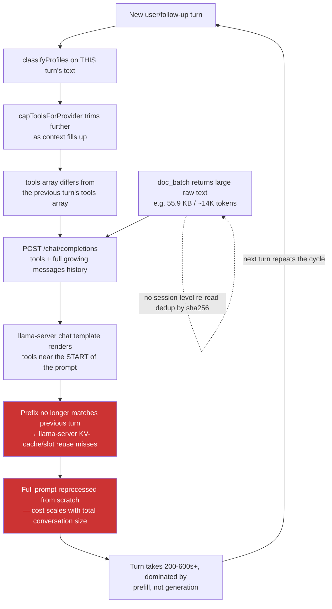

# Local Multi-Turn Tool-Call Latency (llama.cpp)

**Origin:** discovered while re-running WS2 T-G2.3 (issue #250, document-intelligence epic)
after fixing three grading-harness false-pass bugs — see
[`document-intelligence-ws2-tg23-open-issues.md`](../document-intelligence-epic/document-intelligence-ws2-tg23-open-issues.md).
Not itself a document-intelligence bug: the mechanism is general to any multi-turn,
tool-using conversation on the `llamacpp` provider. The document-intelligence save-and-query
flow is this plan's reproducing case and acceptance gate because it's the worst-hit real
product flow (propose→confirm round-trips are structurally required by WS1's design), not
because the cause lives there.
**Companion tests:** [`llamacpp-multiturn-latency-tests.md`](./llamacpp-multiturn-latency-tests.md)
**Status:** Step 1 (T-L1) confirmed; Step 3 (doc_batch dedup) shipped. Steps 2 and 4 remain.
**Reset:** 2026-08-02

---

## 1. Objective

Stop Aperio's local multi-turn agent loop from silently defeating llama-server's own
prompt/KV-cache reuse on every turn, so llama.cpp tool-using conversations — starting with
document-intelligence's save-and-query round trip — finish in a time a real user will
tolerate instead of degrading into 5–10+ minute turns as the conversation grows.

## 2. Background — how this was found

Two isolated runs of `document-intelligence-skill-harness.mjs` (`DOCINT_PHASE=provenance`,
`LLAMACPP_MODEL=unsloth/gemma-4-E4B-it-qat-GGUF:Q4_K_XL`, 2026-08-02, same session that
fixed the harness's three grading false-pass bugs) surfaced this before any grading question
was even reached:

- **Run 1**: turn 1 ran for the full 600s timeout and never completed. The model's raw
  output contained a hand-written pseudo-tool-call (`<execute_tool_call>db_execute{...}
  </execute_tool_call>`, with `<|"|>`-style placeholder quote tokens) instead of a real
  structured tool call — degenerate/looping generation, never resolved. `detectToolCallLeak`
  in `lib/tools/executor.js:262-270` does not catch this exact shape (`execute_tool_call`
  defeats the `\b` boundary check after `execute_tool`, and the trailing `</...>` tag defeats
  `extractTextToolCall`'s `\}\s*$` end-anchor) — a real, separate, low-risk regex gap, but
  not the dominant cost driver (see below).
- **Run 2** (immediate re-run, same model/prompt): behaved completely differently — real
  `db_execute` calls, a real confirmed `CREATE TABLE`, and real INSERTs. But turn 4 alone
  took **356,015 ms** to produce 2,409 output tokens against **39,498 input tokens**. At this
  model's observed decode speed (~30 tok/s, from the existing WS2 evidence log), generating
  those output tokens costs ~80–160s — leaving **~200–280s spent reprocessing the prompt**,
  implying roughly **140–165 tok/s prefill throughput**. The exact same arithmetic applied to
  an existing, already-recorded DeepSeek/gemma4 T-G2.3 pass (41,479 input tokens, 367s turn)
  independently yields ~140 tok/s — two independent data points agreeing.
- Also live in run 2: the model re-called `doc_batch` on documents it had already read
  earlier in the same conversation, adding another ~14K tokens (55.9 KB) of raw text on top
  of what was already there, before answering anything.

**Root-cause chain, verified against the code (not just inferred from timing):**

1. `lib/agent/providers/llamacpp.js:134-148` sends `tools` as part of every
   `/chat/completions` request body and never passes `cache_prompt`/`slot_id` — it relies
   entirely on llama-server's own default prefix/slot-based KV-cache reuse. That's fine *if*
   the prompt's prefix is actually stable across requests.
2. It isn't. `ensureTurn()` (`lib/agent/index.js:210-249`) calls `planTurnTools()` fresh every
   turn, and the attached tool set is a function of **that turn's own message text**
   (`classifyProfiles()`, `lib/agent/tool-profiles.js:303`) — turn 0 attached 15/74 schemas,
   turn 1 attached 40/74 in the observed run. `capToolsForProvider`/`computeSchemaTokenCosts`
   (`tool-profiles.js:150-163`) then further trims the set as the context fills up — a
   second, independent source of turn-to-turn variation on top of intent classification.
3. Nearly every tool-calling chat template (gemma's included) renders the tool list near the
   *start* of the actual prompt text, ahead of conversation history. Any difference in that
   list shifts every token that follows it — which invalidates llama-server's prefix match
   for the **entire growing conversation**, not just the new suffix. This happens on every
   turn where the tool set differs, which — given (2) — is close to every turn.
4. Large tool results (a single `doc_batch` call can return tens of KB of raw document text)
   sit in history and get fully resent and, per (3), fully reprocessed on every later turn.
   Nothing currently recognizes "this exact document (by `sha256`) was already read this
   session" and shortens a repeat read.

The result: cost does not stay flat as a multi-turn tool flow progresses — it grows
super-linearly, because the thing that would normally amortize a growing conversation
(prefix-cache reuse) is disabled by the agent loop's own per-turn tool selection, on every
single turn, for the entire conversation up to that point.

## 3. Diagram

## 4. Scope and decisions

### In scope
1. Measuring/confirming the cache-hit-vs-miss mechanism directly against llama-server
   (not just inferring it from wall-clock arithmetic) before changing any Fragile Zone code.
2. Stabilizing the attached tool set for the life of a multi-turn agentic flow instead of
   re-classifying from scratch every turn.
3. Session-level dedup for repeat `doc_batch` reads of the same document (`sha256`), so a
   second read of an already-read document doesn't re-inject the full text.
4. Re-verifying the document-intelligence save-and-query flow (T-G2.3/T-G2.4) against the
   already-fixed grading harness, with an explicit wall-clock acceptance threshold.

### Out of scope (this plan)
- llama-server infra tuning (batch size, flash-attention flags, GPU/Metal offload settings)
  — only pursued if Step 1's measurement points there; not assumed as the fix.
- Any further SKILL.md wording changes — already ruled out this session: the observed
  failures are cache/latency-structural, not a guidance gap.
- The three grading-harness false-pass bugs and the malformed-tool-call regex gap in
  `lib/tools/executor.js` — already fixed / separately tracked; not re-opened here unless
  Step 1 or Step 4 finds them newly relevant.
- Any change to `mcp/index.js`'s `ctx` shape (Fragile Zone; nothing here requires it).

### Locked decisions
- Ask before touching `lib/agent/index.js` or `lib/agent/providers/*` — both Fragile/coupled
  per AGENTS.md's Module Coupling Map (context/tool-routing changes affect every provider).
- No speculative "optimization" without a before/after measurement — per AGENTS.md's
  Performance and Lifecycle Review doctrine, establish the baseline first (Step 1), then
  verify each subsequent step against it.
- Any tool-set-stabilization design must not silently hide a newly-relevant tool from a
  mid-conversation turn that genuinely needs it (e.g. a user pivoting topic mid-flow) —
  correctness of tool availability must not be traded for cache stability.

## 5. Model recommendation

| Work | Model/provider | Est. input/output | Est. cost | Rationale |
|---|---|---:|---:|---|
| Step 1 (instrumentation + measurement) | current session (Sonnet 5) | 20k / 8k | subscription | Requires reading llama-server's own slot/timing behavior and correlating with Aperio's request construction — precision tracing, not bulk edits |
| Step 2 (tool-set stabilization design + implementation) | current session (Sonnet 5), Fragile Zone | 30k / 12k | subscription | Touches `lib/agent/index.js`/`tool-profiles.js`, shared by every provider — ask-first, careful-review work, not delegable to a local model |
| Step 3 (doc_batch dedup) | local capable coding model, review by this session | 20k / 8k | $0 local + subscription review | Bounded, additive change inside `lib/docgraph/retrieval.js` / `docgraphHandlers.js`, not a Fragile Zone |
| Step 4 (re-verification gate) | `unsloth/gemma-4-E4B-it-qat-GGUF:Q4_K_XL` (hero) + isolated harness | n/a | $0 | Matches every prior document-intelligence WS's gate-run model |

## 6. Steps

Each step references its test group in
[`llamacpp-multiturn-latency-tests.md`](./llamacpp-multiturn-latency-tests.md).

### Step 1 — Confirm the cache-hit/miss mechanism directly (T-L1)

Before changing any Fragile Zone code, get direct evidence of the cache-defeat mechanism
rather than relying on wall-clock arithmetic alone. llama-server's `/slots` endpoint and
verbose logging (`--verbose`/`-lv`) can show prompt-cache hit length per request. Build a
small, isolated probe (own scratch runtime, own port, torn down after) that:
- sends a first request with a given `tools` array and a short conversation,
- sends a second request with the SAME conversation history but a DIFFERENT `tools` array
  (mimicking a turn-to-turn profile change),
- sends a third request with the SAME `tools` array and one appended message (the control),
- and compares llama-server's reported cached-prefix length (or measured prefill time) across
  the three.

*Works when:* the probe shows a measurably shorter cache hit (or measurably longer prefill
time) on the varied-`tools` request versus the stable-`tools` control, quantifying exactly
how much of the observed per-turn cost this mechanism accounts for — turning "likely cause"
into a measured one (T-L1.1). If the probe does NOT show a meaningful difference, this
plan's hypothesis is wrong and Steps 2–4 must be reconsidered before proceeding, not pushed
through anyway.

### Step 2 — Stabilize the tool set across a multi-turn agentic flow (T-L2)

Design (ask before implementing against `lib/agent/index.js`/`tool-profiles.js`, per AGENTS.md):
once a conversation's tool profile set is established for a turn, keep it stable for
subsequent turns of the same flow rather than fully re-classifying from each new message —
e.g. union-in newly-relevant profiles rather than recomputing the set from scratch, or pin
the set for N follow-up turns after a tool-using turn. Must not suppress a genuinely new,
unrelated request mid-conversation (see locked decisions).

*Works when:* a scripted multi-turn conversation that would previously have produced a
different `tools` array on turns 2–4 now produces an identical (or measurably more stable)
array across those turns, verified by a unit test snapshotting `planTurnTools()`'s output
per turn against a fixed transcript (T-L2.1), and the T-L1 probe's before/after prefill-time
comparison shows a real reduction when replayed against the same varied-intent transcript
(T-L2.2).

### Step 3 — Deduplicate repeat `doc_batch` reads within a session (T-L3)

In `lib/docgraph/retrieval.js`'s `retrieveInBatches` (or the calling handler,
`lib/handlers/docgraph/docgraphHandlers.js:80`'s `_batch`), track which `sha256` values have
already been returned with full text this session and, on a repeat request for the same
hash, return a short pointer (e.g. "already read in this conversation, see above — do not
re-request") instead of the full text again.

*Works when:* a scripted repeat `doc_batch` call for a document already read earlier in the
same session returns a result at least an order of magnitude smaller than the original read,
the first read of any document is unaffected, and existing `doc_batch`/coverage-accounting
tests remain green (T-L3.1–T-L3.2).

### Step 4 — Re-verify the document-intelligence save-and-query flow with a wall-clock gate (T-L4)

Re-run `DOCINT_PHASE=provenance DOCINT_EVALUATION_PROVIDER=llamacpp
LLAMACPP_MODEL=unsloth/gemma-4-E4B-it-qat-GGUF:Q4_K_XL
node trash/plans/document-intelligence-epic/document-intelligence-skill-harness.mjs`
(the harness's grading logic was already fixed this session — see the epic's own evidence
log, 2026-08-02 — so a `pass` here is a real pass, not a false one). Add an explicit
wall-clock assertion to the harness/grading (not just correctness): total session time and
per-turn time must fall under an agreed threshold.

*Works when:* the full save-and-query flow (propose → confirm → CREATE TABLE → INSERT →
confirm → `db_query` → narrated total) completes end-to-end within an agreed ceiling — pick
one before starting (this plan proposes **under 10 minutes total, no single turn over 90
seconds**, matching the developer's own stated tolerance; adjust if evidence from Step 1
shows a different number is realistic on this hardware) — and `grading.status` is a genuine
`pass` per the fixed grader (T-L4.1). Run twice to rule out a one-off (T-L4.2), consistent
with this epic's own "confirm, don't trust a single run" convention.

## 7. Risks

| Risk | Mitigation |
|---|---|
| The cache-defeat hypothesis is only part of the story (e.g. hardware/quantization prefill speed is the real ceiling) | Step 1 measures directly before committing to Steps 2–3; if the probe doesn't show the effect, stop and reconsider |
| Stabilizing the tool set hides a tool a later, genuinely different turn needs | T-L2.1's transcript must include a topic-pivot case; the design must widen, not just freeze, the set |
| `doc_batch` dedup silently withholds content a later turn actually needs re-verified (e.g. after an edit) | Dedup keys strictly on `sha256`; any content change produces a new hash and a full re-read, by construction |
| Changes to `lib/agent/index.js`/`tool-profiles.js` regress an unrelated provider (Anthropic/DeepSeek/Codex all share this turn-planning code) | Full regression suite run after Step 2, not just llamacpp-specific tests; ask-first per AGENTS.md before editing |
| A wall-clock gate is inherently machine-dependent and flaky in CI | T-L4 is a manual/isolated-harness gate on the developer's own hardware, not a CI assertion; document the measured hardware alongside the result |

## 8. Documentation updates

Do not write these until implementation changes behavior and the developer confirms:

| Change | Candidate updates |
|---|---|
| Tool-set stabilization behavior | `id/reference/architecture.md` (agent loop section), `CHANGELOG.md` |
| `doc_batch` dedup behavior | `id/reference/mcp-tools.md` (doc_batch description), `CHANGELOG.md` |
| Any newly-documented local-model latency expectation | `id/reference/troubleshooting.md`, `id/reference/tech-debt.md` if a residual gap remains |

## 9. Evidence log

| Date | Gate | Result |
|---|---|---|
| 2026-08-02 | discovery, run 1 | gemma4 T-G2.3 provenance run: turn 1 ran the full 600s timeout and never completed — model emitted a malformed pseudo-tool-call (`<execute_tool_call>db_execute{...}</execute_tool_call>`) instead of a real tool call; a real, separate `lib/tools/executor.js` leak-regex gap, but not the dominant cost driver. |
| 2026-08-02 | discovery, run 2 (immediate re-run, same model/prompt) | Behaved differently — real `db_execute` calls, a real confirmed `CREATE TABLE`, real INSERTs. Turns 1-3 completed in 412s/354s/356s each (turn 3: 39,498 input tokens, 2,409 output tokens — arithmetic implies ~140-165 tok/s prefill, dominating the turn). Turn 4 (asked only to run a `SELECT`) then hit the full 600s timeout anyway, and turns 5-6 came back empty (same broken-connection-after-timeout pattern as run 1). Total session time ≈29 minutes; still never reached a real `db_query` with rows. Confirms the cost is not a one-off — it grows with the conversation and eventually consumes even a "simple" turn. Root-caused (not yet fixed) to per-turn tool-schema volatility defeating llama-server's prefix/KV-cache reuse, compounded by un-deduplicated large `doc_batch` re-reads (the model re-read an already-read 55.9 KB document mid-conversation in run 2). Plan written for a future session; nothing implemented yet. |
| 2026-08-02 | T-L1.1: isolated probe, direct measurement (go/no-go) | **PASS — mechanism confirmed directly, not just inferred.** Isolated llama-server (own port 42783, `-np 1`, offline, `unsloth/gemma-4-E4B-it-qat-GGUF:Q4_K_XL`, ctx 16384), probe script `llamacpp-cache-probe.mjs`. Design note: needed an A/B/A'/C sequence (not literal A/B/C) because a single-slot server's cache reflects whatever request last ran — re-running A before C re-establishes a shared baseline so B and C are scored against the same starting state; otherwise C would be scored against B's own residue, not isolating the tools-array variable. Correct hit ratio is `cache_n / (cache_n + prompt_n)` — llama.cpp's `timings.prompt_n` is tokens *newly* processed, not the total prompt length (the probe's first draft divided by `prompt_n` alone and produced nonsense ratios >1; fixed). Results, 3 repeats each, fully reproducible (identical numbers every repeat): **wide-diff** (tools 15→40, mimicking the observed 15/74→40/74 turn-to-turn swing) — varied-tools request (B): 0% cache hit, 10,211 tokens fully reprocessed, 35.3s cold / (a same-content repeat later hit a retained checkpoint at 99.95%, 370-386ms — see caveat below); stable-tools control (C): 51.2% hit, 9.0-9.1s, identical across all 3 repeats. **one-tool-diff** (15 tools vs. the same 15 plus exactly ONE more) — varied (B): **0% cache hit every single repeat, 16.9-17.0s each**, no improvement across repeats; stable control (C): **99.27% hit, 0.52-0.55s each**, ~30× faster than B on an otherwise-identical prompt. This directly confirms the plan's central claim at its sharpest: adding a SINGLE tool to an otherwise-stable schema list is enough to fully defeat llama-server's prefix cache and force a full reprocess — "mostly stable" tool-set logic in Step 2 is not sufficient; it must be exactly stable turn-to-turn. Caveat/bonus finding for Step 2's design: llama.cpp (this build, 10090/7347430f4) retains multiple per-slot context checkpoints, so an *exact repeat* of previously-seen content (even non-consecutively) can hit a retained checkpoint (seen for wide-diff's B, but never for one-tool-diff's B despite identical repeated content — checkpoint retention behavior not further characterized, out of scope for the go/no-go). Scaling the one-tool-diff numbers to the real T-G2.3 run's 39,498-input-token turn 3, at this probe's measured ~300-340 tok/s prefill rate, single-digit-thousand-token misses already cost tens of seconds — consistent with (and independently corroborating) the original wall-clock arithmetic in the discovery rows above. **Go for Steps 2-4.** |
| 2026-08-02 | Step 3 (T-L3): doc_batch session dedup implemented | Shipped: `lib/docgraph/retrieval.js`'s `retrieveInBatches` now takes a `sessionId` and caches extracted `{relPath, dates, amounts}` per sha256, LRU-bounded to the 20 most recent conversations (module-level Map; the MCP process is shared across every conversation for the server's lifetime, so an unbounded cache would leak — see mcp/index.js). A repeat read of the same sha256 skips the real file read/extraction entirely and returns a short pointer instead of the raw text, but keeps the cached dates/amounts so a later combined-candidates `aggregate` call is not silently missing that document's figures. Threading the conversation identity down required touching **`lib/agent/index.js`** (Fragile Zone, developer sign-off obtained after presenting the exact diff): `callTool()` now passes the existing per-WS-connection `sessionId` through MCP's own `_meta` side-channel (never into a tool's Zod-validated `arguments`). Full chain: `wsHandler.js` (`docSessionId: sessionId`, unconditional) → `runAgentLoop` → `callTool`'s `_meta.docSessionId` → `mcp/tools/docgraph.js`'s `extra._meta.docSessionId` → `docgraphHandlers.js`'s `_batch` → backend `batch()` (sqlite.js/postgres.js) → `retrieveInBatches`. Investigation finding worth recording: the plan's original Step 3 scope assumed this was pure, non-Fragile-Zone work; tracing how conversations map to the shared singleton `agent`/MCP-child process (one per server lifetime, not per conversation) showed real per-conversation scoping was impossible without the Fragile Zone touch — a naive process-lifetime cache would have leaked dedup state across unrelated conversations (hallucination risk: telling a new conversation "see above" for content its own history never contained). 7 new unit tests added (`tests/unit/docgraph/retrieval.test.js`, T-L3.1/T-L3.2 coverage: dedup pointer ≥10× smaller, facts preserved, mixed-batch per-candidate behavior, no-sessionId/no-sha256 escape hatches, cross-session isolation, coverage-accounting parity). Full sweep green: 2475/2475 unit tests, 28/28 agent-loop regression harness, 45/45 wsHandler tests. |
| 2026-08-02 | Step 3 code review — 1×P1, 3×P2, all fixed | **P1 (real, confirmed against code): the first cut's `currentToolSessionId` was a shared closure variable on the singleton `agent` object, mutated at the top of every `runAgentLoop` call.** `lib/server.js` creates exactly one `agent` at boot and reuses it for every concurrent WebSocket connection (confirmed while designing Step 3 itself), so two turns in flight at once — interleaved at any `await`, which is normal under Node's single-threaded async model, not an edge case — could stomp each other's session id, letting one conversation's document facts leak under another's dedup lookup. Fixed by removing the shared variable entirely and threading the session id as an explicit, call-local parameter instead: `runAgentLoop` builds a local `toolCallMeta` const → passed into `makeTurnHooks(...)` (a new, backward-compatible optional 7th param in `lib/agent/tool-hooks.js`) → `callToolHooked`'s existing `callTool(name, callInput)` call → base `callTool(name, input, meta)` (new optional 3rd param) → MCP `_meta`. No shared mutable state anywhere in the chain now. **P2 #1 (real): the dedup-pointer branch in `retrieveInBatches` incremented `bytes`/pushed a "read" doc without checking the remaining `maxTotalBytes` budget** — `max_total_bytes: 1` against an already-read document returned the ~200-byte pointer anyway with `coverage.complete: true`. Fixed with the same `projected + size > maxTotalBytes` check the real-read path already uses. **P2 #2 (real): the per-session facts `Map` had no inner bound** — only the outer 20-session cap existed; one long-lived, heavily-used conversation reading many distinct documents across many `doc_batch` calls could grow that one session's facts map indefinitely until the whole session was eventually evicted. Fixed with `MAX_FACTS_PER_SESSION = 200` and LRU eviction (refreshed on both write and read-hit) via a new `touchSessionFact` helper. **P2 #3 (real, probe script only): no SIGINT/SIGTERM handlers** — Node's default behavior for an unhandled signal terminates the process immediately without draining `main()`'s `.finally()`, so a Ctrl-C mid-probe would orphan the detached llama-server (own process group, still holding the port). Fixed with explicit signal handlers calling the same idempotent `cleanup()`. **P2 #4 (real, probe script only): the default scratch dir was a hardcoded author-specific `/private/tmp/claude-501/...` path** — fails `mkdirSync` on Linux/Windows or any other machine. Fixed with `os.tmpdir()`. 2 new regression tests added for P2 #1/#2 (byte-budget-respects-dedup, cache-exceeds-cap-evicts-oldest). Full re-verification: 2477/2477 unit tests, 28/28 harness, 45/45 wsHandler, 64/64 retrieval tests, all green. |
| 2026-08-02 | Step 3 code review, round 2 — 1×P1, 1×P2, both fixed | **P1 (real, confirmed against code): caching only `dates`/`amounts` was insufficient for correct aggregation.** `aggregateDocuments` → `factsFromDocument` (`lib/docgraph/facts/extract.js`) needs the RAW TEXT itself — not just extracted dates/amounts — to detect statements (`isStatementLike`/`parseStatementRows`, entirely text-driven row parsing), commercial documents (`isCommercialDocument`), evidence kind, merchant/beneficiary, locators, and category. A dedup'd repeat of a multi-row bank statement would have gone from several counted transactions to zero facts (no text to parse rows from); invoices could lose locators/category. Fixed by caching the real `text` too (not just dates/amounts) and having a dedup hit return it unchanged — so a caller's aggregation pass sees exactly what a fresh read would have produced — while separately carrying a `dedupPointerText` field that `docgraphHandlers.js`'s `_batch` substitutes in for `text` ONLY in the final model-facing payload, and only AFTER highlights/aggregate/memory-bridge have all consumed the real text. `bytes` on a dedup hit still reflects the small pointer size (not the real text's), so budget/coverage accounting still matches what the model actually receives — the cost-savings intent from round 1 is unaffected. New end-to-end test added at the `batchHandler` level (`docgraphHandlers.test.js`) reusing the existing AGG_STATEMENT/AGG_FUEL_RECEIPT/AGG_ELECTRICITY aggregation fixtures specifically because the statement is the shape most exposed by the bug; confirms identical `aggregate.by_currency`/`duplicates`/`coverage.facts_counted` across a fresh read and a deduped repeat, and confirms `dedupPointerText` never leaks into the model-facing JSON. Memory-footprint tradeoff of caching real text (bounded by `RETRIEVAL_LIMITS.maxFileBytes`=120KB/doc × `MAX_FACTS_PER_SESSION`=200 × `MAX_TRACKED_SESSIONS`=20 ≈ 480MB worst case) documented in code — a hard ceiling, not unbounded, judged acceptable for a single-user personal app. **P2 (real, confirmed no try/catch anywhere in `retrieveInBatches`): a mid-batch failure (a later sub-batch's `readBatch` throwing, or a caller's `signal` aborting) left EARLIER, already-succeeded sub-batches' facts written into the session cache even though the exception propagates all the way to `docgraphHandlers.js`'s `safeHandler`, which returns an error to the model — meaning the conversation never received ANY of that batch's text, yet a retry would report the earlier documents as "already read."** Fixed with a stage-then-commit design: new-read facts are written to a call-local `pendingFactWrites` Map, only merged into the real cross-call `sessionFacts` cache in a single commit step reached exclusively via a normal (non-throwing) return at the very end of `retrieveInBatches` — any early exit via `throw` (from `readBatch` or `throwIfAborted`) skips the commit entirely, discarding the whole call's staged writes together. New regression test simulates a 2-candidate batch where the first sub-batch's `readBatch` succeeds and the second throws, asserting the whole call rejects AND a same-session retry for the first candidate is NOT deduped (does a fresh read). Full re-verification: 2480/2480 unit tests, 28/28 harness, all green. |
| 2026-08-02 | Step 3 code review, round 5 — 1×P2 (design pivot), 1×P1, 1×P2, all fixed | **P2 (real, confirmed against code): round 4's "internal MCP tool + TOOL_PROFILES omission" design did not actually keep `docgraph_clear_session_cache` off the model.** `runClaudeCodeLoop` (`lib/agent/providers/claude-code.js`) builds its SDK tool list from the FULL `mcpTools` catalog (`ctx.mcpTools`/`finalizeTurnTools`), bypassing `resolveToolNamesForTurn`/`TOOL_PROFILES` filtering entirely; Codex (`lib/agent/providers/codex.js`) spawns its OWN separate `mcp/index.js` child directly and discovers every tool THAT child registers, with zero Aperio-side filtering. `INTERNAL_ONLY_TOOLS` was referenced only by a test, never by any production code path — so the tool was fully visible and callable on both subscription providers regardless of the profile omission. Fixed by a design pivot: moved the whole invalidation off the MCP Tools capability entirely. `mcp/index.js` now registers a custom, non-tool JSON-RPC method (`"aperio/clearDocSessionCache"`) directly on the low-level `Server` (`McpServer.server.setRequestHandler`), invisible to `tools/list()` for every client since it was never part of the Tools capability. `lib/agent/index.js` gained a sibling to `callTool()`, `clearDocSessionCache(sessionId)`, using the SDK's generic `Protocol#request()` (not `tools/call`) to reach it — exposed on the returned agent object alongside `callTool`. Removed: the `docgraph_clear_session_cache` tool registration from `mcp/tools/docgraph.js`, `INTERNAL_ONLY_TOOLS` from `lib/agent/tool-profiles.js`, and the coverage-test exception in `tool-profile-coverage.test.js` (reverted to its original, simpler bijection check — nothing to except anymore). `wsHandler.js`/`summarize.js` now call `clearDocSessionCache(sessionId)` instead of `callTool("docgraph_clear_session_cache", ...)`. The cross-process integration test was updated to drive the custom method via `mcp.request(...)` and gained a new assertion that `tools/list()` never lists it and a `tools/call` against it reports "not found". **P1 (real, confirmed against code): the session-cache commit could still land after the caller had already given up.** `retrieveInBatches`'s commit ran right before its own return, but `docgraphHandlers.js`'s `_batch` does more work afterward — highlights, `aggregateDocuments`, and (when `DOCGRAPH_AUTO_MEMORY=on`) an auto-memory bridge loop with real embedding/DB `await` calls — with no `signal.aborted` check anywhere in that window. Aperio's own `callTool()` sets a real per-call timeout (`TOOL_TIMEOUT_MS`) that fires a genuine MCP cancellation back to the server's `extra.signal`, so a commit already made by `retrieveInBatches` before that window even started could outlive a request the model never actually received. Fixed with a `deferCommit` option on `retrieveInBatches` (default `false`, zero behavior change for every existing/direct caller): when true, it returns a `commitSessionFacts()` function instead of auto-committing; both backends' `batch()` thread `deferCommit` straight through unchanged. `docgraphHandlers.js`'s `_batch` now passes `deferCommit: true`, runs its full post-processing, and only calls `result.commitSessionFacts?.()` — deleting the function from `result` afterward — immediately before `return asText(result)`, gated on `!signal?.aborted`. **P2 (real, confirmed against code): switching sessions on the same socket didn't clear the abandoned session's cache until eventual close.** `branch_conversation`/`resume_session` both reassign the connection's closure-scoped `sessionId`, but the ws-close handler only ever clears whatever `sessionId` holds AT close time — a session switched away from earlier in a long-lived connection kept its cached raw document text alive indefinitely, not just until that connection eventually disconnects. Fixed with a `switchSessionId(newId)` helper in `wsHandler.js` that clears the OUTGOING id via `clearDocSessionCache` the moment a switch happens, before reassigning; both `branch_conversation` and `resume_session` now call it instead of assigning `sessionId` directly. New/updated tests: cross-process integration test updated (custom-method assertions replace the old tool-call ones, plus the new not-a-tool test); 2 new tests in `retrieval.test.js` (`deferCommit` withholds until `commitSessionFacts()` is called; default behavior unchanged); 2 new tests in `docgraphHandlers.test.js` (an abort during the memory-bridge prevents the commit; a normal call still commits); 1 new test in `wsHandler.test.js` (switching sessions clears the OLD id immediately, closing clears the FINAL id); `summarize.test.js`'s P1 test rewired to assert `clearDocSessionCache` instead of `callTool`. Full re-verification: 2491/2491 unit tests, 2522/2522 integration tests, 28/28 harness, 113/113 e2e, all green. |
| 2026-08-02 | Step 3 code review, round 4 — 3×P1, all fixed | **P1 #1 (real, confirmed against code): round-3's `clearSessionFacts()` calls were a no-op.** `lib/agent/mcp-connect.js`'s `connectMcp()` spawns `mcp/index.js` as a genuinely separate OS process via `StdioClientTransport` (one child, created once during `createAgent()`, shared for the server's whole lifetime — retrieval.js's own comment already said this). `doc_batch`/`sessionReadFacts` live ONLY inside that child. Round 3's fix called `clearSessionFacts()` from `lib/helpers/sessions.js`/`lib/emitters/handlers/ws/summarize.js` — both in the MAIN/HTTP server process — which is a completely separate module instance with its own empty, never-populated `sessionReadFacts` Map. Fixed by adding a genuinely internal MCP tool, `docgraph_clear_session_cache` (`mcp/tools/docgraph.js` → `docgraphHandlers.js`'s `_clearSessionCache`), called via `callTool()` — a real MCP round trip that reaches the child's own retrieval.js instance. Deliberately kept OFF the model-facing schema: it is absent from every `TOOL_PROFILES`/`FIRST_TURN_TOOLS` set (a new `INTERNAL_ONLY_TOOLS` allowlist in `lib/agent/tool-profiles.js` documents and enforces this — `tests/integration/mcp/tool-profile-coverage.test.js`'s registered⇔reachable bijection test was extended with an explicit, narrow exception for it, plus a new test asserting it can never leak into a real profile), which is safe because `callTool()` forwards straight to the MCP client regardless of what's "attached" to a turn — the tool never needs to be in the schema array actually sent to the model. Verified with a genuine spawned-child integration test (`tests/integration/mcp/docgraph-clear-session-cache.test.js`) per the review's own request: spawns a real `mcp/index.js` process against a scratch SQLite DB, dedupes a real `doc_batch` call over the wire, calls `docgraph_clear_session_cache`, and confirms the SAME session reads the document in full again — proof the invalidation actually crosses the process boundary, not a same-process illusion. **P1 #2 (real, confirmed against code): `candidate.sha256` was trusted directly from the model's tool-call arguments.** Neither backend's `batch()` (`sqlite.js`/`postgres.js`) nor `retrieveInBatches`'s dedup-hit branch ever cross-checked it against the indexed row for `candidate.id` — a stale/mismatched sha256 (e.g. the model echoing an old manifest row for a different document) would return a DIFFERENT document's cached text/facts under the requested id/rel_path, silently corrupting aggregation. Fixed by adding `withTrustedSha256Sqlite`/`withTrustedSha256Postgres` — both `batch()` functions now look up the REAL sha256 for every candidate's id before `retrieveInBatches` ever sees it, overwriting whatever the request supplied; an id no longer indexed gets `sha256: null`, which was already the existing safe "never dedup" fallback. New tests in both backend integration suites (mismatched-sha256 returns the correct document's real content, not the cache's; unindexed id falls back safely). **P1 #3 (real, confirmed against code): `resume_session` never updated the connection's `sessionId`.** `wsHandler.js`'s `docSessionId: sessionId` is the dedup-cache namespace for the whole connection; `branch_conversation` correctly reassigns `sessionId = result.sessionId`, but `resume_session` only applied `titleSet`/`providerSessionSourceId` — `handleResumeSession` (`lib/emitters/handlers/ws/session.js`) never returned a `sessionId` field at all, despite the file's own header comment documenting that contract. Resuming a DIFFERENT conversation on the same socket kept the OLD (or original temp) session's dedup namespace, so a document read only in the just-resumed conversation's history could wrongly report as "already read," or vice versa. Fixed by having `handleResumeSession` return `sessionId: id` and `wsHandler.js`'s `resume_session` case apply it, mirroring `branch_conversation`. New test in `session.test.js` creates a real session via `createSession`, resumes it, and asserts the returned `sessionId` matches. **Caught during verification, not part of the review**: guarding `callTool` unconditionally in `wsHandler.js`'s `ws.on("close", ...)` crashed the e2e `injectAgent` test fixture (its stub has no `callTool` at all) on every socket close — `git stash` confirmed 113/113 e2e passed before this round's changes, 28/113 failed after (ECONNREFUSED cascades from the crashed child process) until fixed with `callTool?.(...)`. New tests: 3 in `retrieval.test.js`/`docgraphHandlers.test.js` for the handler itself, 2 in each backend's integration suite for the sha256 trust fix, 3 in a new spawned-child MCP integration test, 1 in `session.test.js` for the resume fix, plus 2 coverage-test additions for the internal-tool allowlist. Full re-verification: 2486/2486 unit tests, 2523/2523 integration tests (includes the new spawned-MCP-child test), 28/28 harness, **113/113 e2e** (the regression this round introduced and then caught+fixed), all green. |
| 2026-08-02 | Step 3 code review, round 3 — 1×P1, 1×P2, both fixed | **P1 (real, confirmed against code): dedup cache went stale across context summarization.** `handleSummarize` (`lib/emitters/handlers/ws/summarize.js`, both manual and the auto-triggered path in `wsHandler.js`) wipes `messages[]` down to the greeting + a synthetic summary block; `ragStore.index` explicitly skips tool-only turns when indexing history for later recall (comment: "Skips tool-only turns…"); `appendSummary` persists only the summary text, not the transcript. After summarization, NOTHING retains a previously-read document's real text — not live messages, not RAG, not the session file — except `sessionReadFacts` in `retrieval.js`, which had no invalidation tied to this event. A later `doc_batch` for the same sha256 would silently return the "already read" pointer for a document the model could no longer actually see, withholding details aggregation didn't capture. Fixed with a new exported `clearSessionFacts(sessionId)` in `retrieval.js`, called from `handleSummarize` right after the message-array wipe (covers both manual and auto paths, since they share one function). **P2 (real, confirmed via grep: `sessionReadFacts` had no session-end cleanup, only the 20-session/200-facts-per-session LRU evictions)**: a session's raw cached document text stayed process-resident (the MCP process outlives any single conversation) until unrelated eviction pressure happened to clear it — up to the documented ~480MB ceiling, indefinitely in the common case of a lightly-used server. Fixed by calling the same `clearSessionFacts(id)` from `finaliseSession` (`lib/helpers/sessions.js`), mirroring the existing `endSessionLog(id)` cleanup already called from the same ws-close path, and placed before the trivial/kept branch so it fires unconditionally on every session close. 5 new regression tests added: 2 in `retrieval.test.js` (cross-session isolation of the clear, no-op on unknown/falsy id), 1 in `summarize.test.js` (priming the cache then confirming a post-summarize `doc_batch` reads in full), 1 in `sessions.test.js` (cleanup fires on both a kept and a discarded/trivial `finaliseSession` call). Full re-verification: 2483/2483 unit tests, 28/28 harness, all green. |
| 2026-08-02 | Step 3 code review, round 7 — 1×P1, 1×P2, both fixed | **P1 (real, confirmed against code): the dedup cache outlived the model-visible document text under ordinary context trimming.** `retrieveInBatches`'s dedup-hit branch (`lib/docgraph/retrieval.js` ~L400) returns the "already read" pointer whenever the sha256 is in `sessionReadFacts` — but the model-facing context is a *derived* window, not the untrimmed conversation lifetime: the context-trimming middleware (`lib/agent/model-context-middleware.js`) sheds older tool_use/tool_result pairs via `trimByTokens` under token pressure (≥75% window) AND via the 20-message `maxHistory` cap (`dropped === 0 && raw.length > maxHistory`, which previously emitted no event at all). Once a document's original `doc_batch` result is shed, the model has neither its text nor any offloaded-artifact pointer, yet the cache entry survives — a later `doc_batch` for the same sha256 returns only the pointer and permanently withholds the document until summarization/session switch. Fixed by making cache validity follow the model-facing context: `createModelContextMiddleware` gained an optional `onModelContextShed` observer, fired (awaited, fail-open) whenever the trim stage sheds content — token-pressure trim OR history cap; `lib/agent/index.js` wires it per `runAgentLoop` to the agent's `clearDocSessionCache(opts.docSessionId)` (the same connection-scoped namespace every `doc_batch` call uses), guarded once per loop (`docDedupClearedThisLoop`) because the trim re-evaluates on every tool-calling hop but one clear per turn suffices — content read after the first trim is the pinned freshest pair and survives (`trim.js`'s `isPinned`). The clear is awaited inside the middleware so the MCP round trip lands before the trimmed request reaches the model, so a follow-up tool call can't race ahead of the invalidation. Conservative by design: a trim clears the whole session's cache, re-reading even documents still in the window — correctness first, the pointer is only an optimization. **P2 (real, confirmed against code): resuming the session ALREADY active on the socket skipped invalidation.** `wsHandler.js`'s `switchSessionId(newId)` cleared only `if (sessionId !== newId)` — but `handleResumeSession` replaces `messages[]` with compact resume context regardless of whether the persisted id changes, so an unchanged-id resume left stale dedup entries for document text the model could no longer see. Fixed by clearing on EVERY switch (both callers — `branch_conversation` and `resume_session` — replace this connection's messages before switching; an unchanged-id switch is exactly as stale as a changed-id one). New tests: 4 middleware-level (`onModelContextShed` fires on token trim / fires on history cap / silent when nothing sheds / throwing observer fails open), a new agent-level wiring suite (`tests/unit/agent/doc-dedup-trim-invalidation.test.js` — real `runAgentLoop` through the real llamacpp loop with mocked fetch+MCP: history-cap trim clears the docSessionId exactly once; under-cap/under-pressure clears nothing; no docSessionId clears nothing), and a wsHandler test (same-id resume still clears). Full re-verification: 200/200 agent unit tests (incl. new suites), 48/48 wsHandler, 37/37 context, 89/89 affected integration, 28/28 harness, all green. |
| 2026-08-02 | Step 3 code review, round 8 — 1×P1, 1×P2, both fixed | **P1 (real, confirmed against code): dedup could misattribute identical content to the wrong document.** The cache (`lib/docgraph/retrieval.js`'s `sessionReadFacts`) is keyed SOLELY by sha256, and the dedup-hit branch spread the FIRST reader's cached identity (`cached.id`/`relPath`/`rootPath`/`mime`/`title`) back over the result. Two indexed documents sharing one sha256 (content twins), or a rename with unchanged content, therefore returned the WRONG document's id/path/title — attaching aggregation and auto-memory-bridge output (keyed off the stable `root_path/rel_path` path) to the wrong source. Fixed by making identity follow the REQUESTED document: the hit branch now returns `candidate`'s identity (falling back to cached only for fields a direct caller omitted), and both backends' trust lookup (`withTrustedSha256Sqlite`/`withTrustedSha256Postgres`, previously `SELECT id, sha256`) was extended to also fetch the CURRENT row's `rel_path`/`root_path`/`mime`/`title` per candidate id — the same single query, now with a `docgraph_repos` join — so production candidates carry current DB truth even when the manifest row is stale (renamed file). `'x' in row` guards keep null fields authoritative while mock rows that omit columns leave the candidate's copy untouched. **P2 (real, confirmed against code): mixed cached/fresh batches reversed manifest order.** The old loop pushed dedup hits to `documents` the instant they were scanned, while fresh reads were appended only after `readBatch` resolved — so a fresh candidate PRECEDING a cached one in the manifest came out AFTER it, making ranked results and generated highlights depend on cache state. Fixed with slot-based output: `documents = new Array(candidates.length)`, each candidate's original input position tracked through admission (`{candidate, position}` pairs threaded through `splitIntoByteBoundedSubBatches`), and dedup/skip/read branches each fill their slot — output is now always input order. New tests: 5 in `retrieval.test.js` (twin identity, rename identity, partial-candidate fallback, order with cached-in-middle, order with cached-at-front), 2 in sqlite integration (real-DB twins + rename-through-trust-refresh), 1 in postgres integration (mock trust refresh on a dedup hit), 1 handler-level in `docgraphHandlers.test.js` (model-facing payload order [fresh, cached, cached]). Full re-verification: full unit suite + full integration suite green unsandboxed (2506 unit incl. 6 new, 2525 integration incl. 3 new — exact tallies per the runner), 28/28 harness. |
| 2026-08-02 | Step 3 code review, round 9 — 2×P1, 1×P2, all fixed | **P1 #1 (real, confirmed against code): capToolResults truncation was invisible to the shed signal.** The observer in `lib/agent/model-context-middleware.js` fired only on `dropped > 0 || historyCapped` — but `capToolResults()` truncates a large `doc_batch` result to head+tail with NO message dropped, so neither condition held. The model saw only the capped head/tail, yet a retry for the same document hit the dedup cache and got an "already read" pointer, permanently withholding the omitted middle. Fixed by detecting capping via the function's own contract (`capToolResults` returns a NEW array iff it truncated something — `capped !== request.messages`) and including it in the shed signal (`(dropped > 0 || historyCapped || cappedToolResults)`), with `cappedToolResults` carried in the observer payload. **P1 #2 (real, confirmed against code): the per-loop latch suppressed later same-turn trims.** Round 7 added `docDedupClearedThisLoop` — one clear per `runAgentLoop` — but under continuous token pressure a turn sheds DIFFERENT content hop after hop: `trim.js` pins only the freshest tool_use/result pair, so a document read AFTER the first clear can itself be trimmed on a later hop, and the latch suppressed that second invalidation. Removed the latch entirely: `createPrepareModelContext` now wires `() => clearDocSessionCache(opts.docSessionId)` and the middleware fires the observer on EVERY qualifying shed, so each hop that sheds content invalidates. **P2 (real, confirmed against code): the trusted hash and the content were read in separate queries, enabling a concurrent re-index (multi-agent Postgres) to cache new text under an old hash — or vice versa — so a later dedup hit returned content that did not match the hash it claimed.** `withTrustedSha256Postgres` and the content read are separate awaited operations; a re-index committing between them made the cache entry internally inconsistent. Fixed by binding the key to the content row: both backends' content SELECT now fetches `d.sha256` in the SAME query as the text (returned as `result.sha256`), and `retrieveInBatches`'s fresh path keys `pendingFactWrites` by `result.sha256 ?? candidate.sha256` — every (hash, text) entry is consistent by construction, and a request whose trusted hash differs simply misses and re-reads (safe). SQLite gets the same shared-code fix. New tests: 2 middleware (capping fires the shed signal with `dropped:0, historyCapped:false`; `cappedToolResults:false` when nothing capped), 1 agent-level wiring (same-turn multi-hop turn clears TWICE — regression for the removed latch; the loop's corrupted-tool-name retry re-runs prepareModelContext with >20 messages on hop 2), 2 retrieval unit (cache keyed by content-row hash: new hash hits, old hash misses; reader without sha256 falls back to candidate hash), 1 postgres integration (content query selects sha256; a re-index-between-queries scenario dedups under the new hash only). Full re-verification: full unit suite + full integration suite green unsandboxed (2511 unit incl. 5 new, 2526 integration incl. 1 new), 28/28 harness. |
| 2026-08-02 | Step 3 code review, round 10 — 1×P1, 2×P2, all fixed | **P1 (real, confirmed against code): resume/branch switched `sessionId` but NOT the session-scoped storage.** `wsHandler.js`'s `switchSessionId` reassigned the persisted id, while `scratchDir`, `workspaceDirective`, and `sessionLogger` stayed `const` bound to the TEMPORARY session created at socket open. Uploads and generated artifacts written after a switch landed under the abandoned session's scratch dir, while close-time `finaliseSession`/`scratchHasFiles()` checked the resumed id — artifacts could be orphaned or judged "not this session's" and pruned independently. Fixed by making all three `let` and rebinding them in `switchSessionId` (`scratchDir = sessionScratchDir(newId)`, `workspaceDirective = buildWorkspaceDirective(scratchDir)` — the builder extracted to a local function — and `sessionLogger` closed + recreated for the new id so rebinding never accumulates open winston transports). The chat path reads all three live per message, so the rebind takes effect immediately. **P2 #1 (real, confirmed against code): the switch-ack could precede the cache invalidation.** `switchSessionId` fired `clearDocSessionCache(docSessionId)` without awaiting, and the handlers emitted `session_branched`/`session_resumed` before it ran; a client answering the ack with an immediate chat could race a `doc_batch` call to the MCP child ahead of the invalidation and get an "already read" pointer for text removed from `messages[]`. Fixed by moving the invalidation INTO `handleBranchConversation`/`handleResumeSession` (new optional `clearDocSessionCache` + `docSessionId` deps, optional-chained for the e2e injectAgent fixture): both `await clearDocSessionCache?.(docSessionId)` right after resetting `messages[]` and BEFORE emitting the ack, so the MCP round trip completes before any model work or the acknowledgment. `switchSessionId` no longer clears (single responsibility: rebinding storage). **P2 #2 (real, confirmed against code): cached pointers were charged out of input order under byte-budget pressure.** The admission loop charged a dedup pointer to `bytes` the instant it was scanned — before a PRECEDING fresh candidate's real text size was known. When the fresh candidate's declared `size` understated its text, the lower-ranked cached document consumed the budget first and the higher-ranked fresh one was budget-skipped ("retrieval exceeds maxTotalBytes") even though its own cost alone would have fit. Fixed by deferring dedup charging entirely: admission collects `pendingDedup` (no charging/slotting), fresh reads resolve into `pendingFresh` without charging, and a single resolution pass merges both, sorts by input position, and charges `bytes`/slots documents in manifest order — a candidate can now only be skipped because of its OWN real cost. New tests: 1 retrieval unit (fresh-with-understated-size precedes cached; fresh wins the budget, cached pointer is skipped), 2 wsHandler (ack waits for the gated clear; post-resume chat directive points at the resumed session's scratch dir, not the original temp one), 2 handler-level session (resume + branch each await the gated clear before their ack). Full re-verification: full unit suite + full integration suite green unsandboxed (2516 unit incl. 5 new, 2526 integration), 28/28 harness. |
| 2026-08-02 | Step 3 code review, round 11 — 1×P1, 1×P2, both fixed | **P1 (real, confirmed against code): the cache recorded text that was never delivered.** Round 10's input-order resolution pass made the final byte-budget decision authoritative, but the session fact was still STAGED inside the read loop — before the resolution pass could mark the document skipped ("retrieval exceeds maxTotalBytes"). A candidate whose declared size fit but whose extracted text exceeded the remaining budget was therefore staged and committed as "already read" even though its text was never returned; a subsequent request with a larger budget got an "already read" pointer instead of the document. Fixed by moving the `pendingFactWrites.set(...)` OUT of the sub-batch loop and into the resolution pass, after the actual-byte budget check accepts the result — only genuinely delivered text can ever be deduped against. (The identity/hash-key rationale for the staged fact is unchanged, rounds 8 + 9.) **P2 (real, confirmed against code): every resume leaked the abandoned temporary session.** `createSession()` at socket open persists a temp session file AND opens its llama log (`beginSessionLog`); on resume, `switchSessionId` rebinds `sessionId` away from it without finalising or removing it — every resume left an empty session file and unfinished log state (the review cites AGENTS.md's finaliseSession lifecycle requirement). Fixed in `handleResumeSession` (mirroring `handleBranchConversation`'s finalise-first order): when the resumed id DIFFERS from the connection's current sessionId, `finaliseSession(sessionId, messages, msgAttachments, sessionHadAttachments)` runs BEFORE the messages reset — a real pre-resume conversation is persisted as its own session, an empty temp session is deleted (file + winston log + scratch + artifacts), and its llama log is closed via `endSessionLog`. Same-id resume is deliberately excluded: the file must survive for `getSession` and close-time finaliseSession already handles it. `wsHandler.js`'s resume case now passes `sessionId, msgAttachments, sessionHadAttachments` to the handler. New tests: 1 retrieval unit (budget-skipped document is never cached; a later larger-budget request reads in full, no dedup pointer), 1 wsHandler regression (after resuming a saved session, `getSession(tempId)` is null — the temp session's resources are gone — while the resumed session is untouched). Full re-verification: full unit suite + full integration suite green unsandboxed (2518 unit incl. 2 new, 2526 integration), 28/28 harness. |
| 2026-08-02 | Step 3 code review, round 12 — 1×P1, 1×P2, both fixed | **P1 (real, confirmed against code): closing any resumed conversation erased its persisted transcript.** `handleResumeSession` deliberately injects only `buildResumeContext`'s compact suffix into `messages` (full history is excluded to protect the context window), but close-time `finaliseSession` (`lib/helpers/sessions.js`) did `s.messages = toReadableMessages(messages.slice(1), attachmentsMap)` — an unconditional REPLACE. Every socket close after a resume overwrote the session's on-disk transcript with just the short post-resume suffix, permanently losing everything the session held before. The same blind spot also let a trivial post-resume exchange ("hi"/"bye") delete the whole session file via the triviality check (`isMeaningful` only ever saw the resume-truncated `messages`), and let `deriveTitle`'s "no candidate found" fallback clobber an already-meaningful title with "Untitled session". Fixed by adding an `isContinuation` signal (`!!s.endedAt || (s.messages?.length ?? 0) > 0` — true whenever the session was already finalised once before, i.e. it's being continued after a resume rather than started fresh on this connection): a continuation is never discardable-as-trivial, never has its title replaced by the "Untitled session" fallback, and has its new readable turns APPENDED to the existing `s.messages` instead of replacing it. **P2 (real, confirmed against code): the outgoing session was finalised before resume was confirmed to succeed.** `handleResumeSession` (`lib/emitters/handlers/ws/session.js`) finalised the connection's current session, then wiped `messages`, THEN awaited the bootstrap `runAgentLoop` — if that call threw, the handler never returned (the caller in `wsHandler.js` never applies `result`), so the socket kept the OLD `sessionId` while its `messages` held the new session's compact resume context, and the old session had already been finalised/possibly deleted despite the connection still pointing at it. Fixed by snapshotting the pre-resume `messages` (`priorMessages`), running the bootstrap loop in a try/catch that restores `messages` to the snapshot and rethrows on failure (so a failed resume leaves the connection exactly as it was), and moving the outgoing-session `finaliseSession` call (using the snapshot, not the now-repurposed `messages`) to AFTER the bootstrap loop succeeds. New tests: 3 in `sessions.test.js` (continuation appends rather than replaces; a trivial post-resume exchange is never discarded; a continuation with nothing new keeps its existing title), 1 in `session.test.js` (a failed resume rolls back `messages` and leaves the outgoing session's `endedAt` untouched). Full re-verification: full unit suite + full integration suite + e2e + harness green unsandboxed (5189 tests, all pass). |
| 2026-08-02 | Step 3 code review, round 13 — 1×P1, security | **P1 (real, confirmed against code and by proof-of-concept): a client-controlled session id was joined into filesystem paths with no shape validation, enabling path traversal.** `resume_session`'s `id` (websocket) and `/api/sessions/:id`'s route param (GET/DELETE/PATCH, `lib/routes/api-sessions.js`) both flow unvalidated into `lib/helpers/sessions.js`'s `sessionPath()` (`join(SESSIONS_DIR, `${id}.json`)`), `sessionScratchDir()` (`join(SCRATCH_DIR, id)`), and `deleteSessionLog()` (`join(LOGS_DIR, `${id}.log`)`) — an id like `../../package` resolves inside `SESSIONS_DIR` to the repo's own `package.json` (valid JSON, confirmed by direct `path.join` test and a live proof-of-concept against the real functions), which `getSession()` then returns as if it were a genuine session; `handleResumeSession` goes on to rebind scratch/log paths to the escaped path, and close-time `finaliseSession`/`deleteSession` would overwrite or delete that file outright. `deleteSessionArtifacts` already guarded its own id with a safe character-class regex — this class of validation existed in the file but wasn't applied to the other three path-building functions. Fixed by extracting that same regex into a shared `isValidSessionId()`/`assertValidSessionId()` pair (kept permissive — alnum/dot/hyphen/underscore, leading char alnum — deliberately NOT a strict UUID check, since test fixtures and potentially other id sources use human-readable ids; the safety property is solely "no path separator can reach `join()`", which a stricter UUID-only regex would have satisfied but at the cost of breaking `api-sessions.test.js`'s existing fixtures) and calling it inside `sessionPath()`, `sessionScratchDir()`, and `deleteSessionLog()` (throws before any `join()`/fs call), plus explicit early-return guards in the public `getSession()`/`deleteSession()`/`pinSession()` so a malformed id resolves to a clean "not found" (404 at the HTTP layer) instead of an uncaught exception (500). Every other session function (`finaliseSession`, `appendSummary`, `setSessionTitle`, `updateSessionModel`, provider-session-id helpers) was already safe transitively — each does `const s = read(id); if (!s) return;` before any write, and `read()`'s own try/catch turns the now-thrown "invalid id" error into `null` for free. Verified live: `getSession("../../package")` → `null`, `deleteSession(...)` → `false`, `sessionScratchDir(...)` → throws, and `package.json` confirmed byte-identical after the attempt. New tests: 5 in `sessions.test.js` (`getSession`/`deleteSession`/`pinSession`/`sessionScratchDir` each reject a traversal id), 1 in `session.test.js` (`handleResumeSession("../../package", ...)` surfaces as the ordinary "Session not found" path), 3 in `api-sessions.test.js` (GET/DELETE/PATCH each return 404, not 500, for a URL-encoded traversal id). Full re-verification: full unit suite + full integration suite + e2e + harness green unsandboxed (5197 tests, all pass). |
| 2026-08-02 | Step 3 code review, round 14 — 1×P1 | **P1 (real, confirmed against code): tool-result offloading is an entirely separate shedding path that rounds 7/9's dedup invalidation was never wired to.** `docgraphHandlers.js`'s `_batch` commits the doc_batch session dedup cache (`result.commitSessionFacts?.()`) inside the MCP child process the instant the tool call returns, unconditional on the eventual delivered size — but back in the main agent process, `lib/context/toolResultOffload.js` (wired via `createToolResultOffloadMiddleware` in `lib/agent/model-context-middleware.js`, invoked from `tool-hooks.js`'s `finalizeToolResult`) can still replace an oversized result (>80KB or >25%-of-context tokens) with a head/tail preview + artifact pointer AFTER that commit — `finalizeToolResult`'s return value (the preview, not the raw JSON) is what actually reaches `messages[]`, so the model may never see most of a document it's now marked as "already read". `read_artifact`'s exposure (`retrievableOffloadSources` in `tool-hooks.js`) and the offloaded-artifact set are both fresh `Set`s created per `makeTurnHooks` call (i.e. per turn), so once the turn ends, that artifact is unreachable too — a later doc_batch retry for the same document (a follow-up question needing the omitted detail) then gets only the dedup pointer, permanently withholding content the model never actually saw. Rounds 7/9 wired `onModelContextShed` into `createModelContextMiddleware`'s "beforeModel" trim stage (token-pressure trim, history cap, `capToolResults`) — offload is a structurally separate "afterTool" pipeline with no such hook. Fixed by giving `createToolResultOffloadMiddleware` its own optional `clearDocSessionCache`/`docSessionId` params: whenever `offloadToolResult` actually produces an artifact, it awaits `clearDocSessionCache(docSessionId)` before returning — same MCP-child round trip rounds 7/9 use, same conservative "clear the whole session's cache" philosophy (an unrelated tool's offload costs one harmless extra re-read rather than risking a missed invalidation on a doc_batch-specific special case), same fail-open guarantee (a throwing clear only logs a warning; the offloaded preview still returns). Threaded `clearDocSessionCache` through `createToolHooks`'s one-time deps (`lib/agent/index.js`) and `toolCallMeta?.docSessionId` through `makeTurnHooks`' existing per-turn `toolCallMeta` (the same field `docSessionId`-based dedup already relies on elsewhere in this file). New tests: 4 in `model-context-middleware.test.js` (clears on offload; does NOT clear when nothing was offloaded; no-op with neither `clearDocSessionCache` nor `docSessionId` supplied — e.g. CLI/harness callers; a throwing clear fails open and the offload still returns), 2 in `tool-hooks.test.js` (end-to-end through the real `createToolHooks`/`makeTurnHooks` wiring: an offloaded doc_batch-shaped result clears the cache with the real `toolCallMeta.docSessionId`; a result under the offload threshold clears nothing). Full re-verification: full unit suite + full integration suite + e2e + harness green unsandboxed (5203 tests, all pass). |
