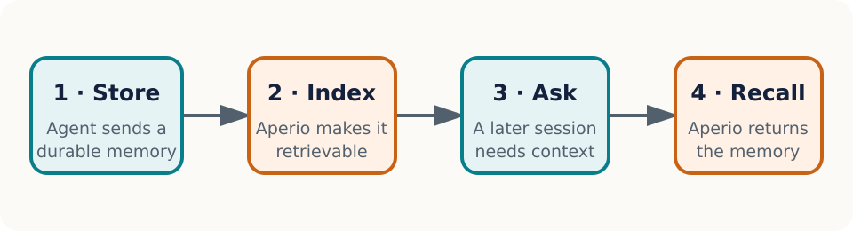

# Recall should be part of the path {#recall-path}

Aperio is a self-hosted memory layer for AI agents. This miniature manual is intentionally small, but it exercises the structures the full manual needs: navigable headings, a real list, a data table, a described figure, code, internal links, and an external reference.

> <span class="lead-label">Proof target.</span> A reader can search and select this sentence, navigate by bookmarks or the table of contents, follow links, understand the reading order, and print the same source on A4 or Letter paper.

## Start a first recall {#first-recall}

Follow this ordered path:

1. Install Aperio for your platform.
2. Connect an agent through MCP.
3. Store one durable memory.
4. Ask a later conversation to recall it.

The result is successful when the later conversation retrieves the memory without the reader copying the original text into the prompt again. If that does not happen, jump to [Recover when recall is empty](#empty-recall).

### Minimal configuration {#minimal-config}

The smallest configuration keeps inference and storage local:

```dotenv
AI_PROVIDER=llamacpp
DB_BACKEND=sqlite
EMBEDDING_PROVIDER=transformers
```

The variables are shown as a code block so syntax remains distinct from explanatory prose in both outputs.

## Know what each layer owns {#layer-ownership}

| Layer | Reader-facing responsibility | Canonical evidence |
|:--|:--|:--|
| Structured source | Meaning, order, labels, alternative text, and links | Reviewed Markdown and metadata |
| Semantic HTML | Web artifact and accessibility-bearing intermediate | Generated HTML inspection |
| Print CSS | Page geometry, running furniture, and break behavior | A4 and Letter render checks |
| PDF renderer | Tags, outlines, annotations, fonts, and PDF metadata | Structural and visual PDF checks |

: The proof separates semantic ownership from presentation ownership. {#tbl-ownership}

{#fig-recall-loop}

The diagram’s meaning is carried by its alternative text and caption, not by color alone. The same vector stays sharp in browser and print output.

# Recover with evidence {#recover}

## Recover when recall is empty {#empty-recall}

Use the shortest diagnostic loop that can distinguish an indexing problem from a retrieval problem:

- Confirm the memory was accepted and has a stable identifier.
- Confirm embedding generation completed rather than remaining queued.
- Search with a distinctive phrase from the stored memory.
- Inspect the relevant troubleshooting entry before changing thresholds.

Do not paste secrets into diagnostic output. Redact credentials and private memory content before sharing logs.

## Follow the evidence {#evidence-links}

Use descriptive link text. The [Aperio repository](https://github.com/BaiGanio/aperio) is the canonical project source, while the [publishing proof target](#recall-path) returns to this document’s opening requirement.

### Acceptance checks {#acceptance}

The pipeline passes this prototype when all checks below are true:

- The HTML document declares English and contains one main landmark.
- Both PDFs report that they are tagged.
- Extracted text contains the proof-target sentence in reading order.
- PDF outlines include the first- and second-level headings.
- Internal destinations and external URL annotations exist.
- The A4 and Letter files report their intended physical page sizes.
- Rendered page images have no clipping, overlap, missing glyphs, or broken page furniture.

Formal PDF/UA certification remains outside this prototype. A production release gate must add a specialist validator and assistive-technology spot checks before claiming conformance.
