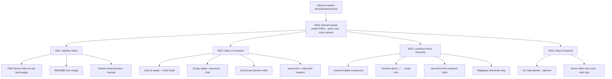

# Mascot Ecosystem Integration

## Objective

Roll the aurora robot mascot out from the landing hero (already shipped) across the whole
Aperio surface — web UI, all favicons, docs subpages, empty states, and "robot speaks"
message bubbles — so Aperio reads as a personality, not just another AI-adjacent app.

## Current state (already shipped, 2026-07-30)

- `docs/assets/mascot/` — transparent robot PNGs (512/1024/2048), head mark, icon set
  (16/32/180/192/512), wallpapers (JPEG, 1080p→4K + phone)
- `docs/assets/favicon.ico` + `public/assets/favicon.ico` replaced (multi-size 16–64,
  head with headphones + antenna)
- `docs/index.html`: hero mascot (`.hero-mascot`, bob animation, reduced-motion guard),
  PNG favicon + apple-touch links, `og:image`/`twitter:image` → icon-512
- All ~31 docs subpages and public pages point at `assets/favicon.ico` /
  `../assets/favicon.ico` → **they inherit the new icon with zero changes**

Master sources: user's Midjourney PNG (`~/Downloads/Generated Image July 30, 2026 - 1_49PM.png`),
pipeline parameters in memory `project-mascot`. Regeneration is scripted, not manual.

## Diagram

## Model recommendation

- **Recommended**: `claude-code` provider (subscription — no per-token API cost) for
  WS0–WS3 wiring: repetitive multi-file HTML/CSS edits where path/i18n precision matters
  and mistakes are cheap to make, expensive to spot.
- **Locale fan-out** (new i18n keys × ~24 languages): DeepSeek — translation of 3–5 short
  strings per language is reasoning-light, throughput-shaped work.
- **Not local**: Qwen2.5-Coder-7B has repeatedly mangled multi-file i18n edits (see i18n
  #177 raw-key renders); the failure mode here is silent broken keys across 24 files.
- **Estimate**: ~120k input / ~25k output tokens over all workstreams. Cost ≈ $0 on
  claude-code subscription + <$0.10 DeepSeek for translations.

## Guiding rules

1. **No new i18n keys unless unavoidable.** Every new user-facing string costs 24 locale
   entries and risks raw-key renders (i18n #177 lesson). Prefer: reuse existing keys,
   decorative images with empty `alt`, aria-hidden art.
2. **Weight budget**: any page gains ≤ 60 KB of mascot assets (use the 512 robot or
   smaller, WebP where a new file is made anyway; never the 1024/2048 on a page).
3. **Reduced motion**: every animation ships with a `prefers-reduced-motion` guard
   (pattern already in `.hero-mascot`).
4. **Preview before integrate** (Co-pilot Contract): each visual workstream gets a
   standalone preview or live screenshot approved before the commit is proposed.
5. **Mascot voice**: bubbles speak in first person, short, plain — the robot is a
   listener that remembers, never a salesman.

## Steps

### WS0 — Derived assets (prerequisite, ~30 min)

Produce once, from the existing masters, into `docs/assets/mascot/` and copy the
app-needed subset to `public/assets/mascot/`:

| Asset | Purpose | Spec |
|-------|---------|------|
| `avatar-56.png` (+`avatar-112.png` @2x) | chat AI avatar | head mark, square, transparent |
| `peek.png` | section corners / 404 | top half of head (eyes + antenna over an edge), ~400px wide |
| `mono.png` | empty states | head mark desaturated to `--dim`-ish opacity 0.35, so empties feel quiet, not loud |
| `head-64.webp` | terminal demo inline icon | 64px head |

**Works when**: files exist in both asset dirs, each ≤ 30 KB, transparent, and a
contact-sheet preview has been shown and approved. → Tests: group **T0**.

### WS1 — Identity rollout (~45 min)

1. Add PNG favicon + apple-touch links (mirroring `docs/index.html`) to the *top-level*
   entry pages only: `docs/guides.html`, `public/index.html`, `public/help.html`,
   `public/setup.html`, `public/codegraph-atlas.html`. Subpages keep inherited `.ico`.
2. README: replace `✨ Aperio` header with centered mascot image
   (`docs/assets/mascot/robot-aurora-512.png` via raw GitHub URL, height ~160) above the
   existing tagline. Keep total header height modest.
3. **Manual (developer)**: GitHub repo → Settings → Social preview → upload
   `wallpaper-1920x1080.jpg` (or icon-512 on aurora bg). Org/repo avatar → `icon-512.png`.

**Works when**: each listed page serves the PNG icons (HTTP 200, `<link>` present),
README renders the robot on GitHub, social preview shows the mascot. → Tests: **T1**.

### WS2 — Web UI moments (~2–3 h)

1. **Chat avatar**: `.avatar.ai` (bubbles.css + roundtable.css interplay) renders
   `avatar-56.png` instead of the letter "A". Keep the colored ring per agent in
   roundtable mode (image inside, ring outside) so agent identity survives.
   Grep the JS that builds `
` (public/index.html:207 static +
   dynamic renderer in scripts) and change in one place if possible.
2. **Empty states**: the two `.empty-state` blocks (`public/index.html:126`,
   `public/scripts/memories.js:32`) swap the `◈` glyph for `mono.png` (small, 56px).
   Existing i18n strings stay — zero new keys.
3. **Disconnect banner**: wherever the WS-offline / server-error state is rendered, add
   the mono robot (head tilted via CSS `rotate(-8deg)`) so failure states feel attended.
   New string? Reuse existing error copy — image only.
4. **setup.html + help.html**: mascot head (~72px) beside the page title.

**Works when**: chat with a live model shows the robot avatar on every AI bubble
(including roundtable, where rings still differ); an empty DB shows the quiet robot in
the sidebar; killing the server shows the banner robot; no raw i18n keys anywhere
(`npm run` i18n check if present, else grep). Exercised in the real app, not just
compiled. → Tests: **T2**.

### WS3 — Landing & docs moments (~2–3 h)

1. **`.mascot-bubble` component** (docs/styles.css): robot head (56px) + speech-bubble
   with tail, aurora border. Used in exactly **three** places (restraint — the bubble is
   the signature, not wallpaper):
   - "Why Aperio?" section intro — robot says the one-liner already present as the
     section lead (reuse `data-i18n` key of that lead → zero new keys)
   - Aperio-lite section — robot delivers the existing "double-click and go" line
   - FAQ/setup handoff — robot points to the terminal example
2. **Terminal demo**: swap the `🤖` emoji (`terminal_provider` row) for `head-64.webp`
   at 16px inline — the robot literally *is* the provider line.
3. **`docs/404.html`**: GitHub Pages serves it automatically. Confused `peek.png` robot +
   "This page isn't in my memory." + link home. (One new i18n-exempt page — 404 is
   en-only, precedent: none exists today at all.)
4. **Wallpaper strip**: small "Wallpapers" row in the footer/community section linking
   the four JPEGs with a thumbnail. Alt text from existing footer vocabulary.

**Works when**: bubbles render on all three spots in dark + light themes without layout
shift; terminal row shows the head icon; `/aperio/nonexistent` shows the 404 robot;
wallpaper links download. Screenshot set approved before commit. → Tests: **T3**.

### WS4 — Repo & beyond (~1 h, optional tail)

1. **CLI `help` banner** (optional, taste-gated): 4-line ASCII robot next to the version
   line in the terminal help — preview in-terminal before adopting.
2. **Demo videos**: future recordings open on the mascot card (note for the demo-recording
   harness; no work now).
3. **Mascot name**: decide on "Meno" (Plato's recollection dialogue) — if adopted,
   bubbles get a tiny `— Meno` signature and the 404 line becomes first-person. Decision,
   not code.

**Works when**: developer has explicitly approved/declined each item. → Tests: **T4**.

## Risks

| Risk | Mitigation |
|------|------------|
| i18n raw-key renders from any new string | Rule 1: reuse existing keys; the only new page (404) is en-only; CI-grep for `data-i18n` keys missing from `en.json` |
| Avatar image breaks roundtable agent-color identity | Ring-outside-image design; verify in a live roundtable run (T2.4) |
| Page-weight creep on landing (image-heavy hero already) | 60 KB/page budget, WebP for new derivatives, Lighthouse spot-check (T3.5) |
| Mascot fatigue — robot everywhere reads as noise | Hard cap: 3 bubbles on landing, 1 avatar + 2 empties + 1 banner in UI; anything more needs a new decision |
| `public/` and `docs/` asset dirs drift apart | WS0 script copies from docs→public; regeneration notes live in memory `project-mascot` |
| GitHub raw-URL image in README breaks on rename | Use relative path `docs/assets/mascot/...` (renders on GitHub) instead of absolute raw URL |

## Doc updates (after implementation — see sync-documentation skill)

- `CHANGELOG.md` — Unreleased entry per shipped workstream
- `README.md` — is itself a WS1 deliverable
- `FEATURES.md` — no (branding, not a feature)
- `id/reference/architecture.md` — no
- `A2D.md` — log the WS4 open decisions (name, CLI banner) if deferred

## Companion tests

`trash/plans/mascot-ecosystem-integration/mascot-ecosystem-integration-tests.md` —
read it first; verify red before implementing (verify-first).
