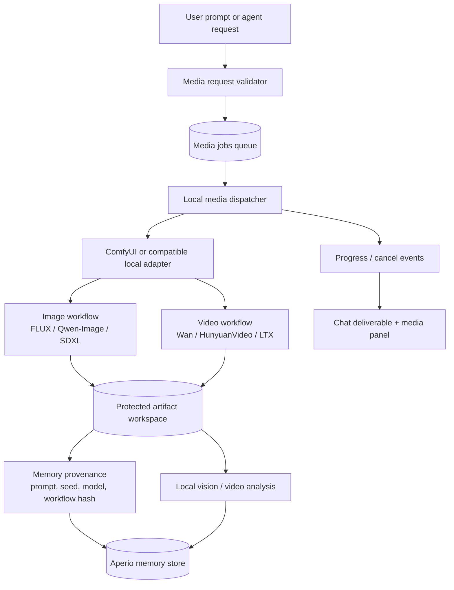

# Aperio local media generation and video tools

## 1. Objective

Add a provider-neutral, local-first media pipeline so Aperio can request, queue,
monitor, cancel, store, inspect, and remember generated images and videos without
mistaking a reasoning model for a renderer.

## 2. Diagram

The model that reasons about the request is separate from the model that renders
pixels. The renderer is selected by an explicit adapter and workflow; the agent
may call it, but cannot turn an arbitrary prompt into an unrestricted process
launch.

## 3. Model recommendation

- **Still images:** start with a ComfyUI adapter and support one pinned workflow
  first. FLUX is a strong quality baseline; Qwen-Image is attractive when prompt
  typography, posters, diagrams, or editing matter. Both are local-capable image
  generators, subject to their individual model licenses and hardware needs.
- **Video:** start with Wan2.2 through an official ComfyUI workflow. Keep Wan2.1
  or LTX as lower-resource alternatives after the contract works. Video generation
  is substantially more expensive in VRAM, disk, time, and temporary storage than
  still-image generation.
- **Reasoning/orchestration:** Gemma 4 or Ornith can write prompts, select a safe
  preset, call the media tool, and critique results. They should not be treated as
  the pixel generator.
- **Execution model:** current Claude Code / Anthropic for the first implementation
  because this crosses MCP, path safety, async lifecycle, WebSocket events, and
  artifact persistence. Estimate: 40k input / 15k output tokens; roughly $3–10
  depending on the selected model, or $0 when a sufficiently capable local model
  is used with human review.

## 4. Steps

### M0 — Capability and adapter contract

1. Define a media-job contract with `kind` (`image` or `video`), validated prompt,
   optional input artifacts, preset, seed, dimensions, duration, requester/session,
   and a non-sensitive workflow identifier. Reject raw shell commands and arbitrary
   workflow paths.
   *Works when:* invalid kinds, paths, dimensions, durations, and unknown presets
   fail before a job is queued. → **T1**
2. Define adapter methods: `probe()`, `submit()`, `getStatus()`, `cancel()`, and
   `collect()`. The initial adapter targets a local ComfyUI HTTP/WebSocket API;
   future adapters can target another local server without changing MCP semantics.
   *Works when:* a fake adapter can run the complete lifecycle without ComfyUI. → **T1**

### M1 — Protected artifact and provenance layer

3. Store outputs only under Aperio's protected artifact workspace, using the existing
   path gates and artifact URL machinery. Never expose a renderer-provided absolute
   path directly to the model or browser.
   *Works when:* an output is downloadable through a scoped artifact reference and
   traversal/symlink attempts are rejected. → **T2**
4. Persist a compact manifest beside each output: job ID, media kind, prompt hash,
   model/checkpoint ID, workflow hash, seed, dimensions, duration, frame rate,
   creation time, and adapter version. Do not persist API keys or full private
   prompts in process logs.
   *Works when:* a completed artifact can be audited and reproduced from its
   manifest without leaking secrets. → **T4**

### M2 — Queue, progress, cancellation, and cleanup

5. Add a bounded media queue with one configurable concurrency limit, explicit
   states (`queued`, `running`, `succeeded`, `failed`, `cancelled`), timeout, and
   cleanup of abandoned temporary files.
   *Works when:* jobs cannot grow without bound, terminal states are idempotent,
   cancellation stops collection, and failed jobs leave no partial deliverable. → **T3**
6. Stream coarse progress and terminal events to the existing chat/deliverable
   surface, while polling the renderer only at a bounded interval. Include a
   visible estimate/notice that video generation may take minutes.
   *Works when:* the UI shows queued → running → completed/failed and reconnecting
   *does not* duplicate or resurrect a terminal job. → **T3**

### M3 — MCP tools and safe agent use

7. Add `generate_image` and `generate_video` MCP tools with explicit presets and
   artifact inputs. Add `media_job_status` and `cancel_media_job`; keep destructive
   cancellation and overwrite behavior scoped to the requester's session.
   *Works when:* an agent can submit and retrieve a fake image/video job, while
   cross-session IDs and unapproved paths are denied. → **T1**, **T2**, **T3**
8. Add capability metadata so Gemma/Ornith can see whether an image or video
   renderer is available, which presets exist, and whether the result is local.
   *Works when:* unavailable media capabilities produce an honest explanation and
   no phantom tool call. → **T5**

### M4 — First real workflows

9. Ship one pinned local image workflow and one pinned local video workflow, with
   documented hardware/runtime prerequisites and model-license notes. Start with
   low-resolution short video settings for smoke tests.
   *Works when:* an isolated ComfyUI instance produces one image and one short video
   through the same adapter used by the fake tests. → **T5**
10. Add media analysis hooks: image description for generated stills and frame/sample
    extraction for videos, with analysis stored as derived metadata rather than
    replacing the original artifact.
    *Works when:* a generated video can be sampled, described locally, and linked to
    its source job without loading the entire video into memory. → **T4**, **T5**

### M5 — Documentation and rollout

11. Add a feature flag and an explicit disabled-by-default posture for media
    rendering. Document local runtime setup, model licenses, disk/VRAM expectations,
    retention, and the privacy boundary.
    *Works when:* a fresh installation has no renderer side effects and the feature
    can be enabled without editing source code. → **T6**
12. After implementation, ask for approval before updating the behavior docs listed
    in §6. Do not silently modify documentation as part of the code work.
    *Works when:* each proposed doc update has an explicit approve/decline decision. → **T6**

## 5. Risks

| Risk | Mitigation |
|---|---|
| Renderer becomes an arbitrary command-execution bridge | Adapter-only API; preset allowlist; no model-supplied shell or workflow paths |
| Video jobs exhaust VRAM, disk, or memory | Bounded concurrency, quotas, short default duration, isolated temp workspace, cleanup tests |
| Renderer leaks files outside Aperio | Resolve every input/output through `lib/routes/paths.js` and artifact helpers; traversal and symlink tests |
| WebSocket disconnect duplicates work | Durable job state, idempotency key, terminal-state replay, reconnect tests |
| Prompt/output privacy leaks through logs or manifests | Hash or redact sensitive fields; never log base64/video bytes; retention policy |
| Model licenses or safety constraints are unclear | Pin model metadata and license notice per workflow; make presets configurable and removable |
| Local model is unavailable or incompatible | `probe()` capability check, honest unavailable response, fake adapter contract tests |
| Generated video is too large for browser delivery | Artifact download/reference first; optional preview/transcode; enforce size and duration limits |

## 6. Doc updates — approval required before writing

| File | Why |
|---|---|
| `FEATURES.md` | Add image/video generation and analysis capabilities |
| `CHANGELOG.md` | Record the new MCP tools and local media pipeline |
| `id/reference/mcp-tools.md` | Document `generate_image`, `generate_video`, status, and cancellation tools |
| `id/reference/architecture.md` | Add the media queue, adapter, artifact, and provenance flow |
| `id/reference/skills.md` | Add or update media-generation/video-analysis skills if shipped |
| `README.md` | Add setup and hardware prerequisites if users must install ComfyUI/models |
| `SECURITY.md` | Document renderer isolation, path gates, quotas, and output retention |

The companion acceptance criteria are in
[`media-generation-and-video-tools-tests.md`](media-generation-and-video-tools-tests.md).

The animated architecture preview is intentionally standalone pending review:
[`media-generation-and-video-tools-preview.html`](media-generation-and-video-tools-preview.html).

