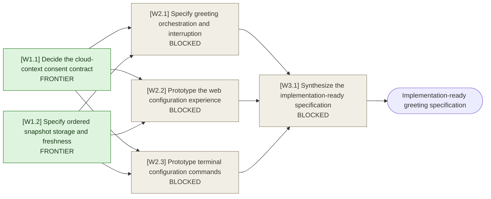

# Model-generated greetings with curated context

## Destination

An implementation-ready product and technical specification for configurable, model-generated session greetings with user-curated cold-start context, covering web and standalone terminal behavior without implementing the feature in this map.

## Notes

### Settled product constraints from charting

- The greeting mode is one global, DB-synced preference shared by web and terminal.
- Model-generated greetings default to on. When off, Aperio keeps the current instant localized static greeting.
- Every session gets a fresh model-generated greeting; no generated greeting is reused across sessions.
- Aperio assembles the selected context itself while the model loads and supplies it to the first inference. The model does not discover greeting context through tool calls.
- The initial curated profile snapshots the five most recent user memories, five most recent self-memories, and one explicitly pinned wiki entry when available. Files and indexed documents are off until selected.
- Users have full source control: individual memories, self-memories, wiki entries, allowed files, and indexed documents can be selected and ordered individually. The greeting instruction itself remains fixed and localized by Aperio.
- Selections are fixed snapshots. A changed, deleted, inaccessible, or otherwise mismatched source is marked stale and excluded until explicitly refreshed or replaced.
- The default greeting-context capacity is 10% of the active model's usable context budget. Users may change the threshold freely.
- Runtime packing follows the user's individual item order. Items are atomic: Aperio includes complete items until capacity is reached, then omits overflow and reports it. The editor may accept over-capacity profiles only with a clear truncation warning.
- A completed generated greeting is the first assistant message in model history.
- A user turn preempts an in-flight greeting. Already-streamed greeting text stays visible and is stored as an interrupted assistant turn; the response briefly and naturally acknowledges what the greeting was leading toward before addressing the user's request.
- Generation failure produces a localized explanation and the current localized static greeting as fallback.
- Web and terminal both consume and can edit the same global preference and context profile.
- Cloud transmission of self-memory and local content is intentionally undecided and must be resolved before implementation.
- Consult `tests/harness/README.md` before any later implementation touches `lib/agent/`, `lib/tools/`, `lib/context/`, or providers. Changes to `lib/context/` require the fragile-zone verification specified in `AGENTS.md`.

## Route

## Frontier

- [[W1.1] Decide the cloud-context consent contract](tickets/cloud-context-consent.md)
- [[W1.2] Specify ordered snapshot storage and freshness](tickets/profile-snapshots-and-freshness.md)

## Decisions so far

<!-- Empty: the settled charting constraints above are the originating brief. Ticket resolutions are indexed here as the map is worked. -->

## Not yet specified

- Provider-specific capability differences may expose additional decisions once the cloud-consent and runtime contracts are known, especially around enforceable context limits, cancellation, and reasoning suppression during greetings.
- The consent decision may expose migration or audit requirements that cannot yet be stated precisely.

## Out of scope

- Implementing the feature during this Wayfinder effort.
- Making the fixed greeting instruction user-editable.
- Maintaining separate context profiles per provider or model.
- Reusing one generated greeting across multiple sessions.
