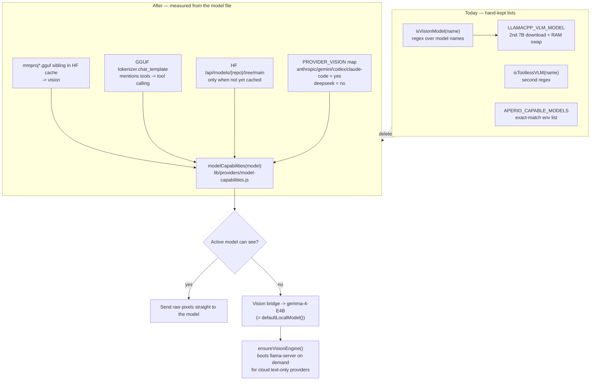

# Auto-detect model vision — delete the hand-kept model lists

## Context

Today Aperio decides "can this model see pictures?" with a **hand-written list of model
names**. It is a regex in `lib/helpers/imageBridge.js:15`:

```js
/(?:llava|bakllava|moondream|minicpm-?v|llama3\.2-vision|vision|vl(?::|-|$)|gemma[-.]?[34]n?|qwen3\.?5)/i
```

Every new model means someone must edit that line. Users complain the whole thing is more
trouble than help. It is also **already wrong**: on this machine's real model cache,
`unsloth/Qwen3.6-35B-A3B-MTP-GGUF` ships an `mmproj-BF16.gguf` (it *can* see) but the regex
says it cannot. That one wrong answer silently moves four behaviours at once —
`omitVlm` (`preset.js:46`), `resolveDescribeModel` (`image.js:47`), `vlmPresetMode`
(`vlm.js:55`) and `modelHandlesInlineImage` (`agent/index.js:390`).

There is a second hand-kept list of the same kind: `APERIO_CAPABLE_MODELS` →
`isCapableModel()` (`lib/agent/tool-profiles.js:333`), an **exact string match** on the full
HF repo id. The developer already decided on 2026-07-11 to delete it; it was never done.

And there is a whole second 7B model — `LLAMACPP_VLM_MODEL`, default
`ggml-org/Qwen2.5-VL-7B-Instruct-GGUF` — downloaded and RAM-juggled purely to look at
pictures, even though the shipped default main model (`unsloth/gemma-4-E4B-it-qat-GGUF:Q4_K_XL`)
already sees images natively.

**Outcome:** no model-name lists anywhere. Vision is read from the model file on disk.
Gemma 4 E4B is the one local model, and it is also the eyes for any model that has none
(Ornith locally, DeepSeek in the cloud). Config keys, the second VLM download, and the
capability gate all go away.

### Real ground truth, verified on this machine

A GGUF repo can see images **iff** its snapshot directory contains an `mmproj*.gguf` file.
Checked against all 11 cached repos in `~/.cache/huggingface/hub`:

| Repo | mmproj on disk | Regex says |
|---|---|---|
| gemma-4-E4B-it-qat / E2B / 12B / 26B-A4B | vision | vision ✅ |
| Qwen3-VL-8B-Instruct | vision | vision ✅ |
| Qwen3.5-4B | vision | vision ✅ |
| **Qwen3.6-35B-A3B-MTP** | **vision** | **no vision ❌** |
| Ornith-1.0-9B-MTP | no vision | no vision ✅ |
| Phi-4-mini-instruct | no vision | no vision ✅ |
| Qwen2.5-Coder-7B / 14B | no vision | no vision ✅ |

The file scan is 11/11 correct. The regex is 10/11.

---

## Diagram



---

## Model recommendation

**claude-sonnet-5.** Same tier the parent provider work ran on
(`project_provider_native_capabilities`). This is wide, precise, mechanical surgery across
~37 files with exact provider-payload shapes and a large test sweep — not novel reasoning.
Estimated ~180k input / ~40k output tokens across the workstreams, roughly $1.20.
Do **not** run this on a local model: the GGUF parsing and the provider-loop edits need
precise instruction following.

---

## Steps

Companion test file: `trash/plans/model-vision-autodetect/model-vision-autodetect-tests.md`
(written in WS0, before any code changes).

### WS0 — Plan + red tests
Copy this document to `trash/plans/model-vision-autodetect/model-vision-autodetect.md` and
write the companion test file. Write the new unit tests as stubs and **watch them fail**.

*Works when:* `npm test` shows the new detection tests red for the right reason
(`modelCapabilities` does not exist yet), and every other test still passes.

### WS1 — The detection module

New file `lib/providers/model-capabilities.js`. One exported function:

```js
export function modelCapabilities(model, env = process.env)
  // -> { vision: boolean, tools: boolean, source: "cache" | "hub" | "provider" | "unknown" }
```

Reuse, do not re-implement:
- `resolveModelCacheDir(env)` — `lib/helpers/modelCache.js:27`
- the repo→cache-dir + `refs/main`→`snapshots/<rev>` walk already in
  `findCachedGguf()` — `lib/helpers/ggufModelFacts.js:121-137`. Extract the snapshot-dir
  resolution into a small shared `resolveSnapshotDir()` so both functions use one walk.
- `readGgufMetadata()` — `lib/helpers/ggufModelFacts.js:47`

Two new pieces:
1. `hasCachedMmproj(model, cacheRoot)` in `ggufModelFacts.js` — the same snapshot dir,
   scanned for `/^mmproj.*\.gguf$/i` instead of filtered against it. Note `findCachedGguf`
   and `modelCache.js:56` **already** exclude `mmproj*`, so the exclusion regex is the
   detection regex inverted — keep one shared constant.
2. Add `tokenizer.chat_template` to the `keep` set in `readGgufMetadata` (currently
   `ggufModelFacts.js:58`). Test the template string for `tools`/`tool_call`, then discard
   it — do **not** retain a 10-50 KB string in the facts cache. This replaces
   `isToollessVLM`.

Cache results in a `Map` keyed by `${cacheRoot}\0${model}`, exactly like
`inspectedFactsCache` — `lib/providers/model-facts.js:15,80-87`.

Not-yet-downloaded models: one `GET https://huggingface.co/api/models/{repo}/tree/main`,
3 s timeout, look for an `mmproj*.gguf` entry. On any failure return `vision: false` —
the bridge is the safe default. Skip the call entirely when `shouldStartOffline`-style
offline conditions apply.

> **Resolved in [#509 / W1.2] (2026-08-26):** the call is allowed, boxed in tight:
> - fires only at boot/preset-build time, never mid-turn;
> - fires only for a repo `findCachedGguf` reports as **not yet on disk** — the exact
>   same cached/uncached boundary `shouldStartOffline` (`lib/helpers/llamacpp/models.js:61`)
>   already uses for its own online/offline call, reused rather than reinvented;
> - independent of `LLAMACPP_CHECK_UPDATES` — that flag only governs revalidating
>   already-cached repos; an uncached repo is already going online to download weights
>   regardless of the flag's value, so there is nothing for it to gate here;
> - 3 s timeout, matching the two existing `AbortSignal.timeout(3000)` calls already in
>   `models.js`;
> - on any failure, fall back to `vision: false` and log one line — the bridge is a safe
>   default, and the answer self-heals once the real mmproj header lands on disk;
> - cache the result per repo so it fires at most once per new model, not once per boot.
>
> Rationale: this is not a new class of network call. It only ever fires in the exact case
> where Aperio is already about to pull several GB from the same host to download the
> model's weights — the metadata GET adds no new exposure over the download that is about
> to happen anyway. A cached model triggers no call, matching the project's local-first,
> offline-when-possible default.

Provider-level vision (cloud) is a tiny map next to `resolveProvider`, keyed by **provider
name, not model name** — this is a provider-API fact and does not grow per model:
`anthropic`, `gemini`, `codex`, `claude-code` → true; `deepseek` → false.

*Works when:* `modelCapabilities()` returns the correct vision answer for all 11 repos in
the table above, from the cache alone, with no network.

### WS2 — Rip out the lists

Delete:

| What | Where |
|---|---|
| `isVisionModel()` | `lib/helpers/imageBridge.js:15-17` |
| `isToollessVLM()` | `lib/helpers/imageBridge.js:27-29` |
| `isCapableModel()`, `needsRecallScaffold()` | `lib/agent/tool-profiles.js:333-360` |
| `APERIO_CAPABLE_MODELS`, `APERIO_RECALL_SCAFFOLD_MODELS` | `lib/config.js:216-222` |
| `LLAMACPP_VLM_MODEL` | `lib/config.js:264-266` |
| `LLAMACPP_VLM_MMPROJ` (unregistered env) | `lib/helpers/llamacpp/preset.js:102` |
| `IMAGE_DROPPING_PROVIDERS`, `providerDropsImages()` | `lib/providers/index.js:387-397` |
| `capability_notice / images_dropped` WS path + i18n string | `lib/emitters/handlers/wsHandler.js:658-662`, `public/scripts/i18n.js:254`, `public/scripts/streaming/events/knowledge.js:22-23` |
| `OLLAMA_VLM_MODEL` shim mapping | `lib/helpers/ollamaMigrationShim.js:15,43` |
| deepseek `vision:` regex | `lib/providers/index.js:317` — becomes `false` |

Rewire every call site to `modelCapabilities().vision`:
`lib/agent/index.js:348,390`; `lib/agent/providers/llamacpp.js:351`;
`lib/helpers/llamacpp/preset.js:46`; `lib/helpers/llamacpp/vlm.js:55`;
`mcp/tools/image.js:47,54`.

`lib/agent/index.js:390` collapses to `modelHandlesInlineImage: modelCapabilities(...).vision`
— the `|| isCapableModel(...)` half is gone. `getSelectedTools()`
(`lib/agent/index.js:397`) stops returning `[]` for "non-capable" models: **every model
gets tools now**, matching the 2026-07-11 decision.

`llamacpp.js:347-350`'s `isToollessVLM` → `state.noTools = !modelCapabilities(...).tools`,
read from the chat template.

Keep `LLAMACPP_VLM_TIMEOUT_MS` (`lib/config.js:386`) — the timeout is still real. Fix its
help text, which currently points at a deleted key.

*Works when:* `grep -rn "isVisionModel\|isToollessVLM\|isCapableModel\|LLAMACPP_VLM_MODEL\|APERIO_CAPABLE_MODELS" lib/ mcp/ db/`
returns nothing, and the full suite is green.

### WS3 — One local model, gemma-4-E4B as the eyes

The bridge model becomes `defaultLocalModel(env)` (`lib/providers/index.js:85`), which
**already resolves to gemma-4-E4B** from `LLAMACPP_MODEL`'s default. No new constant —
this keeps the eyes in lockstep with the default main model automatically.

`lib/helpers/llamacpp/preset.js:40-113`:
- `mainModel` has vision → emit only `[aperio-main]`. Unchanged, and this is the default path.
- `mainModel` has no vision (Ornith) → also emit `[aperio-vlm]` pointing at
  `defaultLocalModel(env)` with `mmproj = hasCachedMmproj(...)` and the existing
  `VLM_BRIDGE_CTX_CEILING` (24576, `vlm.js:24`).
- Keep `mainPlusVlmFit()` and the `models-max = 1` swap mode (`preset.js:54-64`) — the RAM
  math is still needed, only the model it sizes changed (7B Qwen-VL → ~4 GB gemma E4B, so
  co-residency now fits on more machines).

`lib/helpers/imageBridge.js:6` — `VLM_MODEL` becomes `defaultLocalModel()`.
`mcp/tools/image.js:46-57` — `resolveDescribeModel` collapses to: main has vision →
`LLAMACPP_MAIN_ALIAS`, else `LLAMACPP_VLM_ALIAS`.

*Works when:* with `LLAMACPP_MODEL` unset, `models.ini` has exactly one entry. With
`LLAMACPP_MODEL=protoLabsAI/Ornith-1.0-9B-MTP-GGUF`, it has two, the second being
gemma-4-E4B with its mmproj.

### WS4 — On-demand eyes for cloud text-only providers

**This is the one genuinely broken thing today.** `lib/server.js:310-316` starts
llama-server only when `AI_PROVIDER=llamacpp`. So `deepseek.js:87`'s unconditional
`bridgeImagesToVLM` calls `describe_image`, which fetches `127.0.0.1:8080` with nothing
listening, fails, and the image silently degrades to an `[Image: name]` text label. DeepSeek
users have never actually had working image support.

New `ensureVisionEngine()` in `lib/helpers/startLlamaCpp.js`:
- llama-server already up → no-op (fast path, the `llamacpp` provider case).
- otherwise build a **vision-only preset** — just `[aperio-vlm]` = `defaultLocalModel()` +
  mmproj at the 24576 ceiling, no main model — and run the existing `ensureLlamaCpp()`
  spawn/health-poll path against it. Factor the preset choice as a parameter rather than
  duplicating the 200-line reconcile/spawn block.
- emit a progress token before the wait: first run downloads ~4 GB, and the user must see
  why the turn is slow.

Call it from `lib/agent/providers/deepseek.js:86-88` before `bridgeImagesToVLM`. On failure,
keep the existing user-facing "⚠️ **Vision not available**" notice (`deepseek.js:173`) and
say plainly that the local vision model could not start.

Teardown: the existing `stopLlamaCpp` registration in `lib/server.js` covers app shutdown.
Idle-unload for the cloud-provider case is **out of scope** — log it to `A2D.md` as a
follow-up.

*Works when:* with `AI_PROVIDER=deepseek` and llama-server not running, uploading a photo
and asking "what colour is this?" returns the right colour.

### WS5 — Tests, docs, generators

Tests to rewrite (pattern: every assertion keyed on a *model name* becomes one keyed on a
*fixture directory with or without an `mmproj*.gguf`*). Add a tiny fixture helper that
builds fake HF snapshot dirs under the scratch dir.

Largest: `tests/unit/helpers/imageBridge.test.js:48-160` (the two regex suites — delete
outright, replace with the cache-scan suite). Then
`tests/unit/agent/tool-profiles.test.js:732-768`, `tests/unit/providers/llamacpp.test.js:591-720`,
`tests/integration/helpers/startLlamaCpp.test.js:151-250`,
`tests/integration/mcp/tools/image.test.js:196-262`,
`tests/integration/providers.test.js:201-226` (delete — `providerDropsImages` is gone),
`tests/harness/no-tool-use-diagnostic.test.js:187-252`,
plus the whole `isCapableModel` capability-gate suite (issue #188).

Run `npm run gen:env` then `npm run gen:env:check` — **mandatory CI gate** for any
`lib/config.js` change (`AGENTS.md` Fragile Zones). Regenerates `.env.example` and
`docs/config-reference.md`.

Also run `npm run test:harness` — this touches `lib/agent/`, `lib/tools/` and
`lib/context/`, which `AGENTS.md` says requires it.

*Works when:* full suite green, `npm run gen:env:check` passes, `npm run test:harness` green.

---

## Risks

| Risk | Mitigation |
|---|---|
| **`isToollessVLM` deletion breaks a llava user.** Today it sets `noTools` to avoid a hard 400 from llama-server. | The chat-template probe replaces it with a *better* signal — a llava GGUF's template genuinely has no `tools` block. Add an explicit unit test with a real llava template string. |
| **DeepSeek v4-pro loses native vision** (`providers/index.js:317` regex says it has it). | Deliberate — it is a name list, which is what we are removing. The bridge still answers the question, at the cost of one extra local call. If it matters, the honest fix is later: probe the DeepSeek API once and cache the answer, not a regex. |
| **HF tree API call adds latency / fails offline.** | Only fires for a model that is not yet cached, i.e. one Aperio is about to download GB from the same host anyway. 3 s timeout, failure → `vision: false` → bridge. Never fires on a warm install. |
| **`ensureVisionEngine` on a cloud install surprises the user with a 4 GB download.** | Emit the progress token *before* the download starts, naming the size. Follow-up: a one-time confirm. |
| **Chat-template metadata bloats the GGUF facts cache.** | Read it, reduce it to a boolean, drop the string in the same function. Assert cached facts hold no `chat_template` key. |
| **Wide blast radius** — `lib/config.js`, `lib/agent/index.js`, `lib/context/` adjacency are all named Fragile Zones in `AGENTS.md`. | Land WS1 (pure addition, no behaviour change) and WS2 (deletion) as separate commits so a bisect is cheap. Run the full suite between each workstream, not just at the end. |

---

## Doc updates

Per the `sync-documentation` skill — this is a config change **and** a feature change:

- `.env.example` + `docs/config-reference.md` — **generated**, do not hand-edit; run `npm run gen:env`
- `FEATURES.md:115-119` (Web & Image), `:338` (the "Memory-aware llama.cpp vision bridge" paragraph — rewrite: detection is measured, not configured)
- `id/capabilities.md:26-30` — drops the `LLAMACPP_VLM_MODEL` narrative
- `id/whoami.md:31`, `id/capability-tiers.md:37`
- `id/reference/tech-debt.md:50-61` — **delete** the "provider-neutral native-vision seam" entry; this plan resolves it (memory: *delete resolved entries, never annotate*)
- `CHANGELOG.md` → `## Unreleased` → `Changed` + `Removed`
- `skills/preprocess-image/SKILL.md` — remove VLM-model wording

---

## Verification (end to end, not just green tests)

1. `npm test` and `npm run test:harness` — full suite green.
2. `npm run gen:env:check` — CI gate passes.
3. **Detection, offline:** a small script over `~/.cache/huggingface/hub` printing
   `modelCapabilities(repo).vision` for all 11 cached repos — must match the table above
   11/11, including the Qwen3.6-35B case the old regex got wrong.
4. **Default path (isolated run, scratch workdir + non-default port, torn down after):**
   boot with no `LLAMACPP_MODEL`. Assert `var/llamacpp/models.ini` has exactly one entry,
   startup log says vision is native, then upload a solid-red PNG and ask "what colour?" —
   expect "red", and expect **no** `describe_image` call in the activity cards.
5. **Blind local model:** `LLAMACPP_MODEL=protoLabsAI/Ornith-1.0-9B-MTP-GGUF`. Assert two
   preset entries. Same red-PNG question — expect "red", and expect a `describe_image`
   card naming gemma-4-E4B.
6. **Cloud text-only (WS4, the currently-broken case):** `AI_PROVIDER=deepseek`, llama-server
   confirmed down via `lsof -i :8080`. Same red-PNG question — expect "red" plus a visible
   "starting local vision model" progress line. Confirm today's behaviour is a failure
   *before* the change, so the fix is provably real.
7. `git status` clean of stray `var/`/`sqlite/` artifacts afterwards.

---

## Commit messages

```
feat(providers): detect model vision from the GGUF file instead of a name list
```
```
refactor(agent): remove APERIO_CAPABLE_MODELS and the model-name capability gate
```
```
fix(deepseek): actually start the local vision model when a cloud model cannot see
```
