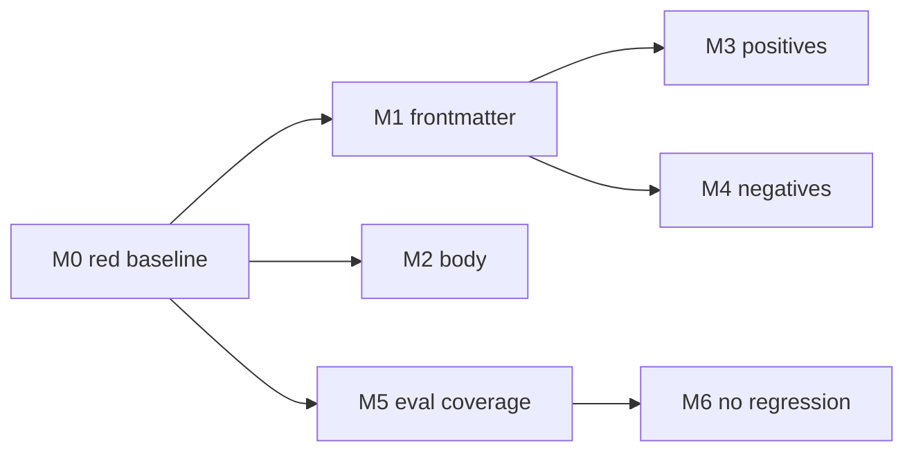

# WS1 tests — pre-write code-minimalism skill

Companion to [`ponytail-borrow-ws1.md`](./ponytail-borrow-ws1.md). Domain: software
feature, so "test" means code test. All groups live in one file,
`tests/integration/skills/code-minimalism.test.js`, run by plain `npm test` (and
therefore `npm run test:ci`). Group **M0** is a procedure, not a permanent assertion.

## Coverage map

| Plan step | Test group | Coverage |
|---|---|---|
| — (pre-work) | **M0** Red baseline | Every criterion below fails before implementation |
| Step 1 — the skill | **M1** Frontmatter + index | File exists; `name`/`description`/`keywords`/`category`/`load` correct and parsed by the real loader |
| Step 1 — the skill | **M2** Body integrity | Ladder rungs present and ordered; non-negotiables named; cross-links; ponytail MIT attribution |
| Step 3 — keywords | **M3** Positive matching | Pre-write requests surface the skill |
| Step 3 — keywords | **M4** Negative matching | Debugging / doc-edit / post-write / the two house exact-match prompts are unaffected |
| Step 2 — eval cases | **M5** Eval coverage | `eval.json` contains positives *and* `expectNot` cases naming the skill |
| Step 3 — keywords | **M6** No regression | No failing case id beyond the recorded pre-WS1 baseline |

No plan step is uncovered. Step 4 (docs) is gated on developer confirmation and is
verified by review, not by test.

## Test execution order

M0 once, before implementation. Then M1 → M2 → M3 → M4 → M5 → M6. M3/M4 depend on M1
(the skill must be in the index before matching means anything); M6 depends on M5 (the
new eval cases must exist before "no new failures" is meaningful). M2 is independent.



## Required setup

- Node.js native test runner, `import assert from "node:assert/strict"` (house style)
- The real loader/matcher (`lib/workers/skills.js`) — no fixture index, no stubs
- `spawnSync("node", ["skills/autotune/score.mjs", "--json"])` for M6, so the metric
  under test is the same scorer the autotune loop uses
- No fixtures, no network, no DB, no model, no temp files

## Recorded baseline (pre-WS1, commit `f77b1bf`)

`node skills/autotune/score.mjs --json` → `train 0.8049`, `holdout 0.4286`,
`kwChars 4548`, failing case ids:

```
7.12  hard.pptx  hard.docx-adv  hard.canvas  hard.prompt-opt  hard.mcp  hard.wiki  hard.xlsx
```

All eight predate WS1 (`mcp-builder` is referenced by the eval but absent from
`skills/`; the rest are unsolved `hard` paraphrases). M6 pins this **set of ids**, not
the accuracy float, because adding cases changes the denominator while leaving the
regression question intact.

---

## M0 — Red baseline

**Input / setup:** clean tree before `skills/code-minimalism/` exists.
**Expected behavior:** the suite fails for *absence* — no skill file, no eval cases.
**Assertions:**
- `tests/integration/skills/code-minimalism.test.js` runs and fails
- Failures name the missing artifacts: `skills/code-minimalism/SKILL.md`, and eval cases
  referencing `code-minimalism`
**Edge cases:** a green M0 means the test file has no teeth — treat it as a bug in the
test, not as work already done.

---

## M1 — Frontmatter and index registration

**Input / setup:** `loadSkillIndex(skills/)`.
**Expected behavior:** the skill is a first-class member of the real index with house
frontmatter.
**Assertions:**
- `skills/code-minimalism/SKILL.md` exists and is non-empty
- The loaded entry has `name === "code-minimalism"`, a non-empty `description`,
  non-empty `keywords`, `category === "engineering-discipline"`, `load === "on-demand"`
- `source === "bundled"` (it ships with the repo, it is not an overlay)
**Edge cases:** `load: "always"` would inject it into every turn and blow the context
budget the epic is trying to protect — assert the exact value, not merely "present".

---

## M2 — Body integrity

**Input / setup:** read `skills/code-minimalism/SKILL.md`.
**Expected behavior:** the file teaches the ladder and forbids the misreading.
**Assertions:**
- Every ladder rung appears, **in order** (assert on ascending index positions, so a
  reordered or truncated ladder fails): need to exist → already in this codebase →
  stdlib/language → platform/native → installed dependency → few inline lines →
  minimum viable new code
- A `## When NOT to Use` heading exists
- The non-negotiables are named in the file: `validation`, `error handling`,
  `security`, `tests` — and the phrase asserting minimalism ≠ corner-cutting
- Cross-links `[[code-simplification]]` and `[[reasoning-planning]]` present
- ponytail attributed with `MIT` and a URL — license obligation, asserted not assumed
- Sibling-skill structure preserved: `## Rationalizations`, `## Red Flags`,
  `## Verification` headings present (house shape for engineering-discipline skills)
**Edge cases:** the ordering assertion must use first-occurrence indices, not `includes`,
or a file that mentions the rungs in a scrambled list passes. It must also be applied to
the **body only** — curated keywords in the frontmatter legitimately repeat ladder
vocabulary ("minimum viable") and would otherwise register as a first occurrence above
the ladder itself (red-phase discovery).

---

## M3 — Positive matching

**Input / setup:** real index; `matchSkills(prompt, index, { limit: 4 })`.
**Expected behavior:** pre-write requests surface the skill.
**Assertions:** `code-minimalism` is returned for each of:
- `"Write me a helper for turning a title into a URL slug."`
- `"Add a small feature to the export command: an optional date range."`
- `"Do I need a library for this, or can we do it with what we already have?"`
- `"Keep it minimal — just the minimum viable code that solves it."`
**Edge cases:** at least one of these must rank the skill **first**, not merely appear
in the top 4 — a skill that never wins a slot never loads for a weak model.

---

## M4 — Negative matching (no collateral damage)

**Input / setup:** real index.
**Expected behavior:** the new keywords do not leak into other phases or other skills'
prompts.
**Assertions:**
- `"The helper function throws a TypeError on empty input — find out why."` →
  `code-minimalism` absent. *(Red-phase discovery: this prompt matches **nothing**
  today — `debugging-and-error-recovery` does not fire on it. That is a pre-existing
  matcher gap, out of WS1's scope, so the assertion is "WS1 must not change that",
  and a second prompt below carries the displacement teeth.)*
- `"Something is throwing an exception on startup and I need to find the cause."` →
  `debugging-and-error-recovery` still ranks first and `code-minimalism` is absent
- `"Fix a typo in the README and update the heading."` → `code-minimalism` absent
- `"This function is overcomplicated — simplify it and reduce the nesting without
  changing behavior."` → `code-simplification` still ranks first (post-write phase
  belongs to the sibling)
- The house exact-match prompts are unchanged:
  `matchSkills("Create a new file called notes-for-me.md …")` is still `[]`, and the
  PptxGenJS prompt still returns exactly `["pptx"]`
**Edge cases:** the two house prompts are already asserted in `skills.test.js`; they are
re-asserted here so a WS1 keyword regression is diagnosed at its cause, not three files
away.

---

## M5 — Eval coverage

**Input / setup:** read `skills/autotune/eval.json` and `eval.negatives.json`.
**Expected behavior:** the skill is actually evaluated, in both directions.
**Assertions:**
- ≥3 cases with `expect === "code-minimalism"`
- ≥2 cases whose `expectNot` includes `"code-minimalism"`
- Every added case has a unique `id` and a `set` the scorer reports on (`exam` or `hard`)
- `eval.negatives.json` gained at least one doc-only-edit turn
**Edge cases:** duplicate ids would silently double-count in the accuracy denominator —
assert id uniqueness across the whole file, not just the new rows.

---

## M6 — No regression against the recorded baseline

**Input / setup:** `spawnSync("node", ["skills/autotune/score.mjs", "--json"])`.
**Expected behavior:** WS1 adds cases and passes them without breaking any case that
passed before.
**Assertions:**
- The scorer exits 0 and emits parseable JSON
- The set of failing train case ids is a **subset** of the recorded 8 baseline ids —
  any new id fails the test and names the case
- Every case that mentions `code-minimalism` (expect or expectNot) passes
- `holdout` accuracy ≥ the recorded 0.4286 — the overfitting guard
**Edge cases:** the scorer prints a logger line before the JSON; parse from the first
`{`. Asserting a raw accuracy float instead of the id set would break the moment anyone
adds an eval case, which is exactly what this workstream does.

---

## Not tested here (and why)

- **Whether the skill makes a model write less code.** That is WS2's before/after eval,
  which needs a live-model arm; `tests/harness/` uses a fake provider by design and
  cannot measure what a model writes. Out of scope by the developer's scoping.
- **Whether the ladder's advice is correct.** Doctrine review by the developer, not an
  assertion.
