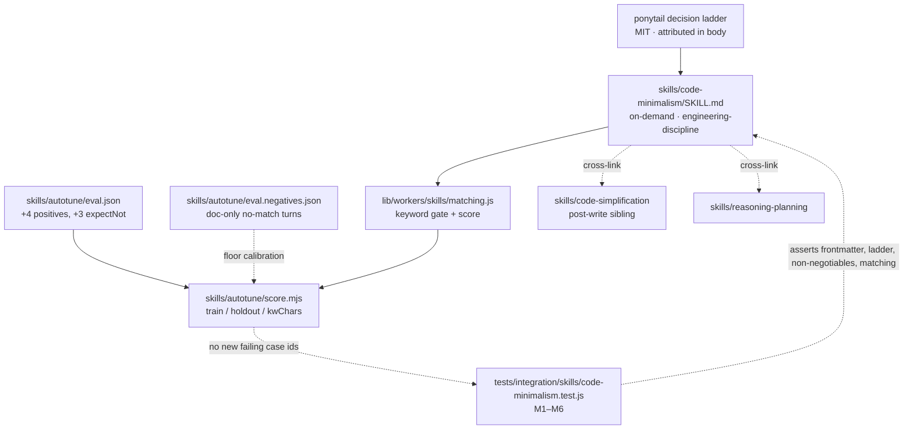

# WS1 — `skills/code-minimalism` (pre-write decision ladder)

> Scope: **WS1 only** of epic [#285](https://github.com/BaiGanio/aperio/issues/285).
> WS3 shipped in `f77b1bf`. WS2 (the before/after eval) is explicitly **not** started
> here — it needs a live-model arm that no existing harness provides, and its scoping
> is a separate decision. WS1 does not depend on either.

## Objective

Aperio has a post-write cleanup skill (`code-simplification`) but nothing that fires
*before* the code exists. Ship a pre-write gate — ponytail's decision ladder, adapted —
so the assistant asks "does this need to exist / does it already exist here / can the
platform do it" before it starts typing, and so the smaller local models (Qwen2.5-Coder
class), which over-engineer the most, get the cheapest possible correction.

## Why this shape

Two skills, two phases, no overlap:

| | `code-minimalism` (WS1) | `code-simplification` (existing) |
|---|---|---|
| Fires | before a line is written | after the code works |
| Question | should this exist, and how small can it be? | this works — why is it this complicated? |
| Output | less code written | same behaviour, less code kept |
| Risk it guards | over-engineering, needless deps | accreted complexity |

The ladder's rung 2 — *already in this codebase? reuse it* — is anamnesis applied to
code, which is the eidos check the epic already recorded as passing.

The load-bearing constraint is **keyword collision**. The skill index is one shared
namespace scored by `lib/workers/skills/matching.js`; broad verbs ("write", "create",
"add", "function") would steal slots from `pptx`, `frontend-design`, and
`debugging-and-error-recovery`, and two house tests assert *exact* match sets
(`matchSkills(…) === []` for a plain Markdown note, `=== ["pptx"]` for the PptxGenJS
prompt). So every keyword entry must be a multi-word phrase or a genuinely
discriminating single word — this is a design constraint, not a tuning detail.

## Diagram

## Decisions taken before writing

| Fork | Decision |
|---|---|
| New skill vs section inside `code-simplification` | **New skill.** Different phase, different trigger vocabulary; merging them would make one skill fire in both phases and dilute both keyword sets. |
| Where the negatives live | **Split.** "Debugging / doc edit must not pull `code-minimalism`" belongs in `eval.json` as `expectNot` cases — `eval.negatives.json` is the *no skill at all* ground truth for the semantic-rescue floor (`calibrate.mjs`), and a debugging turn must fire `debugging-and-error-recovery`, so putting it there would assert something false. Only genuinely skill-less turns (doc-only typo edits) go to `eval.negatives.json`. Flagged to the developer — this deviates from the issue text on purpose. |
| Regression guard shape | **Case-id subset, not an accuracy float.** Baseline train is 0.8049 with 8 known failures (all `mcp-builder`/`hard.*` cases predating WS1); the test asserts no *new* failing case id appears, which survives adding cases to the eval set. |
| New eval cases' `set` | **`hard`.** `exam` mirrors `exam.md` §7 and must not grow without the exam file; a third set would break the scorer's two-line breakdown. |

## Model recommendation

| Aspect | Value |
|---|---|
| Recommended | `deepseek-v4-flash` (or local llama.cpp for drafting the SKILL.md) |
| Est. tokens | ~60k in / ~8k out |
| Est. cost | <$0.05 |
| Rationale | One markdown file mirroring an existing template plus small JSON edits; the only non-mechanical part is keyword selection, and the scorer makes that decision for us. |

Commit signature must name the exact model that does the work, per AGENTS.md.

## Steps

Verification detail lives in [`ponytail-borrow-ws1-tests.md`](./ponytail-borrow-ws1-tests.md).
Run test group **M0** red before implementing.

### Step 1 — The skill

Write `skills/code-minimalism/SKILL.md` with house frontmatter (`name`, `description`,
`metadata.keywords`, `metadata.category: "engineering-discipline"`,
`metadata.load: "on-demand"`). Body:

- **The ladder**, as an ordered pre-write gate: does this need to exist? → already in
  this codebase? → language/stdlib? → native platform capability (SQLite FTS5/vec,
  Express, the DOM)? → an already-installed dependency? → a few inline lines? → only
  then a new module of minimum viable code.
- **"Lazy about the solution, never about reading"** — the ladder shortens what you
  write, never what you read before writing.
- **"When NOT to Use"** naming the non-negotiables explicitly: validation, error
  handling, security checks, and tests are never what gets trimmed. Minimalism is not
  corner-cutting.
- Rationalizations / Red Flags / Verification tables, matching the other
  engineering-discipline skills.
- Cross-links `[[code-simplification]]` (post-write sibling) and `[[reasoning-planning]]`.
- ponytail attribution with an MIT note and a link.

*Works when:* **M1** (frontmatter + index), **M2** (ladder, non-negotiables,
cross-links, attribution), and `npm run test:skills` green.

### Step 2 — Eval cases

Add to `skills/autotune/eval.json` (set `hard`): 4 positives with
`expect: "code-minimalism"` covering "write me a helper for X", "add a small feature",
"do I need a library for this", "keep it minimal"; and 3 cases with
`expectNot: ["code-minimalism"]` covering pure debugging, a README typo edit, and a
plain file write. Add the doc-only-edit turns to `skills/autotune/eval.negatives.json`.

*Works when:* **M5** — the eval set actually contains cases naming the skill in both
directions; a skill nobody evaluates is a skill nobody can regress.

### Step 3 — Autotune the keywords

Run `node skills/autotune/score.mjs`, iterate keywords only (the autotune loop's rules:
`eval*.json`, `score.mjs`, and the matcher are read-only during a run), log keep/discard
rows to `var/autotune/results.tsv`, stop at plateau.

*Works when:* **M3** (positives match), **M4** (negatives and the two house exact-match
prompts unaffected), **M6** (no new failing case id vs the recorded baseline).

### Step 4 — Docs (confirm with the developer before writing)

Per AGENTS.md Documentation Sync: `id/reference/skills.md` (new skill in the
engineering-discipline group), `CHANGELOG.md` (Unreleased, with ponytail MIT
attribution). Not written without explicit confirmation.

## Risks

| Risk | Mitigation |
|---|---|
| Broad keywords steal slots from other skills | Phrase-only entries; **M4** pins the two house exact-match prompts; **M6** blocks any new eval failure |
| Read as permission to skip validation / error handling | Non-negotiables section asserted by **M2**, not merely written |
| Duplicate of `code-simplification` in practice | Distinct phase + distinct vocabulary; **M4** asserts a post-write "simplify this" prompt still ranks `code-simplification` first |
| Overfitting keywords to the 4 new eval cases | Holdout accuracy watched (must not drop); keywords must be phrasings a real user would type |
| Context cost for every coding turn | `load: "on-demand"`; WS2 remains the keep/trim/drop gate on data |
| Eval negatives placed in the wrong file | Split documented above; developer to confirm the deviation |

## Doc updates (after implementation — confirm first)

- `id/reference/skills.md` — new engineering-discipline skill
- `CHANGELOG.md` — Unreleased entry, ponytail MIT attribution

## Out of scope

WS2 (before/after eval) and WS4 (codegraph-backed reuse rung) of #285. No new runtime
dependencies. No edits to `lib/workers/skills/matching.js` — the matcher is the metric.
