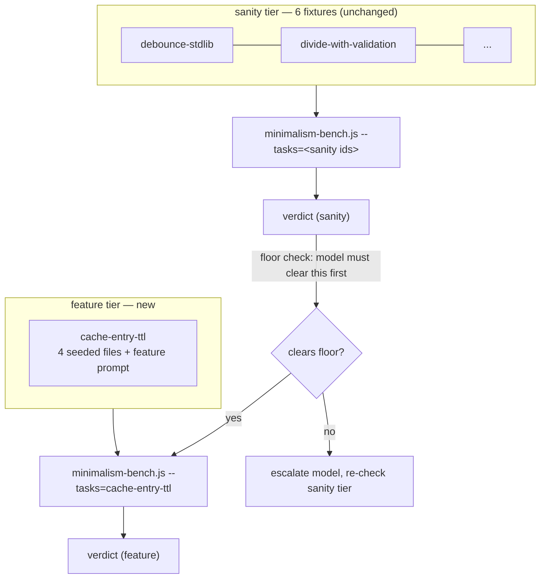

# WS2 revisit — a feature-tier fixture that gives over-engineering room to happen

> Scope: still epic [#285](https://github.com/BaiGanio/aperio/issues/285) WS2. This is not a
> new workstream — it's a design reconsideration of Step 3 (task fixtures) after today's live
> runs against `gemma-4-E2B`/`gemma-4-E4B` produced numbers that look like noise rather than
> signal. Steps 1, 2, 4 of [`ponytail-borrow-ws2.md`](./ponytail-borrow-ws2.md) (sandbox, metrics,
> runner/ledger/dry-run, verdict function) are unchanged and reused as-is. Live execution
> adds the isolation contract below: it must not share the developer's app port, runtime,
> logs, database, or ledger.

## Objective

Decide whether the 6 existing single-file fixtures can ever discriminate what `code-minimalism`
is supposed to prevent, and if not, add a fixture shape that gives over-engineering room to
happen — without touching the plumbing that's already tested and working.

## What today's numbers actually showed

Two real bugs were fixed today (`.env` not loaded by `minimalism:bench`; 5 of 6 prompts didn't
tell the model where to save its answer, so it often just answered in prose). With both fixed,
the pattern across dozens of live turns on `gemma-4-E2B`/`gemma-4-E4B` was:

- `includes-wrapper` (correct answer: write nothing) scored `correct=1` in both arms, always —
  it confirms neither arm hallucinates a file, but that's not a read on the skill.
- Every other fixture scored `correct=0` in both arms, almost every repeat — including a run
  that produced a literal JS syntax error (`queryString.split('&);`) on `reuse-query-parser`.

That second bullet has two candidate explanations, and they call for different fixes:

1. **The fixtures are too small.** A 10-line helper either basically works or face-plants; there's
   no room for "technically works, but three unnecessary layers of abstraction" — the actual
   failure mode the skill's ladder targets. This is the developer's working hypothesis.
2. **The subject models are wrong for the job.** `ponytail-borrow-ws2.md`'s Model recommendation
   named `Qwen2.5-Coder-7B` — a code-specialized model — as "current `LLAMACPP_MODEL`" at the
   time it was written. That's stale: `.env` now defaults `LLAMACPP_MODEL` to
   `unsloth/gemma-4-E2B-it-qat-GGUF:Q4_K_XL`, and today's runs used that plus its 4B sibling —
   both small, quantized, general-purpose chat models, not code models. A model that emits a
   syntax error on a 5-line debounce helper may simply not be a fair subject at *any* fixture
   size, independent of whether the fixture gives over-engineering room to manifest.

Both are real and this plan addresses both, but they are not the same problem, and fixing only
one risks re-running the same floor into a costlier fixture. See "Model choice" below.

## Decision: supplement, not replace

**The 6 single-file fixtures stay, unchanged, as a "sanity tier." A new fixture is added as a
"feature tier."** The two tiers answer different questions, and running the cheap one first is a
gate on whether it's worth running the expensive one.

The case for keeping the sanity tier:
- It already has paid-for, tested infrastructure (E1/E3 green) that costs nothing to keep.
- It still validates real ladder rungs at small scale: rung 2 (`reuse-query-parser`), rung 3
  (`debounce-stdlib`), rung 1 (`includes-wrapper`'s "don't write this" case). Those are legitimate
  even if they can't show an over-engineering *delta*.
- It's cheap (6 short prompts) and now doubles as a **floor check**: if a candidate model can't
  clear the sanity tier's correctness bar, it has no business being the subject of the pricier
  feature-tier matrix (6 tasks × 2 arms × 3 repeats × a 4-5-file prompt is a lot of wall-clock to
  spend on a model that can't reliably write a syntactically valid 10-line file).

The case for replacing it instead (considered and rejected):
- If the sanity tier structurally cannot produce anything but noise, sunk infrastructure cost is
  a bad reason to keep spending eval time on it. But "cannot discriminate over-engineering room"
  and "cannot detect a floor-level model" are different claims — the sanity tier was never
  measuring the first thing well, but it's exactly right for the second. Replacing it would throw
  away a real, cheap signal to fix a problem (no over-engineering room) that only the new tier
  needs to solve.

Verdict: **both tiers ship.** `computeVerdict()` (unchanged) is called once per tier via the
existing `--tasks=` filter — see "No new CLI flag" below — never pooled across tiers, since a
pooled median would blend two different questions into one number.

## Model choice

Today's floor effect was observed on general-purpose chat models, not the code-specialized model
the original plan named. Recommendation for the feature tier: **do not reuse `gemma-4-E2B`/
`gemma-4-E4B`** — a model that already floors on trivial single-file correctness cannot produce
an interpretable feature-tier result; every cell would just repeat today's "both arms fail,"
at 4-5x the prompt size and wall time.

`protoLabsAI/Ornith-1.0-9B-MTP-GGUF:Q4_K_M` is already in `APERIO_CAPABLE_MODELS` and was the
queued next step before this pause — that's still the right next rung: bigger than today's
subjects, still a local/zero-API-cost model, consistent with the epic's "local models
over-engineer" claim being about small-but-not-toy models. Recommended pre-check before spending
the feature-tier matrix on it (a Step 5 live-smoke decision, not something to run in this
session): re-run the **sanity tier alone** (6 short prompts, cheap) against Ornith-1.0-9B first.
If correctness doesn't clear the floor there either, that's a stop-and-reconsider moment for the
whole eval's model choice — escalate further (`Qwen3.5-4B`, `gemma-4-12B`) before touching the
feature tier at all, per the epic's own INCONCLUSIVE/stop discipline.

## Diagram

## No new CLI flag

`scripts/minimalism-bench.js` already supports `--tasks=<comma-separated ids>`, which is exactly
what's needed to run one tier at a time (list the 6 sanity ids, or the one feature id). Adding a
`--tier=` flag for a single current use (one feature-tier fixture) would itself be the thing
`code-minimalism`'s own red-flag table warns about — a parameter with no second caller yet. Wait
for a second feature-tier fixture before building that convenience.

## The fixture: `cache-entry-ttl`

`tests/fixtures/minimalism-tasks/cache-entry-ttl/` — same directory as the sanity tier (no new
sibling directory: `loadFixtures()` and every generic test loop already iterate the whole
directory, so this fixture is picked up automatically with zero script changes).

- `seed/lib/store.js` — an existing in-memory key/value store (`get`/`set`/`has`/`delete`/`size`).
- `seed/lib/index.js` — a thin entry point re-exporting it.
- `seed/tests/store.test.js` — existing tests for current behavior.
- `task.json` prompt: add TTL-based expiry to `set(key, value, ttlMs)`, keep the existing tests
  green, add new tests, reject a bad `ttlMs` by throwing. Deliberately uses two keyword phrases
  ("reinvent the wheel", "new dependency") in a sentence that also tells the model not to do
  those things — natural phrasing, not a copy of the autotune eval's "Add a small feature to X: Y"
  template (checked against `eval.json`/`eval.holdout.json` for exact-match; this is a judgment
  call on near-duplication the WS2 test spec flags as reviewable, not auto-failing).
- `reference/` — full corrected `store.js` (lazy expiry check in `get`/`has`, throws on invalid
  `ttlMs`) plus unchanged `index.js` and `store.test.js`, following the same "reference is a
  complete standalone end-state" convention `reuse-query-parser` already uses.
- `tests/` (grading tests, distinct filename from the seeded `store.test.js` so both coexist when
  `runFixtureTests` merges the solution and grading directories) — asserts: no-ttl set never
  expires, a short-ttl entry expires from both `get` and `has`, and both a negative and a
  non-numeric `ttlMs` throw.
- `anti-solution/` — implements expiry in `get` but not `has`, and never validates `ttlMs`. Fails
  3 of 4 grading tests while still passing every pre-existing `store.test.js` assertion — "correct
  on the happy path, no validation," matching the WS2 spec's definition of a non-negotiable
  anti-solution.

Only three seed files (not the "4-5" the brief sketched) — a fourth, decorative module was
considered and dropped for not having a caller. Padding the file count to hit a number is exactly
what the skill under test argues against; three real files with one clear extension point is
enough room for a plugin/config/dependency over-reach to be a plausible answer.

## Steps

### Step F1 — Fixture files

Files as described above. *Works when:* reference solution passes its own tests + the merged
seed tests; anti-solution fails; neither fixture's exact prompt string appears in
`skills/autotune/eval.json` or `eval.holdout.json`. Extend the existing generic loops in
`tests/integration/skills/minimalism-bench.test.js` (E1 "every fixture," E3 "every fixture,"
E3 "prompts held out") need no changes — they already iterate all fixtures. The two tests that
hardcode fixture ids for the non-negotiable/anti-solution check get `cache-entry-ttl` added
alongside `divide-with-validation`/`parse-config-value`.

### Step F2 — Dry-run integration check

`node scripts/minimalism-bench.js --dry-run --tasks=cache-entry-ttl --repeats=1` against a
temporarily-isolated ledger (today's 34 rows are backed up outside the repo and then cleared per
developer confirmation — see "Data hygiene"). *Works when:* exit 0, 2 rows written (arm A, arm
B), `loc` reflects only the `store.js` delta (seeded files that didn't change contribute 0), and
`node --test tests/integration/skills/minimalism-bench.test.js` + the unit suite both stay green
with the new fixture in place.

### Step F3 — Live smoke (not in this session)

Gated exactly like the original WS2 Step 5: one task, one repeat, real llama-server owned by
the evaluator on the dedicated default port `18080` (`LLAMACPP_BASE_URL=http://127.0.0.1:18080`),
with a run-specific runtime/log root and ledger outside the repository. Wait for `/health` and
the requested model before the first cell; abort if readiness fails or any cell records zero
input and output usage. Assert arm A's input tokens are elevated by roughly the skill's size
over arm B's — the direct evidence the skill loaded. Model: start with `Ornith-1.0-9B-MTP`,
after the sanity-tier floor pre-check above passes. Requires explicit go-ahead before running
(live model, real wall time, not something to kick off silently).

## Risks

| Risk | Mitigation |
|---|---|
| Feature-tier fixture's "over-engineered answer" isn't actually plausible for these models | Chosen scenario (TTL on an existing cache) has well-known real-world over-engineering patterns (new dependency, generic eviction-policy class, config object, background sweep) — not a contrived trap |
| Merging seed tests + grading tests in one `tests/` dir at score time silently double-counts or conflicts | Filenames deliberately distinct (`store.test.js` vs `ttl.test.js`); `cpSync`'s recursive merge doesn't delete non-conflicting files, verified against the existing `reuse-query-parser` convention before writing |
| Escalating to a bigger model just moves the floor effect up a size class | The sanity-tier floor pre-check (cheap, 6 short prompts) is exactly the gate that catches this before the expensive feature-tier matrix runs |
| A second feature-tier fixture arrives later and needs `--tier=` filtering after all | Fine — that's the second caller the ladder asks to wait for; add the flag then, not now |

## Doc updates

None yet — no behavior/config/architecture change ships from this design step. `CHANGELOG.md`
and `id/reference/testing.md` updates are still WS2 Step 6's job, deferred until a verdict (from
either tier) actually lands, per the original plan.

## Out of scope

Everything already out of scope in `ponytail-borrow-ws2.md`: WS4, cloud-model arms, new runtime
dependencies, any change to `lib/`. Also out of scope here: building a `--tier=` CLI flag (see
"No new CLI flag"), running any live model, and touching the 34 existing ledger rows beyond what
the developer already confirmed (clear, after backup).
