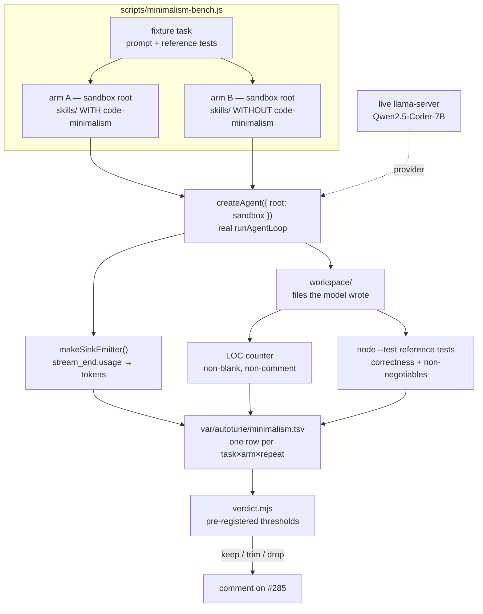

# WS2 — Prove it: the before/after minimalism eval

> Scope: **WS2 only** of epic [#285](https://github.com/BaiGanio/aperio/issues/285).
> WS1 shipped in `9f4eb3b` (skill + autotuned keywords + M1–M6 tests); WS3 shipped in
> `f77b1bf`. WS4 (codegraph-backed reuse rung) stays a separate follow-up.

## Objective

Answer one question with numbers instead of taste: **does `code-minimalism` earn the
~1.7k input tokens it costs on every turn it matches?** Ship a reproducible A/B eval —
same task, same model, skill present vs skill absent — measuring lines of code produced,
*net* token cost, correctness, and wall time; then record a pre-registered keep / trim /
drop verdict in a ledger and on #285. The eval outliving the skill is an acceptable
outcome, and so is a "trim" verdict.

## The economics this has to settle

`skills/code-minimalism/SKILL.md` is 6,743 bytes ≈ **~1.7k input tokens**, charged on
every turn the keywords match. A typical small-helper task emits a few hundred output
tokens. So "fewer output tokens" cannot by itself pay for the skill — the honest metric
is **net tokens (input + output), not output alone**. The skill wins only when it
prevents *whole units of work*: a file that never gets created, a dependency never added,
a config layer never built. WS2 must be able to see that, which is why LOC and net tokens
are reported side by side and neither one alone decides the verdict.

## Diagram

## Decisions taken before writing

These are the forks I resolved while reading the code. Each names the alternative it beat,
because two of them are worth overruling if you disagree.

| Fork | Decision |
|---|---|
| **How to build the "skill absent" arm** | **Sandbox root, not a kill-switch.** `createAgent({ root })` takes root as a parameter (`lib/agent/index.js:112`), and `skillsDir`/`overlayDir` are derived from it (`:154`–`155`). So arm B is just a sandbox whose `skills/` copy lacks `code-minimalism`. **Zero production change.** Beat: (a) a new `APERIO_SKILLS_DISABLED` config key — a knob that exists only for an eval, which rung 1 of our own ladder says shouldn't exist; (b) an overlay stub in `var/skills/` — resolves to the **repo** `var/`, so it writes into the developer's tree and is crash-fragile. |
| **How to drive the agent** | **In-process, not over WebSocket.** Borrowed from `tests/harness/run-scenario.js`: `createAgent` + `makeSinkEmitter` + `runWithPaths`, swapping the mock provider for a live `llamacpp` providerConfig. Decisive reason: **`wsHandler` never forwards `usage` to the socket** — only `cliEmitter` reads it (`lib/emitters/cliEmitter.js:224`). A WS-driven bench like `model-tier-bench` would need a production change just to see token counts; in-process gets them free off `stream_end.usage`. Also skips spawning `server.js` entirely. |
| **Correctness metric** | **Reference `node --test` files per task, run in the sandbox.** Not `evaluateBenchmarkCase` — that scores tool sequences and answer terms, which is the wrong question here. At least two tasks carry reference tests asserting **validation and error paths**, so an answer that is "minimal" by cutting the non-negotiables scores as *incorrect*, not as a win. That is the teeth behind the epic's "correctness must not regress" risk. |
| **Eval prompts vs autotune prompts** | **Held out.** WS1 tuned keywords against `eval.json` positives of exactly this shape ("write me a helper for…"). Reusing them measures our own keyword tuning, not the skill. WS2 prompts are new phrasings; a pre-flight assertion checks arm A actually loads the skill and arm B does not, so a silently-unmatched prompt can't quietly turn the eval into A/A. |
| **Nondeterminism** | **Repeats + medians + alternating arm order.** No temperature/seed knob exists — `lib/config.js` has none and the llamacpp request body (`providers/llamacpp.js:95`) never sends `temperature`, so sampling is at llama-server defaults. Adding a passthrough is a production change I did not want to smuggle in under an eval. Instead: N=3 repeats per task×arm, report median and spread, alternate A/B/B/A so warm-cache and thermal drift don't land on one arm, discard one warmup run. |
| **Semantic rescue** | **Off in both arms** (`APERIO_SKILL_SEMANTIC=off`). It fires only when keyword matching finds nothing, which would let it silently re-attach a skill in arm B's neighbourhood and blur the arms. |
| **Ledger location** | Dry runs may use **`var/autotune/minimalism.tsv`**. Live runs use one ledger per model in a run-specific directory outside the repository; never share the app's current ledger. |

## Pre-registered verdict rule

Written down **before** any data is collected, so the verdict cannot be rationalized after
the fact. Applied to medians across tasks, using arm B as the baseline:

| Verdict | Condition |
|---|---|
| **KEEP** | correctness ≥ baseline on every task, **and** median LOC delta ≤ −15%, **and** median net-token delta ≤ 0 |
| **TRIM** | correctness ≥ baseline and LOC delta ≤ −15%, but net tokens positive → cut `SKILL.md` toward ≤ 60 lines (ladder + non-negotiables survive; the rationalization/red-flag tables are the first to go), re-run the eval once |
| **DROP** | no LOC win at equal correctness, or any correctness regression the skill caused |
| **INCONCLUSIVE** | effect smaller than the observed inter-repeat spread → report it as such; do not round it into a win |

A correctness regression is disqualifying on its own, whatever the token numbers say.

## Model recommendation

| Aspect | Value |
|---|---|
| **Executing the plan** | `deepseek-v4-pro` — eval design plus a runner script with real teardown discipline; reasoning-heavy but not precision-critical |
| Est. tokens | ~150k in / ~20k out |
| Est. cost | ~$0.20 |
| **Subject of the eval** | Local `Qwen2.5-Coder-7B` (current `LLAMACPP_MODEL`) — the epic's whole leverage claim is about small local models over-engineering; a cloud model is a separate, later arm |
| Live-run cost | 6 tasks × 2 arms × 3 repeats = 36 runs ≈ **1–2 h wall on the M1**, zero API cost |

Commit signature must name the exact model that does the work, per AGENTS.md.

## Steps

Verification detail lives in [`ponytail-borrow-ws2-tests.md`](./ponytail-borrow-ws2-tests.md).
Run test group **E0** red before implementing.

### Step 1 — Sandbox + arm construction

`lib/helpers/minimalismBench.js` (pure, unit-testable) + `scripts/minimalism-bench.js`
(process orchestration). Build one `mkdtemp` root per run containing `id/` and a `skills/`
copy — full for arm A, minus `code-minimalism/` for arm B — plus an empty `workspace/`
gated by `runWithPaths([workspace], [workspace])`. Everything under the mkdtemp; teardown
in a `finally`, including on crash and SIGINT.

*Works when:* **E1** — arm A's index contains `code-minimalism` and arm B's does not, and
`matchSkills(taskPrompt)` returns it in A and never in B, asserted offline with no model.

### Step 2 — Metrics

Three collectors: LOC (non-blank, non-comment lines across files created or modified in
`workspace/`), tokens (`input_tokens` / `output_tokens` summed from `stream_end.usage` on
the sink emitter, reported separately **and** as a net figure), correctness (`node --test`
on the task's reference tests, run as a child process in the sandbox), plus wall time.

*Works when:* **E2** — each collector is unit-tested against fixtures, including a
reference-test run that legitimately fails.

### Step 3 — Task fixtures

`tests/fixtures/minimalism-tasks/<id>/{task.json,tests/}` — 6 self-contained tasks whose
prompts are held out from `eval.json`: a small helper, a "do I need a library for this"
task solvable by stdlib, a task already solved elsewhere in the fixture repo (rung 2 —
anamnesis), a task whose honest answer is "this doesn't need to exist", and **two carrying
validation/error-path reference tests** so corner-cutting scores as incorrect.

*Works when:* **E3** — every fixture's reference tests pass against its committed
reference solution and fail against a deliberately corner-cutting one.

### Step 4 — Runner, ledger, dry-run

One command runs the matrix and appends one row per task×arm×repeat:
`ts, task, arm, repeat, loc, input_tokens, output_tokens, net_tokens, correct, wall_ms, model, skill_sha`.
`--dry-run` replays the mock provider so the whole pipeline is exercised in CI without a
live model. `skill_sha` pins which version of `SKILL.md` produced the row, so a TRIM re-run
is comparable rather than confusing.

*Works when:* **E4** — `node scripts/minimalism-bench.js --dry-run` reproduces the eval
end-to-end and writes complete rows; **E6** — no stray state (`git status` clean, no repo
`var/` writes beyond the ledger, no orphaned child processes).

### Step 5 — Live run + verdict

Run the matrix against an evaluator-owned llama-server on the dedicated default port
`18080` (`LLAMACPP_BASE_URL=http://127.0.0.1:18080`), with its runtime/log root and
per-model ledger outside the repository. Start the server before the first cell, wait
for `/health` and the requested model, and tear it down on completion, failure, or
SIGINT. Abort without accepting the run if readiness fails or any cell records both
`input_tokens=0` and `output_tokens=0`; those rows indicate provider failure, not model
behavior. Then apply the pre-registered rule via `verdict.mjs` and post numbers + verdict
as a comment on #285.

*Works when:* **E5** — a one-task live smoke produces two comparable rows; **E7** — the
verdict function returns the pre-registered outcome for synthetic ledgers, including
INCONCLUSIVE when the effect is inside the spread.

### Step 6 — Docs (confirm with the developer before writing)

`id/reference/testing.md` (third evaluator alongside the harness and the tier-exam),
`CHANGELOG.md` (Unreleased, with the verdict). Not written without explicit confirmation.

## Risks

| Risk | Mitigation |
|---|---|
| Arms differ by more than the skill | Sandboxes built from one shared factory; only the skill dir differs; **E1** asserts the index delta is exactly one entry |
| Prompt doesn't match the skill → silent A/A | Pre-flight assertion per task (**E1**); a task whose arm A doesn't load the skill fails the run rather than scoring 0 |
| Nondeterminism swamps the effect | Repeats + medians + alternating order + warmup discard; INCONCLUSIVE is a legitimate verdict |
| Measuring output tokens only → flattering result | Net tokens is the headline; the ~1.7k input cost is charged to arm A on every matched turn |
| "Minimal" answers that skip validation score as wins | Two fixtures' reference tests assert validation and error paths; correctness regression is disqualifying |
| Eval reuses autotune prompts | Held out by construction; **E3** asserts no fixture prompt appears in `eval.json` |
| Live run interferes with the developer's app | Dedicated port `18080`, evaluator-owned server, run-specific runtime/log root and ledger outside the repository; readiness and zero-usage gates reject invalid runs |
| Live run leaves stray state | One mkdtemp per run, `finally` teardown, child kill on signal; **E6** asserts a clean repo tree afterwards |
| Sandbox root diverges from real app behaviour | `id/` is copied in, so the real system prompt is assembled; the only intentional difference is the skill set |

## Doc updates (after implementation — confirm first)

- `id/reference/testing.md` — the third evaluator and when to use it
- `CHANGELOG.md` — Unreleased entry carrying the verdict

## Out of scope

WS4 (codegraph-backed reuse rung). Cloud-model arms. Any new runtime dependency
(no promptfoo). Any production change to `lib/` — if one turns out to be unavoidable,
it stops the work and comes back as a decision, not a quiet commit.
