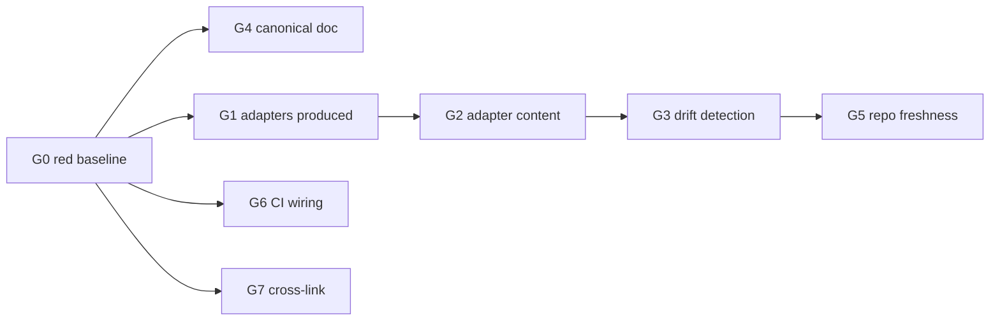

# WS3 tests — portable memory-discipline ruleset

Companion to [`ponytail-borrow-ws3.md`](./ponytail-borrow-ws3.md). Domain: software
feature, so "test" means code test. All groups live in one file,
`tests/integration/scripts/gen-agent-rules.test.js`, run by plain `npm test`
(and therefore by `npm run test:ci` in `ci.codecov.yml`) in addition to the dedicated
`ci.generated-artifacts.yml` gate.

## Coverage map

| Plan step | Test group | Coverage |
|---|---|---|
| — (pre-work) | **G0** Red baseline | Every criterion below fails before implementation |
| Step 1 — canonical ruleset | **G4** Canonical doc integrity | Exists, ≤80-line body, every cited tool name is registered, no secrets guidance omitted |
| Step 2 — generator | **G1** Adapter production | All three adapters written into `--out-dir` |
| Step 2 — generator | **G2** Adapter content | Canonical rules present in each; AUTO-GENERATED banner; Cursor frontmatter; Claude Code skill frontmatter |
| Step 2 — generator | **G3** Drift detection | `--check` exits 0 when fresh, 1 when any single adapter drifts |
| Step 3 — committed adapters | **G5** Repo freshness | Committed `integrations/agent-rules/**` byte-match a fresh build |
| Step 4 — CI workflow | **G6** Gate wiring | Workflow exists and invokes both `gen:env:check` and `gen:agent-rules:check` |
| Step 5 — cross-link | **G7** Cross-link | `skills/memory-protocol/SKILL.md` references the canonical file; skill tests still green |

No plan step is uncovered. G0 is a procedure, not a permanent assertion.

## Test execution order

G0 runs once, before implementation. Afterwards: G4 → G1 → G2 → G3 → G5 → G6 → G7.
G1–G3 depend on the generator existing; G5 depends on G1–G3 passing (a stale committed
artifact is only meaningful once generation is correct). G4, G6, G7 are independent.

## Required setup

- Node.js native test runner, `import assert from "node:assert/strict"` (house style)
- `mkdtemp` scratch dir per test, removed in `t.after()` — nothing left in the repo tree
- Child-process invocation of `scripts/gen-agent-rules.js` via `spawnSync`, mirroring
  `tests/integration/scripts/gen-env-example.test.js`
- No fixtures, no network, no DB, no model

---

## G0 — Red baseline

**Input / setup:** clean tree before any WS3 file exists.
**Expected behavior:** the whole suite fails for *absence*, not for assertion detail.
**Assertions:**
- `tests/integration/scripts/gen-agent-rules.test.js` runs and fails
- Failures name the missing artifacts: `id/agent-rules/aperio-memory.md`,
  `scripts/gen-agent-rules.js`, `integrations/agent-rules/`,
  `.github/workflows/ci.generated-artifacts.yml`
**Edge cases:** a suite that passes here has no teeth — treat a green G0 as a bug in the
test file, not as work already done.

---

## G1 — Adapter production

**Input / setup:** `node scripts/gen-agent-rules.js --out-dir <tmp>`.
**Expected behavior:** exit 0; exactly the three declared adapters are written.
**Assertions:**
- `<tmp>/AGENTS.snippet.md` exists and is non-empty
- `<tmp>/cursor/aperio-memory.mdc` exists and is non-empty
- `<tmp>/claude-code/aperio-memory/SKILL.md` exists and is non-empty
- Nested output dirs are created by the generator (no pre-`mkdir` by the caller)
**Edge cases:** `--out-dir` pointing at a non-existent nested path must still work;
running twice into the same dir is idempotent (byte-identical second run).

---

## G2 — Adapter content

**Input / setup:** the three files from G1, plus `id/agent-rules/aperio-memory.md`.
**Expected behavior:** each adapter carries the canonical discipline plus its
platform-specific wrapper, and announces that it is generated.
**Assertions:**
- Each adapter contains an AUTO-GENERATED banner naming `id/agent-rules/aperio-memory.md`
  and the `gen:agent-rules` command
- Each adapter contains the load-bearing rules — assert on stable rule anchors present in
  the canonical file, not on prose fragments that reword freely (e.g. the literal tool
  names `recall`, `propose_memory`, `wiki_get`, `self_remember`)
- `aperio-memory.mdc` opens with valid Cursor frontmatter (`---` block containing
  `description:` and `alwaysApply:`)
- `claude-code/aperio-memory/SKILL.md` opens with house skill frontmatter: `name`,
  `description`, `metadata.keywords`, `metadata.load`
- `AGENTS.snippet.md` contains no frontmatter block (it is pasted into an existing file)
- Every adapter attributes ponytail (MIT) — license obligation, asserted not assumed
**Edge cases:** a canonical rule added later but missing from an adapter must fail here;
the assertion set is anchors-based so rewording the doctrine does not cause false red.

---

## G3 — Drift detection

**Input / setup:** generate into `<tmp>`, then mutate one adapter.
**Expected behavior:** `--check` distinguishes fresh from stale, per file.
**Assertions:**
- `--check --out-dir <tmp>` exits 0 immediately after a fresh generation
- Appending a byte to *each* adapter in turn makes `--check` exit 1 — asserted once per
  adapter, so a generator that only checks the first file cannot pass
- Deleting an adapter makes `--check` exit 1 (missing counts as stale, matching
  `gen-env-example.js`)
- Regenerating restores exit 0
- On failure the message names the offending file and tells the reader to run
  `npm run gen:agent-rules`
**Edge cases:** trailing-newline-only difference must still count as drift (byte compare,
not trimmed compare).

---

## G4 — Canonical doc integrity

**Input / setup:** read `id/agent-rules/aperio-memory.md` and the tool registrations in
`mcp/tools/*.js`.
**Expected behavior:** the doctrine is portable-sized and factually true about the tool
surface.
**Assertions:**
- File exists
- Body is ≤80 lines excluding frontmatter — the context-budget promise is enforced, not
  merely recommended
- Every backticked identifier in the doc that looks like an MCP tool name resolves to a
  name actually registered under `mcp/tools/` — this is the test with teeth: it catches
  doctrine citing `remember_fact` or a tool removed in a later refactor
- The never-store rules cover credentials explicitly (assert the doc mentions
  tokens/keys/passwords) — a memory-discipline ruleset that omits this is incomplete
**Edge cases:** a tool renamed in `mcp/tools/` without updating the doc must fail;
prose backticks that are not tool names (e.g. `.env`) must not produce false positives —
restrict the match to the known registered-name shape.

---

## G5 — Repo freshness

**Input / setup:** generate into a temp dir; compare against committed
`integrations/agent-rules/**`.
**Expected behavior:** what is committed is what the generator produces today.
**Assertions:**
- Each committed adapter byte-matches its freshly generated counterpart
- Failure message instructs running `npm run gen:agent-rules`
**Edge cases:** this is the assertion the existing `gen-env-example` suite is missing —
it must compare the **repo** files, not a temp-dir round trip, or it proves nothing.

---

## G6 — CI gate wiring

**Input / setup:** read `.github/workflows/ci.generated-artifacts.yml`.
**Expected behavior:** the lockstep promise is actually enforced in CI.
**Assertions:**
- Workflow file exists
- It invokes `npm run gen:agent-rules:check`
- It invokes `npm run gen:env:check` — closes the pre-existing gap the plan documents
- Every `uses:` is pinned to a 40-char commit SHA (repo convention, `bot.pin-shas-to-actions`)
**Edge cases:** a workflow that only runs on `workflow_dispatch` would satisfy a naive
"file exists" check — assert the `push`/`pull_request` triggers are present.

---

## G7 — Cross-link

**Input / setup:** read `skills/memory-protocol/SKILL.md`.
**Expected behavior:** the in-repo skill points at the portable doctrine.
**Assertions:**
- Contains the path `id/agent-rules/aperio-memory.md`
- `npm run test:skills` still exits 0 (frontmatter and loader unaffected)
**Edge cases:** the link must survive the skill's frontmatter parsing — place it in the
body, never inside the `metadata` block.

---

## Not tested here (and why)

- **Whether the doctrine improves model behavior.** That is an eval, not a unit test, and
  it belongs to WS2's methodology — out of scope for WS3 by the developer's scoping.
- **Cursor / Claude Code actually loading the adapters.** Third-party runtime behavior;
  verified by the developer manually installing one adapter once, not asserted in CI.
