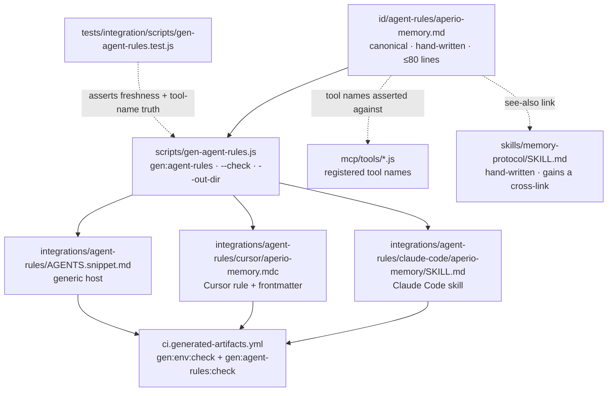

# WS3 — Portable memory-discipline ruleset (ponytail distribution pattern)

> Scope: **WS3 only** of epic [#285](https://github.com/BaiGanio/aperio/issues/285).
> WS1 (`skills/code-minimalism`) and WS2 (before/after eval) are explicitly **not**
> started here. WS3 has no dependency on either.

## Objective

Aperio's memory discipline — *how* an agent should use `recall`/`remember`, not just
what the tool schemas say — currently reaches agents only through MCP tool descriptions
and one in-repo skill. Give it a single canonical, portable source and generate
per-platform adapters from it, so an agent running on Claude Code, Cursor, or any
`AGENTS.md`-reading host learns the discipline, and a lockstep CI check keeps the copies
from drifting.

## Why this shape

The failure mode this targets is observed, not hypothetical: weak models treat the
session preload as the *entire* store and never call `recall` (see
`project_recall_not_invoked`). Tool descriptions cannot fix that — they describe
parameters, not judgment. Ponytail solves the same shape of problem with one canonical
ruleset, mechanical fan-out to platform formats, and a check script that fails the build
when a copy drifts. We borrow the pattern; we do not borrow their adapter zoo.

## Diagram

## Decisions taken before writing (developer, this session)

| Fork | Decision |
|---|---|
| Canonical vs `skills/memory-protocol/SKILL.md` | **New distilled doc, cross-link only.** The skill stays hand-written; it keeps its SQL/advanced sections. No generated block injected into it. |
| Lockstep enforcement | **Dedicated CI workflow** `ci.generated-artifacts.yml`, running `gen:env:check` *and* `gen:agent-rules:check`. |

The second decision also closes a pre-existing hole found while scoping: `gen:env:check`
is referenced by **zero** workflows today, and `tests/integration/scripts/gen-env-example.test.js`
only exercises `--check` inside a temp dir — the committed `.env.example` and
`docs/config-reference.md` are never checked for freshness by CI. AGENTS.md calls it a CI
gate; as of this plan that claim is false. The new workflow makes it true.

## Model recommendation

| Aspect | Value |
|---|---|
| Recommended | `deepseek-v4-pro` (or local llama.cpp for the generator scaffolding) |
| Est. tokens | ~200k in / ~25k out |
| Est. cost | ~$0.30 |
| Rationale | Mechanical work patterned on an existing generator (`scripts/gen-env-example.js`) plus one CI file; the only judgment-heavy artifact is the canonical doctrine text, which the developer reviews. No precision-critical instruction-following. |

Commit signature must name the exact model that does the work, per AGENTS.md.

## Steps

Each step's verification detail lives in the companion file
[`ponytail-borrow-ws3-tests.md`](./ponytail-borrow-ws3-tests.md). Run the suite red
before implementing (test group **G0**).

### Step 1 — Canonical ruleset

Write `id/agent-rules/aperio-memory.md`: the portable discipline, ≤80 lines of body.
Contents: preload-is-a-preview, when to `recall` (no-arg = core context; never ask the
user to narrow first), `remember` only on explicit request vs `propose_memory` for
agent-discovered facts, update-over-duplicate, contradiction handling, `forget` only on
explicit request, wiki-as-synthesis with the `wiki_get` breadcrumb rule, self-memory
boundaries (autonomous, local-only, never surfaced), sensitivity tiers, and what never
to store.

*Works when:* file exists, body ≤80 lines, and every MCP tool name it mentions is
actually registered in `mcp/tools/` (test **G4** — this is what stops the doctrine from
citing a tool that does not exist). Developer reviews for doctrine accuracy.

### Step 2 — Generator

Write `scripts/gen-agent-rules.js`, mirroring `scripts/gen-env-example.js`'s CLI contract:
bare invocation writes all adapters, `--check` exits 1 on drift, `--out-dir DIR` writes
into a scratch dir for tests. Outputs:

- `integrations/agent-rules/AGENTS.snippet.md` — paste-into-`AGENTS.md` block
- `integrations/agent-rules/cursor/aperio-memory.mdc` — Cursor rule with its frontmatter
- `integrations/agent-rules/claude-code/aperio-memory/SKILL.md` — Claude Code skill with
  house frontmatter (`name`, `description`, `metadata.keywords`, `metadata.load`)

Every adapter carries an AUTO-GENERATED banner naming the canonical file.

*Works when:* test groups **G1** (all three adapters produced), **G2** (each carries the
canonical rules and the banner), **G3** (`--check` exits 0 fresh / 1 drifted).

### Step 3 — npm scripts + committed adapters

Add `gen:agent-rules` and `gen:agent-rules:check` to `package.json` beside the `gen:env`
pair, in the same commented section. Commit the generated adapters.

*Works when:* `npm run gen:agent-rules:check` exits 0 on a clean tree; test **G5**
asserts the *committed* adapters byte-match a fresh build.

### Step 4 — CI workflow

Add `.github/workflows/ci.generated-artifacts.yml` running `gen:env:check` and
`gen:agent-rules:check` on push/PR to `master`/`dev`, path-filtered to
`lib/config.js`, `id/agent-rules/**`, `scripts/gen-*.js`, `integrations/agent-rules/**`,
`.env.example`, `docs/config-reference.md`. Actions pinned to SHAs (the
`bot.pin-shas-to-actions` convention).

*Works when:* test **G6** parses the workflow and asserts both checks are invoked;
editing the canonical file without regenerating fails the check locally, regenerating
fixes it.

### Step 5 — Cross-link

Add one "see also" line to `skills/memory-protocol/SKILL.md` pointing at the canonical
file, so the in-repo skill and the portable doctrine are discoverable from each other.

*Works when:* link present and the skill still passes `npm run test:skills`.

### Step 6 — Docs (confirm with developer before writing)

Per AGENTS.md Documentation Sync — do **not** write these without confirmation:
`FEATURES.md` (new integration surface), `README.md` (installing the rules into your
agent), `id/reference/skills.md`, `CHANGELOG.md` (Unreleased).

## Risks

| Risk | Mitigation |
|---|---|
| Canonical doc drifts from `skills/memory-protocol/SKILL.md` (the chosen fork accepts this) | Cross-link both ways; **G4** pins tool-name truth against `mcp/tools/` so neither can cite a nonexistent tool; revisit if the two contradict |
| Doctrine cites a tool that is renamed later | **G4** fails on the next CI run after any rename |
| Adapters hand-edited instead of regenerated | AUTO-GENERATED banner (**G2**) + `--check` in CI (**G6**) |
| A 26th workflow file adds CI noise | Path-filtered; runs only when a generated artifact or its source changes |
| Ruleset grows past a usable context cost | ≤80-line budget asserted in **G4**, not just recommended |
| Doc updates written without approval | Step 6 is gated on explicit developer confirmation |

## Doc updates (after implementation — confirm first)

- `FEATURES.md` — agent-rules integration surface
- `README.md` — how to install the rules into a non-Aperio agent
- `id/reference/skills.md` — rules distribution alongside the skill system
- `id/reference/ci-cd.md` — the new workflow (the inventory was just completed in `80299fc`)
- `CHANGELOG.md` — Unreleased entry, with ponytail MIT attribution

## Out of scope

WS1, WS2, WS4 of #285. Ponytail's lifecycle hooks, mode management, and its ~20-platform
adapter set. No new runtime dependencies.
